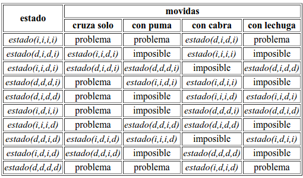
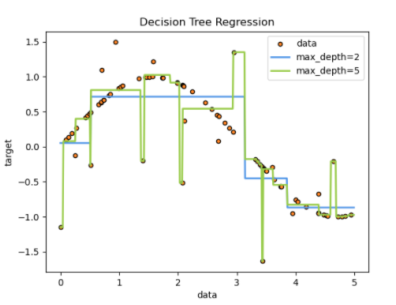
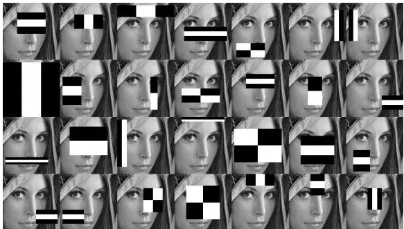

#+TITLE: Apuntes IA
#+AUTHOR: Eduardo Alcaraz
#+LANGUAGE: es
#+LaTeX_HEADER: \usepackage[spanish]{inputenc}
#+SETUPFILE: /home/likcos/Materias/IA/theme-readtheorg-local.setup
#+EXPORT_FILE_NAME: index.html
#+OPTIONS: num:nil
#+HTML_HEAD: 
#+BIND: org-confirm-babel-evaluate nil
#+bibliography: bibliografia.bib
#+cite_export: csl

* Introducción a la Inteligencia Artificial.
  La inteligencia artificial (IA) es un área multidisciplinaria que, a
  través de ciencias como las ciencias de la computación, la lógica y la
  filosofía, estudia la creación y diseño de entidades capaces de
  resolver cuestiones por sí mismas utilizando como paradigma la
  inteligencia humana.

  General y amplio como eso, reúne a amplios campos, los cuales tienen
  en común la creación de máquinas capaces de pensar. En ciencias de la
  computación se denomina inteligencia artificial a la capacidad de
  razonar de un agente no vivo. John McCarthy acuñó la expresión
  inteligencia artificial en 1956, y la definió así: Es la ciencia e
  ingenio de hacer máquinas inteligentes, especialmente programas de
  cómputo inteligentes.

  - Búsqueda del estado requerido en el conjunto de los estados
	producidos por las acciones posibles.
  - Algoritmos genéticos (análogo al proceso de evolución de las cadenas
	de ADN).
  - Redes neuronales artificiales (análogo al funcionamiento físico del
	cerebro de animales y humanos).  
  - Razonamiento mediante una lógica formal análogo al pensamiento
	abstracto humano.  

  También existen distintos tipos de percepciones y acciones, que pueden
  ser obtenidas y producidas, respectivamente, por sensores físicos y
  sensores mecánicos en máquinas, pulsos eléctricos u ópticos en
  computadoras, tanto como por entradas y salidas de bits de un software
  y su entorno software.
  Varios ejemplos se encuentran en el área de control de sistemas,
  planificación automática, la habilidad de responder a diagnósticos y a
  consultas de los consumidores, reconocimiento de escritura,
  reconocimiento del habla y reconocimiento de patrones. Los sistemas de
  IA actualmente son parte de la rutina en campos como economía,
  medicina, ingeniería y la milicia, y se ha usado en gran variedad de
  aplicaciones de software, juegos de estrategia, como ajedrez de
  computador, y otros videojuegos.

** Categorías de la Inteligencia Artificial 

   - *Sistemas que piensan como humanos*. Estos sistemas tratan de emular
     el pensamiento humano; por ejemplo las redes neuronales
     artificiales. La automatización de actividades que vinculamos con
     procesos de pensamiento humano, actividades como la Toma de
     decisiones, Resolución de problemas y aprendizaje. [cite:@Russell]
   - *Sistemas que actúan como humanos*: Estos sistemas tratan de actuar
     como humanos; es decir, imitan el comportamiento humano; por
     ejemplo la robótica. El estudio de cómo lograr que los
     computadores realicen tareas que, por el momento, los humanos hacen mejor. [cite:@Russell]
   - *Sistemas que piensan racionalmente*.- Es decir, con lógica (idealmente), tratan de
     imitar o emular el pensamiento lógico racional del ser humano; por ejemplo los sistemas
     expertos. El estudio de los cálculos que hacen posible percibir, razonar y actuar. [cite:@Russell]
   - *Sistemas que actúan racionalmente (idealmente)*.– Tratan de emular de forma
     racional el comportamiento humano; por ejemplo los agentes inteligentes.Está relacionado con
     conductas inteligentes en artefactos. [cite:@Russell]
 
**  Inteligencia artificial convencional

  Se conoce también como IA simbólico-deductiva. Está basada en el análisis formal y
  estadístico del comportamiento humano ante diferentes problemas:
 
   - Razonamiento basado en casos: Ayuda a tomar decisiones mientras se
     resuelven ciertos problemas concretos y, aparte de que son muy
     importantes, requieren de un buen funcionamiento.
   - Sistemas expertos: Infieren una solución a través del conocimiento
     previo del contexto en que se aplica y ocupa de ciertas reglas o
     relaciones.
   - Redes bayesianas: Propone soluciones mediante inferencia probabilística.
   - Inteligencia artificial basada en comportamientos: Esta
     inteligencia contiene autonomía y puede auto-regularse y
     controlarse para mejorar.
   - Smart process management: Facilita la toma de decisiones
     complejas, proponiendo una solución a un determinado problema al
     igual que lo haría un especialista en la dicha actividad.

**  Historia de la Inteligencia Artificial.
**  Las habilidades cognoscitivas según la psicología. Teorías de la inteligencia (conductismo, Gardner, etc.).

Las habilidades cognoscitivas son capacidades mentales que nos
permiten procesar toda la información que nos llega del
entorno. Incluyen procesos como la percepción, la memoria, el
aprendizaje, la solución de problemas, el razonamiento y el
pensamiento crítico. La psicología ha estudiado extensamente estas
habilidades, y diferentes teorías han surgido para explicar cómo se
desarrollan y funcionan, especialmente en relación con la
inteligencia.

***  Teorías de la Inteligencia

 1. *Conductismo* El conductismo, representado por figuras como
    John B. Watson y B.F. Skinner, se centra en el estudio de
    comportamientos observables y medibles, dejando de lado los procesos
    mentales internos. Desde esta perspectiva, la inteligencia se ve como
    una serie de respuestas aprendidas ante estímulos específicos. Los
    conductistas creen que cualquier diferencia en la inteligencia entre
    individuos se debe a diferencias en sus experiencias de
    aprendizaje. Aunque esta teoría ha sido crítica por su falta de
    atención a los procesos cognitivos internos, ha sido influyente en el
    desarrollo de técnicas de aprendizaje y modificación del
    comportamiento.

 2. *Teoría de las Inteligencias Múltiples (Howard Gardner)*
     Contrastando con el enfoque unitario de la inteligencia, Howard
     Gardner propuso en 1983 la Teoría de las Inteligencias
     Múltiples. Gardner argumentó que la inteligencia no es un dominio
     único y general, sino un conjunto de capacidades cognitivas distintas
     e independientes. Originalmente identificó siete inteligencias
     (lingüístico-verbal, lógico-matemática, espacial, musical,
     corporal-cinestésica, interpersonal e intrapersonal), a las cuales
     más tarde añadió la inteligencia naturalista y posiblemente
     otras. Esta teoría ha tenido un impacto significativo en la
     educación, promoviendo un enfoque más personalizado en la enseñanza.

 3. *Teoría Triárquica de la Inteligencia (Robert Sternberg)*
     Robert Sternberg propuso la Teoría Triárquica de la Inteligencia, que
     divide la inteligencia en tres aspectos: analítico, creativo y
     práctico. La inteligencia analítica se refiere a la capacidad de
     analizar, evaluar, juzgar, comparar y contrastar. La inteligencia
     creativa implica la capacidad de crear, diseñar, inventar, originar y
     imaginar. La inteligencia práctica se relaciona con la capacidad de
     usar, aplicar, implementar y poner en práctica. Sternberg sugiere que
     una inteligencia equilibrada implica la capacidad de adaptarse a,
     moldear y seleccionar entornos para satisfacer tanto las necesidades
     personales como las de la sociedad.

 4. *Teoría del Procesamiento de la Información*
     Esta teoría se enfoca en cómo las personas procesan la información
     que reciben. Implica la atención, percepción, memoria y pensamiento,
     y cómo estas operaciones mentales influyen en nuestra capacidad para
     resolver problemas y tomar decisiones. Desde esta perspectiva, la
     inteligencia se ve como un conjunto de procesos mentales que permiten
     a la persona comprender y manejar el mundo que la rodea.

 5. *Inteligencia Emocional (Daniel Goleman)*
    Daniel Goleman popularizó el concepto de inteligencia emocional en
    los años 90, definiéndola como la capacidad para reconocer, entender
    y manejar nuestras emociones y las de los demás. La inteligencia
    emocional incluye habilidades como la autoconciencia, la
    autoregulación, la motivación, la empatía y las habilidades
    sociales. Esta teoría amplió el concepto de inteligencia más allá de
    las capacidades cognitivas tradicionales, incluyendo aspectos
    emocionales y sociales.

 *Conclusión*: Las teorías de la inteligencia en la psicología
 reflejan la complejidad y diversidad de la mente humana. Desde el
 conductismo, que enfatiza el aprendizaje observable, hasta las
 teorías de inteligencias múltiples y emocional, que reconocen una
 amplia gama de capacidades cognitivas y emocionales, estas teorías
 nos ofrecen diferentes puntos de vista a través de los cuales podemos entender
 la inteligencia humana. Cada teoría aporta su visión única,
 sugiriendo que la inteligencia es un fenómeno multifacético que no
 puede ser completamente comprendido a través de un solo enfoque.

**  El proceso de razonamiento según la lógica (Axiomas, Teoremas, demostración).
El proceso de razonamiento según la lógica involucra varios conceptos
fundamentales como axiomas, teoremas y demostraciones. Estos elementos
forman la base de la lógica y el razonamiento matemático, permitiendo
construir argumentos sólidos y verificar la veracidad de diversas
proposiciones.

- *Axiomas* Los axiomas son declaraciones o proposiciones que se aceptan
  como verdaderas sin necesidad de demostración. En la lógica y las
  matemáticas, los axiomas sirven como fundamentos sobre los cuales se
  construye todo el sistema teórico. No son arbitrarios; se eligen
  cuidadosamente para evitar contradicciones y para ser lo
  suficientemente potentes como para derivar teoremas relevantes. Un
  ejemplo clásico de axioma es el postulado de paralelas de Euclides,
  que afirma que por un punto exterior a una línea, se puede trazar
  una y solo una paralela a dicha línea.

- *Teoremas* Los teoremas son proposiciones que han sido demostradas
  como verdaderas dentro de un sistema lógico, utilizando axiomas y
  teoremas previamente establecidos. Los teoremas requieren una
  demostración rigurosa que muestre su veracidad. Un ejemplo famoso es
  el teorema de Pitágoras en la geometría euclidiana, el cual
  establece que en un triángulo rectángulo, el cuadrado de la
  hipotenusa (el lado opuesto al ángulo recto) es igual a la suma de
  los cuadrados de los otros dos lados.

- *Demostración* La demostración es el proceso mediante el cual se
  establece la verdad de un teorema. Utiliza una serie de pasos
  lógicos y deductivos, basados en axiomas y en teoremas ya
  demostrados, para llegar a la conclusión de que el teorema en
  cuestión es verdadero. Las demostraciones pueden adoptar diversas
  formas, como la demostración directa, donde se parte de los axiomas
  y se llega al teorema; la demostración por contradicción, donde se
  asume que el teorema es falso y se llega a un absurdo; y la
  demostración por inducción, útil especialmente para los teoremas que
  involucran números enteros.

Este proceso es fundamental en el razonamiento lógico y matemático, ya
que proporciona una base sólida para entender y verificar la verdad de
las proposiciones dentro de un marco teórico específico. A través de
los axiomas, teoremas y demostraciones, la lógica facilita la
construcción de conocimiento estructurado y coherente, permitiendo el
avance y la aplicación de las matemáticas y otras disciplinas que
dependen de la lógica formal.

**  El modelo de adquisición del conocimiento según la filosofía.
El modelo de adquisición del conocimiento según la filosofía aborda
cómo los seres humanos entienden, aprenden y conocen el mundo que les
rodea. Esta cuestión ha sido central en la filosofía desde sus
inicios, involucrando a filósofos de todas las épocas, desde los
antiguos hasta los contemporáneos. La filosofía del conocimiento, o
epistemología, estudia la naturaleza, el origen y los límites del
conocimiento. A lo largo de la historia, se han propuesto varios
modelos para explicar cómo adquirimos conocimiento, incluyendo el
empirismo, el racionalismo, el constructivismo, y la fenomenología,
entre otros.

- *Empirismo*: El empirismo sostiene que el conocimiento proviene de la
  experiencia sensorial. Según esta visión, todos los conceptos son
  derivados de la experiencia y la mente al nacer es una tabula rasa,
  una hoja en blanco sobre la cual la experiencia escribe. John Locke,
  George Berkeley y David Hume son algunos de los filósofos más
  destacados asociados con el empirismo. Por ejemplo, Locke argumentó
  que el conocimiento se construye a partir de ideas simples que se
  obtienen a través de la experiencia y que estas ideas simples se
  combinan para formar ideas complejas.

- *Racionalismo*: En contraposición al empirismo, el racionalismo
  argumenta que el conocimiento se adquiere principalmente a través de
  la razón y la intuición, más que a través de los sentidos. Los
  racionalistas creen en la existencia de ideas innatas, es decir,
  conocimientos que nacen con el individuo. René Descartes, Baruch
  Spinoza y Gottfried Wilhelm Leibniz son figuras clave del
  racionalismo. Descartes, por ejemplo, propuso el método de la duda
  sistemática y llegó a la conclusión de que la única certeza es
  "Cogito, ergo sum" ("Pienso, luego existo"), subrayando la primacía
  de la mente y la razón en la adquisición del conocimiento.

- *Constructivismo:* El constructivismo sostiene que el conocimiento se
  construye activamente por el cognoscente, no es simplemente una
  copia de la realidad. Esta teoría sugiere que los individuos
  construyen su conocimiento a través de la interacción con el entorno
  y mediante la reinterpretación de sus experiencias a la luz de sus
  propias creencias y antecedentes. Jean Piaget es uno de los teóricos
  más influyentes en esta área, argumentando que el desarrollo
  cognitivo del niño se produce a través de una serie de etapas y que
  el aprendizaje es un proceso de reorganización de estructuras
  mentales.

- *Fenomenología:* La fenomenología es un enfoque filosófico que
  enfatiza la experiencia subjetiva como la fuente principal del
  conocimiento. Fundada por Edmund Husserl, la fenomenología busca
  describir los fenómenos tal como se presentan a la conciencia, sin
  recurrir a teorías o interpretaciones previas. Este enfoque ha
  influenciado a muchos filósofos y teóricos, incluyendo a Martin
  Heidegger y Maurice Merleau-Ponty, y se centra en la comprensión de
  la experiencia vivida desde el punto de vista de la primera persona.

*Conclusión* El modelo de adquisición del conocimiento según la
filosofía no se limita a una única teoría o enfoque. En cambio,
refleja una rica diversidad de perspectivas sobre cómo los humanos
llegan a entender el mundo. Cada enfoque ofrece una visión diferente
sobre la naturaleza del conocimiento, cómo se adquiere, y los límites
de nuestra comprensión. La epistemología sigue siendo un campo de
estudio vibrante y en evolución, que continúa desafiando nuestras
concepciones sobre la mente, la realidad y la forma en que
interactuamos con el mundo que nos rodea.

**  El modelo cognoscitivo.
El modelo cognoscitivo es un enfoque teórico en la psicología que pone
énfasis en la comprensión de los procesos mentales internos que
subyacen a la percepción, el pensamiento, el aprendizaje, la memoria y
la resolución de problemas. Contrario a los modelos de conducta que se
enfocan únicamente en las respuestas observables a los estímulos, el
modelo cognoscitivo busca entender cómo las personas interpretan,
procesan y almacenan la información recibida del entorno. Este modelo
ha sido fundamental en el desarrollo de la psicología cognitiva, una
rama de la psicología que estudia los procesos mentales internos.

***  Fundamentos del Modelo Cognoscitivo

 El modelo cognoscitivo se basa en la premisa de que la mente funciona
 de manera similar a un ordenador: recibe datos (inputs), los procesa
 y luego produce respuestas (outputs). Este enfoque enfatiza la
 importancia de los procesos mentales internos y cómo estos influyen
 en la conducta. Los aspectos clave del modelo cognoscitivo incluyen:

 - *Percepción:* Cómo interpretamos y damos sentido a la información
   sensorial del mundo que nos rodea.
 - *Atención:* Cómo filtramos y seleccionamos información del entorno
   para procesarla más a fondo.
 - *Memoria:* Cómo almacenamos y recuperamos información. La memoria se
   considera en diferentes formatos, como la memoria a corto plazo (o
   memoria de trabajo) y la memoria a largo plazo.
 - *Pensamiento:* Cómo solucionamos problemas, tomamos decisiones y
   ejecutamos el razonamiento lógico.
 - *Lenguaje:* Cómo utilizamos el lenguaje para pensar, comunicarnos y entender el mundo.

 
***  Aplicaciones del Modelo Cognoscitivo

 El modelo cognoscitivo ha tenido aplicaciones extensas en varios campos, incluyendo:

 - *Educación:* Desarrollo de estrategias de enseñanza basadas en cómo
   los estudiantes procesan y recuerdan la información.
 - *Terapia Cognitiva:* En psicología clínica, se utiliza para tratar
   trastornos como la depresión y la ansiedad, ayudando a los
   pacientes a reconocer y cambiar patrones de pensamiento
   distorsionados.
 - *Diseño de Interfaces de Usuario:* En la tecnología de la
   información, se aplica para crear sistemas que se alineen mejor con
   los procesos cognitivos humanos, haciendo que las interfaces sean
   más intuitivas.

*** Críticas y Limitaciones

A pesar de su influencia y aplicabilidad, el modelo cognoscitivo también ha enfrentado críticas, principalmente por:

 - *Reduccionismo:* Algunos críticos argumentan que reduce los procesos
   mentales complejos a simples mecanismos computacionales.
 - *Descuido de lo Emocional y lo Social:* Inicialmente, el modelo
   cognoscitivo fue criticado por ignorar cómo las emociones y el
   contexto social afectan el procesamiento cognitivo.

*** Evolución y Expansión
 En respuesta a estas críticas, el modelo cognoscitivo ha evolucionado
 para incorporar aspectos emocionales y sociales en el estudio de los
 procesos mentales. Esto ha llevado al desarrollo de subcampos como la
 psicología cognitiva social y la neurociencia cognitiva, que exploran
 la interacción entre cognición, emoción y contextos sociales.

***  Conclusión
El modelo cognoscitivo ha sido fundamental en el avance de nuestra
comprensión de los procesos mentales y ha revolucionado la forma en
que los psicólogos abordan el estudio de la mente y la conducta. A
través de su aplicación en educación, terapia y tecnología, ha
demostrado ser una herramienta invaluable para mejorar diversos
aspectos de la vida humana. Con el tiempo, continúa adaptándose y
expandiéndose para incluir una comprensión más holística de la
cognición humana.

**  El modelo del agente inteligente, Sistemas Multi Agentes, Sistemas Ubicuos.
El modelo del agente inteligente, los Sistemas Multi-Agente (SMA) y
los Sistemas Ubicuos son conceptos fundamentales en el ámbito de la
inteligencia artificial (IA) y las ciencias de la computación, que
tienen aplicaciones en una amplia gama de dominios, desde la
automatización del hogar hasta la manufactura avanzada y los entornos
de trabajo colaborativos. A continuación, se desarrolla cada uno de
estos conceptos para proporcionar una comprensión clara de su
significado, funcionamiento y aplicaciones.

***  El Modelo del Agente Inteligente

 Un agente inteligente es una entidad autónoma capaz de percibir su
 entorno a través de sensores y actuar en ese entorno utilizando
 actuadores para lograr ciertos objetivos o maximizar una medida de
 rendimiento. Los agentes inteligentes pueden ser simples, como un
 termostato programado para mantener una temperatura específica, o
 complejos, como un robot autónomo explorando Marte. La inteligencia
 de un agente se refleja en su capacidad para tomar decisiones
 adecuadas en función de sus percepciones y los objetivos
 establecidos.

 
***  Sistemas Multi-Agente (SMA)

Los Sistemas Multi-Agente son sistemas compuestos por varios agentes
inteligentes que interactúan entre sí dentro de un entorno. Estos
agentes pueden cooperar, competir o negociar para lograr sus
objetivos individuales o colectivos. Los SMA son especialmente útiles
para resolver problemas que son demasiado complejos o grandes para
ser abordados por un único agente. Los ejemplos de aplicaciones
incluyen la simulación de sistemas sociales, la optimización de
procesos de manufactura, la gestión de redes de transporte y los
juegos serios para la educación y la formación.

 
***  Sistemas Ubicuos

Los Sistemas Ubicuos, también conocidos como computación ubicua, se
refieren a la integración de la computación en el entorno cotidiano
de manera que los dispositivos computacionales estén disponibles en
todo momento y lugar, pero de manera invisible para el usuario. Estos
sistemas se caracterizan por su capacidad para proporcionar servicios
y soporte de manera proactiva y context-aware, es decir, adaptando su
comportamiento según el contexto del usuario. Los ejemplos incluyen
casas inteligentes que ajustan automáticamente la iluminación y la
temperatura, ciudades inteligentes con gestión avanzada del tráfico y
sistemas de alerta temprana, y dispositivos personales de salud que
monitorizan constantemente el bienestar del usuario.

 
***  Integración y Aplicaciones
La integración de estos conceptos permite el desarrollo de soluciones
innovadoras a problemas complejos. Por ejemplo, un SMA puede ser
desplegado en un entorno ubicuo para gestionar de manera eficiente y
adaptativa los recursos energéticos de una ciudad inteligente. Los
agentes inteligentes, actuando dentro de este sistema, pueden
monitorear el consumo de energía en tiempo real, predecir la demanda
futura y ajustar de manera proactiva la distribución de energía para
maximizar la eficiencia y minimizar los costos.

*** Conclusión
El modelo del agente inteligente, los Sistemas Multi-Agente y los
Sistemas Ubicuos representan áreas clave en la investigación y
aplicación de la inteligencia artificial y la computación. Al combinar
la autonomía y la capacidad de toma de decisiones de los agentes
inteligentes con la cooperación y la interacción de los SMA, y al
integrar estos sistemas en el entorno cotidiano a través de la
computación ubicua, es posible desarrollar soluciones avanzadas y
adaptativas para una amplia gama de desafíos en la sociedad moderna.

**  El papel de la heurística.

*Búsqueda Heurística:* En la búsqueda heurística, las técnicas
heurísticas se utilizan para acelerar el proceso de búsqueda de
soluciones, especialmente en problemas de búsqueda en espacios de
estados grandes, como los encontrados en la planificación, juegos de
estrategia, y la resolución de puzzles. Algoritmos como A* y sus
variantes utilizan funciones heurísticas para estimar el costo del
camino más corto desde un nodo dado hasta el objetivo, priorizando la
exploración de caminos que parecen más prometedores.

- *Optimización* Las heurísticas también son cruciales en problemas de
  optimización, donde se busca la mejor solución de entre un conjunto
  de soluciones posibles. Técnicas como la búsqueda tabú, algoritmos
  genéticos y el recocido simulado son ejemplos de métodos heurísticos
  que exploran el espacio de soluciones de manera estratégica para
  encontrar soluciones óptimas o cercanas al óptimo en un tiempo
  razonable.

- *Toma de Decisiones*: En la toma de decisiones, las heurísticas ayudan
  a simplificar los procesos de evaluación y elección al reducir la
  complejidad de las decisiones y la cantidad de información a
  considerar. Esto es especialmente útil en la IA para juegos, donde
  los agentes deben tomar decisiones rápidas y efectivas en entornos
  competitivos con información incompleta.

- *Diseño de Algoritmos*: Las heurísticas son fundamentales en el diseño
  de algoritmos para el procesamiento de lenguaje natural, visión por
  computadora, y sistemas de recomendación, donde guían el análisis y
  la interpretación de datos complejos o no estructurados para
  realizar tareas como la clasificación, el reconocimiento de patrones
  y la predicción.

*** Ventajas y Limitaciones
Las principales ventajas de utilizar heurísticas en la IA incluyen la
capacidad de encontrar soluciones de manera más rápida y eficiente que
los métodos exhaustivos, especialmente en problemas complejos o de
gran escala. Sin embargo, el uso de heurísticas también tiene sus
limitaciones, ya que la solución encontrada no siempre es la óptima, y
la calidad de la solución puede depender significativamente de la
elección de la función heurística.

- *Conclusión*: La heurística es una herramienta invaluable en la
  inteligencia artificial, permitiendo el desarrollo de sistemas y
  algoritmos que pueden operar efectivamente en entornos complejos y
  bajo restricciones de tiempo o recursos. Aunque la elección y el
  diseño de funciones heurísticas adecuadas pueden ser desafiantes, su
  aplicación sigue siendo esencial para el avance y la eficacia de la
  IA en una amplia gama de aplicaciones prácticas.

*** Algoritmos de exploración de alternativas.

*** Algoritmo A*

El *algoritmo A** es uno de los algoritmos de búsqueda más populares
y eficientes para encontrar el camino más corto entre dos puntos,
especialmente en grafos o espacios de búsqueda con grandes cantidades
de nodos, como mapas o rejillas de nodos (grids). Es muy utilizado en
problemas de búsqueda de rutas, por ejemplo, en videojuegos y sistemas
de navegación.

**** *Conceptos Básicos*

A* combina las ventajas de los algoritmos de búsqueda de costo
uniforme (como Dijkstra) y búsqueda heurística (como la búsqueda en
anchura) para obtener un algoritmo que es tanto **óptimo** (encuentra
la mejor solución) como **completable** (lo hace en un tiempo
razonable).

A* utiliza una función de evaluación que combina dos valores clave:
- **g(n)**: El costo real desde el nodo inicial hasta el nodo actual \(n\).
- **h(n)**: Una estimación heurística del costo desde el nodo actual \(n\) hasta el nodo final (objetivo).

La función de evaluación se define como:
#+begin_src latex
f(n) = g(n) + h(n)
#+end_src
donde \(g(n)\) es el costo acumulado y \(h(n)\) es la estimación
heurística. La idea es expandir primero los nodos que parecen estar
más cerca del objetivo, mientras se asegura que el costo acumulado sea
mínimo.

*Características del Algoritmo A**
- *Óptimo*: Si la heurística es admisible, es decir, nunca sobreestima
  el costo restante (por ejemplo, si se usa la *distancia Manhattan*
  o la *distancia Euclidiana* como heurística en un espacio
  euclidiano), A* siempre encontrará el camino más corto.
- *Completo*: Si existe un camino desde el punto inicial al punto
  objetivo, A* lo encontrará, siempre que el espacio de búsqueda sea
  finito.

*Etapas del Algoritmo*

1. *Inicialización*:
   - Se parte de un nodo inicial (el punto de partida) y se agrega a una estructura de datos (generalmente una **cola de prioridad**).
   - Cada nodo tiene un valor de \(f(n)\) calculado como la suma de \(g(n)\) y \(h(n)\), donde \(g(n)\) es 0 para el nodo inicial y \(h(n)\) es el valor heurístico estimado.

2. **Expansión de Nodos**:
   - En cada paso, el algoritmo extrae el nodo con el menor valor \(f(n)\) de la cola de prioridad.
   - Luego, el algoritmo **expande** este nodo, es decir, explora todos sus nodos vecinos.
   - Para cada vecino, se calcula el nuevo costo \(g(n)\) como la distancia acumulada desde el nodo inicial y se actualiza el valor de \(f(n)\).

3. **Actualización de Nodos Vecinos**:
   - Si un vecino aún no ha sido explorado, o si se ha encontrado un camino más corto a dicho vecino, se actualizan sus valores de \(g(n)\) y \(f(n)\), y se agrega a la cola de prioridad para ser evaluado más adelante.

4. **Heurística**:
   - La heurística \(h(n)\) es crucial para guiar la búsqueda hacia el objetivo. Una **buena heurística** hace que A* sea más eficiente, ya que prioriza la expansión de los nodos más prometedores.
   - Las heurísticas comunes incluyen la **distancia Manhattan** (para cuadrículas donde solo se puede mover en horizontal o vertical) y la **distancia Euclidiana** (para espacios donde se puede mover en diagonal).

5. **Terminación**:
   - El algoritmo termina cuando se extrae el nodo objetivo (el nodo final) de la cola de prioridad, lo que significa que se ha encontrado el camino más corto.

6. **Reconstrucción del Camino**:
   - Una vez que se ha encontrado el nodo final, el camino se reconstruye retrocediendo desde el nodo final al nodo inicial a través de los nodos predecesores.

**** *Pseudocódigo*

Pseudocódigo simplificado del algoritmo A*:

#+begin_src python
Function A*(inicio, objetivo)
    crear una cola de prioridad `open_set`
    agregar `inicio` a `open_set` con f(inicio) = h(inicio)
    
    g_score[inicio] = 0
    f_score[inicio] = h(inicio)  // Heurística desde inicio hasta objetivo

    While `open_set` no esté vacío:
        current = nodo en `open_set` con menor valor de f_score
        If current == objetivo:
            return reconstruir_camino(current)  // Camino encontrado

        quitar current de `open_set`

        For cada vecino de current:
            tentative_g_score = g_score[current] + costo para moverse a vecino
            
            If tentative_g_score < g_score[vecino]:  // Mejor camino encontrado
                came_from[vecino] = current
                g_score[vecino] = tentative_g_score
                f_score[vecino] = g_score[vecino] + h(vecino, objetivo)
                
                If vecino no está en `open_set`:
                    agregar vecino a `open_set`

    Return fracaso  // Si no se encuentra un camino
#+end_src

*Ejemplo de Heurística: Distancia Manhattan*

Si se está trabajando en una cuadrícula donde solo se permiten movimientos horizontales y verticales, la **distancia Manhattan** es una heurística común:

\(h(n) = |x1 - x2| + |y1 - y2|\)

donde \((x1, y1)\) son las coordenadas del nodo actual \(n\) y \((x2, y2)\) son las coordenadas del nodo objetivo.

*Complejidad del Algoritmo*

- *Complejidad espacial*: A* puede consumir bastante memoria, ya que mantiene una lista de nodos abiertos y cerrados (nodos que han sido evaluados).
- *Complejidad temporal*: En el peor de los casos, A* tiene una complejidad de tiempo de \(O(b^d)\), donde \(b\) es el factor de ramificación (número promedio de vecinos por nodo) y \(d\) es la profundidad del camino más corto.

*Ventajas de A**

1. *Eficiente*: Encuentra el camino más corto de manera eficiente si la heurística es adecuada.
2. *Óptimo*: Siempre encuentra el camino más corto si la heurística es admisible.
3. *Flexible*: Funciona en muchos tipos de grafos y mapas.

*Desventajas de A**
1. *Costoso en memoria*: Puede requerir mucho espacio, especialmente en problemas de gran escala.
2. *Dependencia de la heurística*: Si la heurística no es adecuada, el rendimiento de A* puede degradarse significativamente.

*Aplicaciones*

- *Videojuegos*: Usado en motores de IA para encontrar rutas en mapas grandes, por ejemplo, en juegos de estrategia.
- *Sistemas de navegación*: GPS y otros sistemas de navegación utilizan variantes de A* para encontrar rutas óptimas.
- *Robótica*: En sistemas de planificación de rutas para robots autónomos.

*Visualización de Nodos, Cascaron A** 

#+BEGIN_SRC python 
import pygame

# Configuraciones iniciales
ANCHO_VENTANA = 800
VENTANA = pygame.display.set_mode((ANCHO_VENTANA, ANCHO_VENTANA))
pygame.display.set_caption("Visualización de Nodos")

# Colores (RGB)
BLANCO = (255, 255, 255)
NEGRO = (0, 0, 0)
GRIS = (128, 128, 128)
VERDE = (0, 255, 0)
ROJO = (255, 0, 0)
NARANJA = (255, 165, 0)
PURPURA = (128, 0, 128)

class Nodo:
    def __init__(self, fila, col, ancho, total_filas):
        self.fila = fila
        self.col = col
        self.x = fila * ancho
        self.y = col * ancho
        self.color = BLANCO
        self.ancho = ancho
        self.total_filas = total_filas

    def get_pos(self):
        return self.fila, self.col

    def es_pared(self):
        return self.color == NEGRO

    def es_inicio(self):
        return self.color == NARANJA

    def es_fin(self):
        return self.color == PURPURA

    def restablecer(self):
        self.color = BLANCO

    def hacer_inicio(self):
        self.color = NARANJA

    def hacer_pared(self):
        self.color = NEGRO

    def hacer_fin(self):
        self.color = PURPURA

    def dibujar(self, ventana):
        pygame.draw.rect(ventana, self.color, (self.x, self.y, self.ancho, self.ancho))

def crear_grid(filas, ancho):
    grid = []
    ancho_nodo = ancho // filas
    for i in range(filas):
        grid.append([])
        for j in range(filas):
            nodo = Nodo(i, j, ancho_nodo, filas)
            grid[i].append(nodo)
    return grid

def dibujar_grid(ventana, filas, ancho):
    ancho_nodo = ancho // filas
    for i in range(filas):
        pygame.draw.line(ventana, GRIS, (0, i * ancho_nodo), (ancho, i * ancho_nodo))
        for j in range(filas):
            pygame.draw.line(ventana, GRIS, (j * ancho_nodo, 0), (j * ancho_nodo, ancho))

def dibujar(ventana, grid, filas, ancho):
    ventana.fill(BLANCO)
    for fila in grid:
        for nodo in fila:
            nodo.dibujar(ventana)

    dibujar_grid(ventana, filas, ancho)
    pygame.display.update()

def obtener_click_pos(pos, filas, ancho):
    ancho_nodo = ancho // filas
    y, x = pos
    fila = y // ancho_nodo
    col = x // ancho_nodo
    return fila, col

def main(ventana, ancho):
    FILAS = 10
    grid = crear_grid(FILAS, ancho)

    inicio = None
    fin = None

    corriendo = True

    while corriendo:
        dibujar(ventana, grid, FILAS, ancho)
        for event in pygame.event.get():
            if event.type == pygame.QUIT:
                corriendo = False

            if pygame.mouse.get_pressed()[0]:  # Click izquierdo
                pos = pygame.mouse.get_pos()
                fila, col = obtener_click_pos(pos, FILAS, ancho)
                nodo = grid[fila][col]
                if not inicio and nodo != fin:
                    inicio = nodo
                    inicio.hacer_inicio()

                elif not fin and nodo != inicio:
                    fin = nodo
                    fin.hacer_fin()

                elif nodo != fin and nodo != inicio:
                    nodo.hacer_pared()

            elif pygame.mouse.get_pressed()[2]:  # Click derecho
                pos = pygame.mouse.get_pos()
                fila, col = obtener_click_pos(pos, FILAS, ancho)
                nodo = grid[fila][col]
                nodo.restablecer()
                if nodo == inicio:
                    inicio = None
                elif nodo == fin:
                    fin = None

    pygame.quit()

main(VENTANA, ANCHO_VENTANA)

#+END_SRC

#+RESULTS:
: None

**** *Tutorial de Pygame: Visualización de Nodos, Cascaron A**

Este programa utiliza la biblioteca Pygame para crear una cuadrícula
interactiva donde puedes definir un nodo de inicio, un nodo final, y
establecer paredes. Es una base para implementar algoritmos como A*
para la búsqueda de caminos.

***** 1. Importar Pygame

El primer paso es importar Pygame, que es una biblioteca para la creación de videojuegos en Python:

#+begin_src python
import pygame
#+end_src

***** 2. Configuraciones iniciales
Se configuran la ventana y los colores que se usarán en la
cuadrícula. `ANCHO_VENTANA` define el tamaño de la ventana, y
`VENTANA` se usa para crear la ventana donde se dibujarán los
elementos:

#+begin_src python
ANCHO_VENTANA = 800
VENTANA = pygame.display.set_mode((ANCHO_VENTANA, ANCHO_VENTANA))
pygame.display.set_caption("Visualización de Nodos")
#+end_src

- *`ANCHO_VENTANA`*: Define que la ventana será de 800x800 píxeles.
- *`pygame.display.set_mode`*: Crea la ventana con las dimensiones dadas.
- *`pygame.display.set_caption`*: Establece el título de la ventana.

***** 3. Definir colores en formato RGB
Definimos algunos colores que se usarán para los nodos y las paredes. Los colores se expresan en el formato RGB:

#+begin_src python
BLANCO = (255, 255, 255)
NEGRO = (0, 0, 0)
GRIS = (128, 128, 128)
VERDE = (0, 255, 0)
ROJO = (255, 0, 0)
NARANJA = (255, 165, 0)
PURPURA = (128, 0, 128)
#+end_src

***** 4. Clase Nodo
La clase `Nodo` representa cada celda de la cuadrícula. Cada nodo
tiene una posición (fila y columna), un color, y puede tener
diferentes estados (inicio, fin, pared, etc.):

#+begin_src python
class Nodo:
    def __init__(self, fila, col, ancho, total_filas):
        self.fila = fila
        self.col = col
        self.x = fila * ancho
        self.y = col * ancho
        self.color = BLANCO
        self.ancho = ancho
        self.total_filas = total_filas
#+end_src

Esta clase contiene varios métodos útiles:
- *`get_pos()`*: Devuelve la posición del nodo.
- *`es_pared()`, `es_inicio()`, `es_fin()`*: Determinan el estado del nodo.
- *`hacer_pared()`, `hacer_inicio()`, `hacer_fin()`*: Cambian el estado del nodo.
- *`dibujar()`*: Dibuja el nodo en la ventana.

***** 5. Crear la cuadrícula
El método `crear_grid` crea una lista de nodos organizados en una
cuadrícula. Cada nodo tiene un tamaño calculado dividiendo el ancho
total de la ventana por el número de filas.

#+begin_src python
def crear_grid(filas, ancho):
    grid = []
    ancho_nodo = ancho // filas
    for i in range(filas):
        grid.append([])
        for j in range(filas):
            nodo = Nodo(i, j, ancho_nodo, filas)
            grid[i].append(nodo)
    return grid
#+end_src

Este método crea una lista bidimensional que representa la cuadrícula de nodos.

***** 6. Dibujar la cuadrícula y los nodos
El método `dibujar_grid` dibuja las líneas que separan los nodos en la cuadrícula, mientras que `dibujar` dibuja cada nodo en la ventana.

#+begin_src python
def dibujar_grid(ventana, filas, ancho):
    ancho_nodo = ancho // filas
    for i in range(filas):
        pygame.draw.line(ventana, GRIS, (0, i * ancho_nodo), (ancho, i * ancho_nodo))
        for j in range(filas):
            pygame.draw.line(ventana, GRIS, (j * ancho_nodo, 0), (j * ancho_nodo, ancho))
#+end_src

- *`dibujar_grid`*: Dibuja las líneas horizontales y verticales para formar la cuadrícula.
- *`dibujar`*: Llama al método `dibujar()` de cada nodo para mostrar su estado (color).

***** 7. Obtener la posición del clic
El método `obtener_click_pos` convierte la posición en píxeles del ratón a la posición de la cuadrícula (fila y columna).

#+begin_src python
def obtener_click_pos(pos, filas, ancho):
    ancho_nodo = ancho // filas
    y, x = pos
    fila = y // ancho_nodo
    col = x // ancho_nodo
    return fila, col
#+end_src

Esto permite identificar qué nodo fue clicado con precisión.

***** 8. Ciclo principal
El ciclo principal del programa está en la función `main`, que
controla la interacción del usuario. Escucha eventos como el cierre de
la ventana o clics del ratón para definir los nodos de inicio, fin, y
las paredes.

#+begin_src python
def main(ventana, ancho):
    FILAS = 10
    grid = crear_grid(FILAS, ancho)

    inicio = None
    fin = None

    corriendo = True

    while corriendo:
        dibujar(ventana, grid, FILAS, ancho)
        for event in pygame.event.get():
            if event.type == pygame.QUIT:
                corriendo = False

            if pygame.mouse.get_pressed()[0]:  # Click izquierdo
                pos = pygame.mouse.get_pos()
                fila, col = obtener_click_pos(pos, FILAS, ancho)
                nodo = grid[fila][col]
                if not inicio and nodo != fin:
                    inicio = nodo
                    inicio.hacer_inicio()

                elif not fin and nodo != inicio:
                    fin = nodo
                    fin.hacer_fin()

                elif nodo != fin and nodo != inicio:
                    nodo.hacer_pared()

            elif pygame.mouse.get_pressed()[2]:  # Click derecho
                pos = pygame.mouse.get_pos()
                fila, col = obtener_click_pos(pos, FILAS, ancho)
                nodo = grid[fila][col]
                nodo.restablecer()
                if nodo == inicio:
                    inicio = None
                elif nodo == fin:
                    fin = None

    pygame.quit()
#+end_src

- *Interacción del ratón*:
  - *Clic izquierdo*: Define el nodo de inicio, el nodo final, o establece una pared.
  - *Clic derecho*: Restablece el nodo (lo borra).

Finalmente, la función `pygame.quit()` se encarga de cerrar correctamente el programa.

**** Fuentes sobre el Algoritmo A*

1. [[https://en.wikipedia.org/wiki/A*_search_algorithm][Wikipedia: A* Search Algorithm]] 
2. [[https://theory.stanford.edu/~amitp/GameProgramming/AStarComparison.html][Stanford University: Introduction to A*]] 
3. [[https://aquariusai.ca/a-star-algorithm/][Aquarius AI: A* Algorithm in AI]] 
4. [[https://brilliant.org/wiki/a-star-search/][Brilliant Math & Science: A* Search Algorithm]] 

*** Algoritmos de búsqueda local.
  
   

* Espacio de estados

Muchos de los problemas que pueden ser resueltos aplicando técnicas de
inteligencia artificial se modelan en forma simbólica y discreta
definiendo las configuraciones posibles del universo estudiado.  El
problema se plantea entoces en términos de encontrar una configuración
objetivo a partir de una configuración inicial dada, aplicando
transformaciones válidas según el modelo del universo.  La respuesta
es la secuencia de transformaciones cuya aplicación succesiva lleva a
la configuración deseada.

Los ejemplos más carácteristicos de esta categoría de problemas son
los juegos (son universos restringidos fáciles de modelar). En un
juego, las configuraciones del universo corresponden directamente a
las configuraciones del tablero. Cada configuración es un estado que
puede ser esquematizado gráficamente y representado en forma
simbólica. Las transformaciones permitidas corresponden a las reglas o
movidas del juego, formalizadas como transiciones de estado.

Entonces, para plantear formalmente un problema, se requiere precisar
una representación simbólica de los estados y definir reglas del tipo
condición acción para cada una de las transiciones válidas dentro del
universo modelado. La acción de una regla indica como modificar el
estado actual para generar un nuevo estado.  La condición impone
restricciones sobre la aplicabilidad de la regla según el estado
actual, el estado generado o la historia completa del proceso de
solución.

El espacio de estados de un juego es un grafo cuyos nodos representan
las configuraciones alcanzables (los estados válidos) y cuyos arcos
explicitan las movidas posibles (las transiciones de estado).  En
principio, se puede construir cualquier espacio de estados partiendo
del estado inicial, aplicando cada una de las reglas para generar los
sucesores immediatos, y así succesivamente con cada uno de los nuevos
estados generados (en la práctica, los espacios de estados suelen ser
demasiado grandes para explicitarlos por completo).

Cuando un problema se puede representar mediante un espacio de
estados, la solución computacional correspende a encontrar un camino
desde el estado inicial a un estado objetivo.

** Ejemplo de espacio de estados

*** Descripción del problema  

 Un arriero se encuentra en el borde de un rio llevando un puma, una
 cabra y una lechuga.  Debe cruzar a la otra orilla por medio de un
 bote con capacidad para dos (el arriero y alguna de sus
 pertenecias). La dificultad es que si el puma se queda solo con la
 cabra la devorará, y lo mismo sucederá si la cabra se queda sola con
 la lechuga. ¿Cómo cruzar sin perder ninguna pertenencia?

*** Representación de las configuraciones del universo del problema:

 Basta precisar la situación antes o después de cruzar. El arriero y
 cada una de sus pertenencias tienen que estar en alguna de las dos
 orillas. La representación del estado debe entonces indicar en que
 lado se encuentra cada uno de ellos. Para esto se puede utilizar un
 término simbólico con la siguiente sintáxis: estado(A,P,C,L), en que
 A, P, C y L son variables que representan, respectivamente, la
 posición del arriero, el puma, la cabra y la lechuga. Las variables
 pueden tomar dos valores: i y d, que simbolizan respectivamente el
 borde izquierdo y el borde derecho del rio. Por convención se elige
 partir en el borde izquierdo. El estado inicial es entonces
 estado(i,i,i,i). El estado objetivo es estado(d,d,d,d).

*** Definición de las reglas de transición:
 El arriero tiene cuatro acciones posibles: cruzar solo, cruzar con el
 puma, cruzar con la cabra y cruzar con la lechuga. Estas acciones
 están condicionadas a que ambos pasajeros del bote estén en la misma
 orilla y a que no queden solos el puma con la cabra o la cabra con la
 lechuga. El estado resultante de una acción se determina
 intercambiando los valores i y d para los pasajeros del bote.

*** Generación del espacio de estados
 En este ejemplo se puede explicitar todo el espacio de estados (el
 número de configuraciones está acotado por 24).

 #+ATTR_ORG: :width 200
 

*** Problemas de los Canibales y Monjes

 Se tienen 3 monjes y 3 caníbales en el margen Oeste de un río. Existe
 una canoa con capacidad para dos personas como máximo. Se desea que
 los seis pasen al margen Este del río, pero hay que considerar que no
 debe haber más caníbales que monjes en ningún sitio porque entonces
 los caníbales se comen a los monjes. Además, la canoa siempre debe ser
 conducida por alguien.\\

*** El espacio de estados está definido por

{(Mo, Co, Me, Ce, C) / Mo es el número de monjes en el margen oeste con
0<=Mo<=3\\
 AND Co es el número de caníbales en el margen oeste con 0<=Co<=3
AND (Co<=Mo OR Mo=0)\\
 AND Me es el número de monjes en el margen este con
0<=Me<=3 \\
AND Ce es el número de caníbales en el margen este con 0<=Ce<=3
AND (Ce<=Me OR Me=0) AND Co+Ce=3 AND Mo+Me=3 AND C = [E|O] es el margen dónde está la canoa}\\

El estado inicial es (3,3,0,0,O)

El estado final es (0,0,3,3,E)

Las reglas que se pueden aplicar son:

- Viajan un monje y un caníbal de O a E:
  Si (Mo, Co, Me, Ce, O) AND Mo>=1 AND Co>=1 AND Ce+1<=Me+1 => (Mo-1, Co-1, Me+1, Ce+1, E)
- Viajan un monje y un caníbal de E a O:
  Si (Mo, Co, Me, Ce, E) AND Me>=1 AND Ce>=1 AND Co+1<=Mo+1=> (Mo+1, Co+1, Me-1, Ce-1,O)

- Viajan dos monjes de O a E:
   Si (Mo, Co, Me, Ce, O) AND Mo>=2 AND (Mo-2=0 OR Co<=Mo-2) AND Ce<=Me+2=> (Mo-2, Co, Me+2, Ce, E)

- Viajan dos monjes de E a O:
  Si (Mo, Co, Me, Ce, E) AND Me>=2 AND (Me-2=0 OR Ce<=Me-2) AND Co<=Mo+2 => (Mo+2, Co, Me-2, Ce, O)

- Viajan dos caníbales de O a E:
  Si (Mo, Co, Me, Ce, O) AND Co>=2 AND (Me=0 OR Ce+2<=Me) => (Mo, Co-2, Me, Ce+2, E)

- Viajan dos caníbales de E a O:
  Si (Mo, Co, Me, Ce, E) AND Ce>=2 AND (Mo=0 OR Co+2<=Mo) => (Mo, Co+2, Me, Ce-2, O)

- Viaja un monje de O a E:
  Si (Mo, Co, Me, Ce, O) AND Mo>=1 AND (Mo-1=0 OR Co<=Mo-1) AND Ce<= Me+1 => (Mo-1, Co, Me+1, Ce, E)

- Viaja un monje de E a O:
  Si (Mo, Co, Me, Ce, E) AND Me>=1 AND (Me-1=0 OR Ce<=Me-1) AND Co<=Mo+1 => (Mo+1, Co, Me-1, Ce,O)

- Viaja un caníbal de O a E:
  Si (Mo, Co, Me, Ce, O) AND Co>=1 AND (Me=0 OR Ce+1<=Me) => (Mo, Co-1, Me, Ce+1, E)

- Viaja un caníbal de E a O:
  Si (Mo, Co, Me, Ce, O) AND Ce>=1 AND (Mo=0 OR Co+1<=Mo) => (Mo, Co+1, Me, Ce-1, E)

Nota: En referencia a la regla 3 la condición Ce<=Me+2 puede intuirse
como redundante. Esta condición no se cumple sólo en el caso Ce=3 y
Me=0. Pese a

que es un estado que pertenece al espacio de estados válidos, podemos
intuir que nunca se llega a tener 3 caníbales y ningún monje del lado
Este y la barca del lado Oeste. De todas maneras sólo se puede
eliminar si podemos demostrar formalmente la imposibilidad de esta
situación.

Un pasaje de estados para ir de (3,3,0,0,O) a (0,0,3,3,E) es el siguiente:

(3,3,0,0,O) => (3,1,0,2,E) => (3,2,0,1,O) => (3,0,0,3,E) => (3,1,0,2,O) =>
(1,1,2,2,E) => (2,2,1,1,O) => (0,2,3,1,E) => (0,3,3,0,O) => (0,1,3,2,E) =>
(0,2,3,1,O) =>(0,0,3,3,E)

** Representación de espacio de estados
 La primera pregunta es, como  

** El problema del n-Puzzle

*** Caracterización de las búsquedas ciegas. 
 La búsqueda ciega o no informada sólo utiliza información acerca de si
 un estado es o no objetivo para guiar su procesu de búsqueda.

 Los métodos de búsqueda ciega se pueden clasificar en dos grupos
 básicos:

 - *Métodos de búsqueda en anchura*: Son procedimientos de búsqueda nivel
   a nivel. Para cada uno de los nodos de un nivel se aplican todos los
   posibles operadores y no se expande ningún nodo de un nivel antes de
   haber expandido todos los del nivel anterior.

 - *Métodos de búsqueda en profundidad*: En estos procedimientos se realiza la búsqueda por
   una sola rama del árbol hasta encontrar una solución o hasta que se tome la decisión de
   terminar la búsqueda por esa dirección ( por no haber posibles operadores que aplicar sobre
   el nodo hoja o por haber alcanzado un nivel de profundidad muy grande ) . Si esto ocurre
   se produce una vuelta atrás ( backtracking ) y se sigue por otra rama hasta visitar todas
   las ramas del árbol si es necesario.

 A partir de los dos tipos de búsqueda anteriores surgió uno nuevo,
 llamado método de búsqueda por profundización iterativa. El algoritmo
 de búsqueda más representativo de esta nueva tendencia es el DFID
 acrónimo de su nombre en inglés (Depth-First Iterative-Deepening).

*** Caracterización de las búsquedas heurísticas.
  
 Las técnicas de búsqueda heurística se apoyan alc contrario de los
 métodos de búsqueda ciega se apoyan en información adicional para
 realizar su proceso de búsqueda. Para mejorar la eficiencia de la
 búsqueda, estos algoritmos hacen uso de una función que realiza una
 predicción del coste necesario para alcanzar la solución. La función
 que guía el proceso toma el nombre de función heurística.

 De todos los algoritmos de búsqueda heurística, uno destaca en
 especial: el A*. Este algoritmo, a pesar de haber sido creado entorno
 a los años 60, sigue en la actualidad siendo uno de los mas
 utilizados. Desafortunadamente, es ineficiente en cuanto al uso de
 memoria durante el proceso de búsqueda. Por ello, en las décadas de
 los 80 y 90, aparecieron algoritmos basados en el propio A*, pero que
 limitaban el uso de memoria. Dos de los algoritmos más representativos
 de esta última tendencia son el IDA* (Iterative-Deepening A*) y el
 SMA* (Simplified Memory-bounded A*).

* Técnicas de Búsqueda

** Solución de problemas con búsqueda.

La solución de problemas es fundamental para la mayoría de las
aplicaciones de IA; existen principalmente dos clases de problemas que
se pueden resolver mediante procesos computables: aquéllos en los que
se utiliza un algoritmo determinista que garantiza la solución al
problema y las tareas complejas que se resuelven con la búsqueda de
una solución; de ésta última clase de problemas se ocupa la IA.

La solución de problemas requiere dos consideraciones:

- Representación del problema en un espacio organizado.
- La capacidad de probar la existencia del estado objetivo en dicho espacio.

Las anteriores premisas se traducen en: la determinación del estado
objetivo y la determinación del camino óptimo guiado por este objetivo
a través de una o más transiciones dado un estado inicial

El espacio de búsqueda, se le conoce como una colección de estados.
En general los espacios de búsqueda en los problemas de IA no son completamente conocidos de forma a priori.
De lo anterior ‘resolver un problema de IA’ cuenta con dos fases:\\[0.5cm]

- La generación del espacio de estados
- La búsqueda del estado deseado en ese espacio.

Debido a que "todo el espacio de búsqueda" de un problema es muy
grande, puede causar un bloqueo de memoria, dejando muy poco espacio
para el proceso de búsqueda. Para solucionar esto, se expande el
espacio paso a paso, hasta encontrar el estado objetivo.

** Espacios de Estados

Muchos de los problemas que pueden ser resueltos aplicando técnicas de inteligencia artificial se modelan en forma simbólica y
discreta definiendo las configuraciones posibles del universo estudiado. El problema se plantea entonces en términos de encontrar una configuración objetivo a partir de una configuración inicial dada, aplicando transformaciones válidas según el modelo del universo. La respuesta es la secuencia de transformaciones cuya aplicación succesiva lleva a la configuración deseada.
Los ejemplos más carácteristicos de esta categoría de problemas son los juegos (son universos restringidos fáciles de modelar). En un juego, las configuraciones del universo corresponden directamente a las configuraciones del tablero. Cada configuración es un estado que puede ser esquematizado gráficamente y representado en forma simbólica. Las transformaciones permitidas corresponden a las reglas o movidas del juego, formalizadas como transiciones de estado.
Entonces, para plantear formalmente un problema, se requiere precisar una representación simbólica de los estados y definir reglas del tipo condición   acción para cada una de las transiciones válidas dentro del universo modelado. La acción de una regla indica como modificar el estado actual para generar un nuevo estado. La condición impone restricciones sobre la aplicabilidad de la regla según el estado actual, el estado generado o la historia completa del proceso de solución.
El espacio de estados de un juego es un grafo cuyos nodos representan las configuraciones alcanzables (los estados válidos) y cuyos arcos explicitan las movidas posibles (las transiciones de estado). En principio, se puede construir cualquier espacio de estados partiendo del estado inicial, aplicando cada una de las reglas para generar los sucesores immediatos, y así succesivamente con cada uno de los nuevos estados generados (en la práctica, los espacios de estados suelen ser demasiado grandes para explicitarlos por completo).
Cuando un problema se puede representar mediante un espacio de estados, la solución computacional correspende a encontrar un camino desde el estado inicial a un estado objetivo.

*** Deterministicos

El espacio de estados determinísticos contienen un único estado inicial y seguir la secuencia de estados para la solución. Los espacios de estados determinísticos son usados por los sistemas expertos.
Se puede describir asu vez, que un sistema es determinístico si, para un estado dado, al menos aplica una regla a él y de solo una manera.

*** No Deterministicos
El no determinístico contiene un amplio número de estados iniciales y sigue la secuencia de estados perteneciente al estado inicial del espacio. Son usados por sistemas de lógica difusa.
En otras palabras,  si más de una regla aplica a cualquier estado particular del sistema, o si una regla aplica a un estado particular del sistema en más de una manera, entonces el sistema es no determinístico.

** Métodos de Búsqueda

*** Primero en anchura (breadthfirst) 
En inglés, breadth-first search.
Si el conjunto open se maneja como una lista FIFO, es decir, como una cola, siempre se estará visitando primero los primeros estados en ser generados. El recorrido del espacio de estados se hace por niveles de profundidad.

#+BEGIN_SRC C
procedure Busqueda_en_amplitud {
   open ()[estado_inicial]
   closed () {}
   while (open no esta vacia) {
     remover el primer estado X de la lista open
     if (X es un estado objetivo) return exito
     else {
       generar el conjunto de sucesores del estado X
       agregar el estado X al conjunto closed
       eliminar sucesores que ya estan en open o en closed
       agregar el resto de los sucesores al final de open
     }
   }
   return fracaso
 }

#+END_SRC

Si el factor de ramificación es B y la profundidad a la cual se encuentra el estado objetivo más cercano es n, este algoritmo tiene una complejidad en tiempo y espacio de $O(B^n)$.
Contrariamente a la búsqueda en profundidad, la búsqueda en amplitud garantiza encontrar el camino más corto.  

*** Primero en profundidad (depthfirst).

En inglés, depth-first search.
Si el conjunto open se maneja como una lista LIFO, es decir, como un stack, siempre se estará
visitando primero los últimos estados en ser generados. Esto significa que si A genera B y C, y B
genera D, antes de visitar C se visita D, que está más alejado de la raiz A, o sea más profundo en
el árbol de búsqueda. El algoritmo tiene en este caso la tendencia de profundizar la búsqueda en
una rama antes de explorar ramas alternativas.

#+BEGIN_SRC C
procedure Busqueda_en_profundidad {
   open () [estado_inicial]
   closed () {}
   while (open no esta vacia) {
     remover el primer estado X de la lista open
     if (X es un estado objetivo) return exito
     else {
       generar el conjunto de sucesores del estado X
       agregar el estado X al conjunto closed
       eliminar sucesores que ya estan en open o en closed
       agregar el resto de los sucesores al principio de open
     }
   }
   return fracaso
 }

#+END_SRC

Considerando que la cantidad promedio de sucesores de los nodos visitados es B (llamado en inglés el
branching factor y en castellano el factor de ramificación), y suponiendo que la profundidad máxima alcanzada es n,
este algoritmo tiene una complejidad en tiempo de $O(B^n)$ y, si no se considera el conjunto closed, una complejidad en
espacio de O(B × n). En vez de usar el conjunto closed, el control de ciclos se puede hacer descartando aquellos estados que aparecen en el camino generado hasta el momento (basta que cada estado generado tenga un puntero a su padre).
El mayor problema de este algoritmo es que puede "perderse" en una rama sin encontrar la solución. Además, si se encuentra una solución no se puede garantizar que sea el camino más corto.

*** Búsqueda Heurística 
El algoritmo de búsqueda A* (pronunciado "A asterisco", "A estrella" o
"Astar" en inglés) se clasifica dentro de los algoritmos de búsqueda
en grafos de tipo heurístico o informado. Presentado por primera vez
en 1968 por Peter E. Hart, Nils J. Nilsson y Bertram Raphael, el
algoritmo A* encuentra, siempre y cuando se cumplan unas determinadas
condiciones, el camino de menor coste entre un nodo origen y uno
objetivo.\\

El problema de algunos algoritmos de búsqueda en grafos informados,
como puede ser el algoritmo voraz, es que se guían en exclusiva por la
función heurística, la cual puede no indicar el camino de coste más
bajo, o por el coste real de desplazarse de un nodo a otro (como los
algoritmos de escalada), pudiéndose dar el caso de que sea necesario
realizar un movimiento de coste mayor para alcanzar la solución. Es
por ello bastante intuitivo el hecho de que un buen algoritmo de
búsqueda informada debería tener en cuenta ambos factores, el valor
heurístico de los nodos y el coste real del recorrido.

Así, el algoritmo A* utiliza una función de evaluación
$f(n)=g(n)+h'(n)$, donde $h'(n)$ representa el valor heurístico del
nodo a evaluar desde el actual, n, hasta el final, y $g(n)$ $g(n)$, el
coste real del camino recorrido para llegar a dicho nodo, n, desde el
nodo inicial. A* mantiene dos estructuras de datos auxiliares, que
podemos denominar abiertos, implementado como una cola de prioridad
(ordenada por el valor $f(n)$ de cada nodo), y cerrados, donde se
guarda la información de los nodos que ya han sido visitados. En cada
paso del algoritmo, se expande el nodo que esté primero en abiertos, y
en caso de que no sea un nodo objetivo, calcula la $f(n)$ de todos sus
hijos, los inserta en abiertos, y pasa el nodo evaluado a cerrados.

El algoritmo es una combinación entre búsquedas del tipo primero en
anchura con primero en profundidad: mientras que $h'(n)$ tiende a
primero en profundidad, $g(n)$ tiende a primero en anchura. De este
modo, se cambia de camino de búsqueda cada vez que existen nodos más
prometedores.

**** Propiedades
Como todo algoritmo de búsqueda en amplitud, A* es un algoritmo
completo: en caso de existir una solución, siempre dará con ella.

Si para todo nodo n del grafo se cumple $g(n)=0$, nos encontramos ante
una búsqueda voraz. Si para todo nodo n del grafo se cumple $h(n)=0$,
A* se comporta como el algoritmo de Dijkstra.

Para garantizar la admisibilidad del algoritmo, la función $h(n)$
debe ser heurística admisible, esto es, que no sobrestime el coste
real de alcanzar el nodo objetivo, es decir, h(n) debe ser menor que
h*(n) para todo nodo no final.

Se garantiza que $h(n)$ es
consistente (o monótona), es decir, que para cualquier nodo
$n$ y cualquiera de sus sucesores, el coste estimado de
alcanzar el objetivo desde n no es mayor que el de alcanzar el sucesor
más el coste de alcanzar el objetivo desde el sucesor.

**** Complejidad 

La complejidad computacional del algoritmo está íntimamente
relacionada con la calidad de la heurística que se utilice en el
problema. En el caso peor, con una heurística de pésima calidad, la
complejidad será exponencial, mientras que en el caso mejor, con una
buena $h'(n)$, el algoritmo se
ejecutará en tiempo lineal. Para que esto último suceda, se debe
cumplir que

$$ h'(x)\leq g(y)-g(x)+h'(y)$$ donde h' es una heurística óptima para el problema,
como por ejemplo, el coste real de alcanzar el objetivo.

El espacio requerido por A* para ser ejecutado es su mayor
problema. Dado que tiene que almacenar todos los posibles siguientes
nodos de cada estado, la cantidad de memoria que requerirá será
exponencial con respecto al tamaño del problema. Para solucionar este
problema, se han propuesto diversas variaciones de este algoritmo,
como pueden ser RTA*, IDA* o SMA*.

** Satisfacción de restricciones.
 Los problemas pueden resolverse buscando en un espacio de estados, estos estados pueden evaluarse por heurísticas específicas para el dominio y probados para verificar si son estados meta.
 Los componentes del estado, son equivalentes a un grafo de restricciones, los cuales están compuestos de:\\[0.5cm]

 - *Variables*: Dominios (valores posibles para las variables).
 - *Restricciones* (binarias) entre las variables.

 Objetivo: encontrar un estado (una asignación completa de valores a las variables) Que satisface las restricciones.

 En los Problemas de Satisfacción de Restricciones (PSR), los estados y
 la prueba de meta siguen a una representación estándar, estructurada y
 muy simple.

 Ejemplos:

 - Crucigramas
 - Colorear mapas  

* Teoría de juegos.

Siendo una de las principales capacidades de la inteligencia humana su
capacidad para resolver problemas, así como la habilidad para analizar
los elementos esenciales de cada problema, abstrayéndolos, el
identificar las acciones que son necesarias para resolverlos y el
determinar cuál es la estrategia más acertada para atacarlos, son
rasgos fundamentales.

Podemos definir la resolución de problemas como el proceso que
partiendo de unos datos iníciales y utilizando un conjunto de
procedimientos escogidos, es capaz de determinar el conjunto de pasos
o elementos que nos llevan a lo que denominaremos una solución óptima
o semi-óptima de un problema de planificación, descubrir una
estrategia ganadora de un juego, demostrar un teorema, reconocer

Una imagen, comprender una oración o un texto son algunas de las
tareas que pueden concebirse como de resolución.

Una gran ventaja que nos proporciona la utilización de los juegos es
que a través de ellos es muy fácil medir el éxito o el fracaso, por lo
que podemos comprobar si las técnicas y algoritmos empleados son los
óptimos. En comparación con otras aplicaciones de inteligencia
artificial, por ejemplo comprensión del lenguaje, los juegos no
necesitan grandes cantidades de algoritmos. Los juegos más utilizados
son las damas y el ajedrez.

* Grafos

Un grafo es un conjunto de puntos (vértices) en el espacio, que están conectados
por un conjunto de líneas (aristas). Otros conceptos básicos son:
Dos vértices son adyacentes si comparten la misma arista.
Los extremos de una arista son los vértices que comparte dicha arista.
Un grafo se dice que es finito si su número de vértices es finito.

* Tipos de grafos

Existen dos tipos de grafos los no dirigidos y los dirigidos.

• *No dirigidos*: son aquellos en los cuales los lados no están orientados (No son
flechas). Cada lado se representa entre paréntesis, separando sus vértices por
comas, y teniendo en cuenta (Vi,Vj)=(Vj,Vi).

• *Dirigidos*: son aquellos en los cuales los lados están orientados (flechas).
Cada lado se representa entre ángulos, separando sus vértices por comas y
teniendo en cuenta <Vi ,Vj>!=<Vj ,Vi>. En grafos dirigidos, para cada lado <A,B>,
A, el cual es el vértice origen, se conoce como la cola del lado y B, el cual es
el vértice destino, se conoce como cabeza del lado.

* Machine Learning 

El aprendizaje automático o aprendizaje automatizado o aprendizaje de
máquinas (del inglés, machine learning) es el subcampo de las ciencias
de la computación y una rama de la inteligencia artificial, cuyo
objetivo es desarrollar técnicas que permitan que las computadoras
aprendan. Se dice que un agente aprende cuando su desempeño mejora con
la experiencia y mediante el uso de datos; es decir, cuando la
habilidad no estaba presente en su genotipo o rasgos de nacimiento.1​
"En el aprendizaje de máquinas un computador observa datos, construye
un modelo basado en esos datos y utiliza ese modelo a la vez como una
hipótesis acerca del mundo y una pieza de software que puede resolver
problemas".

En muchas ocasiones el campo de actuación del aprendizaje automático
se solapa con el de la estadística inferencial, ya que las dos
disciplinas se basan en el análisis de datos. Sin embargo, el
aprendizaje automático incorpora las preocupaciones de la complejidad
computacional de los problemas. Muchos problemas son de clase NP-hard,
por lo que gran parte de la investigación realizada en aprendizaje
automático está enfocada al diseño de soluciones factibles a esos
problemas. El aprendizaje automático también está estrechamente
relacionado con el reconocimiento de patrones. El aprendizaje
automático puede ser visto como un intento de automatizar algunas
partes del método científico mediante métodos matemáticos. Por lo
tanto es un proceso de inducción del conocimiento.

El aprendizaje automático tiene una amplia gama de aplicaciones,
incluyendo motores de búsqueda, diagnósticos médicos, detección de
fraude en el uso de tarjetas de crédito, análisis del mercado de
valores, clasificación de secuencias de ADN, reconocimiento del habla
y del lenguaje escrito, juegos y robótica.

** Tipos de Algoritmos

Los diferentes algoritmos de Aprendizaje Automático se agrupan en una
taxonomía en función de la salida de los mismos. Algunos tipos de
algoritmos son:

- *Aprendizaje supervisado* : El algoritmo produce una función que
  establece una correspondencia entre las entradas y las salidas
  deseadas del sistema. Un ejemplo de este tipo de algoritmo es el
  problema de clasificación, donde el sistema de aprendizaje trata de
  etiquetar (clasificar) una serie de vectores utilizando una entre
  varias categorías (clases). La base de conocimiento del sistema está
  formada por ejemplos de etiquetados anteriores. Este tipo de
  aprendizaje puede llegar a ser muy útil en problemas de
  investigación biológica, biología computacional y bioinformática.

- *Aprendizaje no supervisado*: Todo el proceso de modelado se lleva a
  cabo sobre un conjunto de ejemplos formado tan solo por entradas al
  sistema. No se tiene información sobre las categorías de esos
  ejemplos. Por lo tanto, en este caso, el sistema tiene que ser capaz
  de reconocer patrones para poder etiquetar las nuevas entradas.

- *Aprendizaje semisupervisado*: Este tipo de algoritmos combinan los
  dos algoritmos anteriores para poder clasificar de manera
  adecuada. Se tiene en cuenta los datos marcados y los no marcados.

- *Aprendizaje por refuerzo*: El algoritmo aprende observando el mundo
  que le rodea. Su información de entrada es el feedback o
  retroalimentación que obtiene del mundo exterior como respuesta a
  sus acciones. Por lo tanto, el sistema aprende a base de
  ensayo-error. El aprendizaje por refuerzo es el más general entre
  las tres categorías. En vez de que un instructor indique al agente
  qué hacer, el agente inteligente debe aprender cómo se comporta el
  entorno mediante recompensas (refuerzos) o castigos, derivados del
  éxito o del fracaso respectivamente. El objetivo principal es
  aprender la función de valor que le ayude al agente inteligente a
  maximizar la señal de recompensa y así optimizar sus políticas de
  modo a comprender el comportamiento del entorno y a tomar buenas
  decisiones para el logro de sus objetivos formales.  Los principales
  algoritmos de aprendizaje por refuerzo se desarrollan dentro de los
  métodos de resolución de problemas de decisión finitos de Markov,
  que incorporan las ecuaciones de Bellman y las funciones de
  valor. Los tres métodos principales son: la Programación Dinámica,
  los métodos de Monte Carlo y el aprendizaje de Diferencias
  Temporales. Entre las implementaciones desarrolladas está AlphaGo,
  un programa de IA desarrollado por Google DeepMind para jugar el
  juego de mesa Go. En marzo de 2016 AlphaGo le ganó una partida al
  jugador profesional Lee Se-Dol que tiene la categoría noveno dan y
  18 títulos mundiales. Entre los algoritmos que utiliza se encuentra
  el árbol de búsqueda Monte Carlo, también utiliza aprendizaje
  profundo con redes neuronales. Puede ver lo ocurrido en el
  documental de Netflix “AlphaGo”.

- *Transducción*: Similar al aprendizaje supervisado, pero no construye
  de forma explícita una función. Trata de predecir las categorías de
  los futuros ejemplos basándose en los ejemplos de entrada, sus
  respectivas categorías y los ejemplos nuevos al sistema.

- *Aprendizaje multi-tarea*: Métodos de aprendizaje que usan
  conocimiento previamente aprendido por el sistema de cara a
  enfrentarse a problemas parecidos a los ya vistos. El análisis
  computacional y de rendimiento de los algoritmos de aprendizaje
  automático es una rama de la estadística conocida como teoría
  computacional del aprendizaje. El aprendizaje automático las
  personas lo llevamos a cabo de manera
  automática ya que es un proceso tan sencillo para nosotros que ni nos
  damos cuenta de cómo se realiza y todo lo que implica. Desde que
  nacemos hasta que morimos los seres humanos llevamos a cabo diferentes
  procesos, entre ellos encontramos el de aprendizaje por medio del cual
  adquirimos conocimientos, desarrollamos habilidades para analizar y
  evaluar a través de métodos y técnicas así como también por medio de
  la experiencia propia. Sin embargo, a las máquinas hay que indicarles
  cómo aprender, ya que si no se logra que una máquina sea capaz de
  desarrollar sus habilidades, el proceso de aprendizaje no se estará
  llevando a cabo, sino que solo será una secuencia repetitiva.

** Técnicas de clasificación

- *Árboles de decisiones*: Este tipo de aprendizaje usa un árbol de
  decisiones como modelo predictivo. Se mapean observaciones sobre un
  objeto con conclusiones sobre el valor final de dicho objeto. Los
  árboles son estructuras básicas en la informática. Los árboles de
  atributos son la base de las decisiones. Una de las dos formas
  principales de árboles de decisiones es la desarrollada por Quinlan
  de medir la impureza de la entropía en cada rama, algo que primero
  desarrolló en el algoritmo ID3 y luego en el C4.5. Otra de las
  estrategias se basa en el índice GINI y fue desarrollada por
  Breiman, Friedman et alia. El algoritmo de CART es una
  implementación de esta estrategia.5​

- *Reglas de asociación*: Los algoritmos de reglas de asociación
  procuran descubrir relaciones interesantes entre variables. Entre
  los métodos más conocidos se hallan el algoritmo a priori, el
  algoritmo Eclat y el algoritmo de Patrón Frecuente.

- *Algoritmos genéticos*: Los algoritmos genéticos son procesos de
  búsqueda heurística que simulan la selección natural. Usan métodos
  tales como la mutación y el cruzamiento para generar nuevas clases
  que puedan ofrecer una buena solución a un problema dado.

- *Redes neuronales artificiales*: Las redes de neuronas artificiales
  (RNA) son un paradigma de aprendizaje automático inspirado en las
  neuronas de los sistemas nerviosos de los animales. Se trata de un
  sistema de enlaces de neuronas que colaboran entre sí para producir
  un estímulo de salida. Las conexiones tienen pesos numéricos que se
  adaptan según la experiencia. De esta manera, las redes neurales se
  adaptan a un impulso y son capaces de aprender. La importancia de
  las redes neurales cayó durante un tiempo con el desarrollo de los
  vectores de soporte y clasificadores lineales, pero volvió a surgir
  a finales de la década de 2000 con la llegada del aprendizaje
  profundo.

- *Máquinas de vectores de soporte*: Las MVS son una serie de métodos
  de aprendizaje supervisado usados para clasificación y
  regresión. Los algoritmos de MVS usan un conjunto de ejemplos de
  entrenamiento clasificado en dos categorías para construir un modelo
  que prediga si un nuevo ejemplo pertenece a una u otra de dichas
  categorías.

- *Algoritmos de agrupamiento* El análisis por agrupamiento
  (clustering en inglés) es la clasificación de observaciones en
  subgrupos —clusters— para que las observaciones en cada grupo se
  asemejen entre sí según ciertos criterios. Las técnicas de
  agrupamiento hacen inferencias diferentes sobre la estructura de los
  datos; se guían usualmente por una medida de similitud específica y
  por un nivel de compactamiento interno (similitud entre los miembros
  de un grupo) y la separación entre los diferentes grupos.

  El agrupamiento es un método de aprendizaje no supervisado y es una
  técnica muy popular de análisis estadístico de datos.

- *Redes bayesianas* Una red bayesiana, red de creencia o modelo
  acíclico dirigido es un modelo probabilístico que representa una
  serie de variables de azar y sus independencias condicionales a
  través de un grafo acíclico dirigido. Una red bayesiana puede
  representar, por ejemplo, las relaciones probabilísticas entre
  enfermedades y síntomas. Dados ciertos síntomas, la red puede usarse
  para calcular las probabilidades de que ciertas enfermedades estén
  presentes en un organismo. Hay algoritmos eficientes que infieren y
  aprenden usando este tipo de representación.

** Segmentación de Color  

La segmentación de imágenes es un tema ampliamente estudiado para la
extracción y reconocimiento de objetos, de acuerdo a las
características de textura, color, forma, entre otros. Dependiendo de
la naturaleza del problema, las características de color de los
objetos pueden proporcionar información relevante sobre ellos. Por
ejemplo, la segmentación de imágenes de color ha sido aplicado en
diferentes áreas como análisis de alimentos, geología,
medicina entre otras.  Los trabajos que abordan la
segmentación de imágenes por características de color emplean
diferentes técnicas, pero las más empleadas son las redes
neuronales (RN) y métodos basado en agrupamiento,
específicamente, fuzzy c-means (FCM). Las RN son entrenadas
para reconocer colores específicos, es decir, estas son entrenadas con
los colores de la imagen a ser segmentada. Si se da una nueva imagen
la RN debe ser entrenada nuevamente. Al emplear métodos basados en
agrupamiento, se crean grupos de colores con características
similares. La desventaja con tales métodos es que se requiere definir
previamente la cantidad de grupos en que se divide la información; por
lo tanto, el número de grupos se define dependiendo de la naturaleza
de la escena.  Nuestra propuesta consiste en entrenar a la RN para
reconocer diferentes colores, tratando de emular la percepción humana
del color. Los seres humanos identifican principalmente los colores
por su cromaticidad, después por su intensidad [21]. Por ejemplo, si
se le pregunta a cualquier persona cual es el color de los cuadros (a)
y (b) de la Fig. 1, lo más seguro es que responderá “verde”; nótese
que el cuadro (a) es más brilloso que el cuadro (b) pero la
cromaticidad no cambia. Ahora, si se le vuelve a preguntar a esa misma
persona cual es el color de los cuadros (c) y (d) de la Fig. 1, lo más
seguro es que responda “rojo y rosa, respectivamente”; es importante
mencionar que los cuadros (c) y (d) tienen la misma intensidad pero
diferentes cromaticidades.

#+BEGIN_SRC python
#+END_SRC

y
** Árboles de decisión 

 Los árboles de decisión (DT) son un método de aprendizaje supervisado
 no paramétrico que se utiliza para la clasificación y la regresión. El
 objetivo es crear un modelo que prediga el valor de una variable de
 destino mediante el aprendizaje de reglas de decisión simples
 deducidas de las características de los datos. Un árbol puede verse
 como una aproximación constante por partes.

 en el siguiente ejemplo, los árboles de decisión aprenden de los datos
 para aproximarse a una curva sinusoidal con un conjunto de reglas de
 decisión if-then-else. Cuanto más profundo es el árbol, más complejas
 son las reglas de decisión y más ajustado es el modelo

 #+ATTR_ORG: :width 500
 

*** Elementos

 Los árboles de decisión están formados por nodos, vectores de números,
 flechas y etiquetas.

 - Cada nodo se puede definir como el momento en el que se ha de tomar
   una decisión de entre varias posibles, lo que va haciendo que a
   medida que aumenta el número de nodos aumente el número de posibles
   finales a los que puede llegar el individuo. Esto hace que un árbol
   con muchos nodos sea complicado de dibujar a mano y de analizar
   debido a la existencia de numerosos caminos que se pueden seguir.
 - Los vectores de números serían la solución final a la que se llega
   en función de las diversas posibilidades que se tienen, dan las
   utilidades en esa solución.
 - Las flechas son las uniones entre un nodo y otro y representan cada
   acción distinta.
 - Las etiquetas se encuentran en cada nodo y cada flecha y dan nombre
   a cada acción.

*** Algunas ventajas de los árboles de decisión son:

 - Fácil de entender y de interpretar. Los árboles se pueden
   visualizar.

 - Requiere poca preparación de datos. Otras técnicas a menudo
   requieren la normalización de datos, es necesario crear variables
   ficticias y eliminar valores en blanco. Sin embargo, tenga en cuenta
   que este módulo no admite valores faltantes.

 - El costo de usar el árbol (es decir, predecir datos) es logarítmico
   en la cantidad de puntos de datos usados ​​para entrenar el árbol.

- Capaz de manejar datos numéricos y categóricos. Otras técnicas
  suelen estar especializadas en analizar conjuntos de datos que
  tienen un solo tipo de variable.

- Capaz de manejar problemas de múltiples salidas.

- Utiliza un modelo de caja blanca. Si una situación dada es
  observable en un modelo, la explicación de la condición se explica
  fácilmente mediante lógica booleana. Por el contrario, en un modelo
  de caja negra (por ejemplo, en una red neuronal artificial), los
  resultados pueden ser más difíciles de interpretar.

- Posibilidad de validar un modelo mediante pruebas estadísticas. Eso
  permite dar cuenta de la fiabilidad del modelo.

- Tiene un buen desempeño incluso si sus supuestos son algo violados
  por el verdadero modelo a partir del cual se generaron los dato

*** Desventajas de los árboles de decisión:

- El aprendizaje de los  árboles de decisión pueden crear árboles demasiado
  complejos que no generalizan bien los datos. Esto se llama
  sobreajuste. Para evitar este problema, son necesarios mecanismos
  como la poda, establecer el número mínimo de muestras requeridas en
  un nudo de la hoja o establecer la profundidad máxima del árbol.

- Los árboles de decisión pueden ser inestables porque pequeñas
  variaciones en los datos pueden generar un árbol completamente
  diferente. Este problema se mitiga mediante el uso de árboles de
  decisión dentro de un conjunto.

- Las predicciones de los árboles de decisión no son uniformes ni
  continuas, sino aproximaciones constantes por partes, como se ve en
  la figura anterior. Por lo tanto, no son buenos para la
  extrapolación.

- Se sabe que el problema de aprender un árbol de decisión óptimo es
  NP-completo bajo varios aspectos de optimización e incluso para
  conceptos simples. En consecuencia, los algoritmos prácticos de
  aprendizaje del árbol de decisiones se basan en algoritmos
  heurísticos, como el algoritmo voraz, en el que se toman decisiones
  localmente óptimas en cada nodo. Dichos algoritmos no pueden
  garantizar la devolución del árbol de decisión globalmente
  óptimo. Esto se puede mitigar entrenando varios árboles en un alumno
  de conjunto, donde las características y las muestras se muestrean
  aleatoriamente con reemplazo.

- Hay conceptos que son difíciles de aprender porque los árboles de
  decisión no los expresan fácilmente, como XOR, paridad o problemas
  de multiplexor.

- Los aprendices de árboles de decisión crean árboles sesgados si
  dominan algunas clases. Por lo tanto, se recomienda equilibrar el
  conjunto de datos antes de ajustarlo al árbol de decisión.

*** Ejemplo de Clasificación, Árbol de decisión scikit-learn 

*DecisionTreeClassifier* es una clase capaz de realizar una
clasificación de varias clases en un conjunto de datos.

Al igual que con otros clasificadores, *DecisionTreeClassifier* toma
como entrada dos matrices: una matriz *X*, dispersa o densa, de forma
(n_muestras, n_características) que contiene las muestras de
entrenamiento, y una matriz *Y* de valores enteros, forma (n_muestras),
que contiene las etiquetas de clase. para las muestras de
entrenamiento:

gato perro leon 
[0  1  2]
[0.98,  0.02, 0.4 ]
     x    y
| 0 | 0 | 0 |
|---+---+---|
| 1 | 1 | 1 |

#+BEGIN_SRC python :results output
from sklearn import tree
X = [[0, 0], [1, 1]]
Y = [0, 1]
clf = tree.DecisionTreeClassifier()
clf = clf.fit(X, Y)
print(clf.predict([[2.,2.]])) 
#+END_SRC

#+RESULTS:
: [1]

Despues de ajustarce el modelo se puede usar, para predecir la clase 
#+BEGIN_SRC python 
clf.predict([[2.,2.]]) 
#array([1])
#+END_SRC

En caso de que haya múltiples clases con la misma y mayor
probabilidad, el clasificador predecirá la clase con el índice más
bajo entre esas clases.

Como alternativa a generar una clase específica, se puede predecir la
probabilidad de cada clase, que es la fracción de muestras de
entrenamiento de la clase en una hoja:

#+BEGIN_SRC python
clf.predict_proba([[2., 2.]])
#array([[0., 1.]])
#+END_SRC

one-hot encoding
“One-Hot encoding"

[perro, gato, catarina, paloma]
[  0     1      2         3   ]
[  0.98  0.30  0.0020    0.023]

DecisionTreeClassifier es capaz tanto de clasificación binaria (donde
las etiquetas son [-1, 1]) como de clasificación multiclase (donde las
etiquetas son [0, …, K-1]).

Usando el conjunto de datos de Iris, podemos construir un árbol de la
siguiente manera:

#+BEGIN_SRC python :results output :tangle code/arbol.py
# Importar las bibliotecas necesarias
from sklearn.datasets import load_iris
from sklearn import tree
import graphviz

# Cargar el conjunto de datos Iris
iris = load_iris()

X, y = iris.data, iris.target
#print( X, y)
# Crear el clasificador del Árbol de Decisión
clf = tree.DecisionTreeClassifier()

# Entrenar el modelo con los datos
clf = clf.fit(X, y)

# Exportar el árbol de decisión en formato DOT para su visualización
dot_data = tree.export_graphviz(clf, out_file=None, 
                                feature_names=iris.feature_names,  
                                class_names=iris.target_names,  
                                filled=True, rounded=True,  
                                special_characters=True)  

# Crear el gráfico con graphviz
graph = graphviz.Source(dot_data)

# Guardar el gráfico como un archivo PDF (opcional)
graph.render("iris_decision_tree")

# Mostrar el gráfico directamente
graph.view()

#+END_SRC

#+RESULTS:

*** Árbol de Decisión en el Conjunto de Datos Iris

**** Estructura del Árbol de Decisión
Un árbol de decisión tiene la siguiente estructura:
- **Raíz del árbol**: El nodo inicial donde comienza la primera división.
- **Nodos internos**: Nodos que dividen los datos en función de una característica.
- **Hojas**: Nodos finales donde se realiza la clasificación. No hay más
  divisiones posibles en estos nodos.

**** Nodo raíz
La primera decisión se toma en base a **petal width (cm) ≤ 0.8**:
- **gini = 0.667**: El índice de Gini mide la impureza del nodo. Un
  valor de 0 significa pureza total (todas las muestras pertenecen a
  una clase), mientras que un valor de 0.667 indica mezcla.
- **samples = 150**: Hay 150 muestras en este nodo.
- **value = [50, 50, 50]**: Hay 50 flores de cada clase (**setosa**, **versicolor**, **virginica**).
- **class = setosa**: Aunque el nodo está mezclado, la clase mayoritaria es **setosa**.

**** Primera división
- **Si petal width (cm) ≤ 0.8**:
  - **gini = 0.0**, **samples = 50**, **value = [50, 0, 0]**. Todas las
    flores en este nodo son de la clase **setosa**, por lo que el modelo
    puede clasificarlas sin más divisiones.
  
- **Si petal width (cm) > 0.8**:
  - El modelo sigue dividiendo los datos de las otras dos clases
    (**versicolor** y **virginica**).

**** Segunda división
Para el resto de las flores, el modelo utiliza la característica
**petal width (cm) ≤ 1.75**:
- **gini = 0.5**, **samples = 100**, **value = [0, 50, 50]**. Aquí hay una
  mezcla equilibrada de las clases **versicolor** y **virginica**.
- Si el ancho del pétalo es menor o igual a 1.75 cm, el modelo predice
  **versicolor**, mientras que si es mayor, predice **virginica**.

**** Divisiones más profundas
El árbol sigue dividiendo basándose en otras características, como **petal length (cm) ≤ 4.95**:
- Si esta condición se cumple, el modelo predice **versicolor**. Si no,
  comienza a clasificar flores como **virginica**.

**** Hojas finales
Cada nodo hoja finaliza la clasificación:
- Si un nodo tiene **gini = 0.0**, significa que todas las muestras en
  ese nodo pertenecen a una sola clase.
- Por ejemplo, en un nodo final con **gini = 0.0**, **samples = 43**,
  **value = [0, 0, 43]**, todas las flores en ese nodo son de la clase
  **virginica**.

*** Índice de Gini en Árboles de Decisión

**** ¿Qué es el índice de Gini?
El **índice de Gini** es una medida de impureza o diversidad que se
utiliza en algoritmos de aprendizaje automático, como los Árboles de
Decisión. Se utiliza para medir qué tan puras o mezcladas están las
clases en un nodo del árbol.

**** Concepto del Índice de Gini
El índice de Gini mide la probabilidad de que una muestra elegida al
azar sea clasificada incorrectamente si se la asigna una clase de
manera aleatoria basada en la distribución de clases en ese nodo.

- **Un nodo puro** tendrá un índice de Gini igual a 0, lo que significa
  que todas las muestras en ese nodo pertenecen a la misma clase.
- **Un nodo impuro** tendrá un índice de Gini mayor, lo que indica que
  hay una mezcla de clases en ese nodo.

**** Fórmula del Índice de Gini
El índice de Gini se calcula como:

\[
Gini = 1 - \sum_{i=1}^{n} p_i^2
\]

Donde:
- **n** es el número de clases.
- **p_i** es la proporción de ejemplos de la clase **i** en el nodo.

**** Ejemplos del Índice de Gini

***** Ejemplo 1: Nodo completamente puro
Si todas las muestras en un nodo pertenecen a una sola clase, entonces el índice de Gini es **0**.

- Ejemplo: Si hay 100 muestras y todas pertenecen a la clase "A", entonces \( p_A = 1 \) y las demás probabilidades son 0.
- Cálculo:
#+BEGIN_SRC python
Gini = 1 - (1^2) = 0
#+END_SRC
Esto indica que el nodo es completamente puro.

***** Ejemplo 2: Nodo con clases mixtas
Si las muestras están distribuidas equitativamente entre varias clases, el índice de Gini será mayor.

- Ejemplo: Si hay 100 muestras, con 50 de la clase "A" y 50 de la clase "B", entonces \( p_A = 0.5 \) y \( p_B = 0.5 \).
- Cálculo:
#+BEGIN_SRC python
Gini = 1 - (0.5^2 + 0.5^2) = 1 - 0.25 - 0.25 = 0.5
#+END_SRC
Esto indica que el nodo contiene una mezcla de clases.

***** Ejemplo 3: Nodo con clases desbalanceadas
Si en un nodo hay 90 muestras de la clase "A" y 10 de la clase "B", el índice de Gini será más bajo que en el caso de clases equilibradas.

- Ejemplo: \( p_A = 0.9 \) y \( p_B = 0.1 \).
- Cálculo:
#+BEGIN_SRC python
Gini = 1 - (0.9^2 + 0.1^2) = 1 - 0.81 - 0.01 = 0.18
#+END_SRC
Esto indica que la mayoría de las muestras pertenecen a una clase, pero el nodo aún no es completamente puro.

**** Interpretación del Índice de Gini
- **Gini = 0**: El nodo es completamente puro (todas las muestras pertenecen a una sola clase).
- **Gini cercano a 0**: La mayoría de las muestras pertenecen a una clase, pero hay algo de mezcla.
- **Gini cercano a 1**: El nodo es muy impuro, con una mezcla casi uniforme de varias clases.

**** Uso en Árboles de Decisión
El árbol de decisión selecciona la característica que minimiza el índice de Gini en los nodos hijos, creando divisiones que generen nodos lo más puros posibles.

**** Ejemplo del Índice de Gini en tu Árbol de Decisión
En el nodo raíz del árbol de decisión que generaste, el **índice de Gini** es 0.667:
- Esto indica que hay una mezcla significativa de clases en ese nodo.
- El árbol de decisión divide los datos para reducir el índice de Gini en los nodos hijos.

*** Ejemplo con Dataset Phaser

#+begin_src python :results output :tangle code/arbolphaser.py
import pandas as pd
from sklearn.model_selection import train_test_split
from sklearn.tree import DecisionTreeClassifier, export_graphviz
import graphviz
from sklearn.metrics import accuracy_score, classification_report, confusion_matrix
import matplotlib.pyplot as plt
import seaborn as sns

# Cargar el dataset
file_path = 'phaser.csv'
dataset = pd.read_csv(file_path)

# Eliminar columnas innecesarias (como la vacía "Unnamed: 3")
#dataset = dataset.drop(columns=['Unnamed: 3'])

# Definir características (X) y etiquetas (y)
X = dataset.iloc[:, :2]  # Las dos primeras columnas son las características
y = dataset.iloc[:, 2]   # La tercera columna es la etiqueta

print(X)
# Dividir los datos en conjunto de entrenamiento y prueba
X_train, X_test, y_train, y_test = train_test_split(X, y, test_size=0.2, random_state=42)

# Crear el clasificador de Árbol de Decisión
clf = DecisionTreeClassifier()
# Entrenar el modelo
clf.fit(X_train, y_train)
y_predict = clf.predict(X_test)

print(X_test, y_predict)
# Exportar el árbol de decisión en formato DOT para su visualización

print("Accuracy:", accuracy_score(y_test, y_predict))
print("\nReporte de Clasificación:\n", classification_report(y_test, y_predict))

#cm = confusion_matrix(y_test, y_predict)
#sns.heatmap(cm, annot=True, fmt='d', cmap='Blues',
#            xticklabels=dataset.target_names,
#            yticklabels=dataset.target_names)
#plt.xlabel('Predicho')
#plt.ylabel('Real')
#plt.title('Matriz de Confusión')
#plt.show()
#

dot_data = export_graphviz(clf, out_file=None, 
                           feature_names=['Feature 1', 'Feature 2'],  
                           class_names=['Clase 0', 'Clase 1'],  
                           filled=True, rounded=True,  
                           special_characters=True)  

# Crear el gráfico con graphviz
graph = graphviz.Source(dot_data)

# Mostrar el gráfico
graph.view()

#+end_src

#+RESULTS:
#+begin_example
     650  548
0    632  548
1    614  548
2    596  548
3    577  548
4    559  548
..   ...  ...
234  570  302
235  560  302
236  550  302
237  540  302
238  530  302

[239 rows x 2 columns]
     650  548
24   194  548
6    523  548
93    53  332
109  446  472
104  525  472
172   49  531
200  324  466
86   130  332
9    468  548
142  580  531
45   584  332
205  247  466
114  367  472
167  137  531
113  383  472
229  620  302
184  573  466
15   358  548
220   14  466
125  194  472
127  163  472
19   285  548
234  570  302
30    84  548
175    4  531
218   45  466
10   450  548
186  542  466
236  550  302
152  403  531
96   650  472
213  122  466
25   176  548
181  619  466
18   303  548
69   318  332
211  153  466
55   473  332
79   208  332
196  386  466
226  650  302
112  399  472
150  438  531
16   340  548
155  350  531
66   352  332
164  190  531
38    50  548 [1 0 1 0 0 1 0 1 0 0 0 0 0 1 0 0 1 0 1 0 0 0 0 1 1 1 0 0 0 0 1 1 1 0 0 0 1
 0 1 0 1 0 0 0 0 0 0 1]
Accuracy: 0.9375

Reporte de Clasificación:
               precision    recall  f1-score   support

           0       0.94      0.97      0.95        30
           1       0.94      0.89      0.91        18

    accuracy                           0.94        48
   macro avg       0.94      0.93      0.93        48
weighted avg       0.94      0.94      0.94        48

#+end_example

#+BEGIN_SRC python :results output 
from sklearn.datasets import load_iris
from sklearn.tree import DecisionTreeClassifier
from sklearn.model_selection import train_test_split
from sklearn.metrics import accuracy_score, classification_report, confusion_matrix
import matplotlib.pyplot as plt
import seaborn as sns

# 1. Cargar el dataset
data = load_iris()
X, y = data.data, data.target

# 2. Dividir datos en entrenamiento y prueba
X_train, X_test, y_train, y_test = train_test_split(X, y, test_size=0.3, random_state=42)

# 3. Crear y entrenar el árbol de decisión
clf = DecisionTreeClassifier(random_state=42)
clf.fit(X_train, y_train)

# 4. Predecir sobre los datos de prueba
y_pred = clf.predict(X_test)

# 5. Evaluación
print("Accuracy:", accuracy_score(y_test, y_pred))
print("\nReporte de Clasificación:\n", classification_report(y_test, y_pred))

# 6. Matriz de confusión
cm = confusion_matrix(y_test, y_pred)
sns.heatmap(cm, annot=True, fmt='d', cmap='Blues',
            xticklabels=data.target_names,
            yticklabels=data.target_names)
plt.xlabel('Predicho')
plt.ylabel('Real')
plt.title('Matriz de Confusión')
plt.show()

#+END_SRC

#+RESULTS:
#+begin_example
Accuracy: 1.0

Reporte de Clasificación:
               precision    recall  f1-score   support

           0       1.00      1.00      1.00        19
           1       1.00      1.00      1.00        13
           2       1.00      1.00      1.00        13

    accuracy                           1.00        45
   macro avg       1.00      1.00      1.00        45
weighted avg       1.00      1.00      1.00        45

#+end_example

** Arquitecturas de Redes Neuronales

*** 1. Redes Neuronales Feedforward (FFNN)
   - Las **redes neuronales feedforward** son las más simples y
     consisten en capas donde la información fluye en una sola
     dirección, desde la capa de entrada hasta la capa de salida, sin
     retroalimentación.
   - La arquitectura de un perceptrón multicapa (MLP) es un ejemplo de
     red feedforward.
   
   *** Aplicaciones comunes:
       - Clasificación de datos estructurados (tabulares).
       - Problemas de regresión.

*** 1.1 Ejemplo de Redes Neuronales Feedforward

****  fit_transform y transform

Ambos son los métodos de la clase
sklearn.preprocessing.StandardScaler() y se utilizan casi juntos
mientras escalan o estandarizan nuestros datos de entrenamiento y
prueba.

- La estandarización de los datos es el proceso de reescalar los
  atributos para que tengan una media de 0 y una varianza de 1.

- El objetivo final de realizar la estandarización es reducir todas
  las características a una escala común sin distorsionar las
  diferencias en el rango de los valores.

- En sklearn.preprocessing.StandardScaler(), el centrado y el escalado
  ocurren independientemente en cada característica.

**** fit_transform()

fit_transform() se utiliza en los datos de entrenamiento para que
podamos escalar los datos de entrenamiento y también aprender los
parámetros de escalado de esos datos. Aquí, el modelo construido por
nosotros aprenderá la media y la varianza de las características del
conjunto de entrenamiento. Estos parámetros aprendidos se utilizan
para escalar nuestros datos de prueba.

**** transform()

Utilizando el método transform() podemos utilizar la misma media y
varianza que se calcula a partir de nuestros datos de entrenamiento
para transformar nuestros datos de prueba. Así, los parámetros
aprendidos por nuestro modelo utilizando los datos de entrenamiento
nos ayudarán a transformar nuestros datos de prueba.

#+BEGIN_SRC python
from sklearn.datasets import load_iris
from sklearn.model_selection import train_test_split
from sklearn.preprocessing import StandardScaler
from sklearn.neural_network import MLPClassifier
from sklearn.metrics import accuracy_score

# Cargar el dataset Iris
iris = load_iris()
X, y = iris.data, iris.target

# Dividir en conjunto de entrenamiento y prueba (80%-20%)
X_train, X_test, y_train, y_test = train_test_split(X, y, test_size=0.2, random_state=42)
# Normalizar las características (importante para MLP)
scaler = StandardScaler()
X_train = scaler.fit_transform(X_train)
X_test = scaler.transform(X_test)
# Definir la red neuronal con una capa oculta de 10 neuronas
mlp = MLPClassifier(hidden_layer_sizes=(10,), activation='relu', solver='adam', max_iter=500, random_state=42)
# Entrenar el modelo
mlp.fit(X_train, y_train)
# Hacer predicciones
y_pred = mlp.predict(X_test)
# Evaluar el modelo
accuracy = accuracy_score(y_test, y_pred)
print(f'\nPrecisión en test: {accuracy:.4f}')
#+END_SRC

**** Joblib

joblib es una librería de Python utilizada para guardar y cargar
modelos de machine learning de manera eficiente. Se usa mucho en
scikit-learn porque maneja mejor estructuras grandes como arrays de
NumPy y modelos entrenados que pickle.

¿Para qué sirve joblib?

- Guardar modelos de machine learning para reutilizarlos sin volver a entrenar.
- Cargar modelos previamente entrenados para hacer predicciones en nuevos datos.
- Optimizar el almacenamiento de datos grandes, ya que usa compresión eficiente.

¿Cuál es la diferencia entre joblib y pickle?

| Característica            | joblib      | pickle         |
|---------------------------+-------------+----------------|
| Optimizado para NumPy     | Sí          | No             |
|---------------------------+-------------+----------------|
| Manejo de modelos grandes | Sí          | No             |
|---------------------------+-------------+----------------|
| Uso en scikit-learn       | Recomendado | No recomendado |
|---------------------------+-------------+----------------|

#+BEGIN_SRC python
import joblib
from sklearn.datasets import load_iris
from sklearn.model_selection import train_test_split
from sklearn.preprocessing import StandardScaler
from sklearn.neural_network import MLPClassifier
from sklearn.metrics import accuracy_score

# Cargar el dataset Iris
iris = load_iris()
X, y = iris.data, iris.target

# Dividir en conjunto de entrenamiento y prueba (80%-20%)
X_train, X_test, y_train, y_test = train_test_split(X, y, test_size=0.2, random_state=42)

# Normalizar las características (importante para MLP)
scaler = StandardScaler()
X_train = scaler.fit_transform(X_train)
X_test = scaler.transform(X_test)

# Definir la red neuronal con una capa oculta de 10 neuronas
mlp = MLPClassifier(hidden_layer_sizes=(10,), activation='relu', solver='adam', max_iter=500, random_state=42)

# Entrenar el modelo
mlp.fit(X_train, y_train)

# Hacer predicciones
y_pred = mlp.predict(X_test)

# Evaluar el modelo
accuracy = accuracy_score(y_test, y_pred)
print(f'\nPrecisión en test: {accuracy:.4f}')

# Guardar el modelo y el scaler para su uso posterior
joblib.dump(mlp, 'mlp_model.pkl')
joblib.dump(scaler, 'scaler.pkl')
print("\nModelo y scaler guardados correctamente.")

#+END_SRC

- Cargar modelo y meter un dato nuevo

#+BEGIN_SRC python :results output
import joblib
import numpy as np

# Cargar el modelo y el scaler
mlp_loaded = joblib.load('/home/likcos/mlp_model.pkl')
scaler_loaded = joblib.load('/home/likcos/scaler.pkl')

# Nuevo dato (4 características como en el dataset Iris)
nuevo_dato = np.array([[0, 0, 0, 0]])

# Normalizar el nuevo dato
nuevo_dato_escalado = scaler_loaded.transform(nuevo_dato)

# Hacer la predicción
prediccion = mlp_loaded.predict(nuevo_dato_escalado)

# Diccionario para interpretar la clase
clases = {0: 'Setosa', 1: 'Versicolor', 2: 'Virginica'}

print(f'La flor pertenece a la clase: {clases[prediccion[0]]}')
#+END_SRC

#+RESULTS:
: La flor pertenece a la clase: Versicolor

**** ¿Qué es Softmax?
La función *softmax* es una función de activación utilizada en la capa de salida de redes neuronales para clasificación multiclase. Convierte un conjunto de valores en una distribución de *probabilidades*.

**** Fórmula:
\[
\sigma(z_i) = \frac{e^{z_i}}{\sum_{j=1}^{n} e^{z_j}}
\]
Donde:
- \( z_i \) es la activación de la neurona \( i \).
- \( e^{z_i} \) es la exponencial de la activación.
- \( \sum e^{z_j} \) es la suma de todas las exponenciales de las activaciones.

**** Ejemplo práctico:
Si la red neuronal genera los siguientes valores antes de aplicar *softmax* (logits):
#+BEGIN_SRC python
z = [2.0, 1.0, 0.1]
#+END_SRC

Aplicando la función softmax:

\[
\sigma(2.0) = \frac{e^2}{e^2 + e^1 + e^{0.1}} = 0.659
\]

\[
\sigma(1.0) = \frac{e^1}{e^2 + e^1 + e^{0.1}} = 0.242
\]

\[
\sigma(0.1) = \frac{e^{0.1}}{e^2 + e^1 + e^{0.1}} = 0.099
\]

Salida final:

#+BEGIN_SRC python
[0.659, 0.242, 0.099]
#+END_SRC

Esto significa que la red asigna una probabilidad del *65.9%* a la primera clase, *24.2%* a la segunda y *9.9%* a la tercera.

-  *Convierte las salidas en probabilidades* (valores entre 0 y 1 que suman 1).
-  *Permite interpretar las predicciones* fácilmente.
-  *Destaca la clase más probable* con valores amplificados.

Para clasificación binaria se usa la función *sigmoide* en vez de *softmax*.
En *scikit-learn*, la función *softmax* ya está integrada en *MLPClassifier* para clasificación multiclase.

**** Descenso del Gradiente 
El descenso del gradiente o gradiente descendiente es un algoritmo de
optimización iterativo de primer orden que permite encontrar mínimos
locales en una función diferenciable. La idea es tomar pasos de manera
repetida en dirección contraria al gradiente. Esto se hace ya que esta
dirección es la del descenso más empinado. Si se toman pasos con la
misma dirección del gradiente, se encontrará el máximo local de la
función; a esto se le conoce como el gradiente ascendente. Este
algoritmo es utilizado para entrenar modelos de aprendizaje máquina y
redes neuronales.

**** Momentum

Stochastic Gradient Descent with Momentum o, simplemente, Momentum, es
una variación del algoritmo de descenso de gradiente estocástico (SGD)
que utiliza una técnica de suavizado para evitar oscilaciones
excesivas en la dirección del gradiente y aumentar la velocidad de
convergencia: En lugar de actualizar los parámetros utilizando solo la
información del gradiente actual (tras evaluar n muestras), el
algoritmo de Momentum utiliza un promedio ponderado del gradiente
actual y de los gradientes anteriores para calcular la dirección de
actualización (es decir, el gradiente a considerar para la
actualización de los parámetros).

Este algoritmo requiere dos parámetros: el coeficiente de aprendizaje
que ya conocemos (learning rate) y el llamado coeficiente de
momentum. El coeficiente de momentum controla la influencia de los
gradientes anteriores en la dirección de actualización. En función de
los datos, un coeficiente de momentum alto puede ayudar a superar los
mínimos locales en la función de error y llevar a una convergencia más
rápida.

La actualización de los pesos en el algoritmo de Momentum se realiza,
por lo tanto, de la siguiente manera:

- Se evalúa el gradiente actual tras considerar n muestras
- Se calcula la dirección de actualización como una combinación del gradiente actual y los gradientes anteriores ponderados usando el coeficiente de momentum
- Se actualizan los parámetros del modelo utilizando la dirección de actualización y el coeficiente de aprendizaje
- El algoritmo de Momentum se puede implementar de diferentes maneras, como utilizando un promedio ponderado simple de los gradientes anteriores o utilizando un promedio ponderado exponencial.

**** Adam

Adam, o Adaptive Moment Estimation, es un algoritmo de optimización
que combina las ventajas de los algoritmos RMSprop y Momentum para
mejorar el proceso de aprendizaje de un modelo. Al igual que Momentum,
Adam utiliza una estimación del momento y de la magnitud de los
gradientes anteriores para actualizar los parámetros del modelo en
cada iteración. Sin embargo, en lugar de utilizar una tasa de
aprendizaje constante para todos los parámetros, Adam adapta la tasa
de aprendizaje de cada parámetro individualmente en función de su
estimación del momento y de la magnitud del gradiente. Esto permite
que el modelo se ajuste de manera más eficiente y efectiva a los datos
de entrenamiento, lo que puede llevar a una mayor precisión de la
predicción en comparación con otros métodos de optimización.

	   

	   
*** 2. Redes Neuronales Convolucionales (CNN)
   - Las **redes neuronales convolucionales** están diseñadas para
     procesar datos que tienen una estructura de cuadrícula, como
     imágenes. Las CNN usan convoluciones para reducir la cantidad de
     parámetros y hacen que las redes sean eficientes para el
     procesamiento de imágenes.

   *** Componentes principales:
       - **Capas de Convolución**: Detectan características en los
         datos, como bordes y texturas.
       - **Capas de Pooling**: Reducen la dimensionalidad y ayudan a
         evitar el sobreajuste.
       - **Capas de Conexión Completa**: Al final de la red, para
         clasificar o predecir.

   *** Aplicaciones comunes:
       - Clasificación de imágenes.
       - Detección y segmentación de objetos.
       - Procesamiento de video.

   *** Ejemplo en Python:
       #+begin_src python
       import tensorflow as tf
       from tensorflow.keras import layers, models

       model = models.Sequential([
           layers.Conv2D(32, (3, 3), activation='relu', input_shape=(64, 64, 3)),
           layers.MaxPooling2D((2, 2)),
           layers.Conv2D(64, (3, 3), activation='relu'),
           layers.MaxPooling2D((2, 2)),
           layers.Flatten(),
           layers.Dense(64, activation='relu'),
           layers.Dense(10, activation='softmax')
       ])
       #+end_src

*** 3. Redes Neuronales Recurrentes (RNN)
   - Las **redes neuronales recurrentes** están diseñadas para trabajar
     con datos secuenciales o series temporales. Las RNN tienen una
     conexión recurrente que les permite recordar información de
     entradas anteriores.
   
   *** Variantes de RNN:
       - **LSTM (Long Short-Term Memory)**: Diseñadas para retener
         información en secuencias largas y resolver el problema del
         gradiente desvaneciente.
       - **GRU (Gated Recurrent Unit)**: Variante simplificada de LSTM que es más eficiente computacionalmente.

   *** Aplicaciones comunes:
       - Procesamiento de lenguaje natural (NLP).
       - Predicción de series temporales.
       - Generación de texto.

   *** Ejemplo en Python:
       #+begin_src python
       from tensorflow.keras.layers import SimpleRNN, LSTM, Dense
       from tensorflow.keras.models import Sequential

       model = Sequential([
           LSTM(50, input_shape=(100, 1)),
           Dense(1)
       ])
       #+end_src

*** 4. Redes Generativas Antagónicas (GAN)
   - Las **redes generativas antagónicas** (GAN) consisten en dos redes:
     una red generadora y una red discriminadora que compiten entre
     sí. La red generadora intenta crear datos similares a los datos
     reales, mientras que la red discriminadora trata de distinguir
     entre datos reales y generados.

   *** Componentes principales:
       - **Generador**: Produce datos falsos similares a los datos de entrenamiento.
       - **Discriminador**: Evalúa la autenticidad de los datos.
       - **Entrenamiento**: Ambos modelos se entrenan de forma simultánea en un proceso antagónico.

   *** Aplicaciones comunes:
       - Generación de imágenes realistas.
       - Aumento de datos (data augmentation).
       - Transferencia de estilo.

   *** Ejemplo en Python:
       #+begin_src python
       from tensorflow.keras.layers import Dense, LeakyReLU
       from tensorflow.keras.models import Sequential

       # Modelo Generador
       generator = Sequential([
           Dense(256, input_dim=100),
           LeakyReLU(0.2),
           Dense(512),
           LeakyReLU(0.2),
           Dense(784, activation='tanh')
       ])

       # Modelo Discriminador
       discriminator = Sequential([
           Dense(512, input_shape=(784,)),
           LeakyReLU(0.2),
           Dense(256),
           LeakyReLU(0.2),
           Dense(1, activation='sigmoid')
       ])
       #+end_src

*** 5. Redes de Memoria a Largo y Corto Plazo (LSTM)
   - Las **LSTM** son una variante de las RNN que utilizan un sistema de puertas (input gate, forget gate y output gate) para controlar el flujo de información y decidir qué recordar y qué olvidar.

   *** Aplicaciones comunes:
       - Traducción automática.
       - Generación de texto.
       - Análisis de sentimientos.

*** 6. Redes de Transformadores
   - Los **transformadores** utilizan un mecanismo de auto-atención para
     procesar datos secuenciales en paralelo. Esta arquitectura ha
     revolucionado el procesamiento del lenguaje natural.

   *** Componentes principales:
       - **Auto-atención**: Permite a la red enfocarse en diferentes
         partes de la entrada sin procesarlas en orden secuencial.
       - **Embeddings**: Representaciones vectoriales de las palabras.
       - **Capas de Feedforward y Atención Multi-Cabeza**: Proveen
         capacidad de aprendizaje al procesar la información.

   *** Aplicaciones comunes:
       - Traducción automática.
       - Resumen de texto.
       - Generación de lenguaje (GPT-3, BERT).

   *** Ejemplo en Python:
       #+begin_src python
       from transformers import AutoTokenizer, TFAutoModelForSequenceClassification

       tokenizer = AutoTokenizer.from_pretrained("distilbert-base-uncased")
       model = TFAutoModelForSequenceClassification.from_pretrained("distilbert-base-uncased")

       # Tokenización de entrada
       inputs = tokenizer("Hello, how are you?", return_tensors="tf")

       # Predicción
       outputs = model(inputs)
       #+end_src

*** 7. Redes Autoencoders
   - Los **autoencoders** son redes neuronales diseñadas para aprender representaciones de datos de alta dimensionalidad en un espacio de menor dimensión. Consisten en dos partes principales: el codificador y el decodificador.

   *** Componentes principales:
       - **Codificador (Encoder)**: Reduce la dimensión del dato de entrada.
       - **Decodificador (Decoder)**: Reconstruye el dato original a partir de la representación reducida.

   *** Aplicaciones comunes:
       - Compresión de imágenes.
       - Eliminación de ruido en datos.
       - Detección de fraudes.

   *** Ejemplo en Python:
       #+begin_src python
       from tensorflow.keras.layers import Input, Dense
       from tensorflow.keras.models import Model

       # Autoencoder simple
       input_img = Input(shape=(784,))
       encoded = Dense(32, activation='relu')(input_img)
       decoded = Dense(784, activation='sigmoid')(encoded)

       autoencoder = Model(input_img, decoded)
       #+end_src

*** 8. Redes de Cápsulas (Capsule Networks)
   - Las **Capsule Networks** fueron propuestas para superar las limitaciones de las CNN en la detección de la rotación y posición espacial de los objetos en imágenes. Estas redes usan cápsulas (grupos de neuronas) para capturar mejor la orientación y jerarquía en las características de la imagen.

   *** Aplicaciones comunes:
       - Clasificación de imágenes donde la orientación y posición de los objetos son relevantes.

	   

** Juego de Bala y Salto con MLP

*** Introducción
**** ¿Qué es este juego?

Este es un juego que combina mecánicas de juego simples con
aprendizaje automático (Machine Learning). El objetivo es entrenar una
red neuronal (MLP - Multi-Layer Perceptron) para que aprenda a jugar
imitando tu estilo de juego.

**** Concepto principal

- Tú juegas en modo MANUAL y el juego registra tus decisiones.
- El modelo MLP aprende de tus patrones de juego.
- En modo AUTO, el MLP juega por ti usando lo que aprendió.

**** Objetivo del juego

Esquivar las balas que vienen desde la derecha saltando en el momento adecuado. El MLP aprende cuándo saltar basándose en:
- La velocidad de la bala
- La distancia entre el jugador y la bala

*** Requisitos e Instalación
**** Dependencias necesarias

El juego requiere las siguientes librerías de Python:

#+BEGIN_SRC python
pygame >= 2.6.0
scikit-learn >= 1.0.0
matplotlib >= 3.5.0
numpy >= 1.21.0
#+END_SRC

**** Instalación

#+BEGIN_SRC bash
pip install pygame scikit-learn matplotlib numpy
#+END_SRC

**** Estructura de archivos

El proyecto contiene:

- =juego_pygame_mlp.py= :: Juego principal con MLP
- =juego_pygame_mlp_plot.py= :: Script para visualizar datos del CSV
- =datos_mlp.csv= :: Datos exportados (se genera al usar la opción C)
- =assets/= :: Carpeta con sprites y fondos del juego

*** Cómo Jugar
**** Iniciar el juego

#+BEGIN_SRC bash
python juego_pygame_mlp.py
#+END_SRC

**** Menú principal

Al iniciar verás un menú con las siguientes opciones:

| Tecla | Acción |
|-------+--------|
| M | Modo Manual (reinicia dataset y borra modelo) |
| A | Modo Auto (usa MLP; sin modelo NO salta) |
| T | Entrenar MLP |
| C | Exportar datos a CSV |
| F | Fullscreen (toggle) |
| Q | Salir |

**** Controles durante el juego

| Tecla | Acción |
|-------+--------|
| ESPACIO | Saltar (solo en modo manual) |
| ESC / P | Volver al menú |
| F | Alternar pantalla completa |
| Q | Salir del juego |

*** Modo Manual: Recolectando Datos
**** ¿Qué hace el modo manual?

En modo manual, tú controlas al personaje y el juego registra automáticamente:
- La velocidad de cada bala
- La distancia entre el jugador y la bala
- Si decidiste saltar (1) o no saltar (0) en cada frame

**** Cómo jugar en modo manual

1. Presiona =M= en el menú para entrar en modo manual
2. El juego se reinicia y borra cualquier modelo anterior
3. Juega normalmente usando ESPACIO para saltar
4. El juego registra tus decisiones en cada frame donde hay una bala activa

**** Consejos para recolectar buenos datos

- Juega de forma natural, como lo harías normalmente
- Mezcla situaciones: a veces salta temprano, a veces tarde, a veces no saltes
- Juega varias partidas para tener más datos
- Intenta tener al menos 80+ muestras antes de entrenar (verás el contador en el menú)

**** Registro de datos

El juego registra datos en cada frame donde:
- La bala está disparada
- El jugador está en el suelo (para decisiones de salto)
- O está en el aire (marcado como salto=1 durante todo el tiempo en el aire)

*** Entrenamiento del Modelo MLP
**** ¿Qué es un MLP?

MLP (Multi-Layer Perceptron) es un tipo de red neuronal artificial que:
- Tiene capas ocultas entre la entrada y la salida
- Puede aprender patrones no lineales
- En este juego: aprende a predecir cuándo saltar basándose en velocidad y distancia

**** Arquitectura del modelo

El MLP usado en este juego tiene:
- Entrada: 2 características (velocidad_bala, distancia)
- Capas ocultas: (24, 12) neuronas
- Salida: 1 neurona (probabilidad de salto: 0 o 1)
- Activación: ReLU
- Optimizador: Adam

**** Cómo entrenar

1. Recolecta datos en modo manual (al menos 80 muestras)
2. Presiona =T= en el menú para entrenar
3. El modelo se entrena automáticamente:
   - Divide los datos en entrenamiento (80%) y prueba (20%)
   - Normaliza las características con StandardScaler
   - Entrena el MLP con hasta 3000 iteraciones
4. Verás un mensaje con la precisión (accuracy) del modelo

**** Casos especiales

- Si tienes menos de 80 muestras: el entrenamiento fallará con un mensaje
- Si solo tienes una clase (solo 0s o solo 1s): se crea un "modelo trivial" que siempre devuelve esa clase
- Para un modelo útil: necesitas datos con ambas clases (0 y 1)

**** Interpretando los resultados

- Accuracy ≈ 0.5-0.6: El modelo no está aprendiendo bien, necesitas más datos variados
- Accuracy ≈ 0.7-0.8: El modelo está aprendiendo, pero puede mejorar
- Accuracy ≈ 0.8-0.9: Buen modelo, está capturando tus patrones
- Accuracy > 0.9: Excelente, el modelo imita muy bien tu estilo

*** Modo Auto: El MLP Juega Solo
**** ¿Qué hace el modo auto?

En modo auto, el MLP toma las decisiones de salto basándose en lo que aprendió de ti.

**** Cómo activar modo auto

1. Primero debes entrenar un modelo (presiona =T=)
2. Luego presiona =A= en el menú
3. El juego se reinicia y el MLP controla los saltos

**** Visualización en tiempo real

Mientras juegas en modo auto, verás en la esquina superior izquierda:
- =proba_salto≈0.XX= :: La probabilidad que el modelo calcula de que debería saltar

**** Limitaciones del modo auto

- Si no hay modelo entrenado, el modo auto no saltará nunca
- El modelo solo puede hacer lo que aprendió de tus datos
- Si tus datos son inconsistentes, el modelo también lo será

*** Exportación y Visualización de Datos
**** Exportar a CSV

1. En el menú, presiona =C=
2. Se crea/sobrescribe el archivo =datos_mlp.csv=
3. El CSV contiene tres columnas:
   - =velocidad_bala= :: Velocidad de la bala (negativa, en píxeles/frame)
   - =distancia= :: Distancia entre jugador y bala (en píxeles)
   - =salto= :: 1 si saltaste, 0 si no saltaste

**** Visualizar los datos

Para ver gráficas de tus datos:

#+BEGIN_SRC bash
python juego_pygame_mlp_plot.py
#+END_SRC

Esto abre dos ventanas:
- Gráfica 2D: Distancia vs Velocidad (colores: rojo=salto, azul=no salto)
- Gráfica 3D: Distancia, Velocidad y Clase (0 abajo, 1 arriba)

**** Interpretando las gráficas

- Si ves dos nubes bien separadas: tus datos son consistentes, el modelo debería aprender bien
- Si las nubes están mezcladas: tus decisiones son más variadas, el modelo puede tener más dificultad
- Si solo ves una nube: solo tienes una clase, necesitas más variedad en tus datos

*** Arquitectura del Código
**** Estructura principal

El código está organizado en una clase =Juego= con los siguientes módulos:

- =__init__= :: Inicialización de pygame, ventana, estado del juego
- =_apply_resolution= :: Manejo de escalado y resolución
- =_cargar_assets= :: Carga de sprites e imágenes
- =_reset_estado_juego= :: Reinicia posiciones y estado
- =disparar_bala= / =reset_bala= :: Lógica de las balas
- =iniciar_salto= / =manejar_salto= :: Física del salto
- =registrar_decision_manual= :: Guarda datos mientras juegas
- =entrenar_modelo= :: Entrena el MLP con los datos recolectados
- =decision_auto_saltar= :: El MLP decide si saltar o no
- =mostrar_menu= :: Menú principal
- =loop= :: Bucle principal del juego

**** Clase Sample

#+BEGIN_SRC python
@dataclass
class Sample:
    velocidad_bala: float
    distancia: float
    salto: int  # 1 si saltó EN ESE FRAME, 0 si no
#+END_SRC

Cada muestra representa una decisión en un frame específico.

**** Flujo de datos

1. Modo Manual:
   - Juegas → =registrar_decision_manual()= → =datos_modelo.append(Sample(...))=
   
2. Entrenamiento:
   - =datos_modelo= → =entrenar_modelo()= → MLP entrenado guardado en =self.modelo=
   
3. Modo Auto:
   - Cada frame → =decision_auto_saltar()= → MLP predice → Salta o no salta

*** Parámetros Configurables
**** Parámetros del juego

| Variable | Valor | Descripción |
|----------+-------+-------------|
| =BASE_W, BASE_H= | 1080, 720 | Tamaño base de la ventana |
| =velocidad_bala= | -12 a -6 | Rango de velocidad de las balas |
| =salto_vel_inicial= | 15.0 | Velocidad inicial del salto |
| =gravedad= | 1.0 | Fuerza de gravedad |
| =fondo_speed= | 3 | Velocidad de desplazamiento del fondo |

**** Parámetros del MLP

| Variable | Valor | Descripción |
|----------+-------+-------------|
| =hidden_layer_sizes= | (24, 12) | Neuronas en cada capa oculta |
| =activation= | "relu" | Función de activación |
| =solver= | "adam" | Algoritmo de optimización |
| =max_iter= | 3000 | Máximo de iteraciones de entrenamiento |
| =test_size= | 0.2 | 20% de los datos para prueba |

**** Parámetros de registro

| Variable | Valor | Descripción |
|----------+-------+-------------|
| =decision_window= | 500 | Ventana de decisión (ya no se usa, registra todo) |
| =min_samples= | 80 | Mínimo de muestras para entrenar |

*** Mejores Prácticas
**** Recolectando datos de calidad

- Juega varias partidas (no solo una)
- Varía tu estilo: a veces conservador, a veces agresivo
- Asegúrate de tener ejemplos de ambas clases (saltos y no-saltos)
- Recolecta al menos 200-300 muestras para un modelo robusto

**** Entrenando el modelo

- Siempre revisa el accuracy: si es muy bajo (<0.6), recolecta más datos
- Si el accuracy es perfecto (1.0), puede ser sobreajuste: prueba con más datos de prueba
- Exporta el CSV y visualiza los datos para ver si hay patrones claros

**** Jugando en modo auto

- Observa la probabilidad en tiempo real (=proba_salto≈XX=)
- Si el modelo nunca salta o siempre salta, revisa tus datos
- Compara el comportamiento del modelo con cómo tú jugarías

*** Solución de Problemas
**** El modelo no aprende (accuracy < 0.5)

- Posibles causas:
  - Datos insuficientes (< 80 muestras)
  - Solo una clase en los datos (solo 0s o solo 1s)
  - Datos muy inconsistentes o aleatorios
- Solución:
  - Recolecta más datos variados
  - Asegúrate de tener ejemplos de ambas clases
  - Juega de forma más consistente

**** El modo auto no salta nunca

- Verifica que el modelo esté entrenado (=Modelo: sí= en el menú)
- Si el modelo es trivial de clase 0, siempre dirá "no saltar"
- Solución: recolecta datos donde sí saltas y reentrena

**** El modo auto salta demasiado

- El modelo aprendió que siempre debes saltar
- Solución: recolecta más datos donde NO saltas y reentrena

**** Las gráficas no se muestran

- Verifica que tengas =matplotlib= instalado
- Verifica que el CSV tenga datos válidos
- Ejecuta =juego_pygame_mlp_plot.py= desde la terminal

**** El juego se ve lento o con lag

- Reduce los FPS en =reloj.tick(45)= a un valor menor (ej: 30)
- Cierra otras aplicaciones que consuman recursos
- Verifica que tu sistema tenga aceleración gráfica habilitada

*** Conceptos Técnicos Avanzados
**** ¿Por qué MLP y no otro algoritmo?

- MLP puede aprender patrones no lineales (la relación velocidad-distancia-salto no es lineal)
- Es relativamente simple y rápido de entrenar
- Funciona bien con pocas características (solo 2 en este caso)

**** Normalización (StandardScaler)

Las características se normalizan porque:
- La velocidad de la bala y la distancia tienen escalas muy diferentes
- El MLP funciona mejor con datos normalizados
- Ayuda a que el entrenamiento converja más rápido

**** División train/test

- 80% entrenamiento, 20% prueba
- Estratificado (=stratify=y=) para mantener proporción de clases
- El accuracy en test es más confiable que en entrenamiento

**** Overfitting y Underfitting

- Overfitting: El modelo memoriza los datos de entrenamiento pero falla en nuevos datos
- Underfitting: El modelo no aprende lo suficiente
- En este juego: si accuracy test << accuracy train → overfitting

***  Código de Ejemplo
**** Cargar y visualizar datos manualmente

#+BEGIN_SRC python
import csv
import matplotlib.pyplot as plt

# Cargar CSV
xs, ys, cs = [], [], []
with open("datos_mlp.csv", "r") as f:
    reader = csv.DictReader(f)
    for row in reader:
        xs.append(float(row["distancia"]))
        ys.append(float(row["velocidad_bala"]))
        cs.append(int(row["salto"]))

# Separar por clases
xs_0 = [x for x, c in zip(xs, cs) if c == 0]
ys_0 = [y for y, c in zip(ys, cs) if c == 0]
xs_1 = [x for x, c in zip(xs, cs) if c == 1]
ys_1 = [y for y, c in zip(ys, cs) if c == 1]

# Graficar
plt.scatter(xs_0, ys_0, c="blue", label="No salto")
plt.scatter(xs_1, ys_1, c="red", label="Salto")
plt.xlabel("Distancia")
plt.ylabel("Velocidad")
plt.legend()
plt.show()
#+END_SRC

**** Entrenar modelo desde CSV

#+BEGIN_SRC python
from sklearn.neural_network import MLPClassifier
from sklearn.preprocessing import StandardScaler
import csv

# Cargar datos
X, y = [], []
with open("datos_mlp.csv", "r") as f:
    reader = csv.DictReader(f)
    for row in reader:
        X.append([float(row["velocidad_bala"]), float(row["distancia"])])
        y.append(int(row["salto"]))

# Normalizar
scaler = StandardScaler()
X_scaled = scaler.fit_transform(X)

# Entrenar
modelo = MLPClassifier(hidden_layer_sizes=(24, 12), max_iter=3000)
modelo.fit(X_scaled, y)

# Predecir
nueva_velocidad = -8.5
nueva_distancia = 250.0
X_nuevo = scaler.transform([[nueva_velocidad, nueva_distancia]])
probabilidad = modelo.predict_proba(X_nuevo)[0][1]
print(f"Probabilidad de salto: {probabilidad:.2f}")
#+END_SRC

** Métricas de Evaluación para Machine Learning

*** Introducción
**** ¿Qué son las métricas de evaluación?

Las métricas de evaluación son medidas numéricas que nos permiten cuantificar qué tan bien está funcionando un modelo de Machine Learning. Nos ayudan a:
- Comparar diferentes modelos
- Entender las fortalezas y debilidades del modelo
- Decidir si un modelo es útil para nuestro problema
- Detectar problemas como sobreajuste o sesgo

**** ¿Por qué son importantes?

Un modelo puede tener un accuracy alto pero aún así tener problemas graves. Por ejemplo:
- Un modelo que siempre predice "no salto" tendría 90% accuracy si el 90% de los casos son "no salto"
- Pero sería inútil porque nunca saltaría cuando debería

Las métricas nos ayudan a detectar estos problemas.

*** Matriz de Confusión: La Base de Todo
**** ¿Qué es una matriz de confusión?

La matriz de confusión es una tabla que muestra cómo se clasificaron las predicciones del modelo comparadas con los valores reales.

**** Estructura de la matriz (2 clases)

Para un problema de clasificación binaria (como nuestro juego: salto=1, no salto=0):

#+BEGIN_EXAMPLE
                    Predicción
                 No Salto  Salto
Real  No Salto     TN      FP
      Salto        FN      TP
#+END_EXAMPLE

Donde:
- =TP= (True Positive): Predijo salto y era salto ✓
- =TN= (True Negative): Predijo no salto y era no salto ✓
- =FP= (False Positive): Predijo salto pero era no salto ✗
- =FN= (False Negative): Predijo no salto pero era salto ✗

**** Interpretación en el contexto del juego

| Caso | Significado en el juego |
|------+--------------------------|
| TP | El modelo saltó y era correcto hacerlo |
| TN | El modelo no saltó y era correcto no saltar |
| FP | El modelo saltó innecesariamente (gasto de salto) |
| FN | El modelo NO saltó cuando debería haber saltado (¡colisión!) |

**** Ejemplo práctico

Supongamos que el modelo hizo 100 predicciones:

#+BEGIN_EXAMPLE
                    Predicción
                 No Salto  Salto  Total
Real  No Salto      70      10     80
      Salto          5      15     20
      Total          75      25    100
#+END_EXAMPLE

- TP = 15 (saltó correctamente 15 veces)
- TN = 70 (no saltó correctamente 70 veces)
- FP = 10 (saltó innecesariamente 10 veces)
- FN = 5 (no saltó cuando debía 5 veces → ¡5 colisiones!)

*** Accuracy (Precisión General)
**** Definición

Accuracy mide la proporción de predicciones correctas sobre el total:

\[
\text{Accuracy} = \frac{TP + TN}{TP + TN + FP + FN} = \frac{\text{Predicciones correctas}}{\text{Total de predicciones}}
\]

**** Cálculo del ejemplo anterior

\[
\text{Accuracy} = \frac{15 + 70}{100} = \frac{85}{100} = 0.85 = 85\%
\]

**** Ventajas

- Fácil de entender: "¿Qué porcentaje acertó?"
- Útil cuando las clases están balanceadas
- Buena métrica general para comparar modelos

**** Desventajas

- Puede ser engañosa con clases desbalanceadas
- No distingue entre tipos de errores
- Un modelo que siempre predice la clase mayoritaria puede tener buen accuracy

**** Ejemplo del problema

Si en el juego el 90% de los casos son "no salto":
- Un modelo que siempre dice "no salto" tendría 90% accuracy
- Pero sería inútil porque nunca saltaría
- Accuracy alto ≠ modelo bueno

**** Cuándo usar Accuracy

- Clases balanceadas (50-50 o similar)
- Todos los errores tienen el mismo costo
- Quieres una métrica simple y general

*** Precision (Precisión)
**** Definición

Precision mide: "De todas las veces que predije salto, ¿cuántas eran correctas?"

\[
\text{Precision} = \frac{TP}{TP + FP} = \frac{\text{Verdaderos positivos}}{\text{Todos los positivos predichos}}
\]

**** Cálculo del ejemplo

\[
\text{Precision} = \frac{15}{15 + 10} = \frac{15}{25} = 0.60 = 60\%
\]

**** Interpretación

- De las 25 veces que el modelo decidió saltar, solo 15 eran correctas
- 10 veces saltó innecesariamente (FP)
- "Cuando el modelo dice que hay que saltar, ¿qué tan confiable es?"

**** En el contexto del juego

- Precision alta: Cuando el modelo decide saltar, casi siempre es correcto
- Precision baja: El modelo salta demasiado, muchas veces innecesariamente
- Costo: Saltos innecesarios no son críticos, pero desperdician recursos

**** Cuándo es importante

- Los falsos positivos son costosos
- Quieres minimizar acciones innecesarias
- Ejemplo: Sistema de spam (no quieres marcar emails legítimos como spam)

*** Recall (Sensibilidad o Exhaustividad)
**** Definición

Recall mide: "De todos los casos donde realmente debía saltar, ¿cuántos detecté?"

\[
\text{Recall} = \frac{TP}{TP + FN} = \frac{\text{Verdaderos positivos}}{\text{Todos los positivos reales}}
\]

**** Cálculo del ejemplo

\[
\text{Recall} = \frac{15}{15 + 5} = \frac{15}{20} = 0.75 = 75\%
\]

**** Interpretación

- De las 20 veces que realmente debía saltar, el modelo detectó 15
- 5 veces no saltó cuando debía (FN) → ¡5 colisiones!
- "¿Qué porcentaje de las situaciones peligrosas detecta el modelo?"

**** En el contexto del juego

- Recall alto: El modelo detecta casi todas las situaciones donde debe saltar
- Recall bajo: El modelo se pierde muchas situaciones peligrosas → muchas colisiones
- Costo: Falsos negativos son MUY costosos (colisiones = perder)

**** Cuándo es crítico

- Los falsos negativos son muy costosos
- Es mejor "sobre-detectar" que "sub-detectar"
- Ejemplos: Detección de cáncer, detección de fraude, nuestro juego

**** Trade-off Precision vs Recall

Generalmente hay un trade-off:
- Si aumentas el umbral de decisión → más Precision, menos Recall
- Si disminuyes el umbral → más Recall, menos Precision

En el juego:
- Umbral alto (0.7): Solo salta cuando está muy seguro → alta Precision, bajo Recall
- Umbral bajo (0.3): Salta con más frecuencia → bajo Precision, alto Recall

*** F1-Score: El Balance Perfecto
**** Definición

F1-Score es la media armónica de Precision y Recall:

\[
F1 = 2 \times \frac{\text{Precision} \times \text{Recall}}{\text{Precision} + \text{Recall}} = \frac{2 \times TP}{2 \times TP + FP + FN}
\]

**** Cálculo del ejemplo

\[
F1 = 2 \times \frac{0.60 \times 0.75}{0.60 + 0.75} = 2 \times \frac{0.45}{1.35} = 0.667 = 66.7\%
\]

**** ¿Por qué media armónica y no aritmética?

La media armónica penaliza más cuando una métrica es muy baja:
- Si Precision = 0.1 y Recall = 0.9 → F1 = 0.18 (bajo)
- Si Precision = 0.5 y Recall = 0.5 → F1 = 0.5 (mejor balance)

**** Ventajas

- Balancea Precision y Recall
- Útil cuando necesitas ambas métricas
- No se ve afectado por clases desbalanceadas tanto como Accuracy

**** Desventajas

- Puede ocultar problemas si una métrica es muy baja
- No siempre es la métrica más importante

**** Cuándo usar F1-Score

- Necesitas balance entre Precision y Recall
- Las clases están desbalanceadas
- Quieres una métrica única que considere ambos aspectos

*** Especificidad
**** Definición

Especificidad mide: "De todos los casos donde NO debía saltar, ¿cuántos detecté correctamente?"

\[
\text{Especificidad} = \frac{TN}{TN + FP} = \frac{\text{Verdaderos negativos}}{\text{Todos los negativos reales}}
\]

**** Cálculo del ejemplo

\[
\text{Especificidad} = \frac{70}{70 + 10} = \frac{70}{80} = 0.875 = 87.5\%
\]

**** Interpretación

- De las 80 veces que NO debía saltar, el modelo acertó 70
- 10 veces saltó innecesariamente
- Es el "Recall de la clase negativa"

**** En el contexto del juego

- Especificidad alta: El modelo rara vez salta innecesariamente
- Especificidad baja: El modelo salta demasiado cuando no es necesario

*** Comparación de Métricas: Tabla Resumen
**** Valores del ejemplo

| Métrica | Valor | Interpretación |
|---------+-------+----------------|
| Accuracy | 85% | 85 de cada 100 predicciones fueron correctas |
| Precision | 60% | De cada 10 saltos predichos, 6 eran correctos |
| Recall | 75% | De cada 10 situaciones peligrosas, detectó 7.5 |
| F1-Score | 66.7% | Balance entre Precision y Recall |
| Especificidad | 87.5% | De cada 10 casos seguros, detectó 8.75 correctamente |

**** ¿Qué métrica usar?

| Situación | Métrica recomendada |
|-----------+---------------------|
| Clases balanceadas, errores igual costo | Accuracy |
| Falsos positivos muy costosos | Precision |
| Falsos negativos muy costosos | Recall |
| Necesitas balance Precision/Recall | F1-Score |
| Clases muy desbalanceadas | F1-Score o Recall |
| Quieres ver todo el panorama | Matriz de confusión + todas |

*** Casos de Uso en el Juego
**** Escenario 1: Modelo Conservador

Un modelo que casi nunca salta:

#+BEGIN_EXAMPLE
                    Predicción
                 No Salto  Salto
Real  No Salto      75       5
      Salto         15       5
#+END_EXAMPLE

- Accuracy: 80% (80/100)
- Precision: 50% (5/10) - Cuando salta, acierta la mitad
- Recall: 25% (5/20) - Solo detecta 1 de cada 4 peligros → ¡MUCHAS COLISIONES!
- F1: 33.3%

**Veredicto**: Mal modelo para el juego. Aunque tiene buen accuracy, tiene muy bajo Recall → muchas colisiones.

**** Escenario 2: Modelo Agresivo

Un modelo que salta muy frecuentemente:

#+BEGIN_EXAMPLE
                    Predicción
                 No Salto  Salto
Real  No Salto      50      30
      Salto           2      18
#+END_EXAMPLE

- Accuracy: 68% (68/100)
- Precision: 37.5% (18/48) - Muchos saltos innecesarios
- Recall: 90% (18/20) - Detecta casi todos los peligros
- F1: 53.3%

**Veredicto**: Mejor que el conservador. Aunque tiene muchos saltos innecesarios, evita casi todas las colisiones.

**** Escenario 3: Modelo Balanceado (Ideal)

Un modelo bien entrenado:

#+BEGIN_EXAMPLE
                    Predicción
                 No Salto  Salto
Real  No Salto      70      10
      Salto           3      17
#+END_EXAMPLE

- Accuracy: 87% (87/100)
- Precision: 63% (17/27)
- Recall: 85% (17/20) - Detecta la mayoría de peligros
- F1: 72.3%

**Veredicto**: Buen modelo. Balance entre evitar colisiones y no saltar innecesariamente.

*** Implementación en Python
**** Cálculo manual de métricas

#+BEGIN_SRC python
from sklearn.metrics import confusion_matrix, accuracy_score, precision_score, recall_score, f1_score

# Ejemplo con predicciones y valores reales
y_real = [0, 0, 0, 1, 1, 1, 0, 1, 0, 1]
y_pred = [0, 0, 1, 1, 1, 0, 0, 1, 0, 1]

# Matriz de confusión
cm = confusion_matrix(y_real, y_pred)
print("Matriz de confusión:")
print(cm)
# [[4 1]   # TN=4, FP=1
#  [1 4]]  # FN=1, TP=4

# Métricas
accuracy = accuracy_score(y_real, y_pred)
precision = precision_score(y_real, y_pred)
recall = recall_score(y_real, y_pred)
f1 = f1_score(y_real, y_pred)

print(f"Accuracy: {accuracy:.2%}")
print(f"Precision: {precision:.2%}")
print(f"Recall: {recall:.2%}")
print(f"F1-Score: {f1:.2%}")
#+END_SRC

**** Reporte completo de clasificación

#+BEGIN_SRC python
from sklearn.metrics import classification_report

y_real = [0, 0, 0, 1, 1, 1, 0, 1, 0, 1]
y_pred = [0, 0, 1, 1, 1, 0, 0, 1, 0, 1]

report = classification_report(y_real, y_pred, target_names=['No Salto', 'Salto'])
print(report)
#+END_SRC

Salida esperada:
#+BEGIN_EXAMPLE
              precision    recall  f1-score   support

    No Salto       0.80      0.80      0.80         5
       Salto       0.80      0.80      0.80         5

    accuracy                           0.80        10
   macro avg       0.80      0.80      0.80        10
weighted avg       0.80      0.80      0.80        10
#+END_EXAMPLE

**** Visualización de la matriz de confusión

#+BEGIN_SRC python
import matplotlib.pyplot as plt
import seaborn as sns
from sklearn.metrics import confusion_matrix

y_real = [0, 0, 0, 1, 1, 1, 0, 1, 0, 1]
y_pred = [0, 0, 1, 1, 1, 0, 0, 1, 0, 1]

cm = confusion_matrix(y_real, y_pred)
sns.heatmap(cm, annot=True, fmt='d', cmap='Blues', 
            xticklabels=['No Salto', 'Salto'],
            yticklabels=['No Salto', 'Salto'])
plt.ylabel('Real')
plt.xlabel('Predicción')
plt.title('Matriz de Confusión')
plt.show()
#+END_SRC

*** Mejorando el Juego con Métricas
**** Añadir métricas al entrenamiento

Podemos modificar =entrenar_modelo()= para mostrar más métricas:

#+BEGIN_SRC python
from sklearn.metrics import classification_report, confusion_matrix

def entrenar_modelo_mejorado(self) -> Tuple[bool, str]:
    # ... código de entrenamiento existente ...
    
    # Predicciones en el conjunto de prueba
    y_pred = clf.predict(X_test)
    
    # Matriz de confusión
    cm = confusion_matrix(y_test, y_pred)
    print("\nMatriz de Confusión:")
    print(cm)
    
    # Reporte completo
    report = classification_report(y_test, y_pred, 
                                   target_names=['No Salto', 'Salto'])
    print("\nReporte de Clasificación:")
    print(report)
    
    # Métricas individuales
    from sklearn.metrics import precision_score, recall_score, f1_score
    precision = precision_score(y_test, y_pred)
    recall = recall_score(y_test, y_pred)
    f1 = f1_score(y_test, y_pred)
    
    return True, (f"MLP entrenado. Accuracy: {acc:.3f}, "
                  f"Precision: {precision:.3f}, "
                  f"Recall: {recall:.3f}, "
                  f"F1: {f1:.3f}")
#+END_SRC

**** Interpretar resultados en el juego

Si el modelo tiene:
- Recall bajo (< 0.6): Muchas colisiones → recolecta más datos donde saltas
- Precision bajo (< 0.5): Muchos saltos innecesarios → recolecta más datos donde NO saltas
- F1 bajo (< 0.6): El modelo no está aprendiendo bien → más datos variados

*** Curvas ROC y AUC
**** ¿Qué es la curva ROC?

ROC (Receiver Operating Characteristic) muestra el trade-off entre:
- Tasa de Verdaderos Positivos (Recall/TPR) en el eje Y
- Tasa de Falsos Positivos (FPR = FP/(FP+TN)) en el eje X

**** ¿Qué es AUC?

AUC (Area Under Curve) es el área bajo la curva ROC:
- AUC = 1.0: Clasificador perfecto
- AUC = 0.5: Clasificador aleatorio (no mejor que adivinar)
- AUC > 0.7: Buen clasificador
- AUC > 0.9: Excelente clasificador

**** Código para generar curva ROC

#+BEGIN_SRC python
from sklearn.metrics import roc_curve, roc_auc_score
import matplotlib.pyplot as plt

# Obtener probabilidades (no solo predicciones)
y_proba = modelo.predict_proba(X_test)[:, 1]

# Calcular curva ROC
fpr, tpr, thresholds = roc_curve(y_test, y_proba)
auc = roc_auc_score(y_test, y_proba)

# Graficar
plt.figure(figsize=(8, 6))
plt.plot(fpr, tpr, label=f'ROC curve (AUC = {auc:.2f})')
plt.plot([0, 1], [0, 1], 'k--', label='Random classifier')
plt.xlabel('False Positive Rate')
plt.ylabel('True Positive Rate')
plt.title('ROC Curve')
plt.legend()
plt.grid(True)
plt.show()
#+END_SRC

**** Interpretación

- Curva cerca de la esquina superior izquierda → mejor modelo
- AUC alto → modelo puede distinguir bien entre clases
- Útil para comparar diferentes modelos o umbrales

*** Métricas para Clases Desbalanceadas
**** El problema

Cuando una clase es mucho más frecuente que la otra:
- Accuracy puede ser engañoso
- Un modelo que siempre predice la clase mayoritaria puede tener buen accuracy

**** Soluciones

1. **F1-Score**: Ya lo vimos, balancea Precision y Recall

2. **Precision-Recall Curve**: Similar a ROC pero mejor para clases desbalanceadas

#+BEGIN_SRC python
from sklearn.metrics import precision_recall_curve, auc

precision_vals, recall_vals, thresholds = precision_recall_curve(y_test, y_proba)
pr_auc = auc(recall_vals, precision_vals)

plt.plot(recall_vals, precision_vals)
plt.xlabel('Recall')
plt.ylabel('Precision')
plt.title(f'Precision-Recall Curve (AUC = {pr_auc:.2f})')
plt.show()
#+END_SRC

3. **Matthews Correlation Coefficient (MCC)**:

\[
MCC = \frac{TP \times TN - FP \times FN}{\sqrt{(TP+FP)(TP+FN)(TN+FP)(TN+FN)}}
\]

- Rango: -1 a +1
- +1: Predicción perfecta
- 0: Predicción aleatoria
- -1: Predicción inversa perfecta
- Útil para clases desbalanceadas

#+BEGIN_SRC python
from sklearn.metrics import matthews_corrcoef

mcc = matthews_corrcoef(y_test, y_pred)
print(f"MCC: {mcc:.3f}")
#+END_SRC

*** Resumen: Guía Rápida
**** Tabla de métricas clave

| Métrica | Fórmula | Rango | ¿Qué mide? |
|---------+---------+-------+------------|
| Accuracy | (TP+TN)/(TP+TN+FP+FN) | 0-1 | Proporción de aciertos totales |
| Precision | TP/(TP+FP) | 0-1 | Confiabilidad de predicciones positivas |
| Recall | TP/(TP+FN) | 0-1 | Detección de casos positivos reales |
| F1-Score | 2×(P×R)/(P+R) | 0-1 | Balance Precision/Recall |
| Especificidad | TN/(TN+FP) | 0-1 | Detección de casos negativos reales |
| AUC-ROC | Área bajo curva ROC | 0-1 | Capacidad de distinguir clases |
| MCC | (TP×TN-FP×FN)/√(...) | -1 a +1 | Correlación general (balanceada) |

**** Decisión rápida: ¿Qué métrica usar?

#+BEGIN_EXAMPLE
¿Las clases están balanceadas?
├─ SÍ → Accuracy es útil
└─ NO → Usa F1-Score o MCC

¿Los falsos negativos son críticos?
├─ SÍ → Recall es la más importante
└─ NO → Precision puede ser más importante

¿Necesitas una métrica única?
├─ SÍ → F1-Score o MCC
└─ NO → Revisa Precision, Recall y Accuracy juntas
#+END_EXAMPLE

**** Checklist de evaluación

Antes de aceptar un modelo, verifica:

- [ ] Accuracy > umbral mínimo (ej: 0.7)
- [ ] Recall > umbral mínimo (ej: 0.7) - especialmente si FN son críticos
- [ ] Precision > umbral mínimo (ej: 0.6) - si FP son costosos
- [ ] F1-Score muestra buen balance
- [ ] Matriz de confusión no muestra patrones extraños
- [ ] Métricas en test son similares a entrenamiento (no overfitting)

*** Ejercicios Prácticos
**** Ejercicio 1: Calcular métricas manualmente

Dada esta matriz de confusión:

#+BEGIN_EXAMPLE
                    Predicción
                 No Salto  Salto
Real  No Salto      60      20
      Salto         10      10
#+END_EXAMPLE

Calcula:
- TP, TN, FP, FN
- Accuracy
- Precision
- Recall
- F1-Score
- Especificidad

**Solución**:
- TP = 10, TN = 60, FP = 20, FN = 10
- Accuracy = 70/100 = 0.70
- Precision = 10/30 = 0.33
- Recall = 10/20 = 0.50
- F1 = 2×(0.33×0.50)/(0.33+0.50) = 0.40
- Especificidad = 60/80 = 0.75

**** Ejercicio 2: Interpretar resultados

Un modelo tiene:
- Accuracy: 85%
- Precision: 40%
- Recall: 90%

¿Es un buen modelo para el juego? ¿Por qué?

**Solución**: 
- Recall alto (90%) es bueno → detecta casi todos los peligros
- Precision bajo (40%) → muchos saltos innecesarios
- Para el juego: Es aceptable porque evitar colisiones (Recall) es más importante que saltos innecesarios (Precision)

**** Ejercicio 3: Mejorar un modelo

Un modelo tiene Recall = 0.5. ¿Qué puedes hacer para mejorarlo?

**Solución**:
- Recolectar más datos donde realmente debes saltar
- Disminuir el umbral de decisión (de 0.5 a 0.3, por ejemplo)
- Ajustar hiperparámetros del MLP
- Añadir más características al modelo

*** Referencias y Recursos
**** Documentación oficial

- scikit-learn metrics: https://scikit-learn.org/stable/modules/model_evaluation.html
- Confusion matrix: https://scikit-learn.org/stable/modules/generated/sklearn.metrics.confusion_matrix.html

**** Lecturas recomendadas

- "Hands-On Machine Learning" - Aurélien Géron (Capítulo sobre evaluación)
- "Pattern Recognition and Machine Learning" - Christopher Bishop
- "The Elements of Statistical Learning" - Hastie, Tibshirani, Friedman

**** Herramientas útiles

- scikit-learn: Métricas implementadas
- Yellowbrick: Visualizaciones de métricas
- Weka: Suite completa de ML con evaluación

*** Conclusión

Las métricas de evaluación son esenciales para entender y mejorar modelos de Machine Learning. No hay una métrica "perfecta" - la elección depende de:
- Tu problema específico
- El costo de diferentes tipos de errores
- El balance de clases
- Tus objetivos

Para el juego de salto:
- **Recall es crítico** (evitar colisiones)
- **Precision es importante** (no saltar innecesariamente)
- **F1-Score** da un buen balance general
- **Accuracy** puede ser engañoso si las clases están desbalanceadas

Recuerda: Un modelo con 90% accuracy puede ser inútil si tiene 10% Recall (muchas colisiones). Siempre revisa múltiples métricas.

** Redes Neuronales Recurrentes (RNN)

*** Introducción

**** ¿Qué son las Redes Recurrentes?

Las Redes Neuronales Recurrentes (RNN - Recurrent Neural Networks) son
un tipo de arquitectura de redes neuronales diseñadas específicamente
para procesar **secuencias de datos**. A diferencia de las redes
feedforward tradicionales, las RNN tienen conexiones que forman
ciclos, permitiéndoles mantener una "memoria" de información procesada
anteriormente.

**** Características Fundamentales

1. **Procesamiento secuencial**: Procesan datos uno a la vez, manteniendo información del pasado
2. **Memoria temporal**: Pueden recordar información de pasos anteriores
3. **Parámetros compartidos**: Los mismos pesos se usan en cada paso temporal
4. **Longitud variable**: Pueden procesar secuencias de diferentes longitudes

**** Aplicaciones Comunes

- **Procesamiento de lenguaje natural**: Traducción, generación de texto, análisis de sentimientos
- **Reconocimiento de voz**: Transcripción de audio a texto
- **Series temporales**: Predicción de valores futuros (precios, temperatura, etc.)
- **Análisis de video**: Reconocimiento de acciones, seguimiento de objetos
- **Música**: Generación de melodías, clasificación de géneros

*** El Problema que Resuelven las RNN

**** Limitaciones de las Redes Feedforward

Las redes neuronales tradicionales (feedforward) tienen limitaciones importantes:

**Problema 1: Tamaño fijo de entrada**
- Una red feedforward requiere que todas las entradas tengan el mismo tamaño
- No puede manejar secuencias de longitud variable directamente

**Problema 2: Sin memoria**
- Cada predicción es independiente
- No puede usar información de predicciones anteriores
- No entiende el contexto temporal

**Ejemplo**: Predecir la siguiente palabra en una oración
- Feedforward: Solo ve la palabra actual → predicción limitada
- RNN: Ve todas las palabras anteriores → predicción más inteligente

**** El Concepto de Secuencias

Una secuencia es una serie ordenada de elementos donde:
- El orden importa
- Cada elemento puede depender de los anteriores
- La longitud puede variar

**Ejemplos de secuencias**:
- Palabras en una oración: ["El", "gato", "está", "durmiendo"]
- Valores de temperatura: [20, 22, 21, 23, 25, ...]
- Píxeles en una imagen (si se procesan fila por fila)
- Notas musicales: [Do, Re, Mi, Fa, Sol, ...]

*** Arquitectura Básica de RNN
**** Estructura Fundamental

Una RNN básica tiene la siguiente estructura:

#+BEGIN_EXAMPLE
        h[t-1] ──┐
                 │
        x[t] ────┼──→ RNN Cell ──→ h[t] ──→ y[t]
                 │                    │
                 └────────────────────┘
                 (bucle de retroalimentación)
#+END_EXAMPLE

**Componentes**:
- =x[t]= : Vector de entrada en el tiempo t
- =h[t]= : Estado oculto (hidden state) en el tiempo t (la "memoria")
- =y[t]= : Vector de salida en el tiempo t
- =h[t-1]= : Estado oculto del paso anterior

**** La Ecuación Matemática Fundamental

La operación básica de una RNN se puede expresar como:

\[
h_t = f(W_{xh} \cdot x_t + W_{hh} \cdot h_{t-1} + b_h)
\]

\[
y_t = g(W_{hy} \cdot h_t + b_y)
\]

Donde:
- =f= y =g= son funciones de activación (típicamente tanh y sigmoid/softmax)
- =W_{xh}= : Matriz de pesos de entrada a estado oculto
- =W_{hh}= : Matriz de pesos de estado oculto a estado oculto (la "memoria")
- =W_{hy}= : Matriz de pesos de estado oculto a salida
- =b_h=, =b_y= : Vectores de sesgo (bias)

**** Desglose Detallado de la Ecuación

Vamos a analizar cada componente:

*1. Término de entrada: $$W_{xh} \cdot x_t$$*
- Transforma la entrada actual a un espacio de dimensión oculta
- Captura información del presente

**2. Término recurrente: $$W_{hh} \cdot h_{t-1}$$**
- Transforma la memoria anterior
- Captura información del pasado
- **Esta es la clave de la "memoria"**

**3. Suma y activación: =f(...)=**
- Combina información presente y pasada
- La función de activación introduce no-linealidad
- Típicamente se usa tanh para mantener valores acotados

**** Ejemplo Numérico Simple

Vamos a calcular manualmente un paso de una RNN.

**Configuración**:
- Dimensión de entrada: 2
- Dimensión oculta: 3
- Dimensión de salida: 1

**Paso 1: Inicialización (t=0)**
\[
h_0 = \begin{bmatrix} 0 \\ 0 \\ 0 \end{bmatrix}
\]

**Paso 2: Primer paso temporal (t=1)**

**Entrada**: $$x_1 = \begin{bmatrix} 1 \\ 2 \end{bmatrix}$$

**Pesos** (ejemplo):
\[
W_{xh} = \begin{bmatrix}
0.1 & 0.3 \\
0.2 & 0.4 \\
0.3 & 0.5
\end{bmatrix}, \quad
W_{hh} = \begin{bmatrix}
0.6 & 0.1 & 0.2 \\
0.1 & 0.7 & 0.3 \\
0.2 & 0.3 & 0.8
\end{bmatrix}, \quad
b_h = \begin{bmatrix}
0.1 \\
0.2 \\
0.3
\end{bmatrix}
\]

**Cálculo del estado oculto**:

1. $$W_{xh} \cdot x_1$$
    \begin{align*}
    \begin{bmatrix}
    0.1 & 0.3 \\
    0.2 & 0.4 \\
    0.3 & 0.5
    \end{bmatrix}
    \quad
    \begin{bmatrix}
    1 \\
    2
    \end{bmatrix}
     \quad  =  \quad
    \begin{bmatrix}
    0.1(1) + 0.3(2) \\
    0.2(1) + 0.4(2) \\
    0.3(1) + 0.5(2)
    \end{bmatrix}
    \quad  =  \quad
     \begin{bmatrix}
    0.7 \\
    1.0 \\
    1.3
    \end{bmatrix}
    \end{align*}
   
2. $$W_{hh} \cdot h_0:$$
   \begin{align*}
   \begin{bmatrix}
   0.6 & 0.1 & 0.2 \\
   0.1 & 0.7 & 0.3 \\
   0.2 & 0.3 & 0.8
   \end{bmatrix}
   \quad
   \begin{bmatrix}
   0 \\
   0 \\
   0
   \end{bmatrix}
   \quad=\quad
   \begin{bmatrix}
   0 \\
   0 \\
   0
   \end{bmatrix}
   \end{align*}

3. Suma con bias:
   \begin{align*}
   \begin{bmatrix} 0.7 \\ 1.0 \\ 1.3 \end{bmatrix} 
   &\quad+\quad 
   \begin{bmatrix} 0 \\ 0 \\ 0 \end{bmatrix} 
   \quad+\quad 
   \begin{bmatrix} 0.1 \\ 0.2 \\ 0.3 \end{bmatrix} 
   &\quad=\quad 
   \begin{bmatrix} 0.8 \\ 1.2 \\ 1.6 \end{bmatrix}
   \end{align*}

4. Aplicar tanh:
   \[
    h_1 = \tanh\left(\begin{bmatrix} 0.8 \\ 1.2 \\ 1.6 \end{bmatrix}\right) \approx \begin{bmatrix} 0.664 \\ 0.834 \\ 0.922 \end{bmatrix}
   \]

**Cálculo de la salida**:
\begin{align*}
W_{hy} =
\quad
\begin{bmatrix}
0.5 & 0.3 & 0.2
\end{bmatrix},
\quad
b_y = 0.1
\end{align*}

\begin{align*}
y_1 = W_{hy} \cdot h_1 + b_y
=
\quad
\begin{bmatrix} 0.5 & 0.3 & 0.2
\end{bmatrix}
\begin{bmatrix}
0.664 \\
0.834 \\
0.922
\end{bmatrix}
+
0.1
\end{align*}

\[
= 0.5(0.664) + 0.3(0.834) + 0.2(0.922) + 0.1\\
= 0.332 + 0.250 + 0.184 + 0.1\\
= 0.866\\
\]

**Paso 3: Segundo paso temporal (t=2)**

**Entrada**: $$x_2 = \begin{bmatrix} 3 \\ 4 \end{bmatrix}$$

**Cálculo**:

1. $$W_{xh} \cdot x_2:$$
   \begin{align*}
   \begin{bmatrix}
   0.1 & 0.3 \\
   0.2 & 0.4 \\
   0.3 & 0.5
   \end{bmatrix}
   \quad
   \begin{bmatrix}
   3 \\
   4
   \end{bmatrix}
   \quad
   =
   \quad
   \begin{bmatrix}
   1.5 \\
   2.2 \\
   2.9
   \end{bmatrix}
   \end{align*}

2. $$W_{hh} \cdot h_1$$ (¡Ahora usamos la memoria!):
   \begin{align*}
   \begin{bmatrix}
   0.6 & 0.1 & 0.2 \\
   0.1 & 0.7 & 0.3 \\
   0.2 & 0.3 & 0.8
   \end{bmatrix}
   \quad
   \begin{bmatrix}
   0.664 \\
   0.834 \\
   0.922
   \end{bmatrix}
   \quad
   =
   \quad
   \begin{bmatrix}
   0.6(0.664) + 0.1(0.834) + 0.2(0.922) \\
   0.1(0.664) + 0.7(0.834) + 0.3(0.922) \\
   0.2(0.664) + 0.3(0.834) + 0.8(0.922)
   \end{bmatrix}
   \quad
   =
   \quad
   \begin{bmatrix}
   0.398 + 0.083 + 0.184 \\
   0.066 + 0.584 + 0.277 \\
   0.133 + 0.250 + 0.738
   \end{bmatrix}
   \quad
   =
   \quad
   \begin{bmatrix}
   0.665 \\
   0.927 \\
   1.121
   \end{bmatrix}
   \end{align*}

3. Suma:

   \begin{align*}
   \begin{bmatrix}
   1.5 \\
   2.2 \\
   2.9
   \end{bmatrix}
   \quad
   +
   \quad  
   \begin{bmatrix}
   0.665 \\
   0.927 \\
   1.121
   \end{bmatrix}
   \quad
   +
   \quad  
   \begin{bmatrix}
   0.1 \\
   0.2 \\
   0.3
   \end{bmatrix}
   \quad
   =
   \quad
   \begin{bmatrix}
   2.265 \\
   3.327 \\
   4.321
   \end{bmatrix}
   \end{align*}

4. Aplicar tanh:
   \begin{align*}
   h_2
   \quad=
   \tanh\left(
   \quad
   \begin{bmatrix}
   2.265 \\
   3.327 \\
   4.321
   \end{bmatrix}
   \quad
   \right)
   \quad
   \approx
   \quad
   \begin{bmatrix}
   0.978 \\
   0.997 \\
   0.999
   \end{bmatrix}
   \end{align*}

**Observación clave**: El estado =h_2= es diferente de =h_1= porque:
1. La entrada cambió (=x_2 ≠ x_1=)
2. La memoria anterior (=h_1=) influyó en el cálculo
3. La combinación de ambos crea un nuevo estado que refleja tanto el presente como el pasado

*** Propagación hacia Atrás en el Tiempo (BPTT)
**** ¿Qué es BPTT?

Backpropagation Through Time (BPTT) es el algoritmo de entrenamiento
para RNN. Es una extensión del backpropagation estándar que propaga el
error no solo a través de las capas, sino también **a través del
tiempo**.

**** Analogía

Imagina que tienes una secuencia de 5 pasos:
- En backpropagation normal: El error se propaga capa por capa
- En BPTT: El error se propaga capa por capa Y paso temporal por paso temporal

**** Cálculo de Gradientes

Para entrenar una RNN, necesitamos calcular los gradientes de la función de pérdida respecto a todos los parámetros.

**Pérdida total**:
\[
L = \sum_{t=1}^{T} L_t(y_t, \hat{y}_t)
\]

Donde =L_t= es la pérdida en el tiempo t y =T= es la longitud de la
secuencia.

**Gradiente respecto a =W_{hh}=**:

El gradiente es más complejo porque =h_t= depende de =h_{t-1}=, que
depende de =h_{t-2}=, etc.

\[
\frac{\partial L}{\partial W_{hh}} = \sum_{t=1}^{T} \sum_{k=1}^{t} \frac{\partial L_t}{\partial y_t} \frac{\partial y_t}{\partial h_t} \frac{\partial h_t}{\partial h_k} \frac{\partial h_k}{\partial W_{hh}}
\]

Donde =∂h_t/∂h_k= requiere calcular la cadena completa:

\[
\frac{\partial h_t}{\partial h_k} = \prod_{j=k+1}^{t} \frac{\partial h_j}{\partial h_{j-1}}
\]

**** El Problema del Gradiente que Desaparece

**¿Por qué ocurre?**

La derivada =∂h_j/∂h_{j-1}= típicamente tiene valores menores que 1. Cuando multiplicamos muchas de estas derivadas, el resultado se acerca a cero.

**Ejemplo numérico**:

Supongamos que =∂h_j/∂h_{j-1} = 0.5= (valor típico).

Para una secuencia de longitud 10:
\[
\frac{\partial h_{10}}{\partial h_1} = 0.5^9 \approx 0.002
\]

Para una secuencia de longitud 50:
\[
\frac{\partial h_{50}}{\partial h_1} = 0.5^{49} \approx 1.8 \times 10^{-15}
\]

¡El gradiente es prácticamente cero! El modelo no puede aprender dependencias largas.

**** El Problema del Gradiente que Explota

A veces ocurre lo contrario: los valores son mayores que 1 y al multiplicarlos explotan.

**Ejemplo**:
Si =∂h_j/∂h_{j-1} = 1.5=:
\[
\frac{\partial h_{50}}{\partial h_1} = 1.5^{49} \approx 6.3 \times 10^8
\]

El gradiente es enorme, causando actualizaciones de pesos muy grandes y entrenamiento inestable.

**** Soluciones

1. **Gradient Clipping**: Limitar el valor máximo del gradiente
2. **LSTM/GRU**: Arquitecturas diseñadas para solucionar estos problemas
3. **Skip Connections**: Conexiones que saltan pasos temporales

*** Tipos de Redes Recurrentes
**** RNN Vanilla (SimpleRNN)

La RNN más básica, con la estructura que hemos estado describiendo.

**Ecuación**:
\[
h_t = \tanh(W_{xh} x_t + W_{hh} h_{t-1} + b_h)
\]

**Ventajas**:
- Simple de entender e implementar
- Computacionalmente eficiente
- Buena para secuencias cortas

**Desventajas**:
- Problema del gradiente que desaparece
- Memoria limitada
- Dificultad para capturar dependencias largas

**Uso típico**: Secuencias cortas (5-10 pasos), problemas simples.

**** LSTM (Long Short-Term Memory)

LSTM fue diseñada específicamente para solucionar el problema del gradiente que desaparece.

**Estructura clave**: La LSTM tiene "puertas" (gates) que controlan el flujo de información:

1. **Forget Gate** (Puerta de olvido): Decide qué información olvidar del estado anterior
2. **Input Gate** (Puerta de entrada): Decide qué nueva información guardar
3. **Output Gate** (Puerta de salida): Decide qué información usar para la salida

**Ecuaciones**:

**Forget Gate**:
\[
f_t = \sigma(W_f \cdot [h_{t-1}, x_t] + b_f)
\]

**Input Gate**:
\[
i_t = \sigma(W_i \cdot [h_{t-1}, x_t] + b_i)
\]

**Candidato a memoria**:
\[
\tilde{C}_t = \tanh(W_C \cdot [h_{t-1}, x_t] + b_C)
\]

**Estado de celda** (la memoria a largo plazo):
\[
C_t = f_t * C_{t-1} + i_t * \tilde{C}_t
\]

**Output Gate**:
\[
o_t = \sigma(W_o \cdot [h_{t-1}, x_t] + b_o)
\]

**Estado oculto**:
\[
h_t = o_t * \tanh(C_t)
\]

Donde =*= denota multiplicación elemento por elemento (Hadamard product).

**Interpretación**:
- =C_t= es la "memoria a largo plazo" que puede persistir por muchos pasos
- Las puertas controlan qué se recuerda y qué se olvida
- Esto permite que la información fluya sin degradarse

**Ventajas**:
- Puede recordar información por mucho tiempo
- Soluciona el problema del gradiente que desaparece
- Muy efectiva para secuencias largas

**Desventajas**:
- Más compleja computacionalmente
- Más parámetros que entrenar
- Más lenta que RNN vanilla

**Uso típico**: Secuencias largas (20+ pasos), problemas complejos que requieren memoria a largo plazo.

**** GRU (Gated Recurrent Unit)

GRU es una versión simplificada de LSTM que combina algunas operaciones.

**Estructura**: Solo 2 puertas en lugar de 3:

1. **Reset Gate**: Decide qué información del pasado ignorar
2. **Update Gate**: Decide qué información actualizar

**Ecuaciones**:

**Reset Gate**:
\[
r_t = \sigma(W_r \cdot [h_{t-1}, x_t] + b_r)
\]

**Update Gate**:
\[
z_t = \sigma(W_z \cdot [h_{t-1}, x_t] + b_z)
\]

**Candidato a estado oculto**:
\[
\tilde{h}_t = \tanh(W \cdot [r_t * h_{t-1}, x_t] + b)
\]

**Estado oculto**:
\[
h_t = (1 - z_t) * h_{t-1} + z_t * \tilde{h}_t
\]

**Interpretación**:
- =z_t= controla cuánta información nueva vs. antigua usar
- =r_t= controla cuánta información del pasado considerar
- Más simple que LSTM pero a menudo igual de efectiva

**Ventajas**:
- Más simple que LSTM
- Menos parámetros
- A menudo funciona tan bien como LSTM
- Más rápida de entrenar

**Desventajas**:
- Menos flexible que LSTM para casos muy complejos
- Puede tener problemas con secuencias muy largas

**Uso típico**: Balance entre simplicidad y poder. Recomendada para la mayoría de casos.

*** Implementación Práctica
**** Implementación desde Cero (NumPy)

#+BEGIN_SRC python
import numpy as np

class SimpleRNN:
    def __init__(self, input_size, hidden_size, output_size):
        """
        Inicializa una RNN simple.
        
        Args:
            input_size: Dimensión de la entrada
            hidden_size: Dimensión del estado oculto
            output_size: Dimensión de la salida
        """
        # Inicializar pesos con valores pequeños aleatorios
        self.W_xh = np.random.randn(hidden_size, input_size) * 0.01
        self.W_hh = np.random.randn(hidden_size, hidden_size) * 0.01
        self.W_hy = np.random.randn(output_size, hidden_size) * 0.01
        
        # Inicializar sesgos
        self.b_h = np.zeros((hidden_size, 1))
        self.b_y = np.zeros((output_size, 1))
        
        self.hidden_size = hidden_size
    
    def forward(self, x_sequence):
        """
        Forward pass: procesa una secuencia completa.
        
        Args:
            x_sequence: Lista de vectores de entrada [x_1, x_2, ..., x_T]
        
        Returns:
            h_states: Lista de estados ocultos
            y_outputs: Lista de salidas
        """
        h_states = []
        y_outputs = []
        h_prev = np.zeros((self.hidden_size, 1))  # Inicializar h_0
        
        for x_t in x_sequence:
            # Convertir entrada a columna si es necesario
            if x_t.ndim == 1:
                x_t = x_t.reshape(-1, 1)
            
            # Calcular estado oculto
            h_t = np.tanh(
                self.W_xh @ x_t +      # Entrada actual
                self.W_hh @ h_prev +  # Memoria anterior
                self.b_h               # Sesgo
            )
            
            # Calcular salida
            y_t = self.W_hy @ h_t + self.b_y
            
            h_states.append(h_t)
            y_outputs.append(y_t)
            h_prev = h_t  # Actualizar para el siguiente paso
        
        return h_states, y_outputs

# Ejemplo de uso
rnn = SimpleRNN(input_size=2, hidden_size=3, output_size=1)

# Secuencia de ejemplo
x_seq = [
    np.array([1, 2]),
    np.array([3, 4]),
    np.array([5, 6])
]

h_states, y_outputs = rnn.forward(x_seq)

print("Estados ocultos:")
for i, h in enumerate(h_states):
    print(f"h_{i+1} = {h.flatten()}")

print("\nSalidas:")
for i, y in enumerate(y_outputs):
    print(f"y_{i+1} = {y.flatten()}")
#+END_SRC

**** Implementación con Keras/TensorFlow

#+BEGIN_SRC python
from tensorflow import keras
from tensorflow.keras import layers
import numpy as np

# Crear datos de ejemplo
# Secuencias de longitud 10, cada elemento tiene 5 características
X_train = np.random.randn(100, 10, 5)  # (muestras, tiempo, características)
y_train = np.random.randint(0, 2, (100, 1))  # Clasificación binaria

# Crear modelo RNN
modelo = keras.Sequential([
    layers.Input(shape=(10, 5)),  # (tiempo, características)
    layers.SimpleRNN(32, return_sequences=False),  # 32 neuronas ocultas
    layers.SimpleRNN(16, return_sequences=False),  # 32 neuronas ocultas
  
    layers.Dense(8, activation='relu'),
     layers.Dense(4, activation='relu'),

layers.Dense(1, activation='sigmoid')  # Salida binaria
])

# Compilar modelo
modelo.compile(
    optimizer='adam',
    loss='binary_crossentropy',
    metrics=['accuracy']
)

# Entrenar
modelo.fit(X_train, y_train, epochs=10, batch_size=32, verbose=1)

# Predecir
predicciones = modelo.predict(X_train[:5])
print("Predicciones:", predicciones)
#+END_SRC

**** Implementación con LSTM

#+BEGIN_SRC python
from tensorflow import keras
from tensorflow.keras import layers

# Modelo LSTM
modelo_lstm = keras.Sequential([
    layers.Input(shape=(10, 5)),
    layers.LSTM(64, return_sequences=False),  # 64 neuronas LSTM
    layers.Dense(32, activation='relu'),
    layers.Dropout(0.2),  # Regularización
    layers.Dense(1, activation='sigmoid')
])

modelo_lstm.compile(
    optimizer='adam',
    loss='binary_crossentropy',
    metrics=['accuracy']
)
#+END_SRC

**** Implementación con GRU

#+BEGIN_SRC python
# Modelo GRU
modelo_gru = keras.Sequential([
    layers.Input(shape=(10, 5)),
    layers.GRU(64, return_sequences=False),  # 64 neuronas GRU
    layers.Dense(32, activation='relu'),
    layers.Dropout(0.2),
    layers.Dense(1, activation='sigmoid')
])

modelo_gru.compile(
    optimizer='adam',
    loss='binary_crossentropy',
    metrics=['accuracy']
)
#+END_SRC

*** Ejemplos Prácticos
**** Ejemplo 1: Predicción de Series Temporales

Predecir el siguiente valor en una serie temporal.

#+BEGIN_SRC python
import numpy as np
from tensorflow import keras
from tensorflow.keras import layers

# Generar datos sintéticos: función seno con ruido
t = np.linspace(0, 4*np.pi, 1000)
serie = np.sin(t) + 0.1 * np.random.randn(1000)

# Crear secuencias: usar 20 valores para predecir el siguiente
def crear_secuencias(datos, longitud_secuencia=20):
    X, y = [], []
    for i in range(len(datos) - longitud_secuencia):
        X.append(datos[i:i+longitud_secuencia])
        y.append(datos[i+longitud_secuencia])
    return np.array(X), np.array(y)

X, y = crear_secuencias(serie, longitud_secuencia=20)
X = X.reshape(X.shape[0], X.shape[1], 1)  # Añadir dimensión de características

# Dividir en train/test
split = int(0.8 * len(X))
X_train, X_test = X[:split], X[split:]
y_train, y_test = y[:split], y[split:]

# Crear modelo
modelo = keras.Sequential([
    layers.Input(shape=(20, 1)),
    layers.LSTM(50, return_sequences=False),
    layers.Dense(1)
])

modelo.compile(optimizer='adam', loss='mse', metrics=['mae'])

# Entrenar
modelo.fit(X_train, y_train, epochs=50, batch_size=32, 
           validation_data=(X_test, y_test), verbose=1)

# Predecir
predicciones = modelo.predict(X_test)
print(f"Error promedio: {np.mean(np.abs(predicciones.flatten() - y_test)):.4f}")
#+END_SRC

**** Ejemplo 2: Clasificación de Texto

Clasificar oraciones como positivas o negativas.

#+BEGIN_SRC python
from tensorflow import keras
from tensorflow.keras import layers
from tensorflow.keras.preprocessing.text import Tokenizer
from tensorflow.keras.preprocessing.sequence import pad_sequences
import numpy as np

# Datos de ejemplo
textos = [
    "Me encanta este producto",
    "No me gusta para nada",
    "Excelente calidad",
    "Muy malo, no lo recomiendo",
    # ... más textos
]

etiquetas = [1, 0, 1, 0, ...]  # 1=positivo, 0=negativo

# Tokenizar y convertir a secuencias
tokenizer = Tokenizer(num_words=1000)
tokenizer.fit_on_texts(textos)
secuencias = tokenizer.texts_to_sequences(textos)

# Padding para que todas tengan la misma longitud
X = pad_sequences(secuencias, maxlen=50)
y = np.array(etiquetas)

# Crear modelo
modelo = keras.Sequential([
    layers.Input(shape=(50,)),
    layers.Embedding(1000, 128),  # Embedding de palabras
    layers.LSTM(64, return_sequences=False),
    layers.Dense(32, activation='relu'),
    layers.Dense(1, activation='sigmoid')
])

modelo.compile(optimizer='adam', loss='binary_crossentropy', metrics=['accuracy'])

# Entrenar
modelo.fit(X, y, epochs=10, batch_size=32, validation_split=0.2)
#+END_SRC

**** Ejemplo 3: Generación de Secuencias

Generar texto carácter por carácter.

#+BEGIN_SRC python
from tensorflow import keras
from tensorflow.keras import layers
import numpy as np

# Texto de entrenamiento
texto = "El gato está durmiendo en el sofá. " * 100

# Crear mapeo carácter → índice
caracteres = sorted(list(set(texto)))
char_to_idx = {char: idx for idx, char in enumerate(caracteres)}
idx_to_char = {idx: char for char, idx in char_to_idx.items()}

# Crear secuencias: usar 40 caracteres para predecir el siguiente
longitud_secuencia = 40
X, y = [], []

for i in range(len(texto) - longitud_secuencia):
    secuencia = texto[i:i+longitud_secuencia]
    siguiente = texto[i+longitud_secuencia]
    X.append([char_to_idx[char] for char in secuencia])
    y.append(char_to_idx[siguiente])

X = np.array(X)
y = keras.utils.to_categorical(y, num_classes=len(caracteres))

# Crear modelo
modelo = keras.Sequential([
    layers.Input(shape=(longitud_secuencia,)),
    layers.Embedding(len(caracteres), 50),
    layers.LSTM(128, return_sequences=True),
    layers.LSTM(128, return_sequences=False),
    layers.Dense(128, activation='relu'),
    layers.Dense(len(caracteres), activation='softmax')
])

modelo.compile(optimizer='adam', loss='categorical_crossentropy', metrics=['accuracy'])

# Entrenar
modelo.fit(X, y, epochs=50, batch_size=128)

# Generar texto
def generar_texto(semilla, longitud=100):
    texto_generado = semilla
    for _ in range(longitud):
        x = np.array([[char_to_idx[char] for char in texto_generado[-longitud_secuencia:]]])
        pred = modelo.predict(x, verbose=0)
        siguiente_idx = np.argmax(pred[0])
        siguiente_char = idx_to_char[siguiente_idx]
        texto_generado += siguiente_char
    return texto_generado

print(generar_texto("El gato está ", 50))
#+END_SRC

*** Variantes y Extensiones
**** RNN Bidireccional

Una RNN bidireccional procesa la secuencia en ambas direcciones (hacia adelante y hacia atrás).

#+BEGIN_SRC python
from tensorflow.keras import layers

modelo = keras.Sequential([
    layers.Input(shape=(10, 5)),
    layers.Bidirectional(layers.LSTM(32)),  # Procesa en ambas direcciones
    layers.Dense(1, activation='sigmoid')
])
#+END_SRC

**Ventaja**: Puede usar información tanto del pasado como del "futuro" (en el contexto de la secuencia completa).

**Uso**: Cuando tienes acceso a toda la secuencia (no predicción en tiempo real).

**** RNN Apiladas (Stacked)

Múltiples capas RNN apiladas para capturar patrones más complejos.

#+BEGIN_SRC python
modelo = keras.Sequential([
    layers.Input(shape=(10, 5)),
    layers.LSTM(64, return_sequences=True),  # return_sequences=True para apilar
    layers.LSTM(32, return_sequences=True),
    layers.LSTM(16, return_sequences=False),
    layers.Dense(1, activation='sigmoid')
])
#+END_SRC

**Ventaja**: Cada capa puede aprender diferentes niveles de abstracción.

**Desventaja**: Más parámetros, más lento de entrenar.

**** Attention Mechanism

Los mecanismos de atención permiten que el modelo "preste atención" a partes específicas de la secuencia.

Más avanzado, pero muy poderoso. Se usa en arquitecturas como Transformers.

*** Regularización y Mejoras
**** Dropout

Evita sobreajuste desactivando aleatoriamente algunas neuronas.

#+BEGIN_SRC python
layers.LSTM(64, dropout=0.2, recurrent_dropout=0.2)
#+END_SRC

- =dropout=: Dropout en las entradas
- =recurrent_dropout=: Dropout en las conexiones recurrentes

**** Early Stopping

Detener el entrenamiento cuando el error de validación deja de mejorar.

#+BEGIN_SRC python
from tensorflow.keras.callbacks import EarlyStopping

callbacks = [
    EarlyStopping(
        monitor='val_loss',
        patience=10,  # Esperar 10 épocas sin mejora
        restore_best_weights=True
    )
]

modelo.fit(X_train, y_train, validation_data=(X_val, y_val), 
           callbacks=callbacks)
#+END_SRC

**** Gradient Clipping

Limitar el valor máximo del gradiente para evitar explosión.

#+BEGIN_SRC python
from tensorflow.keras.optimizers import Adam

optimizer = Adam(clipnorm=1.0)  # Limitar norma del gradiente a 1.0
modelo.compile(optimizer=optimizer, loss='binary_crossentropy')
#+END_SRC

*** Conceptos Clave

1. **RNN procesan secuencias** manteniendo memoria del pasado
2. **BPTT** propaga errores hacia atrás en el tiempo
3. **LSTM y GRU** solucionan problemas de RNN vanilla
4. **Parámetros compartidos** hacen que RNN sean eficientes

**** Cuándo Usar RNN

-  Datos secuenciales o temporales
-  El orden importa
-  El contexto temporal es relevante
-  Longitud variable de secuencias

**** Cuándo NO Usar RNN

-  Datos independientes (sin secuencia)
-  El orden no importa
-  Problemas que se resuelven bien con feedforward
-  Secuencias muy largas (considerar Transformers)

**** Próximos Pasos

1. Experimentar con diferentes arquitecturas (LSTM, GRU)
2. Aprender sobre Transformers (sucesor de RNN)
3. Explorar aplicaciones específicas (NLP, series temporales)
4. Estudiar técnicas avanzadas (attention, encoder-decoder)

** Redes Recurrentes (RNN) con Aplicación al Juego

*** Introducción

**** ¿Qué son las Redes Recurrentes?

Las Redes Neuronales Recurrentes (RNN - Recurrent Neural Networks) son
un tipo especial de red neuronal diseñadas para trabajar con
**secuencias de datos**. A diferencia de las redes feedforward (como el
MLP), las RNN tienen "memoria" que les permite recordar información de
pasos anteriores.

**** ¿Por qué RNN para el juego?

En el juego actual, el MLP solo considera:
- Velocidad de la bala (en este momento)
- Distancia (en este momento)

Pero una RNN podría considerar:
- La **historia** de velocidades y distancias anteriores
- El **patrón temporal** de cómo se mueve la bala
- La **secuencia** de decisiones anteriores

Esto podría hacer que el modelo entienda mejor el contexto y tome decisiones más inteligentes.

**** Objetivo de estas notas

Aprender:
1. Conceptos fundamentales de RNN
2. Diferentes tipos de RNN (vanilla, LSTM, GRU)
3. Cómo adaptar el juego para usar RNN
4. Implementación práctica
5. Comparación RNN vs MLP

*** Conceptos Fundamentales
**** El Problema de las Secuencias

**Ejemplo del juego**:
- Frame 1: distancia=500, velocidad=-10 → ¿saltar?
- Frame 2: distancia=450, velocidad=-10 → ¿saltar?
- Frame 3: distancia=400, velocidad=-10 → ¿saltar?

Un MLP ve cada frame de forma independiente. Una RNN ve la **secuencia completa** y puede aprender que:
- "Si la distancia está disminuyendo constantemente y la velocidad es negativa, probablemente deba saltar pronto"

**** Arquitectura Básica de RNN

Una RNN tiene una estructura que permite que la salida de un paso anterior se use como entrada del siguiente:

#+BEGIN_EXAMPLE
        h[t-1] ──┐
                 │
        x[t] ────┼──→ RNN Cell ──→ h[t] ──→ y[t]
                 │                    │
                 └────────────────────┘
                 (feedback loop)
#+END_EXAMPLE

Donde:
- =x[t]= : Entrada en el tiempo t (ej: distancia, velocidad en frame t)
- =h[t]= : Estado oculto (memoria) en el tiempo t
- =y[t]= : Salida en el tiempo t (ej: decisión de salto)
- =h[t-1]= : Estado oculto del paso anterior (memoria)

**** Ecuación Matemática Básica

Para una RNN simple (vanilla RNN):

\[
h_t = \tanh(W_{xh} \cdot x_t + W_{hh} \cdot h_{t-1} + b_h)
\]

\[
y_t = W_{hy} \cdot h_t + b_y
\]

Donde:
- =W_{xh}= : Pesos de entrada a oculto
- =W_{hh}= : Pesos de oculto a oculto (la "memoria")
- =W_{hy}= : Pesos de oculto a salida
- =b_h, b_y= : Sesgos (biases)

**** Ventajas de RNN

1. **Memoria temporal**: Recuerda información de pasos anteriores
2. **Secuencias de longitud variable**: Puede procesar secuencias de diferentes tamaños
3. **Contexto**: Entiende el contexto de la secuencia completa

**** Desventajas de RNN Vanilla

1. **Problema del gradiente que desaparece**: En secuencias largas, el gradiente se vuelve muy pequeño
2. **Memoria limitada**: La memoria se desvanece rápidamente
3. **Dificultad para capturar dependencias largas**: No puede recordar información de muchos pasos atrás

*** Matemáticas Detalladas de las Redes Recurrentes
**** Desglose Paso a Paso de las Ecuaciones

Vamos a descomponer las ecuaciones matemáticas de una RNN paso a paso para entender exactamente qué está pasando.

**** Ecuación del Estado Oculto (Hidden State)

La ecuación fundamental de una RNN es:

\[
h_t = \tanh(W_{xh} \cdot x_t + W_{hh} \cdot h_{t-1} + b_h)
\]

**Desglose de cada componente**:

1. **=W_{xh} \cdot x_t=**: Transformación lineal de la entrada actual
   - =W_{xh}= es una matriz de pesos de tamaño (dimensión_oculta × dimensión_entrada)
   - =x_t= es el vector de entrada en el tiempo t
   - Resultado: Vector de tamaño (dimensión_oculta,)

2. **=W_{hh} \cdot h_{t-1}=**: Transformación de la memoria anterior
   - =W_{hh}= es una matriz de pesos de tamaño (dimensión_oculta × dimensión_oculta)
   - =h_{t-1}= es el estado oculto del paso anterior
   - Resultado: Vector de tamaño (dimensión_oculta,)
   - **Esta es la clave de la "memoria"**: La información del pasado se combina con el presente

3. **=b_h=**: Sesgo (bias) del estado oculto
   - Vector de tamaño (dimensión_oculta,)
   - Permite ajustar el punto de activación

4. **Suma**: Se suman los tres componentes
   - =W_{xh} \cdot x_t + W_{hh} \cdot h_{t-1} + b_h=
   - Resultado: Vector de tamaño (dimensión_oculta,)

5. **=tanh()=**: Función de activación
   - Comprime el resultado al rango (-1, 1)
   - Introduce no-linealidad
   - Ayuda a estabilizar los valores

**** Ecuación de la Salida

\[
y_t = W_{hy} \cdot h_t + b_y
\]

Esta es más simple:
- =W_{hy}=: Matriz de pesos (dimensión_salida × dimensión_oculta)
- =h_t=: Estado oculto calculado anteriormente
- =b_y=: Sesgo de la salida
- Resultado: =y_t=, la predicción en el tiempo t

**** Ejemplo Numérico Concreto

Vamos a ver un ejemplo paso a paso con números reales.

**Configuración**:
- Dimensión de entrada: 2 (velocidad, distancia)
- Dimensión oculta: 3 (3 neuronas en la capa oculta)
- Dimensión de salida: 1 (probabilidad de salto)

**Paso 1: Inicialización (t=0)**

Al inicio, no hay memoria previa, así que =h_0 = 0= (vector de ceros).

**Paso 2: Primer Frame (t=1)**

**Entrada**: =x_1 = \begin{bmatrix} -10 \\ 500 \end{bmatrix}= (velocidad=-10, distancia=500)

**Pesos** (ejemplo):
\[
W_{xh} = \begin{bmatrix}
0.1 & 0.2 \\
-0.3 & 0.4 \\
0.2 & -0.1
\end{bmatrix}, \quad
W_{hh} = \begin{bmatrix}
0.5 & 0.1 & 0.2 \\
0.1 & 0.6 & 0.3 \\
0.2 & 0.3 & 0.7
\end{bmatrix}, \quad
b_h = \begin{bmatrix}
0.1 \\
-0.2 \\
0.3
\end{bmatrix}
\]

**Cálculo**:

1. =W_{xh} \cdot x_1=:
\[
\begin{bmatrix}
0.1 & 0.2 \\
-0.3 & 0.4 \\
0.2 & -0.1
\end{bmatrix}
\begin{bmatrix}
-10 \\
500
\end{bmatrix}
=
\begin{bmatrix}
0.1(-10) + 0.2(500) \\
-0.3(-10) + 0.4(500) \\
0.2(-10) + -0.1(500)
\end{bmatrix}
=
\begin{bmatrix}
-1 + 100 \\
3 + 200 \\
-2 - 50
\end{bmatrix}
=
\begin{bmatrix}
99 \\
203 \\
-52
\end{bmatrix}
\]

2. =W_{hh} \cdot h_0=:
\[
\begin{bmatrix}
0.5 & 0.1 & 0.2 \\
0.1 & 0.6 & 0.3 \\
0.2 & 0.3 & 0.7
\end{bmatrix}
\begin{bmatrix}
0 \\
0 \\
0
\end{bmatrix}
=
\begin{bmatrix}
0 \\
0 \\
0
\end{bmatrix}
\]

3. Suma con bias:
\[
\begin{bmatrix}
99 \\
203 \\
-52
\end{bmatrix}
+
\begin{bmatrix}
0 \\
0 \\
0
\end{bmatrix}
+
\begin{bmatrix}
0.1 \\
-0.2 \\
0.3
\end{bmatrix}
=
\begin{bmatrix}
99.1 \\
202.8 \\
-51.7
\end{bmatrix}
\]

4. Aplicar tanh:
\[
h_1 = \tanh\left(\begin{bmatrix}
99.1 \\
202.8 \\
-51.7
\end{bmatrix}\right)
\approx
\begin{bmatrix}
1.0 \\
1.0 \\
-1.0
\end{bmatrix}
\]

(Nota: tanh de valores grandes se acerca a ±1)

**Paso 3: Segundo Frame (t=2)**

**Entrada**: =x_2 = \begin{bmatrix} -10 \\ 450 \end{bmatrix}= (distancia disminuyó)

**Cálculo**:

1. =W_{xh} \cdot x_2=:
\[
\begin{bmatrix}
0.1 & 0.2 \\
-0.3 & 0.4 \\
0.2 & -0.1
\end{bmatrix}
\begin{bmatrix}
-10 \\
450
\end{bmatrix}
=
\begin{bmatrix}
89 \\
177 \\
-47
\end{bmatrix}
\]

2. =W_{hh} \cdot h_1= (¡Ahora usamos la memoria!):
\[
\begin{bmatrix}
0.5 & 0.1 & 0.2 \\
0.1 & 0.6 & 0.3 \\
0.2 & 0.3 & 0.7
\end{bmatrix}
\begin{bmatrix}
1.0 \\
1.0 \\
-1.0
\end{bmatrix}
=
\begin{bmatrix}
0.5 + 0.1 - 0.2 \\
0.1 + 0.6 - 0.3 \\
0.2 + 0.3 - 0.7
\end{bmatrix}
=
\begin{bmatrix}
0.4 \\
0.4 \\
-0.2
\end{bmatrix}
\]

3. Suma:
\[
\begin{bmatrix}
89 \\
177 \\
-47
\end{bmatrix}
+
\begin{bmatrix}
0.4 \\
0.4 \\
-0.2
\end{bmatrix}
+
\begin{bmatrix}
0.1 \\
-0.2 \\
0.3
\end{bmatrix}
=
\begin{bmatrix}
89.5 \\
177.2 \\
-46.9
\end{bmatrix}
\]

4. Aplicar tanh:
\[
h_2 = \tanh\left(\begin{bmatrix}
89.5 \\
177.2 \\
-46.9
\end{bmatrix}\right)
\approx
\begin{bmatrix}
1.0 \\
1.0 \\
-1.0
\end{bmatrix}
\]

**Observación clave**: Aunque la entrada cambió ligeramente (distancia 500→450), el estado oculto =h_2= es similar a =h_1= porque la **memoria** (=h_1=) se combina con la nueva entrada.

**** Cálculo de la Salida

Continuando con el ejemplo, calculemos =y_2=:

**Pesos de salida**:
\[
W_{hy} = \begin{bmatrix} 0.3 & -0.5 & 0.8 \end{bmatrix}, \quad
b_y = 0.2
\]

**Cálculo**:
\[
y_2 = W_{hy} \cdot h_2 + b_y
= \begin{bmatrix} 0.3 & -0.5 & 0.8 \end{bmatrix}
\begin{bmatrix}
1.0 \\
1.0 \\
-1.0
\end{bmatrix}
+ 0.2
\]

\[
= 0.3(1.0) + (-0.5)(1.0) + 0.8(-1.0) + 0.2
= 0.3 - 0.5 - 0.8 + 0.2
= -0.8
\]

Si aplicamos sigmoid para obtener probabilidad:
\[
P(\text{salto}) = \sigma(y_2) = \sigma(-0.8) = \frac{1}{1 + e^{0.8}} \approx 0.31
\]

Probabilidad de salto ≈ 31% (baja, lo cual tiene sentido si la distancia aún es grande).

**** Propagación hacia Atrás en el Tiempo (BPTT)

El entrenamiento de una RNN usa Backpropagation Through Time (BPTT), que es una extensión del backpropagation estándar.

**** Idea General

En una red feedforward, el error se propaga hacia atrás capa por capa. En una RNN, el error se propaga hacia atrás **en el tiempo** también.

**** Derivadas Necesarias

Para entrenar, necesitamos calcular:

1. **=∂L/∂W_{hy}=**: Gradiente respecto a los pesos de salida
2. **=∂L/∂W_{xh}=**: Gradiente respecto a los pesos de entrada
3. **=∂L/∂W_{hh}=**: Gradiente respecto a los pesos recurrentes
4. **=∂L/∂b_h=** y **=∂L/∂b_y=**: Gradientes de los sesgos

**** Cálculo del Gradiente en el Tiempo T

Supongamos que tenemos una secuencia de longitud T y queremos calcular el gradiente en el tiempo final =T=.

**Pérdida total**:
\[
L = \sum_{t=1}^{T} L_t(y_t, \hat{y}_t)
\]

Donde =L_t= es la pérdida en el tiempo t (ej: binary cross-entropy).

**Gradiente respecto a =W_{hh}=**:

\[
\frac{\partial L}{\partial W_{hh}} = \sum_{t=1}^{T} \frac{\partial L_t}{\partial W_{hh}}
\]

Para calcular =∂L_t/∂W_{hh}=, necesitamos la regla de la cadena:

\[
\frac{\partial L_t}{\partial W_{hh}} = \frac{\partial L_t}{\partial y_t} \cdot \frac{\partial y_t}{\partial h_t} \cdot \frac{\partial h_t}{\partial W_{hh}}
\]

El problema es que =h_t= depende de =h_{t-1}=, que depende de =h_{t-2}=, etc.:

\[
\frac{\partial h_t}{\partial W_{hh}} = \frac{\partial h_t}{\partial W_{hh}} + \frac{\partial h_t}{\partial h_{t-1}} \cdot \frac{\partial h_{t-1}}{\partial W_{hh}} + \frac{\partial h_t}{\partial h_{t-1}} \cdot \frac{\partial h_{t-1}}{\partial h_{t-2}} \cdot \frac{\partial h_{t-2}}{\partial W_{hh}} + \cdots
\]

Esto crea una cadena de multiplicaciones que puede hacer que el gradiente:
- **Desaparezca** (vanishing gradient): Si los valores son < 1, multiplicarlos muchas veces → 0
- **Explote** (exploding gradient): Si los valores son > 1, multiplicarlos muchas veces → ∞

**** Ejemplo del Problema del Gradiente que Desaparece

Supongamos que =∂h_t/∂h_{t-1} = 0.5= (valor típico).

Para una secuencia de longitud 10:
\[
\frac{\partial h_{10}}{\partial h_1} = 0.5^9 \approx 0.002
\]

Para una secuencia de longitud 50:
\[
\frac{\partial h_{50}}{\partial h_1} = 0.5^{49} \approx 1.8 \times 10^{-15}
\]

¡El gradiente es prácticamente cero! El modelo no puede aprender dependencias largas.

**** Visualización del Flujo de Información

#+BEGIN_EXAMPLE
Tiempo:     t=1        t=2        t=3        t=4
          ┌─────┐    ┌─────┐    ┌─────┐    ┌─────┐
Entrada:  │ x₁  │    │ x₂  │    │ x₃  │    │ x₄  │
          └──┬──┘    └──┬──┘    └──┬──┘    └──┬──┘
             │          │          │          │
          ┌──▼──┐    ┌──▼──┐    ┌──▼──┐    ┌──▼──┐
Memoria:  │ h₀  │───▶│ h₁  │───▶│ h₂  │───▶│ h₃  │───▶...
          └──┬──┘    └──┬──┘    └──┬──┘    └──┬──┘
             │          │          │          │
          ┌──▼──┐    ┌──▼──┐    ┌──▼──┐    ┌──▼──┐
Salida:   │ y₁  │    │ y₂  │    │ y₃  │    │ y₄  │
          └─────┘    └─────┘    └─────┘    └─────┘

Flujo de información:
- Hacia adelante: x_t → h_t → y_t (con h_{t-1} → h_t)
- Hacia atrás: ∂L/∂y_t → ∂L/∂h_t → ∂L/∂h_{t-1} → ... → ∂L/∂h_1
#+END_EXAMPLE

**** Descomposición de la Ecuación RNN

Vamos a ver qué representa cada término matemáticamente:

\[
h_t = \tanh(W_{xh} \cdot x_t + W_{hh} \cdot h_{t-1} + b_h)
\]

**Término 1: =W_{xh} \cdot x_t=**
- **Significado**: "¿Qué información nueva aporta la entrada actual?"
- **En el juego**: "¿Qué me dice este frame sobre la situación actual?"
- **Ejemplo**: Si distancia=300 y velocidad=-10, esto sugiere peligro

**Término 2: =W_{hh} \cdot h_{t-1}=**
- **Significado**: "¿Qué información del pasado es relevante ahora?"
- **En el juego**: "¿Qué aprendí de los frames anteriores?"
- **Ejemplo**: Si en los últimos frames la distancia ha estado disminuyendo, esto es una tendencia importante

**Suma de ambos términos**:
- **Significado**: Combinar información nueva con memoria del pasado
- **En el juego**: "Considerando tanto la situación actual como la tendencia, ¿qué debo hacer?"

**** Función de Activación tanh

¿Por qué tanh y no otra función?

**Propiedades de tanh**:
- Rango: (-1, 1)
- Derivada: =tanh'(x) = 1 - tanh²(x)=
- Derivada máxima: 1 (en x=0)
- Derivada mínima: 0 (cuando |x| es grande)

**Ventajas**:
- Mantiene los valores acotados (evita explosión)
- Es diferenciable en todas partes
- Tiene gradiente razonable en el rango útil

**Desventajas**:
- Para valores grandes, la derivada es muy pequeña → contribuye al problema del gradiente que desaparece

**** Ejemplo Completo: Secuencia de 3 Frames

Vamos a calcular manualmente una secuencia completa para el juego.

**Configuración simplificada**:
- Dimensión oculta: 2 (para simplificar)
- Pesos inicializados aleatoriamente

**Frame 1** (t=1):
- Entrada: =x_1 = [-10, 500]= (velocidad, distancia)
- Memoria previa: =h_0 = [0, 0]=

\[
h_1 = \tanh\left(W_{xh} \begin{bmatrix} -10 \\ 500 \end{bmatrix} + W_{hh} \begin{bmatrix} 0 \\ 0 \end{bmatrix} + b_h\right)
\]

Supongamos que =h_1 = [0.3, -0.7]=

**Frame 2** (t=2):
- Entrada: =x_2 = [-10, 450]= (distancia disminuyó)
- Memoria previa: =h_1 = [0.3, -0.7]=

\[
h_2 = \tanh\left(W_{xh} \begin{bmatrix} -10 \\ 450 \end{bmatrix} + W_{hh} \begin{bmatrix} 0.3 \\ -0.7 \end{bmatrix} + b_h\right)
\]

La memoria =h_1= ahora influye en =h_2=. Si =W_{hh}= tiene valores positivos en la diagonal, =h_2= recordará parte de =h_1=.

Supongamos que =h_2 = [0.5, -0.6]=

**Frame 3** (t=3):
- Entrada: =x_3 = [-10, 400]= (distancia sigue disminuyendo)
- Memoria previa: =h_2 = [0.5, -0.6]=

\[
h_3 = \tanh\left(W_{xh} \begin{bmatrix} -10 \\ 400 \end{bmatrix} + W_{hh} \begin{bmatrix} 0.5 \\ -0.6 \end{bmatrix} + b_h\right)
\]

Ahora =h_3= tiene información de =h_2= (que a su vez tenía información de =h_1=). La RNN puede "ver" la tendencia: distancia está disminuyendo constantemente.

Supongamos que =h_3 = [0.8, -0.4]=

**Salida final**:
\[
y_3 = W_{hy} \cdot h_3 + b_y
\]

Si =y_3 = 0.7=, entonces =P(salto) = σ(0.7) ≈ 0.67= (67% de probabilidad de saltar).

**Interpretación**: La RNN vio la secuencia [500, 450, 400] y aprendió que la distancia está disminuyendo rápidamente, por lo que aumenta la probabilidad de salto.

**** Representación Matricial Completa

Para una secuencia completa, podemos escribir todo en forma matricial:

**Entradas**: =X = [x_1, x_2, ..., x_T]= (matriz T × dimensión_entrada)

**Estados ocultos**: =H = [h_1, h_2, ..., h_T]= (matriz T × dimensión_oculta)

**Ecuación vectorizada** (para todos los tiempos a la vez):
\[
H = \tanh(X \cdot W_{xh}^T + H_{shifted} \cdot W_{hh}^T + \mathbf{1} \cdot b_h^T)
\]

Donde =H_{shifted}= es H desplazado un paso (h_0, h_1, ..., h_{T-1}).

**** Cálculo de la Pérdida y Optimización

**Pérdida total**:
\[
L = -\frac{1}{T}\sum_{t=1}^{T} \left[ y_t^* \log(\sigma(y_t)) + (1-y_t^*) \log(1-\sigma(y_t)) \right]
\]

Donde =y_t^*= es el valor real (0 o 1) y =y_t= es la predicción.

**Gradiente respecto a =W_{hy}=**:
\[
\frac{\partial L}{\partial W_{hy}} = \frac{1}{T}\sum_{t=1}^{T} (\sigma(y_t) - y_t^*) \cdot h_t
\]

**Gradiente respecto a =W_{xh}=** (más complejo debido a la recurrencia):
\[
\frac{\partial L}{\partial W_{xh}} = \sum_{t=1}^{T} \frac{\partial L_t}{\partial W_{xh}}
\]

Donde cada término requiere calcular la cadena completa desde t hasta 1.

**** Implementación Numérica

Aquí está cómo se calcula realmente en código:

#+BEGIN_SRC python
import numpy as np

def rnn_forward(x_sequence, W_xh, W_hh, W_hy, b_h, b_y):
    """
    Forward pass de una RNN.
    
    Args:
        x_sequence: Lista de entradas [x_1, x_2, ..., x_T]
        W_xh: Pesos entrada→oculto
        W_hh: Pesos oculto→oculto
        W_hy: Pesos oculto→salida
        b_h: Sesgo oculto
        b_y: Sesgo salida
    
    Returns:
        h_states: Lista de estados ocultos
        y_outputs: Lista de salidas
    """
    h_states = []
    y_outputs = []
    h_prev = np.zeros(W_hh.shape[0])  # Inicializar h_0 = 0
    
    for x_t in x_sequence:
        # Calcular estado oculto
        h_t = np.tanh(
            np.dot(W_xh, x_t) +      # Entrada actual
            np.dot(W_hh, h_prev) +   # Memoria anterior
            b_h                      # Sesgo
        )
        
        # Calcular salida
        y_t = np.dot(W_hy, h_t) + b_y
        
        h_states.append(h_t)
        y_outputs.append(y_t)
        h_prev = h_t  # Actualizar para el siguiente paso
    
    return h_states, y_outputs

# Ejemplo de uso
x_seq = [
    np.array([-10, 500]),
    np.array([-10, 450]),
    np.array([-10, 400])
]

# Pesos (ejemplo, normalmente se inicializan aleatoriamente)
W_xh = np.random.randn(3, 2) * 0.1
W_hh = np.random.randn(3, 3) * 0.1
W_hy = np.random.randn(1, 3) * 0.1
b_h = np.zeros(3)
b_y = np.array([0.0])

h_states, y_outputs = rnn_forward(x_seq, W_xh, W_hh, W_hy, b_h, b_y)

print("Estados ocultos:")
for i, h in enumerate(h_states):
    print(f"h_{i+1} = {h}")

print("\nSalidas:")
for i, y in enumerate(y_outputs):
    prob = 1 / (1 + np.exp(-y))  # sigmoid
    print(f"y_{i+1} = {y[0]:.3f}, P(salto) = {prob[0]:.3f}")
#+END_SRC

**** Resumen Matemático

**Ecuaciones clave**:

1. **Estado oculto**: =h_t = tanh(W_{xh}x_t + W_{hh}h_{t-1} + b_h)=
2. **Salida**: =y_t = W_{hy}h_t + b_y=
3. **Probabilidad**: =P_t = σ(y_t)=

**Propiedades importantes**:

- **Memoria**: =h_t= contiene información de todos los pasos anteriores (a través de =h_{t-1}=)
- **No-linealidad**: tanh permite aprender patrones complejos
- **Gradientes**: Se propagan hacia atrás en el tiempo (BPTT)
- **Problema**: Gradientes pueden desaparecer o explotar en secuencias largas

**Interpretación para el juego**:
- La RNN "recuerda" cómo ha cambiado la distancia y velocidad en los frames anteriores
- Combina esta memoria con la información actual
- Toma una decisión basada en el contexto completo, no solo el frame actual

*** Tipos de Redes Recurrentes
**** RNN Vanilla (Simple)

La RNN más básica, con la estructura que vimos antes.

**Ventajas**:
- Simple de entender
- Rápida de entrenar
- Buena para secuencias cortas

**Desventajas**:
- Problema del gradiente que desaparece
- Memoria limitada

**Uso en el juego**: Podría funcionar para secuencias de 5-10 frames.

**** LSTM (Long Short-Term Memory)

LSTM fue diseñada para solucionar el problema del gradiente que desaparece.

**Estructura clave**: La LSTM tiene "puertas" (gates) que controlan el flujo de información:

1. **Forget Gate** (Puerta de olvido): Decide qué información olvidar
2. **Input Gate** (Puerta de entrada): Decide qué nueva información guardar
3. **Output Gate** (Puerta de salida): Decide qué información usar para la salida

#+BEGIN_EXAMPLE
        ┌─────────────────┐
        │  Forget Gate    │ ──→ ¿Qué olvidar?
        ├─────────────────┤
        │  Input Gate     │ ──→ ¿Qué recordar?
        ├─────────────────┤
        │  Output Gate    │ ──→ ¿Qué usar?
        └─────────────────┘
#+END_EXAMPLE

**Ecuaciones principales**:

\[
f_t = \sigma(W_f \cdot [h_{t-1}, x_t] + b_f) \quad \text{(Forget Gate)}
\]

\[
i_t = \sigma(W_i \cdot [h_{t-1}, x_t] + b_i) \quad \text{(Input Gate)}
\]

\[
\tilde{C}_t = \tanh(W_C \cdot [h_{t-1}, x_t] + b_C) \quad \text{(Candidato a memoria)}
\]

\[
C_t = f_t * C_{t-1} + i_t * \tilde{C}_t \quad \text{(Estado de celda)}
\]

\[
o_t = \sigma(W_o \cdot [h_{t-1}, x_t] + b_o) \quad \text{(Output Gate)}
\]

\[
h_t = o_t * \tanh(C_t) \quad \text{(Estado oculto)}
\]

**Ventajas**:
- Puede recordar información por mucho tiempo
- Soluciona el problema del gradiente que desaparece
- Muy efectiva para secuencias largas

**Desventajas**:
- Más compleja computacionalmente
- Más parámetros que entrenar

**Uso en el juego**: Ideal para secuencias largas (20+ frames) donde necesitas recordar el patrón completo.

**** GRU (Gated Recurrent Unit)

GRU es una versión simplificada de LSTM con solo 2 puertas en lugar de 3.

**Estructura**:
1. **Reset Gate**: Decide qué información del pasado ignorar
2. **Update Gate**: Decide qué información actualizar

**Ecuaciones**:

\[
r_t = \sigma(W_r \cdot [h_{t-1}, x_t] + b_r) \quad \text{(Reset Gate)}
\]

\[
z_t = \sigma(W_z \cdot [h_{t-1}, x_t] + b_z) \quad \text{(Update Gate)}
\]

\[
\tilde{h}_t = \tanh(W \cdot [r_t * h_{t-1}, x_t] + b) \quad \text{(Candidato)}
\]

\[
h_t = (1 - z_t) * h_{t-1} + z_t * \tilde{h}_t \quad \text{(Estado oculto)}
\]

**Ventajas**:
- Más simple que LSTM
- Menos parámetros
- A menudo funciona tan bien como LSTM
- Más rápida de entrenar

**Desventajas**:
- Menos flexible que LSTM para casos muy complejos

**Uso en el juego**: Excelente balance entre simplicidad y poder. Recomendado para la mayoría de casos.

*** Adaptando el Juego para RNN
**** Cambios Necesarios en los Datos

**Formato actual (MLP)**:
Cada muestra es independiente:
- Muestra 1: [velocidad, distancia] → salto
- Muestra 2: [velocidad, distancia] → salto
- Muestra 3: [velocidad, distancia] → salto

**Formato para RNN (Secuencias)**:
Necesitamos secuencias de frames:
- Secuencia 1: [[v1,d1], [v2,d2], [v3,d3], ...] → [s1, s2, s3, ...]
- Secuencia 2: [[v1,d1], [v2,d2], [v3,d3], ...] → [s1, s2, s3, ...]

**** Estructura de Datos para RNN

#+BEGIN_SRC python
# Para MLP (actual)
sample = {
    'velocidad_bala': -10.0,
    'distancia': 250.0,
    'salto': 1
}

# Para RNN (nuevo)
sequence = {
    'frames': [
        {'velocidad': -10.0, 'distancia': 500.0},
        {'velocidad': -10.0, 'distancia': 450.0},
        {'velocidad': -10.0, 'distancia': 400.0},
        {'velocidad': -10.0, 'distancia': 350.0},
        {'velocidad': -10.0, 'distancia': 300.0},
    ],
    'decisiones': [0, 0, 0, 1, 1]  # ¿Saltó en cada frame?
}
#+END_SRC

**** Longitud de Secuencia

**Opciones**:
- **Secuencias cortas (5-10 frames)**: RNN vanilla o GRU, más rápido
- **Secuencias medianas (10-20 frames)**: GRU o LSTM
- **Secuencias largas (20+ frames)**: LSTM

**Para el juego**: Recomendamos 10-15 frames, suficiente para capturar el patrón de una bala acercándose.

**** Ventana Deslizante (Sliding Window)

Para crear secuencias a partir de datos continuos:

#+BEGIN_SRC python
def crear_secuencias(datos, longitud_secuencia=10):
    """
    Convierte datos continuos en secuencias de longitud fija.
    
    Ejemplo:
    datos = [d1, d2, d3, d4, d5, d6, d7, d8, d9, d10, d11, ...]
    
    Con longitud_secuencia=5:
    secuencia1 = [d1, d2, d3, d4, d5] → decisión en d5
    secuencia2 = [d2, d3, d4, d5, d6] → decisión en d6
    secuencia3 = [d3, d4, d5, d6, d7] → decisión en d7
    """
    secuencias = []
    decisiones = []
    
    for i in range(len(datos) - longitud_secuencia + 1):
        secuencia = datos[i:i+longitud_secuencia]
        # La decisión es la del último frame de la secuencia
        decision = secuencia[-1]['salto']
        secuencias.append([(s['velocidad'], s['distancia']) for s in secuencia])
        decisiones.append(decision)
    
    return secuencias, decisiones
#+END_SRC

*** Implementación Práctica
**** Instalación de Dependencias

Para usar RNN en Python necesitamos:

#+BEGIN_SRC bash
pip install tensorflow keras numpy
#+END_SRC

O si prefieres PyTorch:

#+BEGIN_SRC bash
pip install torch numpy
#+END_SRC

En este tutorial usaremos **Keras/TensorFlow** por su simplicidad.

**** Modificando el Juego: Recolectar Secuencias

#+BEGIN_SRC python
class JuegoRNN:
    def __init__(self):
        # ... código existente ...
        self.longitud_secuencia = 10  # Frames en cada secuencia
        self.buffer_secuencia = []  # Buffer para construir secuencias
        
    def registrar_frame_secuencia(self):
        """Registra un frame para construir secuencias."""
        if not self.bala_disparada:
            return
        
        distancia = abs(self.jugador.x - self.bala.x)
        frame = {
            'velocidad_bala': float(self.velocidad_bala),
            'distancia': float(distancia),
            'salto': 0 if self.en_suelo else 1
        }
        
        self.buffer_secuencia.append(frame)
        
        # Si el buffer está lleno, guardamos una secuencia
        if len(self.buffer_secuencia) >= self.longitud_secuencia:
            # Guardar secuencia completa
            self.secuencias_modelo.append({
                'frames': self.buffer_secuencia.copy(),
                'decision_final': self.buffer_secuencia[-1]['salto']
            })
            # Deslizar ventana: quitar el primer elemento
            self.buffer_secuencia.pop(0)
#+END_SRC

**** Preparación de Datos para RNN

#+BEGIN_SRC python
import numpy as np
from sklearn.preprocessing import StandardScaler

def preparar_datos_rnn(secuencias):
    """
    Prepara datos para entrenar una RNN.
    
    Args:
        secuencias: Lista de secuencias, cada una con 'frames' y 'decision_final'
    
    Returns:
        X: Array 3D (num_secuencias, longitud_secuencia, num_caracteristicas)
        y: Array 1D (num_secuencias,)
        scaler: Scaler para normalizar
    """
    # Extraer características y decisiones
    X_list = []
    y_list = []
    
    for seq in secuencias:
        # Extraer características de cada frame
        features = [[f['velocidad_bala'], f['distancia']] for f in seq['frames']]
        X_list.append(features)
        y_list.append(seq['decision_final'])
    
    # Convertir a numpy arrays
    X = np.array(X_list)  # Shape: (num_secuencias, longitud_secuencia, 2)
    y = np.array(y_list)  # Shape: (num_secuencias,)
    
    # Normalizar características
    # Reshape para normalizar: (num_secuencias * longitud_secuencia, 2)
    X_reshaped = X.reshape(-1, 2)
    scaler = StandardScaler()
    X_normalized = scaler.fit_transform(X_reshaped)
    # Volver a la forma original
    X_normalized = X_normalized.reshape(X.shape)
    
    return X_normalized, y, scaler
#+END_SRC

**** Creando una RNN con Keras

#+BEGIN_SRC python
from tensorflow import keras
from tensorflow.keras import layers

def crear_modelo_rnn(longitud_secuencia=10, num_caracteristicas=2, tipo='GRU'):
    """
    Crea un modelo RNN para el juego.
    
    Args:
        longitud_secuencia: Número de frames en cada secuencia
        num_caracteristicas: Número de características por frame (2: velocidad, distancia)
        tipo: 'RNN', 'LSTM', o 'GRU'
    """
    modelo = keras.Sequential()
    
    # Capa de entrada
    modelo.add(layers.Input(shape=(longitud_secuencia, num_caracteristicas)))
    
    # Capa recurrente
    if tipo == 'LSTM':
        modelo.add(layers.LSTM(32, return_sequences=False))
    elif tipo == 'GRU':
        modelo.add(layers.GRU(32, return_sequences=False))
    else:  # RNN vanilla
        modelo.add(layers.SimpleRNN(32, return_sequences=False))
    
    # Capa densa para la salida
    modelo.add(layers.Dense(16, activation='relu'))
    modelo.add(layers.Dropout(0.2))  # Regularización
    modelo.add(layers.Dense(1, activation='sigmoid'))  # Salida binaria
    
    modelo.compile(
        optimizer='adam',
        loss='binary_crossentropy',
        metrics=['accuracy', 'precision', 'recall']
    )
    
    return modelo
#+END_SRC

**** Entrenamiento de la RNN

#+BEGIN_SRC python
def entrenar_rnn(modelo, X_train, y_train, X_test, y_test, epochs=50):
    """
    Entrena el modelo RNN.
    """
    # Callbacks para mejorar el entrenamiento
    callbacks = [
        keras.callbacks.EarlyStopping(
            monitor='val_loss',
            patience=10,
            restore_best_weights=True
        ),
        keras.callbacks.ReduceLROnPlateau(
            monitor='val_loss',
            factor=0.5,
            patience=5
        )
    ]
    
    # Entrenar
    historia = modelo.fit(
        X_train, y_train,
        validation_data=(X_test, y_test),
        epochs=epochs,
        batch_size=32,
        callbacks=callbacks,
        verbose=1
    )
    
    return historia, modelo
#+END_SRC

**** Predicción con RNN

#+BEGIN_SRC python
def predecir_rnn(modelo, secuencia_actual, scaler):
    """
    Predice si debe saltar basándose en la secuencia actual.
    
    Args:
        modelo: Modelo RNN entrenado
        secuencia_actual: Lista de frames recientes (longitud_secuencia frames)
        scaler: Scaler usado para normalizar
    
    Returns:
        probabilidad: Probabilidad de que deba saltar (0-1)
    """
    # Preparar secuencia
    features = [[f['velocidad_bala'], f['distancia']] for f in secuencia_actual]
    X = np.array([features])  # Shape: (1, longitud_secuencia, 2)
    
    # Normalizar
    X_reshaped = X.reshape(-1, 2)
    X_normalized = scaler.transform(X_reshaped)
    X_normalized = X_normalized.reshape(X.shape)
    
    # Predecir
    probabilidad = modelo.predict(X_normalized, verbose=0)[0][0]
    
    return probabilidad
#+END_SRC

*** Comparación: MLP vs RNN
**** Tabla Comparativa

| Aspecto | MLP | RNN |
|---------+-----+-----|
| **Entrada** | Frame individual | Secuencia de frames |
| **Memoria** | No tiene | Tiene memoria temporal |
| **Contexto** | Solo el momento actual | Historia completa |
| **Complejidad** | Simple | Más compleja |
| **Tiempo entrenamiento** | Rápido | Más lento |
| **Datos necesarios** | Menos | Más (secuencias) |
| **Mejor para** | Decisiones instantáneas | Patrones temporales |

**** Ejemplo Práctico: Misma Situación

**Situación**: Bala acercándose con velocidad constante.

**MLP**:
- Frame 1: distancia=500 → No salto (correcto)
- Frame 2: distancia=450 → No salto (correcto)
- Frame 3: distancia=400 → No salto (correcto)
- Frame 4: distancia=350 → ¿Salto? (depende del umbral)

**RNN**:
- Ve la secuencia completa: [500, 450, 400, 350, 300, ...]
- Aprende el patrón: "distancia disminuyendo constantemente"
- Puede predecir mejor: "En los próximos frames probablemente deba saltar"
- Toma decisiones más informadas basadas en la tendencia

**** Cuándo Usar Cada Una

**Usa MLP cuando**:
- Las decisiones son independientes del contexto temporal
- Tienes pocos datos
- Necesitas un modelo simple y rápido
- Cada frame contiene toda la información necesaria

**Usa RNN cuando**:
- El contexto temporal es importante
- Los patrones se desarrollan en el tiempo
- Tienes suficientes datos para crear secuencias
- Quieres capturar tendencias y patrones

**Para el juego**: RNN podría ser mejor porque:
- El movimiento de la bala es una secuencia temporal
- La decisión de saltar depende de cómo se ha movido la bala
- Podemos predecir mejor cuándo saltar viendo la tendencia

*** Implementación Completa: Juego con RNN
**** Estructura del Código

#+BEGIN_SRC python :results output
import os
import random
import numpy as np
from dataclasses import dataclass
from typing import List, Optional, Tuple
from collections import deque

import pygame
from sklearn.model_selection import train_test_split
from sklearn.preprocessing import StandardScaler
from tensorflow import keras
from tensorflow.keras import layers

@dataclass
class FrameSecuencia:
    velocidad_bala: float
    distancia: float
    salto: int

class JuegoRNN:
    def __init__(self):
        pygame.init()
        # ... inicialización de pygame ...
        
        # Parámetros RNN
        self.longitud_secuencia = 10
        self.buffer_secuencia = deque(maxlen=self.longitud_secuencia)
        self.secuencias_modelo: List[dict] = []
        
        # Modelo
        self.modelo_rnn = None
        self.scaler_rnn = None
        self.modelo_entrenado = False
        
    def registrar_frame_secuencia(self):
        """Registra un frame para construir secuencias."""
        if not self.bala_disparada:
            return
        
        distancia = abs(self.jugador.x - self.bala.x)
        frame = FrameSecuencia(
            velocidad_bala=float(self.velocidad_bala),
            distancia=float(distancia),
            salto=0 if self.en_suelo else 1
        )
        
        self.buffer_secuencia.append(frame)
        
        # Cuando el buffer está lleno, guardamos secuencia
        if len(self.buffer_secuencia) == self.longitud_secuencia:
            self.secuencias_modelo.append({
                'frames': list(self.buffer_secuencia),
                'decision': self.buffer_secuencia[-1].salto
            })
    
    def preparar_datos_rnn(self):
        """Prepara datos para entrenar RNN."""
        if len(self.secuencias_modelo) < 50:
            return None, None, None
        
        X_list = []
        y_list = []
        
        for seq in self.secuencias_modelo:
            features = [[f.velocidad_bala, f.distancia] for f in seq['frames']]
            X_list.append(features)
            y_list.append(seq['decision'])
        
        X = np.array(X_list)
        y = np.array(y_list)
        
        # Normalizar
        X_reshaped = X.reshape(-1, 2)
        scaler = StandardScaler()
        X_normalized = scaler.fit_transform(X_reshaped)
        X_normalized = X_normalized.reshape(X.shape)
        
        return X_normalized, y, scaler
    
    def crear_modelo_rnn(self, tipo='GRU'):
        """Crea modelo RNN."""
        modelo = keras.Sequential([
            layers.Input(shape=(self.longitud_secuencia, 2)),
            layers.GRU(32, return_sequences=False) if tipo == 'GRU' else
            layers.LSTM(32, return_sequences=False) if tipo == 'LSTM' else
            layers.SimpleRNN(32, return_sequences=False),
            layers.Dense(16, activation='relu'),
            layers.Dropout(0.2),
            layers.Dense(1, activation='sigmoid')
        ])
        
        modelo.compile(
            optimizer='adam',
            loss='binary_crossentropy',
            metrics=['accuracy']
        )
        
        return modelo
    
    def entrenar_rnn(self, tipo='GRU'):
        """Entrena el modelo RNN."""
        X, y, scaler = self.preparar_datos_rnn()
        if X is None:
            return False, "Necesitas más secuencias (>= 50)."
        
        # Dividir datos
        X_train, X_test, y_train, y_test = train_test_split(
            X, y, test_size=0.2, random_state=42
        )
        
        # Crear y entrenar modelo
        modelo = self.crear_modelo_rnn(tipo)
        
        historia = modelo.fit(
            X_train, y_train,
            validation_data=(X_test, y_test),
            epochs=50,
            batch_size=32,
            verbose=0
        )
        
        # Evaluar
        acc = modelo.evaluate(X_test, y_test, verbose=0)[1]
        
        self.modelo_rnn = modelo
        self.scaler_rnn = scaler
        self.modelo_entrenado = True
        
        return True, f"RNN ({tipo}) entrenada. Accuracy test ≈ {acc:.3f}"
    
    def decision_auto_rnn(self) -> bool:
        """Decide si saltar usando RNN."""
        if not self.modelo_entrenado or len(self.buffer_secuencia) < self.longitud_secuencia:
            return False
        
        if not self.bala_disparada or not self.en_suelo:
            return False
        
        # Preparar secuencia actual
        features = [[f.velocidad_bala, f.distancia] for f in self.buffer_secuencia]
        X = np.array([features])
        
        # Normalizar
        X_reshaped = X.reshape(-1, 2)
        X_normalized = self.scaler_rnn.transform(X_reshaped)
        X_normalized = X_normalized.reshape(X.shape)
        
        # Predecir
        proba = self.modelo_rnn.predict(X_normalized, verbose=0)[0][0]
        self.ultima_proba_salto = proba
        
        return proba >= 0.5
#+END_SRC

#+RESULTS:
: pygame 2.6.1 (SDL 2.28.4, Python 3.13.5)
: Hello from the pygame community. https://www.pygame.org/contribute.html

*** Visualización de Secuencias
**** Graficar Secuencias Temporales

#+BEGIN_SRC python
import matplotlib.pyplot as plt

def graficar_secuencia(secuencia, titulo="Secuencia de Juego"):
    """
    Grafica una secuencia mostrando cómo cambian distancia y velocidad en el tiempo.
    """
    frames = secuencia['frames']
    tiempos = list(range(len(frames)))
    
    distancias = [f.distancia for f in frames]
    velocidades = [abs(f.velocidad_bala) for f in frames]
    decisiones = [f.salto for f in frames]
    
    fig, (ax1, ax2) = plt.subplots(2, 1, figsize=(10, 6))
    
    # Gráfica de distancia
    ax1.plot(tiempos, distancias, 'b-o', label='Distancia')
    ax1.set_ylabel('Distancia')
    ax1.set_title(f'{titulo} - Distancia vs Tiempo')
    ax1.grid(True)
    ax1.legend()
    
    # Gráfica de velocidad y decisiones
    ax2.plot(tiempos, velocidades, 'r-s', label='Velocidad (abs)')
    # Marcar frames donde se saltó
    saltos = [i for i, d in enumerate(decisiones) if d == 1]
    if saltos:
        ax2.scatter(saltos, [velocidades[i] for i in saltos], 
                   c='green', s=100, marker='*', label='Salto', zorder=5)
    ax2.set_xlabel('Frame')
    ax2.set_ylabel('Velocidad')
    ax2.set_title('Velocidad y Decisiones')
    ax2.grid(True)
    ax2.legend()
    
    plt.tight_layout()
    plt.show()
#+END_SRC

*** Actividades Prácticas
**** Actividad 1: Comparar MLP vs RNN

1. Entrena un modelo MLP con el juego
2. Entrena un modelo RNN (GRU) con el mismo juego
3. Compara:
   - Accuracy en test
   - Precision y Recall
   - Comportamiento en modo auto
   - ¿Cuál juega mejor?

**** Actividad 2: Experimentar con Longitud de Secuencia

1. Entrena RNN con secuencias de 5 frames
2. Entrena RNN con secuencias de 10 frames
3. Entrena RNN con secuencias de 20 frames
4. Compara resultados:
   - ¿Cuál tiene mejor accuracy?
   - ¿Cuál se entrena más rápido?
   - ¿Cuál juega mejor en modo auto?

**** Actividad 3: Comparar Tipos de RNN

1. Entrena una RNN vanilla (SimpleRNN)
2. Entrena una GRU
3. Entrena una LSTM
4. Compara:
   - Tiempo de entrenamiento
   - Accuracy
   - Comportamiento en el juego

**** Actividad 4: Análisis de Secuencias

1. Exporta secuencias a CSV
2. Visualiza varias secuencias con gráficas
3. Identifica patrones:
   - ¿Qué patrones llevan a saltar?
   - ¿Qué patrones llevan a no saltar?
   - ¿Hay tendencias claras?

*** Conceptos Avanzados
**** Bidireccionalidad (Bidirectional RNN)

Una RNN bidireccional procesa la secuencia en ambas direcciones:

#+BEGIN_SRC python
from tensorflow.keras import layers

modelo = keras.Sequential([
    layers.Input(shape=(longitud_secuencia, 2)),
    layers.Bidirectional(layers.GRU(32)),
    layers.Dense(1, activation='sigmoid')
])
#+END_SRC

**Ventaja**: Puede usar información tanto del pasado como del "futuro" (en el contexto de la secuencia).

**Para el juego**: Probablemente no necesario, ya que solo tenemos información del pasado.

**** Stacked RNN (RNN Apiladas)

Múltiples capas RNN apiladas para capturar patrones más complejos:

#+BEGIN_SRC python
modelo = keras.Sequential([
    layers.Input(shape=(longitud_secuencia, 2)),
    layers.GRU(32, return_sequences=True),  # return_sequences=True para apilar
    layers.GRU(16, return_sequences=False),
    layers.Dense(1, activation='sigmoid')
])
#+END_SRC

**** Attention Mechanism

Los mecanismos de atención permiten que el modelo "preste atención" a partes específicas de la secuencia. Más avanzado, pero muy poderoso.

**** Regularización para RNN

- **Dropout**: Ya lo usamos en el ejemplo
- **Recurrent Dropout**: Dropout específico para conexiones recurrentes
- **L2 Regularization**: Penalizar pesos grandes

#+BEGIN_SRC python
layers.GRU(32, 
           dropout=0.2,           # Dropout en inputs
           recurrent_dropout=0.2, # Dropout en conexiones recurrentes
           kernel_regularizer=keras.regularizers.l2(0.01))
#+END_SRC

*** Troubleshooting Común
**** Problema: "No hay suficientes datos"

**Solución**:
- Reduce la longitud de secuencia
- Recolecta más datos jugando más tiempo
- Usa ventana deslizante con solapamiento

**** Problema: "El modelo no aprende (loss no baja)"

**Soluciones**:
- Verifica que los datos estén normalizados
- Reduce el learning rate
- Aumenta el número de neuronas
- Prueba diferentes optimizadores

**** Problema: "Overfitting (accuracy train >> accuracy test)"

**Soluciones**:
- Aumenta dropout
- Reduce el número de neuronas
- Añade más datos
- Usa early stopping (ya incluido en el código)

**** Problema: "Entrenamiento muy lento"

**Soluciones**:
- Reduce la longitud de secuencia
- Reduce el número de neuronas
- Usa GRU en lugar de LSTM
- Reduce batch size (pero puede afectar estabilidad)

** RNN para autocompletado — NumPy a mano + TensorFlow

*** Objetivo

Aprender cómo una **RNN vanilla** predice el **siguiente carácter** (modelado de lenguaje causal), en tres niveles:

1. *Matemáticas en NumPy*: propagación hacia adelante y **retropropagación en el tiempo (BPTT)** sin bibliotecas de autograd — solo álgebra lineal.
2. *Ejemplo completo en TensorFlow/Keras*: mismo problema con =Embedding=, =SimpleRNN= y entrenamiento estándar.
3. *Generación autoregresiva* (autocompletado iterativo).

Los sistemas grandes (Copilot, etc.) usan **Transformers** y muchos datos; aquí el foco es **entender la recurrencia**.

*** Requisitos (terminal)

#+begin_src shell :results output :exports both
python3 -m pip install --upgrade pip
python3 -m pip install "numpy>=1.24" "tensorflow>=2.15"
#+end_src

Para **solo** la parte NumPy basta con =numpy=. TensorFlow puede usar CPU
por defecto; GPU opcional según tu instalación.

*** Fundamentos breves
**** Una celda RNN con =tanh=
Estado oculto \(h_t \in \mathbb{R}^H\), entrada **embebida** \(e_t \in \mathbb{R}^d\) (vector fila del embedding del carácter \(x_t\)):

\[
z_t = W_{xh} e_t^\top + W_{hh} h_{t-1}^\top + b_h, \quad h_t = \tanh(z_t)
\]

Salida (logits del siguiente token):

\[
\ell_t = W_{hy} h_t^\top + b_y
\]

En código usamos formas columnas: =e_t= shape =(d,)=, =h_t= =(H,)=, =Wxh= =(H, d)=, =Whh= =(H, H)=.

**** Pérdida
Entropía cruzada entre =softmax(\ell_t)= y el carácter objetivo (one-hot). Suma (o media) sobre \(t\).

**** BPTT (idea)
El gradiente respecto a \(h_t\) recibe contribución del paso \(t\) (vía \(W_{hy}\)) **y** del paso \(t+1\) (vía \(W_{hh}\)). Por eso el bucle hacia atrás en el tiempo acumula =dh_next=.

*** Parte A — Corpus y vocabulario compartidos
Estos bloques usan la sesión =*rnn-numpy-manual*= (cabecera por defecto de =python=).

**** Corpus mínimo reproducible

#+begin_src python :results output :exports both :session *rnn-numpy-manual*
CORPUS = r'''
def factorial(n):
    if n <= 1:
        return 1
    return n * factorial(n - 1)

def fibonacci(n):
    a, b = 0, 1
    for _ in range(n):
        a, b = b, a + b
    return a

class Punto:
    def __init__(self, x, y):
        self.x = x
        self.y = y

    def distancia_origen(self):
        return (self.x ** 2 + self.y ** 2) ** 0.5

for i in range(10):
    print(i, fibonacci(i))
'''

chars = sorted(set(CORPUS))
stoi = {ch: i for i, ch in enumerate(chars)}
itos = {i: ch for ch, i in stoi.items()}
VOCAB_SIZE = len(chars)

def encode(s: str):n
    return [stoi[c] for c in s]

def decode(ids):
    return "".join(itos[i] for i in ids)

print("VOCAB_SIZE:", VOCAB_SIZE, "| len(CORPUS):", len(CORPUS))
#+end_src

#+RESULTS:
: VOCAB_SIZE: 36 | len(CORPUS): 391

**** Ventanas (entrada / objetivo siguiente carácter)

#+begin_src python :results output :exports both :session *rnn-numpy-manual*
import numpy as np

SEQ = np.array(encode(CORPUS), dtype=np.int64)
block_size = 32
X_rows, Y_rows = [], []
for i in range(0, len(SEQ) - block_size):
    X_rows.append(SEQ[i : i + block_size])
    Y_rows.append(SEQ[i + 1 : i + 1 + block_size])

X_np = np.stack(X_rows)   # (N, T)
Y_np = np.stack(Y_rows)   # (N, T) — en t, objetivo = siguiente carácter tras X_np[n,t]
print("X_np:", X_np.shape, "Y_np:", Y_np.shape)
#+end_src

#+RESULTS:
: X_np: (359, 32) Y_np: (359, 32)

*** Parte B — RNN solo con NumPy (forward + BPTT + SGD)
**** Convenciones de forma
| Símbolo | Shape   | Rol                                           |
|---------+---------+-----------------------------------------------|
| =V=       | escalar | =VOCAB_SIZE=                                    |
| =d=       | escalar | dimensión embedding                           |
| =H=       | escalar | estado oculto                                 |
| =E=       | =(V, d)=  | matriz embedding (fila = vector del carácter) |
| =Wxh=     | =(H, d)=  | entrada embebida → pre-activación             |
| =Whh=     | =(H, H)=  | estado anterior → pre-activación              |
| =bh=      | =(H,)=    | sesgo oculto                                  |
| =Why=     | =(V, H)=  | estado → logits                               |
| =by=      | =(V,)=    | sesgo de salida                               |

**** Inicialización de pesos

#+begin_src python :results output :exports both :session *rnn-numpy-manual*
import numpy as np

rng = np.random.default_rng(42)
H, d_emb = 64, 48
scale_e = 0.02
scale_rnn = (1.0 / np.sqrt(H + d_emb))

def init_params(V, H, d, rng):
    E = rng.normal(0, scale_e, size=(V, d))
    Wxh = rng.normal(0, scale_rnn, size=(H, d))
    Whh = rng.normal(0, scale_rnn, size=(H, H))
    bh = np.zeros(H)
    Why = rng.normal(0, scale_rnn, size=(V, H))
    by = np.zeros(V)
    return {"E": E, "Wxh": Wxh, "Whh": Whh, "bh": bh, "Why": Why, "by": by}

params_np = init_params(VOCAB_SIZE, H, d_emb, rng)
print({k: v.shape for k, v in params_np.items()})
#+end_src

#+RESULTS:
: {'E': (36, 48), 'Wxh': (64, 48), 'Whh': (64, 64), 'bh': (64,), 'Why': (36, 64), 'by': (36,)}

**** Propagación hacia adelante (guardamos todo lo necesario para BPTT)
Para cada tiempo \(t\): =emb_t = E[x_t]= (fila), =pre_t = Wxh @ emb_t + Whh @ h_{t-1} + bh=, =h_t = tanh(pre_t)=, =logits_t = Why @ h_t + by=.

#+begin_src python :results output :exports both :session *rnn-numpy-manual*
import numpy as np

def forward_sequence(x_indices, p, h0=None):
    """x_indices: (T,) enteros. Devuelve logits (T, V), caches para backward."""
    T = len(x_indices)
    V, d = p["E"].shape[0], p["E"].shape[1]
    H = p["bh"].shape[0]
    if h0 is None:
        h0 = np.zeros(H)

    h_list = []
    pre_list = []
    emb_list = []
    logits_list = []
    h_prev = h0.copy()

    for t in range(T):
        idx = int(x_indices[t])
        emb = p["E"][idx].copy()
        pre = p["Wxh"] @ emb + p["Whh"] @ h_prev + p["bh"]
        h = np.tanh(pre)
        logits = p["Why"] @ h + p["by"]

        emb_list.append(emb)
        pre_list.append(pre)
        h_list.append(h)
        logits_list.append(logits)
        h_prev = h

    logits = np.stack(logits_list, axis=0)
    return logits, {"h": h_list, "pre": pre_list, "emb": emb_list, "x": x_indices}

def softmax_rows(z):
    z = z - z.max(axis=-1, keepdims=True)
    e = np.exp(z)
    return e / e.sum(axis=-1, keepdims=True)

def cross_entropy_from_logits(logits, targets):
    """Media sobre tiempo: CE con targets enteros (T,)"""
    probs = softmax_rows(logits)
    T = logits.shape[0]
    nll = 0.0
    for t in range(T):
        nll -= np.log(probs[t, int(targets[t])] + 1e-12)
    return nll / T

# Prueba en una secuencia corta
probe_x = X_np[0]
probe_y = Y_np[0]
logits0, cache0 = forward_sequence(probe_x, params_np)
loss0 = cross_entropy_from_logits(logits0, probe_y)
print("loss (antes de entrenar, 1 secuencia):", float(loss0))
#+end_src

#+RESULTS:
: loss (antes de entrenar, 1 secuencia): 3.586872477065522

**** BPTT: gradientes respecto a todos los pesos
Derivada útil: \(\frac{d}{dz}\tanh(z) = 1 - \tanh^2(z)\). Para softmax + CE, \(\partial L / \partial \ell_t = p_t - \text{onehot}(y_t)\).

#+begin_src python :results output :exports both :session *rnn-numpy-manual*
import numpy as np

def backward_sequence(targets, p, cache):
    """
    targets: (T,) índices del siguiente carácter.
    Devuelve dict de gradientes con las mismas claves que p (sumas sobre el tiempo).
    """
    T = len(targets)
    V, H = p["Why"].shape
    d = p["E"].shape[1]

    probs = softmax_rows(np.stack([p["Why"] @ cache["h"][t] + p["by"] for t in range(T)]))
    d_logits = probs.copy()
    for t in range(T):
        d_logits[t, int(targets[t])] -= 1.0
    d_logits /= T

    g = {k: np.zeros_like(v) for k, v in p.items()}
    dh_next = np.zeros(H)

    for t in range(T - 1, -1, -1):
        h = cache["h"][t]
        pre = cache["pre"][t]
        emb = cache["emb"][t]
        xi = int(cache["x"][t])

        dh = p["Why"].T @ d_logits[t] + dh_next
        dpre = (1.0 - np.tanh(pre) ** 2) * dh

        g["Why"] += np.outer(d_logits[t], h)
        g["by"] += d_logits[t]
        g["Wxh"] += np.outer(dpre, emb)
        g["Whh"] += np.outer(dpre, cache["h"][t - 1] if t > 0 else np.zeros(H))
        g["bh"] += dpre

        row = np.zeros_like(p["E"][0])
        row += p["Wxh"].T @ dpre
        g["E"][xi] += row

        dh_next = p["Whh"].T @ dpre

    return g

def sgd_step(p, g, lr):
    for k in p:
        p[k] -= lr * g[k]

# Comprobar coherencia: paso pequeño debería bajar un poco la pérdida (no garantizado en 1 paso)
g0 = backward_sequence(probe_y, params_np, cache0)
params_test = {k: v.copy() for k, v in params_np.items()}
sgd_step(params_test, g0, lr=0.05)
logits1, _ = forward_sequence(probe_x, params_test)
loss1 = cross_entropy_from_logits(logits1, probe_y)
print("loss después de 1 paso SGD (misma secuencia):", float(loss1))
#+end_src

#+RESULTS:
: loss después de 1 paso SGD (misma secuencia): 3.575820814713167

**** Bucles de entrenamiento (minibatches pequeños, CPU)
Este bucle es **demostrativo**: muchas épocas sobre un corpus pequeño pueden sobreajustar; la meta es ver la pérdida bajar.

#+begin_src python :results output :exports both :session *rnn-numpy-manual*
import numpy as np

N = X_np.shape[0]
batch_size = 8
epochs = 80
lr = 0.02
rng = np.random.default_rng(7)

for epoch in range(1, epochs + 1):
    perm = rng.permutation(N)
    epoch_loss = 0.0
    n_batches = 0

    for start in range(0, N, batch_size):
        batch_idx = perm[start : start + batch_size]
        g_acc = {k: np.zeros_like(v) for k, v in params_np.items()}
        batch_loss = 0.0
        count = 0

        for j in batch_idx:
            x_seq = X_np[j]
            y_seq = Y_np[j]
            logits, cache = forward_sequence(x_seq, params_np)
            batch_loss += cross_entropy_from_logits(logits, y_seq)
            g = backward_sequence(y_seq, params_np, cache)
            for k in g_acc:
                g_acc[k] += g[k]
            count += 1

        batch_loss /= max(count, 1)
        epoch_loss += batch_loss
        n_batches += 1

        for k in g_acc:
            g_acc[k] /= max(count, 1)
        sgd_step(params_np, g_acc, lr)

    if epoch == 1 or epoch % 20 == 0:
        print(f"epoch {epoch:3d} | pérdida media por batch ~ {epoch_loss / max(n_batches,1):.4f}")

print("Entrenamiento NumPy terminado.")
#+end_src

#+RESULTS:
: epoch   1 | pérdida media por batch ~ 3.4601
: epoch  20 | pérdida media por batch ~ 2.6543
: epoch  40 | pérdida media por batch ~ 2.0983
: epoch  60 | pérdida media por batch ~ 1.4455
: epoch  80 | pérdida media por batch ~ 1.0234
: Entrenamiento NumPy terminado.

**** Generación con los pesos NumPy

#+begin_src python :results output :exports both :session *rnn-numpy-manual*
import numpy as np

def sample_next(logits, temperature=1.0, rng=None):
    rng = rng or np.random.default_rng()
    z = logits / max(temperature, 1e-6)
    z = z - z.max()
    p = np.exp(z)
    p = p / p.sum()
    return int(rng.choice(len(p), p=p))

def complete_numpy(prompt, max_new=120, temperature=0.8, rng=None):
    rng = rng or np.random.default_rng(123)
    ids = list(encode(prompt))
    for _ in range(max_new):
        x_arr = np.array(ids[-block_size:], dtype=np.int64)
        if len(x_arr) < block_size:
            pad = np.full(block_size - len(x_arr), ids[0], dtype=np.int64)
            x_arr = np.concatenate([pad, x_arr])
        logits, _ = forward_sequence(x_arr, params_np)
        next_id = sample_next(logits[-1], temperature=temperature, rng=rng)
        ids.append(next_id)
    return decode(ids)

txt = complete_numpy("def fac", max_new=100, temperature=0.75)
print(txt[:400])
#+end_src

#+RESULTS:
: def fact):
:  ** f b i, rsngl(g):
: 
:        aelfrnin 1:
:         aelf_n = 1
: 
: 
:                     det rnin P)c

**** Notas sobre la parte NumPy
- El gradiente respecto al embedding se acumula **por fila** (=g["E"][xi]+=)=; es la forma escrita explícita del “embedding lookup”.
- Para corpus grande conviene **recorte de gradientes** (=np.clip=) y quizá **Adam** en lugar de SGD; aquí se prioriza claridad.
- Complejidad \(O(T)\) por secuencia en tiempo y memoria para BPTT; secuencias muy largas suelen usar **truncamiento** del backprop.

** TensorFlow/Keras (ejemplo completo)
Cada bloque Python de esta parte incluye explícitamente =:session *rnn-tensorflow*= para no pisar las variables de la parte NumPy.

*** Por qué =return_sequences=True= y =TimeDistributed(Dense)=

La capa =SimpleRNN= sin =return_sequences= solo devuelve el **último** paso
temporal; aquí necesitamos logits en **cada** posición \(t\) para
comparar con el carácter objetivo siguiente (igual que en
NumPy). =TimeDistributed(Dense)= aplica la misma transformación lineal a
cada paso temporal — análogo a \(W_{hy}\) compartido.

*** Datos, modelo, entrenamiento

#+begin_src python :results output :exports both :session *rnn-tensorflow*
import numpy as np
import tensorflow as tf

tf.keras.utils.set_random_seed(42)

# Si solo ejecutas esta parte (sin Parte A), definimos corpus y helpers aquí.
try:
    SEQ
except NameError:
    CORPUS = r'''
#Factorial: es una 

def factorial(n):
    if n <= 1:
        return 1
    return n * factorial(n - 1)

def fibonacci(n):
    a, b = 0, 1
    for _ in range(n):
        a, b = b, a + b
    return a

class Punto:
    def __init__(self, x, y):
        self.x = x
        self.y = y

    def distancia_origen(self):
        return (self.x ** 2 + self.y ** 2) ** 0.5

for i in range(10):
    print(i, fibonacci(i))
'''
    chars = sorted(set(CORPUS))
    stoi = {ch: i for i, ch in enumerate(chars)}
    itos = {i: ch for ch, i in stoi.items()}
    VOCAB_SIZE = len(chars)

    def encode(s):
        return [stoi[c] for c in s]

    def decode(ids):
        return "".join(itos[i] for i in ids)

    SEQ = np.array(encode(CORPUS), dtype=np.int64)

block_size_tf = 32
X_rows_tf, Y_rows_tf = [], []
for i in range(0, len(SEQ) - block_size_tf):
    X_rows_tf.append(SEQ[i : i + block_size_tf])
    Y_rows_tf.append(SEQ[i + 1 : i + 1 + block_size_tf])

X_tf = np.stack(X_rows_tf)
Y_tf = np.stack(Y_rows_tf)

embed_dim_tf = 48
hidden_tf = 64

model_tf = tf.keras.Sequential(
    [
        tf.keras.layers.Input(shape=(block_size_tf,)),
        tf.keras.layers.Embedding(VOCAB_SIZE, embed_dim_tf),
        tf.keras.layers.SimpleRNN(hidden_tf, activation="tanh", return_sequences=True),
        tf.keras.layers.TimeDistributed(tf.keras.layers.Dense(VOCAB_SIZE)),
    ]
)

model_tf.compile(
    optimizer=tf.keras.optimizers.Adam(1e-3),
    loss=tf.keras.losses.SparseCategoricalCrossentropy(from_logits=True),
)

model_tf.summary()

history = model_tf.fit(
    X_tf,
    Y_tf,
    epochs=120,
    batch_size=16,
    verbose=0,
)
print("épocas:", len(history.history["loss"]))
print("pérdida inicial:", float(history.history["loss"][0]))
print("pérdida final:", float(history.history["loss"][-1]))
#+end_src

#+RESULTS:
#+begin_example
WARNING: All log messages before absl::InitializeLog() is called are written to STDERR
I0000 00:00:1776920916.630634  188117 port.cc:153] oneDNN custom operations are on. You may see slightly different numerical results due to floating-point round-off errors from different computation orders. To turn them off, set the environment variable `TF_ENABLE_ONEDNN_OPTS=0`.
I0000 00:00:1776920916.634255  188117 cudart_stub.cc:31] Could not find cuda drivers on your machine, GPU will not be used.
I0000 00:00:1776920917.096326  188117 cpu_feature_guard.cc:227] This TensorFlow binary is optimized to use available CPU instructions in performance-critical operations.
To enable the following instructions: AVX2 AVX_VNNI AVX_VNNI_INT8 AVX_NE_CONVERT FMA, in other operations, rebuild TensorFlow with the appropriate compiler flags.
WARNING: All log messages before absl::InitializeLog() is called are written to STDERR
I0000 00:00:1776920918.394229  188117 port.cc:153] oneDNN custom operations are on. You may see slightly different numerical results due to floating-point round-off errors from different computation orders. To turn them off, set the environment variable `TF_ENABLE_ONEDNN_OPTS=0`.
I0000 00:00:1776920918.396201  188117 cudart_stub.cc:31] Could not find cuda drivers on your machine, GPU will not be used.
E0000 00:00:1776920919.892487  188117 cuda_platform.cc:52] failed call to cuInit: INTERNAL: CUDA error: Failed call to cuInit: UNKNOWN ERROR (303)
Model: "sequential"
┏━━━━━━━━━━━━━━━━━━━━━━━━━━━━━━━━━━━━━━┳━━━━━━━━━━━━━━━━━━━━━━━━━━━━━┳━━━━━━━━━━
┃ Layer (type)                         ┃ Output Shape                ┃         P
┡━━━━━━━━━━━━━━━━━━━━━━━━━━━━━━━━━━━━━━╇━━━━━━━━━━━━━━━━━━━━━━━━━━━━━╇━━━━━━━━━━
│ embedding (Embedding)                │ (None, 32, 48)              │          
├──────────────────────────────────────┼─────────────────────────────┼──────────
│ simple_rnn (SimpleRNN)               │ (None, 32, 64)              │          
├──────────────────────────────────────┼─────────────────────────────┼──────────
│ time_distributed (TimeDistributed)   │ (None, 32, 36)              │          
└──────────────────────────────────────┴─────────────────────────────┴──────────
 Total params: 11,300 (44.14 KB)
 Trainable params: 11,300 (44.14 KB)
 Non-trainable params: 0 (0.00 B)
épocas: 120
pérdida inicial: 3.1191232204437256
pérdida final: 0.10811327397823334
#+end_example

*** Generación (autocompletado) con el modelo TensorFlow

#+begin_src python :results output :exports both :session *rnn-tensorflow*
import tensorflow as tf
import numpy as np

def complete_tf(prompt, max_new_tokens=120, temperature=0.8):
    """Usa forward de ventana fija: últimos block_size_tf caracteres."""
    ids = encode(prompt)
    for _ in range(max_new_tokens):
        x = np.array(ids[-block_size_tf:], dtype=np.int64)
        if x.shape[0] < block_size_tf:
            pad = np.full(block_size_tf - x.shape[0], ids[0], dtype=np.int64)
            x = np.concatenate([pad, x])
        x = x.reshape(1, block_size_tf)
        logits = model_tf(x, training=False).numpy()[0, -1, :]
        logits = logits / max(temperature, 1e-6)
        logits = logits - logits.max()
        probs = np.exp(logits)
        probs = probs / probs.sum()
        next_id = int(np.random.choice(len(probs), p=probs))
        ids.append(next_id)
    return decode(ids)

print(complete_tf("def fac", max_new_tokens=90, temperature=0.75)[:450])
#+end_src

#+RESULTS:
: def factorial(n):
:     if n <= 1:
:         return 1
:     return n * factorial(n - 1)
: 
: def fibonacci(

*** Ampliación práctica
- Sustituye =CORPUS= por texto leído de tus =.py= (ojo con licencias y datos sensibles).
- Aumenta =block_size= con **GPU** y más datos.
- Para producción histórica en secuencias largas: **GRU/LSTM** en Keras (=layers.GRU=, =layers.LSTM=) o **Transformers**.

*** Referencias
- Goodfellow et al., *Deep Learning* — capítulo sobre RNN y BPTT.
- TensorFlow: documentación de =tf.keras.layers.SimpleRNN=.

** Autocompletado con RNN vanilla en Keras (TensorFlow)

Este apartado muestra cómo entrenar una **RNN vanilla** con **TensorFlow/Keras** para
**autocompletar código** carácter a carácter, y cómo conectarla a un editor (VS Code,
Emacs u otro) mediante un servidor JSON ligero.

Componentes del modelo:

- =Embedding= — vector por carácter.
- =SimpleRNN= con =tanh= y =return_sequences=True=.
- =TimeDistributed(Dense)= — logits del siguiente carácter en **cada** paso temporal.

Es un ejemplo didáctico en CPU; no sustituye a Copilot ni a modelos grandes.

*** Requisitos

- Python 3.10+
- =numpy= y =tensorflow>=2.15=

#+begin_src shell
python3 -m pip install "numpy>=1.24" "tensorflow>=2.15"
#+end_src

*** Fundamentos

**** Predicción del siguiente carácter
Dado un fragmento de texto (prefijo), el modelo devuelve una distribución sobre el
vocabulario; se elige el siguiente carácter, se concatena al prefijo y se repite.

**** Por qué =return_sequences=True=
Sin él, =SimpleRNN= solo devuelve el estado del **último** paso. Para entrenar con
ventanas de longitud \(T\) necesitamos logits en **cada** posición \(t\), comparando
con el carácter objetivo en \(t{+}1\).

**** Por qué =TimeDistributed(Dense)=
Aplica la misma capa densa en cada paso temporal: equivalente a compartir la matriz
\(W_{hy}\) del modelo carácter a carácter que verías en una RNN escrita a mano.

*** Corpus y vocabulario

#+begin_src python
import json
from pathlib import Path

import numpy as np
import tensorflow as tf

tf.keras.utils.set_random_seed(42)

CORPUS = r'''
def factorial(n):
    if n <= 1:
        return 1
    return n * factorial(n - 1)

def fibonacci(n):
    a, b = 0, 1
    for _ in range(n):
        a, b = b, a + b
    return a

class Punto:
    def __init__(self, x, y):
        self.x = x
        self.y = y

    def distancia_origen(self):
        return (self.x ** 2 + self.y ** 2) ** 0.5

for i in range(10):
    print(i, fibonacci(i))
'''

chars = sorted(set(CORPUS))
stoi = {ch: i for i, ch in enumerate(chars)}
itos = {i: ch for ch, i in stoi.items()}
VOCAB_SIZE = len(chars)

def encode(s: str) -> list[int]:
    return [stoi[c] for c in s]

def decode(ids: list[int]) -> str:
    return "".join(itos[i] for i in ids)

SEQ = np.array(encode(CORPUS), dtype=np.int64)
print("VOCAB_SIZE:", VOCAB_SIZE, "| caracteres en corpus:", len(CORPUS))
#+end_src

Puedes sustituir =CORPUS= por el contenido de tus archivos =.py= (cuidado con datos
privados y licencias).

*** Ventanas de entrenamiento

Cada fila de =X= es una ventana de =BLOCK_SIZE= caracteres; =Y= contiene el carácter
**siguiente** en cada posición.

#+begin_src python
BLOCK_SIZE = 32
X_rows, Y_rows = [], []
for i in range(0, len(SEQ) - BLOCK_SIZE):
    X_rows.append(SEQ[i : i + BLOCK_SIZE])
    Y_rows.append(SEQ[i + 1 : i + 1 + BLOCK_SIZE])

X = np.stack(X_rows)
Y = np.stack(Y_rows)
print("X:", X.shape, "Y:", Y.shape)
#+end_src

Si =len(SEQ) <= BLOCK_SIZE=, alarga el corpus o reduce =BLOCK_SIZE=.

*** Modelo Keras

#+begin_src python
EMBED_DIM = 48
HIDDEN = 64

model = tf.keras.Sequential(
    [
        tf.keras.layers.Input(shape=(BLOCK_SIZE,)),
        tf.keras.layers.Embedding(VOCAB_SIZE, EMBED_DIM),
        tf.keras.layers.SimpleRNN(HIDDEN, activation="tanh", return_sequences=True),
        tf.keras.layers.TimeDistributed(tf.keras.layers.Dense(VOCAB_SIZE)),
    ]
)

model.compile(
    optimizer=tf.keras.optimizers.Adam(learning_rate=1e-3),
    loss=tf.keras.losses.SparseCategoricalCrossentropy(from_logits=True),
)

model.summary()
#+end_src

*** Entrenamiento

#+begin_src python
EPOCHS = 120
BATCH_SIZE = 16

history = model.fit(
    X,
    Y,
    epochs=EPOCHS,
    batch_size=BATCH_SIZE,
    verbose=0,
)

print("épocas:", len(history.history["loss"]))
print("pérdida inicial:", round(float(history.history["loss"][0]), 4))
print("pérdida final:", round(float(history.history["loss"][-1]), 4))
#+end_src

Con el corpus de ejemplo, la pérdida suele bajar de ~3 a ~0.1 en unas 120 épocas en CPU.

***  Autocompletado (generación)

#+begin_src python
def complete(prompt: str, max_new: int = 120, temperature: float = 0.75) -> str:
    """Ventana fija: últimos BLOCK_SIZE caracteres del contexto."""
    ids = encode(prompt)
    rng = np.random.default_rng(42)
    for _ in range(max_new):
        x = np.array(ids[-BLOCK_SIZE:], dtype=np.int64)
        if x.shape[0] < BLOCK_SIZE:
            pad = np.full(BLOCK_SIZE - x.shape[0], ids[0], dtype=np.int64)
            x = np.concatenate([pad, x])
        x = x.reshape(1, BLOCK_SIZE)
        logits = model(x, training=False).numpy()[0, -1, :]
        logits = logits / max(temperature, 1e-6)
        logits = logits - logits.max()
        probs = np.exp(logits)
        probs = probs / probs.sum()
        ids.append(int(rng.choice(len(probs), p=probs)))
    return decode(ids)

print(complete("def fac", max_new=90, temperature=0.75))
#+end_src

**** Varias sugerencias (menú del editor)

#+begin_src python
def suggest(prefix: str, n: int = 5, max_new: int = 50) -> list[str]:
    seen, out = set(), []
    for i in range(n * 3):
        text = complete(prefix, max_new=max_new, temperature=0.7 + 0.05 * i)
        line = (prefix + text[len(prefix) :].split("\n")[0])[:80]
        if line not in seen and len(line) > len(prefix):
            seen.add(line)
            out.append(line)
        if len(out) >= n:
            break
    return out

for s in suggest("class P", n=3):
    print("-", s)
#+end_src

*** Guardar el modelo para el servidor

#+begin_src python
DEPLOY_DIR = Path("rnn-keras-autocomplete")
DEPLOY_DIR.mkdir(parents=True, exist_ok=True)

model.save(DEPLOY_DIR / "model.keras")
(DEPLOY_DIR / "meta.json").write_text(
    json.dumps(
        {"block_size": BLOCK_SIZE, "chars": chars},
        ensure_ascii=False,
    ),
    encoding="utf-8",
)
print("Guardado en:", DEPLOY_DIR.resolve())
#+end_src

Estructura resultante:

#+begin_example
rnn-keras-autocomplete/
├── model.keras
└── meta.json
#+end_example

***  Servidor para editores

El editor lanza =server_stdio.py= como subproceso y envía **una línea JSON por petición**.

**** Arquitectura

#+begin_example
  [Editor]  --JSON-->  server_stdio.py  -->  model.keras
  [Editor]  <--JSON--  server_stdio.py
#+end_example

**** Protocolo

| Método | Entrada | Salida |
|--------|---------+--------|
| =complete= | =prefix=, =max_new=, =temperature= | ={"ok":true,"text":"..."}= |
| =suggest= | =prefix=, =n= | ={"ok":true,"items":[...]}= |

Guarda el siguiente código como =rnn-keras-autocomplete/server_stdio.py=:

#+begin_src python
#!/usr/bin/env python3
"""Autocompletado Keras; JSON por línea en stdin/stdout."""
from __future__ import annotations

import json
import sys
from pathlib import Path

import numpy as np
import tensorflow as tf

ROOT = Path(__file__).resolve().parent

_model = None
_stoi: dict[str, int] = {}
_itos: dict[int, str] = {}
_BLOCK_SIZE = 32

def _load() -> None:
    global _model, _stoi, _itos, _BLOCK_SIZE
    meta = json.loads((ROOT / "meta.json").read_text(encoding="utf-8"))
    _BLOCK_SIZE = int(meta["block_size"])
    chars = meta["chars"]
    _stoi = {c: i for i, c in enumerate(chars)}
    _itos = {i: c for c, i in _stoi.items()}
    _model = tf.keras.models.load_model(ROOT / "model.keras")

def _encode(s: str) -> list[int]:
    return [_stoi[c] for c in s]

def _decode(ids: list[int]) -> str:
    return "".join(_itos[i] for i in ids)

def _complete(prefix: str, max_new: int = 80, temperature: float = 0.75) -> str:
    ids = _encode(prefix)
    rng = np.random.default_rng(42)
    for _ in range(max_new):
        x = np.array(ids[-_BLOCK_SIZE:], dtype=np.int64)
        if x.shape[0] < _BLOCK_SIZE:
            pad = np.full(_BLOCK_SIZE - x.shape[0], ids[0], dtype=np.int64)
            x = np.concatenate([pad, x])
        logits = _model(x.reshape(1, _BLOCK_SIZE), training=False).numpy()[0, -1, :]
        logits = logits / max(temperature, 1e-6)
        logits = logits - logits.max()
        probs = np.exp(logits)
        probs = probs / probs.sum()
        ids.append(int(rng.choice(len(probs), p=probs)))
    return _decode(ids)

def _suggest(prefix: str, n: int = 5) -> list[str]:
    seen, out = set(), []
    for i in range(n * 3):
        text = _complete(prefix, max_new=50, temperature=0.7 + 0.05 * i)
        line = (prefix + text[len(prefix) :].split("\n")[0])[:80]
        if line not in seen and len(line) > len(prefix):
            seen.add(line)
            out.append(line)
        if len(out) >= n:
            break
    return out

def _handle(msg: dict) -> dict:
    rid = msg.get("_id")
    base = {"_id": rid} if rid is not None else {}
    try:
        if msg.get("method") == "complete":
            return {
                **base,
                "ok": True,
                "text": _complete(
                    msg.get("prefix", ""),
                    int(msg.get("max_new", 80)),
                    float(msg.get("temperature", 0.75)),
                ),
            }
        if msg.get("method") == "suggest":
            return {
                **base,
                "ok": True,
                "items": _suggest(msg.get("prefix", ""), int(msg.get("n", 5))),
            }
        return {**base, "ok": False, "error": "metodo desconocido"}
    except Exception as exc:
        return {**base, "ok": False, "error": str(exc)}

def main() -> None:
    if not (ROOT / "model.keras").is_file():
        sys.stderr.write("Falta model.keras — entrena y guarda el modelo primero.\n")
        sys.exit(1)
    _load()
    sys.stderr.write("servidor Keras listo\n")
    sys.stderr.flush()
    for line in sys.stdin:
        line = line.strip()
        if not line:
            continue
        try:
            out = _handle(json.loads(line))
        except json.JSONDecodeError as exc:
            out = {"ok": False, "error": f"JSON invalido: {exc}"}
        sys.stdout.write(json.dumps(out, ensure_ascii=False) + "\n")
        sys.stdout.flush()

if __name__ == "__main__":
    main()
#+end_src

**** Prueba en terminal

#+begin_src shell
cd rnn-keras-autocomplete
echo '{"method":"complete","prefix":"def fac","max_new":50,"temperature":0.75}' \
  | python3 server_stdio.py 2>/dev/null
#+end_src

***  Integración con VS Code

Carpeta del proyecto:

#+begin_example
rnn-keras-autocomplete/
├── model.keras
├── meta.json
├── server_stdio.py
└── vscode-extension/
    ├── package.json
    └── extension.js
#+end_example

**** package.json

#+begin_src json
{
  "name": "rnn-keras-autocomplete",
  "displayName": "RNN Keras Autocomplete",
  "version": "0.1.0",
  "engines": { "vscode": "^1.80.0" },
  "main": "./extension.js",
  "activationEvents": ["onLanguage:python"],
  "contributes": {
    "commands": [
      { "command": "rnnKeras.complete", "title": "RNN: completar línea" },
      { "command": "rnnKeras.suggest", "title": "RNN: elegir sugerencia" }
    ],
    "keybindings": [
      {
        "command": "rnnKeras.complete",
        "key": "ctrl+shift+space",
        "when": "editorTextFocus && editorLangId == python"
      }
    ],
    "configuration": {
      "properties": {
        "rnnKeras.pythonPath": { "type": "string", "default": "python3" },
        "rnnKeras.serverScript": {
          "type": "string",
          "default": "",
          "description": "Ruta absoluta a server_stdio.py"
        },
        "rnnKeras.maxNew": { "type": "number", "default": 60 }
      }
    }
  }
}
#+end_src

**** extension.js

#+begin_src javascript
const vscode = require("vscode");
const path = require("path");
const { spawn } = require("child_process");
const readline = require("readline");

let proc, rl, pending = new Map(), reqId = 0;

function serverScript() {
  const cfg = vscode.workspace.getConfiguration("rnnKeras");
  const custom = cfg.get("serverScript");
  if (custom) return custom;
  const root = vscode.workspace.workspaceFolders?.[0]?.uri.fsPath;
  return path.join(root, "server_stdio.py");
}

function request(method, fields) {
  return new Promise((resolve, reject) => {
    if (!proc) {
      const py = vscode.workspace.getConfiguration("rnnKeras").get("pythonPath") || "python3";
      const script = serverScript();
      proc = spawn(py, [script], { cwd: path.dirname(script), stdio: ["pipe", "pipe", "pipe"] });
      rl = readline.createInterface({ input: proc.stdout });
      rl.on("line", (line) => {
        const msg = JSON.parse(line);
        if (pending.has(msg._id)) {
          pending.get(msg._id)(msg);
          pending.delete(msg._id);
        }
      });
    }
    const id = ++reqId;
    const timer = setTimeout(() => reject(new Error("timeout")), 20000);
    pending.set(id, (msg) => {
      clearTimeout(timer);
      msg.ok ? resolve(msg) : reject(new Error(msg.error || "error"));
    });
    proc.stdin.write(JSON.stringify({ method, _id: id, ...fields }) + "\n");
  });
}

async function completeLine() {
  const ed = vscode.window.activeTextEditor;
  if (!ed) return;
  const pos = ed.selection.active;
  const prefix = ed.document.lineAt(pos.line).text.slice(0, pos.character);
  const maxNew = vscode.workspace.getConfiguration("rnnKeras").get("maxNew") || 60;
  const res = await request("complete", { prefix, max_new: maxNew, temperature: 0.75 });
  const suffix = res.text.slice(prefix.length).split("\n")[0];
  await ed.edit((eb) => eb.insert(pos, suffix));
}

async function showSuggestions() {
  const ed = vscode.window.activeTextEditor;
  if (!ed) return;
  const pos = ed.selection.active;
  const prefix = ed.document.lineAt(pos.line).text.slice(0, pos.character);
  const res = await request("suggest", { prefix, n: 5 });
  const pick = await vscode.window.showQuickPick(res.items, { placeHolder: "Sugerencias RNN" });
  if (!pick) return;
  await ed.edit((eb) => eb.insert(pos, pick.slice(prefix.length)));
}

function activate(ctx) {
  ctx.subscriptions.push(
    vscode.commands.registerCommand("rnnKeras.complete", completeLine),
    vscode.commands.registerCommand("rnnKeras.suggest", showSuggestions)
  );
}

function deactivate() {
  if (proc) proc.kill();
}

module.exports = { activate, deactivate };
#+end_src

**** settings.json del workspace

#+begin_src json
{
  "rnnKeras.pythonPath": "python3",
  "rnnKeras.serverScript": "/ruta/absoluta/rnn-keras-autocomplete/server_stdio.py"
}
#+end_src

Instala la extensión con =F5= (modo desarrollo) o =code --install-extension .= desde
=vscode-extension/=.

***  Integración con Emacs

#+begin_src emacs-lisp
(require 'json)

(defvar rnn-server-script (expand-file-name "rnn-keras-autocomplete/server_stdio.py"))
(defvar rnn-python "python3")
(defvar rnn-proc nil)
(defvar rnn--pending nil)

(defun rnn--ensure-server ()
  (unless (and rnn-proc (process-live-p rnn-proc))
    (setq rnn-proc (start-process "rnn-keras" nil rnn-python rnn-server-script))
    (set-process-filter rnn-proc #'rnn--filter)))

(defun rnn--filter (_proc output)
  (let ((line (string-trim output)))
    (when (and (not (string-empty-p line))
               (not (string-prefix-p "servidor Keras" line)))
      (let* ((data (json-read-from-string line))
             (cb (pop rnn--pending)))
        (when cb (funcall cb data))))))

(defun rnn-request (payload callback)
  (rnn--ensure-server)
  (push callback rnn--pending)
  (process-send-string rnn-proc (concat (json-encode payload) "\n")))

(defun rnn-complete-line ()
  (interactive)
  (let ((prefix (buffer-substring-no-properties (line-beginning-position) (point))))
    (rnn-request `((method . "complete") (prefix . ,prefix) (max_new . 60) (temperature . 0.75))
                 (lambda (data)
                   (when (alist-get 'ok data)
                     (insert (substring (alist-get 'text data) (length prefix))))))))

(global-set-key (kbd "C-c C-k") #'rnn-complete-line)
#+end_src

Ajusta =rnn-server-script= a la ruta real de tu =server_stdio.py=.

***  Script único (opcional)

Si prefieres un solo archivo =entrenar_y_probar.py= en lugar de bloques separados,
une las secciones 1–5 en orden. El servidor y la extensión del editor siguen siendo
archivos aparte porque el IDE los lanza como procesos independientes.

*** Limitaciones y mejoras

| Tema      | Aquí                      | Siguiente paso           |
|-----------+---------------------------+--------------------------|
| Contexto  | Ventana fija (=BLOCK_SIZE=) | =GRU=, =LSTM= o Transformer  |
| Datos     | Corpus pequeño            | Más archivos =.py= propios |
| Sintaxis  | No validada               | Parser + LSP             |
| Velocidad | CPU                       | GPU, exportar a ONNX     |

*** Referencias

- Documentación: =tf.keras.layers.SimpleRNN=, =TimeDistributed=
- Karpathy, *The Unreasonable Effectiveness of Recurrent Neural Networks*
- Goodfellow et al., *Deep Learning* — RNN y modelado de secuencias

* Análisis de información  
** Programación 

*** Carga de imágenes y propiedades  

Con el siguiente ejemplo, se puede cargar una imagen, utilizando la
librería de opencv, mediante el método [[https://docs.opencv.org/3.4/d4/da8/group__imgcodecs.html][imread]], el cual carga en la
variable **img** la imagen contenida en el directorio que se puede
observar en la linea 2 de igual forma el método [[https://www.geeksforgeeks.org/python-opencv-cv2-imshow-method/][imshow]] permite mostrar
la imagen, dando como primer parámetro, el nombre del marco y
posteriormente el nombre de la imagen, finalmente se utiliza el método
[[https://www.geeksforgeeks.org/python-opencv-waitkey-function/][waitKey]] permite  mostrar una ventana durante un número
específico de milisegundos o hasta que se presione cualquier tecla, a su vez 
la el método [[https://www.geeksforgeeks.org/python-opencv-destroyallwindows-function/][destroyAllWindows]] permite destruir todas las ventanas abiertas 
creadas por **imshow**. 

#+BEGIN_SRC python :results output
import cv2 as cv
import numpy as np 
#c:\\home\\misdatos\\imagen.jpg
img = cv.imread("/home/likcos/Imágenes/tr.png",1)
#print(img.shape[:2])
img2 = np.zeros(img.shape[:2], np.uint8)
b,g,r=cv.split(img)
b1=cv.merge([b, img2, img2])
g1=cv.merge([img2, g, img2])
r1=cv.merge([img2, img2, r])
res1 = cv.merge([g,r,b])
cv.imshow('res1', res1)
cv.imshow('b', b)
cv.imshow('g', g)
cv.imshow('r', r)
cv.imshow('b1', b1)
cv.imshow('g1', g1)
cv.imshow('r1', r1)
cv.imshow('marco2', img2)
cv.imshow('marco', img)
cv.waitKey(0)
cv.destroyAllWindows()
#+END_SRC

#+RESULTS:

#+BEGIN_SRC python results output
import cv2 as cv

cap = cv.VideoCapture(0)

while True:
    rec, img = cap.read()
    if rec:
        cv.imshow('img', img)
        img2 = cv.cvtColor(img,cv.COLOR_BGR2GRAY)
        img3 = cv.cvtColor(img,cv.COLOR_BGR2RGB)
        img4 = cv.cvtColor(img,cv.COLOR_BGR2HSV)
        
        cv.imshow('img2', img2)
        cv.imshow('img3', img3)
        cv.imshow('img4', img4)
      
        k = cv.waitKey(1)
        if k == 27:
            break
cap.release()
cv.destroyAllWindows()

#+END_SRC

#+RESULTS:
: None

#+BEGIN_SRC python
import cv2 as cv
import numpy as np 
img = cv.imread("man1.jpg",1)
hsv = cv.cvtColor(img, cv.COLOR_BGR2HSV)
cv.imshow('hsv', hsv)
umb=(0, 100, 100)
uma=(10, 255, 255)
umb1=(170,100,100)
uma1=(180,255,255)
mask1=cv.inRange(hsv, umb, uma)
mask2=cv.inRange(hsv, umb1, uma1)
mask = mask1 + mask2
result= cv.bitwise_and(img, img, mask=mask)
cv.imshow('man', img)
cv.imshow('mask', mask)
cv.imshow('result', result)
cv.waitKey(0)
cv.destroyAllWindows()

#+END_SRC

#+RESULTS:
: None

#+BEGIN_SRC python
import cv2 as cv

img = cv.imread('man1.jpg',1)
img2 = cv.cvtColor(img, cv.COLOR_BGR2GRAY)
hsv = cv.cvtColor(img, cv.COLOR_BGR2HSV)
ubb = (0, 60, 60)
uba = (10, 255 , 255)
ubb1 =(170, 60, 60)
uba1 =(180, 255, 255)
mascara1 = cv.inRange(hsv, ubb, uba)
mascara2 = cv.inRange(hsv, ubb1, uba1)
mascara = mascara1+mascara2
resultado = cv.bitwise_and(img, img, mask=mascara)
cv.imshow('resultado', resultado)
cv.imshow('mascara', mascara)
cv.imshow('img', img)
cv.imshow('img2', img2)
cv.imshow('hsv', hsv)

cv.waitKey(0)
cv.destroyAllWindows()

#+END_SRC

#+RESULTS:
: None

#+BEGIN_SRC python
import cv2 as cv

cap = cv.VideoCapture('/home/likcos/Vídeos/cancer3/CoilocitosLB1227/c2.mp4')

while True:
    ret, img = cap.read()

    cv.imshow('resultado', img)
    
    #cv.imshow('gris', gris)
    
    k = cv.waitKey(1)
    if k == 27:
        break
cap.release()
cv.destroyAllWindows()
    

#+END_SRC

#+RESULTS:

        k = cv.waitKey(1)
        if k == 27:
            break
cap.release()
cv.destroyAllWindows()

Opencv también permite acceder a las propiedades de la imagen mediante
la función [[https://docs.opencv.org/3.4/d3/df2/tutorial_py_basic_ops.html][shape]], con la cual podremos acceder al tamaño de la imagen,
los canales de color entre otras propiedades. En el ejemplo siguiente
se muestra como al cargar la imagen utilizando la bandera de **1**
podemos acceder al ancho, alto y al numero de canales de color de la
imagen. En caso de cargar la imagen utilizando el **0**, **shape**
solo podrá acceder al alto, ancho de la imagen.

#+BEGIN_SRC python :results output
import cv2 as cv 
img = cv.imread("/home/likcos/Imágenes/tr.png",1)
w,h,c = img.shape
print(w,h,c)
cv.imshow('marco', img)
cv.waitKey()
cv.destroyAllWindows()

#+END_SRC

#+RESULTS:
: 632 635 3
*** Operadores Puntuales

De igual forma cargando la imagen, en un solo canal es posible aplicar
operadores puntuales a la imagen. Las operaciones puntuales son
transformaciones de uno a uno, es decir el nuevo valor de un pixel 'q'
en la posición ( i , j ) esta en función de un pixel 'p' de otra
imagen pero en la misma posición, es decir, ( i , j ).

#+BEGIN_SRC python :results output
import cv2 as cv
import numpy as np

img = cv.imread('tr.png', 0)
print(img.shape, img.size)
w = img.shape[0]
h = img.shape[1]
#c = img.shape[2]
#w1, h1 = img.shape
img2 = img
cv.imshow('imagen', img2)
for x in range(w):
    for y in range(h):
        if(img[x,y]>50):
            img[x,y]=255
        else:
            img[x,y]=0

cv.imshow('imagen1', img)
cv.waitKey(0)
cv.destroyAllWindows()
#+END_SRC

*** Modelos de color 

El color es una de las características que nos permite a los seres
humanos identificar y clasificar los objetos. La percepción visual del
color se genera en nuestro cerebro a partir de las ondas
electromagnéticas reflejadas por los objetos y captadas por los ojos.
Desde el punto de vista del procesamiento de imágenes por computador,
es preciso recurrir a los llamados espacios de color, se trata de
conjuntos de fórmulas matemáticas que permiten describir los colores y
descomponerlos en distintos canales. Los espacios de color más
utilizados son el RGB y el CMYK, debido a que el modelo RGB se utiliza
en periféricos como pantallas, cámaras y escáneres, y el modelo CMYK
en impresoras. En este capítulo se analizará también el sistema de
coordenadas tridimensional (tono, saturación e intensidad) del espacio
de color HSI, donde cada color está representado por un punto en el
espacio. Los dos espacios siguientes que se estudiarán fueron
establecidos por la Comisión Internacional de Iluminación (CIE): el
espacio de color XYZ se usa actualmente como referencia para definir
los colores que percibe el ojo humano, mientras que el Lab se puede
considerar como el más completo de los desarrollados por la CIE, ya
que permite identificar cada color de una forma muy precisa mediante
sus valores “a” y “b” y su brillo (“L”).  Finalmente, se analizará el
espacio de color YCbCr.

#+BEGIN_SRC python
img = cv.imread('tr.png', 1)
img2 = cv.cvtColor(img, cv.COLOR_BGR2RGB)
cv.imshow('img', img)
cv.imshow('img2', img2)

zero = np.zeros(img.shape[:2], dtype='uint8')
(r,g,b)= cv.split(img)
#cv.imshow('rg', r)
#cv.imshow('gg', g)
#cv.imshow('bg', b)
cv.imshow('GRB', cv.merge([g,r,b]))
#cv.imshow('G', cv.merge([zero,g,zero]))
#cv.imshow('R', cv.merge([zero,zero,r]))
#(r1,g1,b1)= cv.split(img2)
#cv.imshow('R1', cv.merge([r1,zero,zero]))
#cv.imshow('G1', cv.merge([zero,g1,zero]))
#cv.imshow('B1', cv.merge([zero,zero,b1]))

cv.waitKey(0)
cv.destroyAllWindows()
#+END_SRC

*** Segmentación de Color 

#+BEGIN_SRC python
import cv2 as cv
img = cv.imread('salida.jpg', 1)
img2 = cv.cvtColor(img, cv.COLOR_BGR2RGB)
img3 = cv.cvtColor(img2, cv.COLOR_RGB2HSV)

umbralBajo=(0, 80, 80  )
umbralAlto=(10, 255, 255)
umbralBajoB=(170, 80,80)
umbralAltoB=(180, 255, 255)

mascara1 = cv.inRange(img3, umbralBajo, umbralAlto)
mascara2 = cv.inRange(img3, umbralBajoB, umbralAltoB)

mascara = mascara1 + mascara2

resultado = cv.bitwise_and(img, img, mask=mascara)

cv.imshow('resultado', resultado)
cv.imshow('mascara', mascara)
cv.imshow('img',img)
cv.imshow('img2', img2)
cv.imshow('img3', img3)

cv.waitKey(0)
cv.destroyAllWindows()
#+END_SRC

#+RESULTS:
: None

*** Haarcascades 
Los Haar Cascades es una técnica utilizada en el campo de la visión
por computadora para la detección de objetos. Fueron introducidos por
Paul Viola y Michael Jones en su artículo seminal "Rapid Object
Detection using a Boosted Cascade of Simple Features" en 2001. Esta
técnica es particularmente conocida por su eficacia en la detección de
rostros, aunque puede ser utilizada para detectar otros tipos de
objetos.

#+startup: inlineimages
#+ATTR_LATEX: :width 0.1\textwidth

**** Conceptos Clave: 
Características de Haar: Son patrones visuales simples que se pueden
 calcular rápidamente en una imagen. Estas características se asemejan
 a pequeñas versiones de núcleos de wavelet de Haar y son utilizadas
 para capturar la presencia de bordes, cambios de textura, y otras
 propiedades visuales.

 
**** Imágenes Integrales: 
Para acelerar el cálculo de las características
 de Haar, se utiliza un concepto llamado imagen integral. Una imagen
 integral permite calcular la suma de los valores de los píxeles en
 cualquier área rectangular de la imagen en tiempo constante.

****  Adaboost: 
Es un método de aprendizaje automático utilizado para
 mejorar la eficiencia de la detección. Selecciona un pequeño número
 de características críticas de un conjunto más grande y construye
 clasificadores "débiles". Luego, estos se combinan en un clasificador
 más fuerte y eficiente.

****  Cascadas: 
En lugar de aplicar todas las características a una ventana de la
imagen, se organizan en una secuencia de etapas (cascadas). Cada etapa
tiene su propio clasificador (hecho con Adaboost) y solo pasa las
ventanas de la imagen que parecen prometedoras. Esto reduce
significativamente el tiempo de cálculo, ya que muchas ventanas no
pasan las primeras etapas.

 *Proceso de Detección*: 
Pre-procesamiento: Se convierte la imagen en
 escala de grises y se crea su imagen integral.

 *Aplicación de las Características*: Se desplaza una ventana sobre la
 imagen, y en cada posición, se calculan las características de Haar.

 *Clasificación en Cascada*: Cada ventana es evaluada a través de la
 cascada de clasificadores. Si una ventana falla en alguna etapa, se
 descarta. Si pasa todas las etapas, se considera como una detección.

 *Post-procesamiento*: Finalmente, se pueden aplicar técnicas como la
 supresión de no máximos para reducir falsos positivos y mejorar la
 precisión.

 *Aplicaciones*: Detección de rostros en imágenes y videos.  Detección
 de peatones u otros objetos en sistemas de vigilancia.  Aplicaciones
 de realidad aumentada.  Es importante mencionar que, aunque los Haar
 Cascades fueron revolucionarios en su momento, han sido superados en
 precisión y velocidad por técnicas más modernas de aprendizaje
 profundo. Sin embargo, siguen siendo utilizados debido a su
 simplicidad y bajo requerimiento de recursos computacionales.

**** Ejemplo de un Haarcascade

https://github.com/opencv/opencv/tree/master/data/haarcascades

https://opencv-python-tutroals.readthedocs.io/en/latest/py_tutorials/py_objdetect/py_face_detection/py_face_detection.html

https://docs.opencv.org/2.4/doc/user_guide/ug_traincascade.html

https://amin-ahmadi.com/cascade-trainer-gui/

#+BEGIN_SRC python
import numpy as np
import cv2 as cv

rostro = cv.CascadeClassifier('haarcascade_frontalface_alt.xml')
cap = cv.VideoCapture(0)
x=y=w=h= 0 
img = 0
count = 0
while True:
    ret, frame = cap.read()
    gray = cv.cvtColor(frame, cv.COLOR_BGR2GRAY)
    rostros = rostro.detectMultiScale(gray, 1.3, 5)
    for(x, y, w, h) in rostros:
        #m= int(h/2)
        frame = cv.rectangle(frame, (x,y), (x+w, y+h), (0, 255, 0), 2)
        #frame = cv.rectangle(frame, (x,y+m), (x+w, y+h), (255, 0 ,0), 2 )
        img =  frame[y:y+h,x:x+w]
        count = count + 1   
    
    name = '/home/likcos/imgs/cara'+str(count)+'.jpg'
    cv.imwrite(name, img)
    cv.imshow('rostros', frame)
    cv.imshow('cara', img)
    
    k = cv.waitKey(1)
    if k == 27:
        break
cap.release()
cv.destroyAllWindows()
#+END_SRC

#+RESULTS:
: None

#+BEGIN_SRC python
import numpy as np
import cv2 as cv
import math 

#rostro = cv.CascadeClassifier('haarcascade_frontalface_alt.xml')
cap = cv.VideoCapture('/home/likcos/Vídeos/ultimo.mp4')
i = 0
frame3=None
while True:
    ret, frame = cap.read()
    frame3=frame[300:310, 320:330]
    frame2 = cv.resize(frame, (28, 30), interpolation=cv.INTER_AREA)
    if(i%5==0):
        cv.imwrite('/home/likcos/recorte/data/'+str(i)+'.jpg', frame2)

    cv.imshow('salida', frame)
    cv.imshow('salida3', frame3)
    
    i = i+1
    k = cv.waitKey(1)
    if k == 27:
        break
cap.release()
cv.destroyAllWindows()
#+END_SRC

#+RESULTS:

#+BEGIN_SRC python
import cv2 as cv 

rostro = cv.CascadeClassifier('haarcascade_frontalface_alt.xml')
cap = cv.VideoCapture(0)

while True:
    ret, img = cap.read()
    gris = cv.cvtColor(img, cv.COLOR_BGR2GRAY)
    rostros = rostro.detectMultiScale(gris, 1.3, 5)
    for(x,y,w,h) in rostros:
        res = int((w+h)/8)
        img = cv.rectangle(img, (x,y), (x+w, y+h), (234, 23,23), 2)
        img = cv.rectangle(img, (x,int(y+h/2)), (x+w, y+h), (0,255,0),5 )
        img = cv.circle(img, (x + int(w*0.3), y + int(h*0.4)) , 21, (0, 0, 0), 2 )
        img = cv.circle(img, (x + int(w*0.7), y + int(h*0.4)) , 21, (0, 0, 0), 2 )
        img = cv.circle(img, (x + int(w*0.3), y + int(h*0.4)) , 20, (255, 255, 255), -1 )
        img = cv.circle(img, (x + int(w*0.7), y + int(h*0.4)) , 20, (255, 255, 255), -1 )
        img = cv.circle(img, (x + int(w*0.3), y + int(h*0.4)) , 5, (0, 0, 255), -1 )
        img = cv.circle(img, (x + int(w*0.7), y + int(h*0.4)) , 5, (0, 0, 255), -1 )

    cv.imshow('img', img)
    if cv.waitKey(1)== ord('q'):
        break
    
cap.release
cv.destroyAllWindows()
#+END_SRC

#+RESULTS:
: None

**** Eigenfaces 

Un Eigenface (en español cara propia) es el nombre dado a un conjunto
de vectores propios cuando se utiliza en el problema de visión
artificial del reconocimiento de rostros humanos. Sirovich y Kirby
desarrollaron el enfoque de usar caras propias para el reconocimiento
y lo usaron Matthew Turk y Alex Pentland en la clasificación de
caras. Los vectores propios se derivan de la matriz de covarianza de
la distribución de probabilidad sobre el espacio vectorial de alta
dimensión de imágenes de rostros. Las caras propias forman un conjunto
base de todas las imágenes utilizadas para construir la matriz de
covarianza. Esto produce una reducción de la dimensión al permitir que
el conjunto más pequeño de imágenes base represente las imágenes de
entrenamiento originales. La clasificación se puede lograr comparando
cómo se representan las caras por el conjunto base.

 *Generación*
 Se puede generar un conjunto de caras propias mediante la realización
 de un proceso matemático llamado análisis de componentes principales
 (PCA) en un gran conjunto de imágenes que representan diferentes
 rostros humanos. De manera informal, las caras propias pueden
 considerarse un conjunto de "ingredientes faciales estandarizados",
 derivados del análisis estadístico de muchas imágenes de
 rostros. Cualquier rostro humano puede considerarse una combinación
 de estos rostros estándar. Por ejemplo, la cara de uno podría estar
 compuesta por la cara promedio más el 10 % de la cara propia 1, el 55
 % de la cara propia 2 e incluso el −3 % de la cara
 propia 3. Sorprendentemente, no se necesitan muchas caras propias
 combinadas para lograr una aproximación justa de la mayoría de las
 caras. Además, debido a que la cara de una persona no se registra
 mediante una fotografía digital, sino simplemente como una lista de
 valores (un valor para cada cara propia en la base de datos
 utilizada), se ocupa mucho menos espacio para la cara de cada
 persona.

 Las caras propias que se crean aparecerán como áreas claras y oscuras
 que se organizan en un patrón específico. Este patrón es cómo se
 seleccionan las diferentes características de una cara para
 evaluarlas y puntuarlas. Habrá un patrón para evaluar la simetría, si
 hay algún estilo de vello facial, dónde está la línea del cabello o
 una evaluación del tamaño de la nariz o la boca. Otras caras propias
 tienen patrones que son menos fáciles de identificar, y la imagen de
 la cara propia puede parecerse muy poco a una cara.

 La técnica utilizada en la creación de caras propias y su uso para el
 reconocimiento también se utiliza fuera del reconocimiento facial:
 reconocimiento de escritura a mano, lectura de labios, reconocimiento
 de voz, lenguaje de señas /interpretación de gestos con las manos y
 análisis de imágenes médicas. Por lo tanto, algunos no usan el
 término "eigenface", sino que prefieren usar 'eigenimage'.

#+BEGIN_SRC python :results output
import cv2 as cv 
import numpy as np 
import os
dataSet = '/home/likcos/recorte'
faces  = os.listdir(dataSet)
print(faces)

labels = []
facesData = []
label = 0 
for face in faces:
    facePath = dataSet+'/'+face
    for faceName in os.listdir(facePath):
        labels.append(label)
        facesData.append(cv.imread(facePath+'/'+faceName,0))
    label = label + 1
print(np.count_nonzero(np.array(labels)==0)) 

faceRecognizer = cv.face.EigenFaceRecognizer_create()
faceRecognizer.train(facesData, np.array(labels))
faceRecognizer.write('Eigenface.xml')

#+END_SRC

#+RESULTS:
: ['lalo', 'lujan']
: 438
     0        1
: ['lalo', 'lujan']
    3040     4504

: 438

#+BEGIN_SRC python
import cv2 as cv
import os 

faceRecognizer = cv.face.EigenFaceRecognizer_create()
faceRecognizer.read('Eigenface.xml')
faces =['lalo', 'lujan']
cap = cv.VideoCapture(0)
rostro = cv.CascadeClassifier('haarcascade_frontalface_alt.xml')
while True:
    ret, frame = cap.read()
    if ret == False: break
    gray = cv.cvtColor(frame, cv.COLOR_BGR2GRAY)
    cpGray = gray.copy()
    rostros = rostro.detectMultiScale(gray, 1.3, 3)
    for(x, y, w, h) in rostros:
        frame2 = cpGray[y:y+h, x:x+w]
        frame2 = cv.resize(frame2,  (100,100), interpolation=cv.INTER_CUBIC)
        result = faceRecognizer.predict(frame2)
        cv.putText(frame, '{}'.format(result), (x,y-20), 1,3.3, (0,0,255), 1, 3)
        if result[1] > 2800:
            cv.putText(frame,'{}'.format(faces[result[0]]),(x,y-25),2,1.1,(0,255,0),1,cv.LINE_AA)
            cv.rectangle(frame, (x,y),(x+w,y+h),(0,255,0),2)
        else:
            cv.putText(frame,'Desconocido',(x,y-20),2,0.8,(0,0,255),1,cv.LINE_AA)
            cv.rectangle(frame, (x,y),(x+w,y+h),(0,0,255),2)
    cv.imshow('frame', frame)
    k = cv.waitKey(1)
    if k == 27:
        break
cap.release()
cv.destroyAllWindows()

#+END_SRC

#+RESULTS:
: None

**** Fisherfaces

 El algoritmo Fisherfaces es una técnica de reconocimiento facial que
 forma parte del campo del aprendizaje automático y la visión por
 computadora. Este algoritmo es una extensión del método de Análisis de
 Componentes Principales (PCA) y fue diseñado específicamente para
 mejorar la capacidad de reconocimiento en situaciones donde la
 iluminación y las expresiones faciales varían significativamente.

 La idea central detrás de Fisherfaces es reducir la dimensionalidad de
 las imágenes faciales manteniendo al mismo tiempo la capacidad de
 distinguir entre diferentes clases (es decir, diferentes
 personas). Esto se logra mediante el Análisis Discriminante Lineal
 (LDA), que es la base del método Fisherfaces. 

 Preprocesamiento: Las imágenes faciales se normalizan en términos de
 tamaño, orientación e iluminación.

 *Análisis de Componentes Principales (PCA)*: Se realiza PCA para reducir
 la dimensionalidad de los datos. PCA identifica las direcciones en las
 que los datos varían más y proyecta los datos en un espacio de menor
 dimensión preservando estas variaciones principales.

 *Análisis Discriminante Lineal (LDA)*: Después de aplicar PCA, se
 utiliza LDA para encontrar las combinaciones lineales de
 características que mejor separan las diferentes clases (diferentes
 personas). Mientras que PCA busca direcciones que maximizan la
 varianza en los datos, LDA busca maximizar la separación entre las
 diferentes clases.

 *Proyección y Clasificación*: Las imágenes se proyectan en el espacio de
 características obtenido por PCA y LDA. Luego, se utiliza un
 clasificador (como k-NN o máquinas de vectores de soporte) para
 identificar a qué clase (persona) pertenece cada imagen proyectada
 basándose en las características extraídas.

 El algoritmo Fisherfaces es particularmente efectivo en situaciones
 donde las variaciones entre las imágenes de una misma clase (por
 ejemplo, las diferentes expresiones faciales de una persona) son
 menores en comparación con las variaciones entre clases diferentes
 (diferentes personas). Esto lo hace robusto frente a cambios en la
 iluminación y las expresiones faciales, siendo una técnica popular en
 aplicaciones de reconocimiento facial.

#+CAPTION: Script para leer un dataset y generar el entrenamiento con FisherFaces
 #+BEGIN_SRC python ::results
import cv2 as cv 
import numpy as np 
import os

dataSet = '/home/likcos/recorte'
faces  = os.listdir(dataSet)
print(faces)

labels = []
facesData = []
label = 0 
for face in faces:
    facePath = dataSet+'/'+face
    for faceName in os.listdir(facePath):
        labels.append(label)
        facesData.append(cv.imread(facePath+'/'+faceName,0))
    label = label + 1
#print(np.count_nonzero(np.array(labels)==0)) 
faceRecognizer = cv.face.FisherFaceRecognizer_create()
faceRecognizer.train(facesData, np.array(labels))
faceRecognizer.write('FisherFace.xml')

 #+END_SRC

 #+RESULTS:
 : None

 #+BEGIN_SRC python
import cv2 as cv
import os 

faceRecognizer = cv.face.FisherFaceRecognizer_create()
faceRecognizer.read('FisherFace.xml')
faces=['lalo', 'lujan']
cap = cv.VideoCapture(0)
rostro = cv.CascadeClassifier('haarcascade_frontalface_alt.xml')
while True:
    ret, frame = cap.read()
    if ret == False: break
    gray = cv.cvtColor(frame, cv.COLOR_BGR2GRAY)
    cpGray = gray.copy()
    rostros = rostro.detectMultiScale(gray, 1.3, 3)
    for(x, y, w, h) in rostros:
        frame2 = cpGray[y:y+h, x:x+w]
        frame2 = cv.resize(frame2,  (100,100), interpolation=cv.INTER_CUBIC)
        result = faceRecognizer.predict(frame2)
        cv.putText(frame, '{}'.format(result), (x,y-20), 1,3.3, (255,255,0), 1, cv.LINE_AA)
        if result[1] < 500:
            cv.putText(frame,'{}'.format(faces[result[0]]),(x,y-25),2,1.1,(0,255,0),1,cv.LINE_AA)
            cv.rectangle(frame, (x,y),(x+w,y+h),(0,255,0),2)
        else:
            cv.putText(frame,'Desconocido',(x,y-20),2,0.8,(0,0,255),1,cv.LINE_AA)
            cv.rectangle(frame, (x,y),(x+w,y+h),(0,0,255),2)
    cv.imshow('frame', frame)
    k = cv.waitKey(1)
    if k == 27:
        break
cap.release()
cv.destroyAllWindows()

 #+END_SRC

 #+RESULTS:
 : None

**** LBPH
El LBPH es un enfoque simple y efectivo para el reconocimiento
facial. A diferencia de otros métodos que operan en todo el rostro, el
LBPH trabaja examinando características locales. Su popularidad se
debe a su simplicidad, velocidad y buen rendimiento, incluso en
condiciones de iluminación desafiantes. Aquí está cómo funciona:

División de la Imagen en Celdas: La imagen del rostro se divide en
pequeñas regiones o celdas.

*Calculo de Patrones Binarios Locales (LBP):* Para cada píxel en una
región, se compara su intensidad con las de sus vecinos (generalmente
8 vecinos circundantes). Si la intensidad del vecino es mayor o igual
que el píxel central, se asigna un 1, de lo contrario un 0. Esto
genera un número binario de 8 dígitos (o un número decimal después de
la conversión) para cada píxel.

*Histogramas:* Se calcula un histograma de estas etiquetas LBP para cada
celda. Los histogramas cuentan la frecuencia de cada número obtenido
en el paso anterior dentro de la celda.

*Concatenación de Histogramas:* Los histogramas de todas las celdas se
concatenan en un solo vector de características. Este vector describe
las características locales de la imagen de la cara.

*Reconocimiento:* Para reconocer un rostro desconocido, se calcula su
vector de características LBPH y se compara con los vectores de
características de las caras conocidas (generalmente usando una medida
de distancia, como la distancia euclidiana). La imagen desconocida se
identifica como la clase (es decir, la persona) cuyo vector de
características conocido sea más cercano al del rostro desconocido.

El LBPH es eficaz en diversas condiciones y no requiere un
preprocesamiento tan intenso como otros métodos de reconocimiento
facial. Puede manejar variaciones en iluminación y expresión facial
bastante bien. Además, su implementación es relativamente sencilla, lo
que lo hace popular para aplicaciones en tiempo real y sistemas
embebidos.

#+BEGIN_SRC python
import cv2 as cv 
import numpy as np 
import os

dataSet = '/home/likcos/pruebacaras'
faces  = os.listdir(dataSet)
print(faces)

labels = []
facesData = []
label = 0 
for face in faces:
    facePath = dataSet+'/'+face
    for faceName in os.listdir(facePath):
        labels.append(label)
        facesData.append(cv.imread(facePath+'/'+faceName,0))
    label = label + 1
#print(np.count_nonzero(np.array(labels)==0)) 
faceRecognizer = cv.face.LBPHFaceRecognizer_create()
faceRecognizer.train(facesData, np.array(labels))
faceRecognizer.write('laloLBPHFace.xml')

#+END_SRC

#+BEGIN_SRC python
import cv2 as cv
import os 

faceRecognizer = cv.face.LBPHFaceRecognizer_create()
faceRecognizer.read('laloLBPHFace.xml')

cap = cv.VideoCapture(0)
rostro = cv.CascadeClassifier('data/haarcascade_frontalface_alt.xml')
while True:
    ret, frame = cap.read()
    if ret == False: break
    gray = cv.cvtColor(frame, cv.COLOR_BGR2GRAY)
    cpGray = gray.copy()
    rostros = rostro.detectMultiScale(gray, 1.3, 3)
    for(x, y, w, h) in rostros:
        frame2 = cpGray[y:y+h, x:x+w]
        frame2 = cv.resize(frame2,  (100,100), interpolation=cv.INTER_CUBIC)
        result = faceRecognizer.predict(frame2)
        cv.putText(frame, '{}'.format(result), (x,y-20), 1,3.3, (255,255,0), 1, cv.LINE_AA)
        if result[1] < 70:
            cv2.putText(frame,'{}'.format(faces[result[0]]),(x,y-25),2,1.1,(0,255,0),1,cv2.LINE_AA)
            cv2.rectangle(frame, (x,y),(x+w,y+h),(0,255,0),2)
        else:
            cv2.putText(frame,'Desconocido',(x,y-20),2,0.8,(0,0,255),1,cv2.LINE_AA)
            cv2.rectangle(frame, (x,y),(x+w,y+h),(0,0,255),2) 
    cv.imshow('frame', frame)
    k = cv.waitKey(1)
    if k == 27:
        break
cap.release()
cv.destroyAllWindows()

#+END_SRC

*** Template Matching

El **Template Matching** (emparejamiento de plantillas) es una técnica utilizada en procesamiento de imágenes y visión por computadora para buscar y encontrar una sub-imagen o patrón dentro de una imagen más grande. 

**Descripción del algoritmo Template Matching**

1. **Entrada**:
   - Una **imagen de entrada**: Es la imagen en la cual se desea buscar la plantilla.
   - Una **plantilla**: Es una sub-imagen más pequeña que se quiere localizar dentro de la imagen de entrada.

2. **Desplazamiento de la plantilla**: 
   - El algoritmo desplaza la plantilla sobre la imagen de entrada y compara las intensidades de los píxeles de la plantilla con los de la región correspondiente en la imagen.

3. **Cálculo de la similitud**:
   - Existen varias formas de medir la similitud entre la plantilla y la región correspondiente en la imagen:
     - **Correlación Normalizada (NCC)**: La correlación normalizada mide el grado de similitud entre la plantilla y la región de la imagen.
     - **Suma de diferencias cuadráticas (SSD)**: Esta métrica mide la diferencia entre los valores de los píxeles correspondientes en la plantilla y la imagen. Se busca minimizar esta diferencia.
     - **Suma de diferencias absolutas (SAD)**: Similar a la SSD, pero se suma la diferencia absoluta entre los valores de los píxeles.

4. **Localización de la mejor coincidencia**:
   - El algoritmo calcula la similitud o diferencia para cada posible ubicación de la plantilla en la imagen de entrada. La posición con el valor más alto de similitud (o más bajo de diferencia) será la ubicación donde la plantilla se ajusta mejor a la imagen.

5. **Resultado**:
   - El algoritmo devuelve las coordenadas de la región que coincide mejor con la plantilla.

**Formulaciones comunes**

1. **Correlación Normalizada (NCC)**:
\(
 R(x, y) = \frac{\sum_{u,v} \left[ T(u, v) - \bar{T} \right] \left[ I(x+u, y+v) - \bar{I} \right]}{\sqrt{\sum_{u,v} \left[ T(u, v) - \bar{T} \right]^2 \sum_{u,v} \left[ I(x+u, y+v) - \bar{I} \right]^2}}
\)

2. **Suma de diferencias cuadráticas (SSD)**:
\(
R(x, y) = \sum_{u,v} \left[ I(x+u, y+v) - T(u, v) \right]^2
\)

3. **Suma de diferencias absolutas (SAD)**:
\(
R(x, y) = \sum_{u,v} \left| I(x+u, y+v) - T(u, v) \right|
\)

**Ventajas del Template Matching**

- **Simplicidad**: Es un método sencillo y directo de encontrar una sub-imagen dentro de otra.
- **Determinístico**: No requiere entrenamiento ni ajustes de parámetros complejos.
- **Aplicaciones**: Útil en aplicaciones de localización precisa.

**Desventajas del Template Matching**

- **Sensibilidad a la escala y rotación**: No funciona bien si la plantilla y la imagen no están en la misma escala o rotadas.
- **Ruido y variaciones de iluminación**: Se ve afectado por el ruido y las variaciones de iluminación.
- **Costoso computacionalmente**: Es lento si la imagen es grande, ya que requiere hacer muchas comparaciones.

**Mejoras del Template Matching**

- **Uso de pirámides**: Se pueden utilizar pirámides de imágenes para mejorar el rendimiento.
- **Métodos más robustos**: Se pueden utilizar métodos avanzados de coincidencia basados en características locales, como SIFT o SURF.

#+begin_src python
import cv2
import numpy as np
import matplotlib.pyplot as plt

# Cargar la imagen y la plantilla en color
imagen_color = cv2.imread('gen.png')  # Imagen donde se buscará la plantilla
plantilla_color = cv2.imread('wall.png')   # La plantilla que queremos encontrar

# Convertir las imágenes a escala de grises para el template matching
imagen_gris = cv2.cvtColor(imagen_color, cv2.COLOR_BGR2GRAY)
plantilla_gris = cv2.cvtColor(plantilla_color, cv2.COLOR_BGR2GRAY)

# Obtener las dimensiones de la plantilla
altura, ancho = plantilla_gris.shape

# Aplicar el método de Template Matching usando la correlación normalizada (TM_CCOEFF_NORMED)
resultado = cv2.matchTemplate(imagen_gris, plantilla_gris, cv2.TM_CCOEFF_NORMED)

# Encontrar la mejor coincidencia usando minMaxLoc
min_val, max_val, min_loc, max_loc = cv2.minMaxLoc(resultado)

# Coordenadas del rectángulo de coincidencia
top_left = max_loc
bottom_right = (top_left[0] + ancho, top_left[1] + altura)

# Dibujar un rectángulo alrededor de la coincidencia sobre la imagen original en color
cv2.rectangle(imagen_color, top_left, bottom_right, (0, 255, 0), 2)

# Convertir BGR a RGB para mostrar con matplotlib
#imagen_rgb = cv2.cvtColor(imagen_color, cv2.COLOR_BGR2RGB)

# Mostrar la imagen con el rectángulo en color
cv2.imshow('resultado', imagen_color)
cv2.imshow('resultado2', resultado)

cv2.waitKey()
cv2.destroyAllWindows()

#+end_src

#+RESULTS:
: None

* Detección de Manos con MediaPipe en Python

** Introducción
MediaPipe es una
librería desarrollada por Google Research, diseñada para el
procesamiento eficiente de datos en tiempo real. Fue lanzada para
facilitar el desarrollo de aplicaciones de visión por computadora,
realidad aumentada y aprendizaje automático en dispositivos móviles y
computadoras.

MediaPipe Hands utiliza modelos preentrenados basados en redes
neuronales para detectar y seguir 21 puntos clave de la mano,
permitiendo análisis de gestos y seguimiento preciso.

** Instalación de Dependencias
Para ejecutar el código, se necesita instalar los siguientes paquetes en Python:

#+begin_src sh
pip install mediapipe opencv-python
#+end_src

** Código para Detección de Manos en Tiempo Real
Este es un un código en Python que detecta manos usando MediaPipe y OpenCV.

#+begin_src python :results output :exports both
import cv2
import mediapipe as mp

# Inicializar MediaPipe Hands
mp_hands = mp.solutions.hands
mp_drawing = mp.solutions.drawing_utils
hands = mp_hands.Hands(min_detection_confidence=0.5, min_tracking_confidence=0.5)

# Captura de video
cap = cv2.VideoCapture(0)

while cap.isOpened():
    ret, frame = cap.read()
    if not ret:
        break

    # Convertir imagen a RGB
    frame_rgb = cv2.cvtColor(frame, cv2.COLOR_BGR2RGB)
    
    # Detectar manos
    results = hands.process(frame_rgb)

    # Dibujar los puntos clave y conexiones
    if results.multi_hand_landmarks:
        for hand_landmarks in results.multi_hand_landmarks:
            mp_drawing.draw_landmarks(frame, hand_landmarks, mp_hands.HAND_CONNECTIONS)

    # Mostrar la imagen
    cv2.imshow("Salida", frame)

    # Salir con 'q'
    if cv2.waitKey(1) & 0xFF == ord('q'):
        break

cap.release()
cv2.destroyAllWindows()
#+end_src

#+RESULTS:

#+begin_src python :results output :exports both
import cv2
import mediapipe as mp

# Inicializar MediaPipe Hands
mp_hands = mp.solutions.hands
mp_drawing = mp.solutions.drawing_utils
hands = mp_hands.Hands(min_detection_confidence=0.5, min_tracking_confidence=0.5)

# Captura de video
cap = cv2.VideoCapture(0)

while cap.isOpened():
    ret, frame = cap.read()
    if not ret:
        break

    # Convertir imagen a RGB
    frame_rgb = cv2.cvtColor(frame, cv2.COLOR_BGR2RGB)
    
    # Detectar manos
    results = hands.process(frame_rgb)

    # Dibujar los puntos clave y conexiones
    if results.multi_hand_landmarks:
        for hand_landmarks in results.multi_hand_landmarks:
            for idx, landmark in enumerate(hand_landmarks.landmark):

                h,w,_ =frame.shape
                x,y=int(landmark.x*w), int(landmark.y*h)

                cv2.circle(frame, (x,y), 2, (12, 233,4), -1)
            #mp_drawing.draw_landmarks(frame, hand_landmarks, mp_hands.HAND_CONNECTIONS)

    # Mostrar la imagen
    cv2.imshow("Salida", frame)

    # Salir con 'q'
    if cv2.waitKey(1) & 0xFF == ord('q'):
        break

cap.release()
cv2.destroyAllWindows()
#+end_src

#+RESULTS:

** Explicación del Código
1. Se inicializa MediaPipe Hands con una confianza mínima de detección y seguimiento del 50%.
2. Se usa OpenCV para capturar video en tiempo real.
3. Se convierte el fotograma de BGR a RGB, ya que MediaPipe trabaja con imágenes en formato RGB.
4. Se procesan los fotogramas y se extraen las coordenadas de la mano si se detecta.
5. Se dibujan los puntos clave de la mano y sus conexiones en la imagen original.
6. Se muestra el resultado en una ventana de OpenCV.

** Mejoras Posibles
- Contar cuántas manos hay con =len(results.multi_hand_landmarks)=.
- Detectar gestos analizando las posiciones de los dedos.
- Guardar las coordenadas para análisis posterior.

** Indice de dedos en mediapipe 

| Índice | Dedo / Punto              | Descripción                           |
|--------+---------------------------+---------------------------------------|
| 0      | Muñeca (wrist)            | Base de la mano                      |
| 1      | Base del pulgar           | Unión del pulgar con la palma        |
| 2      | Primera falange del pulgar| Parte inferior del pulgar            |
| 3      | Segunda falange del pulgar| Parte media del pulgar               |
| 4      | Punta del pulgar          | Extremo del pulgar                   |
| 5      | Base del índice           | Unión del índice con la palma        |
| 6      | Primera falange del índice| Parte inferior del índice            |
| 7      | Segunda falange del índice| Parte media del índice               |
| 8      | Punta del índice          | Extremo del índice                   |
| 9      | Base del medio            | Unión del dedo medio con la palma    |
| 10     | Primera falange del medio | Parte inferior del medio             |
| 11     | Segunda falange del medio | Parte media del medio                |
| 12     | Punta del medio           | Extremo del medio                    |
| 13     | Base del anular           | Unión del anular con la palma        |
| 14     | Primera falange del anular| Parte inferior del anular            |
| 15     | Segunda falange del anular| Parte media del anular               |
| 16     | Punta del anular          | Extremo del anular                   |
| 17     | Base del meñique          | Unión del meñique con la palma       |
| 18     | Primera falange del meñique| Parte inferior del meñique           |
| 19     | Segunda falange del meñique| Parte media del meñique              |
| 20     | Punta del meñique         | Extremo del meñique                  |

** Medipipe Reconocimiento de letras

#+BEGIN_SRC python :results output
import cv2
import mediapipe as mp
import numpy as np

# Inicializar MediaPipe Hands
mp_hands = mp.solutions.hands
mp_drawing = mp.solutions.drawing_utils
hands = mp_hands.Hands(min_detection_confidence=0.7, min_tracking_confidence=0.7)

# Función para determinar la letra según la posición de los dedos
def reconocer_letra(hand_landmarks, frame):
    # Obtener coordenadas de los puntos clave de la mano
    dedos = [hand_landmarks.landmark[i] for i in range(21)]
    
    # Obtener posiciones clave (puntas y base de los dedos)
    pulgar = dedos[4]   # Punta del pulgar
    indice = dedos[8]   # Punta del índice
    medio = dedos[12]   # Punta del medio
    anular = dedos[16]  # Punta del anular
    meñique = dedos[20] # Punta del meñique

    # Distancias entre puntos (para definir gestos)
    distancia_pulgar_indice = np.linalg.norm([pulgar.x - indice.x, pulgar.y - indice.y])
    distancia_indice_medio = np.linalg.norm([indice.x - medio.x, indice.y - medio.y])
    
    # Lógica para reconocer algunas letras
    if distancia_pulgar_indice < 0.05 and distancia_indice_medio > 0.1:
        return "A"  # Seña de la letra A (puño cerrado con pulgar al lado)
    elif indice.y < medio.y and medio.y < anular.y and anular.y < meñique.y:
        return "B"  # Seña de la letra B (todos los dedos estirados, pulgar en la palma)
    elif distancia_pulgar_indice > 0.1 and distancia_indice_medio > 0.1:
        return "C"  # Seña de la letra C (mano en forma de "C")
    
    return "Desconocido"

# Captura de video en tiempo real
cap = cv2.VideoCapture(0)

while cap.isOpened():
    ret, frame = cap.read()
    if not ret:
        break

    # Convertir a RGB
    frame_rgb = cv2.cvtColor(frame, cv2.COLOR_BGR2RGB)

    # Procesar la imagen con MediaPipe
    results = hands.process(frame_rgb)

    # Dibujar puntos de la mano y reconocer letras
    if results.multi_hand_landmarks:
        for hand_landmarks in results.multi_hand_landmarks:
            mp_drawing.draw_landmarks(frame, hand_landmarks, mp_hands.HAND_CONNECTIONS)
            
            # Identificar la letra
            letra_detectada = reconocer_letra(hand_landmarks, frame)

            # Mostrar la letra en pantalla
            cv2.putText(frame, f"Letra: {letra_detectada}", (50, 50), 
                        cv2.FONT_HERSHEY_SIMPLEX, 1, (0, 255, 0), 2, cv2.LINE_AA)

    # Mostrar el video
    cv2.imshow("Reconocimiento de Letras", frame)

    # Salir con la tecla 'q'
    if cv2.waitKey(1) & 0xFF == ord('q'):
        break

# Liberar recursos
cap.release()
cv2.destroyAllWindows()

#+END_SRC

#+RESULTS:

#+BEGIN_SRC python
import cv2
import mediapipe as mp
import numpy as np

# Inicializar MediaPipe Hands
mp_hands = mp.solutions.hands
mp_drawing = mp.solutions.drawing_utils
hands = mp_hands.Hands(min_detection_confidence=0.7, min_tracking_confidence=0.7)

# Función para determinar la letra según la posición de los dedos
def reconocer_letra(hand_landmarks, frame):
    h, w, _ = frame.shape  # Tamaño de la imagen
    
    # Obtener coordenadas de los puntos clave en píxeles
    dedos = [(int(hand_landmarks.landmark[i].x * w), int(hand_landmarks.landmark[i].y * h)) for i in range(21)]
    
    # Obtener posiciones clave (puntas de los dedos)
    pulgar, indice, medio, anular, meñique = dedos[4], dedos[8], dedos[12], dedos[16], dedos[20]

    # Mostrar los números de los landmarks en la imagen
    for i, (x, y) in enumerate(dedos):
        cv2.circle(frame, (x, y), 5, (233, 23, 0), -1)  # Puntos verdes
        cv2.putText(frame, str(i), (x, y - 10), cv2.FONT_HERSHEY_SIMPLEX, 0.5, (0, 255, 255), 1)

    # Dibujar coordenadas del pulgar
    cv2.putText(frame, f'({int(pulgar[0])}, {int(pulgar[1])})', (pulgar[0], pulgar[1] - 15), 
                cv2.FONT_HERSHEY_SIMPLEX, 0.6, (245, 0, 0), 2, cv2.LINE_AA)

    cv2.line(frame, (int(pulgar[0]), int(pulgar[1])), (int(indice[0]), int(indice[1])), (244,34,12), 2)
    
    # Calcular distancias en píxeles
    distancia_pulgar_indice = np.linalg.norm(np.array(pulgar) - np.array(indice))
    distancia_indice_medio = np.linalg.norm(np.array(indice) - np.array(medio))

    cv2.putText(frame, f'({distancia_pulgar_indice})', (pulgar[0]-40, pulgar[1] - 45), 
                cv2.FONT_HERSHEY_SIMPLEX, 0.6, (255, 255, 255), 2, cv2.LINE_AA)

    cv2.circle(frame, (pulgar[0]+20,pulgar[1]+20), int(distancia_indice_medio), (34,234,65), -1 )
    
    # Lógica para reconocer algunas letras
    if distancia_pulgar_indice < 30 and distancia_indice_medio > 50:
        return "A"  # Seña de la letra A (puño cerrado con pulgar al lado)
    elif indice[1] < medio[1] and medio[1] < anular[1] and anular[1] < meñique[1]:
        return "B"  # Seña de la letra B (todos los dedos estirados, pulgar en la palma)
    elif distancia_pulgar_indice > 50 and distancia_indice_medio > 50:
        return "C"  # Seña de la letra C (mano en forma de "C")

    return "Desconocido"

# Captura de video en tiempo real
cap = cv2.VideoCapture(0)

while cap.isOpened():
    ret, frame = cap.read()
    if not ret:
        break

    # Convertir a RGB
    frame_rgb = cv2.cvtColor(frame, cv2.COLOR_BGR2RGB)

    # Procesar la imagen con MediaPipe
    results = hands.process(frame_rgb)

    # Dibujar puntos de la mano y reconocer letras
    if results.multi_hand_landmarks:
        for hand_landmarks in results.multi_hand_landmarks:
            mp_drawing.draw_landmarks(frame, hand_landmarks, mp_hands.HAND_CONNECTIONS)
            
            # Identificar la letra
            letra_detectada = reconocer_letra(hand_landmarks, frame)

            # Mostrar la letra en pantalla
            cv2.putText(frame, f"Letra: {letra_detectada}", (50, 50), 
                        cv2.FONT_HERSHEY_SIMPLEX, 1, (0, 255, 0), 2, cv2.LINE_AA)

    # Mostrar el video
    cv2.imshow("Reconocimiento de Letras", frame)

    # Salir con la tecla 'q'
    if cv2.waitKey(1) & 0xFF == ord('q'):
        break

# Liberar recursos
cap.release()
cv2.destroyAllWindows()

#+END_SRC

#+RESULTS:
: None

#+BEGIN_SRC python
import cv2
import mediapipe as mp

# Inicializar MediaPipe Face Mesh
mp_face_mesh = mp.solutions.face_mesh
face_mesh = mp_face_mesh.FaceMesh(static_image_mode=False, max_num_faces=2, min_detection_confidence=0.5, min_tracking_confidence=0.5)

# Inicializar dibujador de MediaPipe
mp_drawing = mp.solutions.drawing_utils
drawing_spec = mp_drawing.DrawingSpec(thickness=1, circle_radius=1, color=(234, 255, 233))  # Puntos verdes

# Captura de video
cap = cv2.VideoCapture(0)

while cap.isOpened():
    ret, frame = cap.read()
    if not ret:
        break

    frame = cv2.flip(frame, 1)  # Espejo para mayor naturalidad
    rgb_frame = cv2.cvtColor(frame, cv2.COLOR_BGR2RGB)
    results = face_mesh.process(rgb_frame)

    if results.multi_face_landmarks:
        for face_landmarks in results.multi_face_landmarks:
            mp_drawing.draw_landmarks(frame, face_landmarks, mp_face_mesh.FACEMESH_TESSELATION, drawing_spec, drawing_spec)

    cv2.imshow('PuntosFacialesMediaPipe', frame)
    if cv2.waitKey(1) & 0xFF == ord('q'):
        break

cap.release()
cv2.destroyAllWindows()

#+END_SRC

#+RESULTS:
: None

#+BEGIN_SRC python
import cv2
import mediapipe as mp

# Inicializar MediaPipe Face Mesh
mp_face_mesh = mp.solutions.face_mesh
face_mesh = mp_face_mesh.FaceMesh(static_image_mode=False, max_num_faces=2, 
                                  min_detection_confidence=0.5, min_tracking_confidence=0.5)

# Inicializar dibujador de MediaPipe
mp_drawing = mp.solutions.drawing_utils
drawing_spec = mp_drawing.DrawingSpec(thickness=1, circle_radius=1, color=(234, 255, 233))  # Verde

# Captura de video
cap = cv2.VideoCapture(0)

while cap.isOpened():
    ret, frame = cap.read()
    if not ret:
        break

    frame = cv2.flip(frame, 1)  # Espejo para mayor naturalidad
    rgb_frame = cv2.cvtColor(frame, cv2.COLOR_BGR2RGB)
    results = face_mesh.process(rgb_frame)

    if results.multi_face_landmarks:
        for face_landmarks in results.multi_face_landmarks:
            # Dibujar solo los contornos en lugar de la teselación completa
            mp_drawing.draw_landmarks(frame, face_landmarks, mp_face_mesh.FACEMESH_CONTOURS, 
                                      drawing_spec, drawing_spec)

    cv2.imshow('PuntosFacialesMediaPipe', frame)
    if cv2.waitKey(1) & 0xFF == ord('q'):
        break

cap.release()
cv2.destroyAllWindows()
#+END_SRC

#+RESULTS:
: None

#+BEGIN_SRC python
import cv2
import mediapipe as mp
import numpy as np

# Inicializar MediaPipe Face Mesh
mp_face_mesh = mp.solutions.face_mesh
face_mesh = mp_face_mesh.FaceMesh(static_image_mode=False, max_num_faces=2, 
                                  min_detection_confidence=0.5, min_tracking_confidence=0.5)

# Captura de video
cap = cv2.VideoCapture(0)

# Lista de índices de landmarks específicos (ojos y boca)
selected_points = [33, 133, 362, 263, 61, 291, 4, 36]  # Ojos y boca

def distancia(p1, p2):
    """Calcula la distancia euclidiana entre dos puntos."""
    return np.linalg.norm(np.array(p1) - np.array(p2))

while cap.isOpened():
    ret, frame = cap.read()
    if not ret:
        break

    frame = cv2.flip(frame, 1)  # Espejo para mayor naturalidad
    rgb_frame = cv2.cvtColor(frame, cv2.COLOR_BGR2RGB)
    results = face_mesh.process(rgb_frame)

    if results.multi_face_landmarks:
        for face_landmarks in results.multi_face_landmarks:
            puntos = {}
            
            for idx in selected_points:
                x = int(face_landmarks.landmark[idx].x * frame.shape[1])
                y = int(face_landmarks.landmark[idx].y * frame.shape[0])
                puntos[idx] = (x, y)
                cv2.circle(frame, (x, y), 2, (0, 255, 0), -1)  # Dibuja el punto en verde
             
            # Calcular y mostrar distancia entre puntos (ejemplo: entre ojos)
            if 33 in puntos and 133 in puntos:
                d_ojos = distancia(puntos[33], puntos[133])
                #print(puntos[33])
                #cv2.line(frame, (puntos[33][0], puntos[33][1]), (puntos[133][0], puntos[133][1]), (23, 234,23), 2 )
                cv2.putText(frame, f" {int(puntos[61][0]-20), int(puntos[61][1]-20) }", (puntos[61][0], puntos[61][1] - 10), 
                            cv2.FONT_HERSHEY_SIMPLEX, 0.5, (0, 255, 0), 1)

                #cv2.putText(frame, f"D: {int(d_ojos)}", (puntos[33][0], puntos[33][1] - 10), 
                #            cv2.FONT_HERSHEY_SIMPLEX, 0.5, (0, 255, 0), 1)

    cv2.imshow('PuntosFacialesMediaPipe', frame)
    if cv2.waitKey(1) & 0xFF == ord('q'):
        break

cap.release()
cv2.destroyAllWindows()

#+END_SRC

#+RESULTS:
: None

#+BEGIN_SRC python
import cv2
import mediapipe as mp
import numpy as np

# Inicializar MediaPipe Face Detection
mp_face_detection = mp.solutions.face_detection
face_detection = mp_face_detection.FaceDetection(min_detection_confidence=0.7)

# Cargar la máscara con transparencia (debe ser un PNG con canal alpha)
mask = cv2.imread("300.png", cv2.IMREAD_UNCHANGED)

# Función para superponer la máscara en la cara
def overlay_mask(frame, mask, x, y, w, h):
    # Redimensionar la máscara al tamaño de la cara detectada
    mask_resized = cv2.resize(mask, (w, h))

    # Extraer los canales de la máscara (RGBA)
    mask_rgb = mask_resized[:, :, :3]  # Canales de color
    mask_alpha = mask_resized[:, :, 3] / 255.0  # Canal de transparencia

    # Obtener la región donde se colocará la máscara
    roi = frame[y:y+h, x:x+w]

    # Mezclar la máscara con el frame
    for c in range(3):  # Aplicar a cada canal de color (BGR)
        roi[:, :, c] = (1 - mask_alpha) * roi[:, :, c] + mask_alpha * mask_rgb[:, :, c]

    frame[y:y+h, x:x+w] = roi  # Colocar la máscara en el frame

# Captura de video
cap = cv2.VideoCapture(0)

while cap.isOpened():
    ret, frame = cap.read()
    if not ret:
        break

    frame = cv2.flip(frame, 1)  # Espejo para mejor experiencia
    rgb_frame = cv2.cvtColor(frame, cv2.COLOR_BGR2RGB)
    results = face_detection.process(rgb_frame)

    if results.detections:
        for detection in results.detections:
            # Obtener la caja delimitadora del rostro
            bboxC = detection.location_data.relative_bounding_box
            ih, iw, _ = frame.shape  # Alto y ancho del frame

            # Convertir a coordenadas de píxeles
            x = int(bboxC.xmin * iw) - 20
            y = int(bboxC.ymin * ih) - 40
            w = int(bboxC.width * iw) + 40
            h = int(bboxC.height * ih) + 40

            # Superponer la máscara en la imagen
            overlay_mask(frame, mask, x, y, w, h)

    cv2.imshow("Mascara Animada", frame)
    if cv2.waitKey(1) & 0xFF == ord('q'):
        break

cap.release()
cv2.destroyAllWindows()

#+END_SRC

#+RESULTS:

#+BEGIN_SRC python :results output
import cv2
import mediapipe as mp

mp_hands = mp.solutions.hands
mp_drawing = mp.solutions.drawing_utils
hands = mp_hands.Hands(static_image_mode=False, max_num_hands=2, min_detection_confidence=0.5)

cap = cv2.VideoCapture(0)

while True:
    ret, frame = cap.read()
    if not ret:
        break
    frame= cv2.flip(frame, 1)
    # Convertir imagen a RGB (MediaPipe usa RGB)
    frame_rgb = cv2.cvtColor(frame, cv2.COLOR_BGR2RGB)
    results = hands.process(frame_rgb)

    # Variables para guardar coordenadas
    left_index = None
    right_index = None
    cv2.rectangle(frame, (100,100), (300,300), (255, 0, 0), 3)
            
    if results.multi_hand_landmarks and results.multi_handedness:
        for hand_landmarks, handedness in zip(results.multi_hand_landmarks, results.multi_handedness):
            label = handedness.classification[0].label  # 'Left' o 'Right'
            #print(label)
            h, w, _ = frame.shape
            
            # Coordenadas del índice (landmark 8)
            index_tip = hand_landmarks.landmark[8]
            x, y = int(index_tip.x * w), int(index_tip.y * h)
            
            # Guardar según la mano
            if label == 'Left':
                left_index = (x, y)
            elif label == 'Right':
                right_index = (x, y)

            # Dibujar los landmarks (opcional)
            mp_drawing.draw_landmarks(frame, hand_landmarks, mp_hands.HAND_CONNECTIONS)

        # Si ambas manos detectadas, dibujar línea entre los dos puntos
        if left_index and right_index:
            #cv2.line(frame, left_index, right_index, (0, 255, 0), 3)
            cv2.rectangle(frame, left_index, right_index, (0, 255, 0), 3)
            cv2.circle(frame, left_index, 8, (255, 0, 0), -1)
            cv2.circle(frame, right_index, 8, (0, 0, 255), -1)

    cv2.imshow("Line", frame)

    if cv2.waitKey(1) & 0xFF == 27:
        break

cap.release()
cv2.destroyAllWindows()
#+END_SRC

* Programación

#+BEGIN_SRC python
import cv2 as cv
import numpy as np 

img = cv.imread('/home/likcos/Imágenes/tr.png')

hsv=cv.cvtColor(img, cv.COLOR_BGR2HSV)
ub = np.array([0, 100, 100])
ua = np.array([10,255,255])
ub1 = np.array([170, 100,100])
ua1 = np.array([180,255,255])

mascara1 = cv.inRange(hsv, ub, ua)
mascara2 = cv.inRange(hsv, ub1, ua1)
mascara= mascara1 + mascara2
resultado = cv.bitwise_and(img, img, mask=mascara)
cv.imshow('resultado', resultado)
cv.imshow('manzana', img)
cv.imshow('mascara', mascara)
cv.imshow('hsv', hsv)
cv.waitKey(0)
cv.destroyAllWindows()

#+END_SRC

#+RESULTS:
: None

#+BEGIN_SRC python
import cv2 as cv
import numpy as np

img = cv.imread("/home/likcos/Imágenes/tuli.png", 1)
hsv = cv.cvtColor(img, cv.COLOR_BGR2HSV)

ub=np.array([0, 40, 40])
ua=np.array([10, 255, 255])

ub1=np.array([160, 40, 40])
ua1=np.array([180, 255, 255])

mask1 = cv.inRange(hsv, ub, ua)
mask2 = cv.inRange(hsv, ub1, ua1)

mask = mask1 + mask2

res = cv.bitwise_and(img, img, mask=mask)

cv.imshow('res',res )
cv.imshow('hsv', hsv)
cv.imshow('mask', mask)
cv.imshow('img', img)
cv.waitKey(0)
cv.destroyAllWindows()
#+END_SRC

#+RESULTS:
: None

#+BEGIN_SRC python
import cv2 as cv
import numpy as np

cap = cv.VideoCapture(0)
while True:
    ret, img = cap.read()
    if(ret):
        hsv = cv.cvtColor(img, cv.COLOR_BGR2HSV)
        ub=np.array([88, 30, 30])
        ua=np.array([92, 255, 255])
        mask = cv.inRange(hsv, ub, ua)
        res = cv.bitwise_and(img, img, mask=mask)

        cv.imshow('res', res)
        #cv.imshow('gray', gris)
        
   	k =cv.waitKey(1) & 0xFF
	if k == 27 :
	    break
    else:
	break
cap.release()
cv.destroyAllWindows()
        
#+END_SRC

#+RESULTS:
: None

#+BEGIN_SRC python :results output
import cv2 as cv
import numpy as np

img = cv.imread("/home/likcos/Imágenes/tr.png", 1)
print(img.shape[:2])
imgn = np.zeros(img.shape[:2], np.uint8)
b,g,r =cv.split(img)
#img2 = cv.cvtColor(img, cv.COLOR_BGR2GRAY)
#img3 =cv.cvtColor(img, cv.COLOR_BGR2HSV)
imgb = cv.merge([b, imgn, imgn])
imgg = cv.merge([imgn, g, imgn])
imgr = cv.merge([imgn, imgn, r])
grb = cv.merge([imgn, r, b])

cv.imshow('b', b)
cv.imshow('g', g)
cv.imshow('r', r)
cv.imshow('img',img)
#cv.imshow('img2', img2)
cv.imshow('imgb', imgb )
cv.imshow('imgg', imgg )
cv.imshow('imgr', imgr )
cv.imshow('grb', grb )

cv.waitKey()
cv.destroyAllWindows()

#+END_SRC

#+RESULTS:
: (632, 635)

#+BEGIN_SRC python :results output
import cv2
import numpy as np

img = cv2.imread("/home/likcos/Imágenes/tr.png", 1)
imgn = np.zeros(img.shape[:2], np.uint8)
print(img.shape)
b,g,r=cv2.split(img)
imgb=cv2.merge([b, imgn, imgn])
imgg=cv2.merge([imgn, g, imgn])
imgr=cv2.merge([imgn, imgn, r])
imgnn = cv2.merge([g ,r , b])
cv2.imshow('salidab', imgnn)
cv2.imshow('salidag', imgg)
cv2.imshow('salidar', imgr)

#img2 = cv2.cvtColor(img, cv2.COLOR_BGR2GRAY)
#img3 = cv2.cvtColor(img, cv2.COLOR_BGR2RGB)
#img4 = cv2.cvtColor(img, cv2.COLOR_BGR2HSV)
#cv2.imshow('salida1', b)
#cv2.imshow('salida2', imgb)
#cv2.imshow('salida3', r)
#cv2.imshow('salida4', imgn)

cv2.waitKey(0)
cv2.destroyAllWindows()

#+END_SRC

#+RESULTS:
: (632, 635, 3)

#+BEGIN_SRC python :results output
import cv2 as cv
import numpy as np 
img = cv.imread('tr.png',0)
x,y=img.shape
img2 = np.zeros((x*2,y*2), dtype='uint8')
for i in range(x):
    for j in range(y):
        if(img[i,j]>150):
            img[i, j]=255
        else:
            img[i,j] = 0

print(img.shape)
#cv.imshow('img2', img2)
cv.imshow('img', img)
cv.waitKey(0)
cv.destroyAllWindows()

#+END_SRC

#+BEGIN_SRC python
import cv2 as cv

cap = cv.VideoCapture(0)

while(True):
    ret, img =cap.read()
    if ret == True:
        cv.imshow('img', img)
    	k =cv.waitKey(1) & 0xFF
	if k == 27 :
	    break
    else:
	break

cap.release()
cv.destroyAllWindows()

#+END_SRC

#+RESULTS:
: None

#+BEGIN_SRC python :results output
import cv2 as cv
import numpy as np 
img = cv.imread('tr.png',0)
print(img.shape)
x,y = img.shape
img2 = np.zeros((x*2,y*2), dtype='uint8')
for i in range(x):
    for j in range(y):
        img2[i*2,j*2]=img[i,j]

cv.imshow('img', img)
cv.imshow('img2', img2)
cv.waitKey(0)
cv.destroyAllWindows()

#+END_SRC

#+RESULTS:
: (632, 635)

#+BEGIN_SRC python
import cv2 as cv 

img = cv.imread('tr.png', 1)
gray = cv.cvtColor(img, cv.COLOR_BGR2GRAY)
rgb = cv.cvtColor(img, cv.COLOR_BGR2RGB)
hsv = cv.cvtColor(img, cv.COLOR_BGR2HSV)

cv.imshow('img', img)
cv.imshow('gray', gray)
cv.imshow('rgb', rgb)
cv.imshow('hsv', hsv)

cv.waitKey(0)
cv.destroyAllWindows()

#+END_SRC

#+RESULTS:
: None

#+BEGIN_SRC python 
import cv2 as cv
import numpy as np 

cap = cv.VideoCapture(0)

while(True):
    ret,img=cap.read()
    if(ret == True):
        cv.imshow('marco', img)
        x,y = img.shape[:2]
        img2 = np.zeros((x,y), dtype='uint8')
       
        #hsv = cv.cvtColor(img, cv.COLOR_BGR2HSV)
        #cv.imshow('hsv', hsv)
        b,g,r = cv.split(img)
        bm = cv.merge([b,img2, img2])
        gm = cv.merge([img2, g, img2])
        rm = cv.merge([img2, img2, r])
        eje = cv.merge([b,r,g])
        cv.imshow('b', bm)
        cv.imshow('g', gm)
        cv.imshow('r', rm)
        cv.imshow('eje', eje)
        k =cv.waitKey(1) & 0xFF
	if k == 27 :
	    break
    else:
        break

cap.release()
cv.destroyAllWindows()
#+END_SRC

#+RESULTS:
: None

#+BEGIN_SRC python
import cv2 as cv

img = cv.imread('man1.jpg', 1)
hsv = cv.cvtColor(img, cv.COLOR_BGR2HSV)
ubb=(0, 150, 150)
uba=(10, 255, 255)
ubb2=(170, 100, 100)
uba2=(180, 255, 255)

mask1 = cv.inRange(hsv, ubb, uba)
mask2 = cv.inRange(hsv, ubb2, uba2)
mask = mask1 + mask2

res = cv.bitwise_and(img, img, mask=mask)
cv.imshow('mask', mask)
cv.imshow('hsv', hsv)
cv.imshow('res', res)
cv.imshow('img', img)
cv.waitKey(0)
cv.destroyAllWindows()

#+END_SRC

#+RESULTS:
: None

** Segmentación de color en vídeo

#+BEGIN_SRC python 
import cv2 as cv
import numpy as np 

cap = cv.VideoCapture(0)

while(True):
    ret,img=cap.read()
    if(ret == True):
        hsv = cv.cvtColor(img, cv.COLOR_BGR2HSV)
        ubb=(35, 40, 40)
        uba=(95, 255, 255)

        mask = cv.inRange(hsv, ubb, uba)
        res = cv.bitwise_or(img, img, mask=mask)

        cv.imshow('img', img)
        cv.imshow('res', res)
        
        k =cv.waitKey(1) & 0xFF
	if k == 27 :
	    break
    else:
        break

cap.release()
cv.destroyAllWindows()
#+END_SRC

#+RESULTS:
: None

** Seguimiento Por color 

#+BEGIN_SRC python 
import cv2
import numpy as np

# Iniciar la captura de video desde la cámara
cap = cv2.VideoCapture(0)
# Definir el rango de color que quieres rastrear en el espacio de color HSV (en este caso, azul)
lower_blue = np.array([100, 150, 0])
upper_blue = np.array([140, 255, 255])
img2=None
i=0 
while True:
    # Capturar frame por frame
    ret, frame = cap.read()
    if not ret:
        break
    
    # Convertir el frame de BGR a HSV
    hsv = cv2.cvtColor(frame, cv2.COLOR_BGR2HSV)
    
    # Crear una máscara que detecte solo el color azul
    mask = cv2.inRange(hsv, lower_blue, upper_blue)
    
    # Filtrar la máscara con operaciones morfológicas
    mask = cv2.erode(mask, None, iterations=2)
    mask = cv2.dilate(mask, None, iterations=2)
    
    # Encontrar contornos en la máscara
    contours, _ = cv2.findContours(mask, cv2.RETR_EXTERNAL, cv2.CHAIN_APPROX_SIMPLE)
    
    # Si se encuentra al menos un contorno, seguir el objeto
    if contours:
        # Tomar el contorno más grande
        largest_contour = max(contours, key=cv2.contourArea)
        
        # Encontrar el centro del contorno usando un círculo mínimo que lo rodee
        ((x, y), radius) = cv2.minEnclosingCircle(largest_contour)
        
        # Dibujar el círculo y el centro en el frame original si el radio es mayor que un umbral
        if radius > 10:
            i=i+1
            #cv2.circle(frame, (int(x), int(y)), int(radius), (0, 255, 255), 2)
            #cv2.circle(frame, (int(x), int(y)), 5, (0, 255, 255), -1)
            #cv2.rectangle(frame, (int(x-radius), int(y-radius)), (int(x+radius), int(y+radius)), (0, 0, 255), 3)
            img2 = frame[int(y-radius):int(y+radius), int(x-radius):int(x+radius)]
            cv2.imwrite('/home/likcos/recorte/recorte'+str(i)+'.jpg',  img2)
            
            cv2.imshow('img2', img2)
    # Mostrar el frame
    cv2.imshow('Frame', frame)
    #cv2.imshow('img2', img2)
    #cv2.imshow('Mask', mask)

    # Salir si se presiona la tecla 'q'
    if cv2.waitKey(1) & 0xFF == ord('q'):
        break

# Liberar la captura y cerrar todas las ventanas
cap.release()
cv2.destroyAllWindows()

#+END_SRC

#+RESULTS:
: None

* Tutorial Básico de Pygame

Pygame es una biblioteca de Python que facilita la creación de
videojuegos y aplicaciones gráficas interactivas. Este tutorial te
guiará a través de los conceptos básicos de Pygame, desde la
instalación hasta la creación de una ventana básica y la interacción
con el teclado.

- [[https://www.pygame.org/docs/][Documentación Oficial de Pygame]]

** Instalación de Pygame
Para instalar Pygame, puedes usar `pip`, el gestor de paquetes de Python. Abre tu terminal y ejecuta el siguiente comando:

#+begin_src sh
pip install pygame
#+end_src

** Creación de una ventana básica

El primer paso para cualquier aplicación en Pygame es crear una ventana. Este código inicializa Pygame y abre una ventana de 800x600 píxeles.

#+begin_src python
import pygame
import sys

# Inicialización de Pygame
pygame.init()

# Tamaño de la ventana
ANCHO, ALTO = 800, 600
ventana = pygame.display.set_mode((ANCHO, ALTO))
pygame.display.set_caption("Ventana Básica en Pygame")

# Ciclo principal
while True:
    for event in pygame.event.get():
        if event.type == pygame.QUIT:
            pygame.quit()
            sys.exit()

    # Rellenar la ventana con un color (blanco)
    ventana.fill((255, 255, 255))

    # Actualizar la ventana
    pygame.display.flip()
#+end_src

** Manejo de eventos

Los eventos en Pygame incluyen entradas del teclado, del ratón, y el cierre de la ventana. A continuación te muestro cómo capturar eventos de teclado.

#+begin_src python
import pygame
import sys

# Inicialización de Pygame
pygame.init()

# Tamaño de la ventana
ANCHO, ALTO = 800, 600
ventana = pygame.display.set_mode((ANCHO, ALTO))
pygame.display.set_caption("Manejo de Eventos en Pygame")

# Colores
BLANCO = (255, 255, 255)
ROJO = (255, 0, 0)

# Posición inicial del cuadrado
x, y = 100, 100
velocidad = 5

# Ciclo principal
while True:
    for event in pygame.event.get():
        if event.type == pygame.QUIT:
            pygame.quit()
            sys.exit()

    # Movimiento del cuadrado con teclas de flechas
    keys = pygame.key.get_pressed()
    if keys[pygame.K_LEFT]:
        x -= velocidad
    if keys[pygame.K_RIGHT]:
        x += velocidad
    if keys[pygame.K_UP]:
        y -= velocidad
    if keys[pygame.K_DOWN]:
        y += velocidad

    # Dibujar el cuadrado
    ventana.fill(BLANCO)
    pygame.draw.rect(ventana, ROJO, (x, y, 50, 50))

    # Actualizar la pantalla
    pygame.display.flip()
#+end_src

** Dibujar formas y texto

Pygame facilita el dibujo de formas básicas, como rectángulos, círculos, y también permite renderizar texto.

#+begin_src python
import pygame
import sys

# Inicialización de Pygame
pygame.init()

# Tamaño de la ventana
ANCHO, ALTO = 800, 600
ventana = pygame.display.set_mode((ANCHO, ALTO))
pygame.display.set_caption("Dibujo de Formas y Texto en Pygame")

# Colores
BLANCO = (255, 255, 255)
VERDE = (0, 255, 0)
AZUL = (0, 0, 255)

# Fuente de texto
fuente = pygame.font.SysFont(None, 55)

# Ciclo principal
while True:
    for event in pygame.event.get():
        if event.type == pygame.QUIT:
            pygame.quit()
            sys.exit()

    # Rellenar la ventana
    ventana.fill(BLANCO)

    # Dibujar un rectángulo
    pygame.draw.rect(ventana, VERDE, (150, 150, 200, 100))

    # Dibujar un círculo
    pygame.draw.circle(ventana, AZUL, (400, 300), 75)

    # Renderizar texto
    texto = fuente.render("Hola, Pygame!", True, AZUL)
    ventana.blit(texto, (250, 500))

    # Actualizar la ventana
    pygame.display.flip()
#+end_src

** Cargar y mostrar imágenes

Pygame permite cargar imágenes desde archivos externos. Aquí te muestro cómo hacerlo:

#+begin_src python
import pygame
import sys

# Inicialización de Pygame
pygame.init()

# Tamaño de la ventana
ANCHO, ALTO = 800, 600
ventana = pygame.display.set_mode((ANCHO, ALTO))
pygame.display.set_caption("Mostrar Imágenes en Pygame")

# Cargar la imagen
imagen = pygame.image.load('ruta_a_tu_imagen.png')

# Ciclo principal
while True:
    for event in pygame.event.get():
        if event.type == pygame.QUIT:
            pygame.quit()
            sys.exit()

    # Dibujar la imagen en la ventana
    ventana.fill((255, 255, 255))
    ventana.blit(imagen, (100, 100))

    # Actualizar la ventana
    pygame.display.flip()
#+end_src

* Web scraping

#+BEGIN_SRC python :results output :tangle code/snscrap.py
import snscrape.modules.twitter as sntwitter

query = "ley fula de tal"
tetes = []

for i, tweet in enumerate(sntwitter.TwitterSearchScraper(query).get_items()):
    if i > 10:  # Limitar a los primeros 10 tweets
        break
    tweets.append((tweet.user.username, tweet.content))

for user, content in tweets:
    print(f"Usuario: {user}")
    print(f"Texto: {content}\n")
#+END_SRC

#+RESULTS:

* Introducción a los  Embeddings
Los *embeddings* son representaciones vectoriales densas y de baja
dimensión de elementos de un espacio de características, diseñadas
para capturar relaciones semánticas o estructurales entre dichos
elementos. Este concepto es ampliamente utilizado en el procesamiento
del lenguaje natural (NLP), aprendizaje automático y redes neuronales.

** Concepto de Embedding
Un *embedding* toma objetos de un espacio discreto (como palabras,
frases, imágenes, o nodos de un grafo) y los transforma en un espacio
continuo, típicamente un espacio vectorial de dimensión reducida.

Por ejemplo, en NLP, palabras como "gato" y "perro" pueden tener [0.6,
0.4, 0.6, 0.2] embeddings que las representan como vectores cercanos
en un espacio de características, indicando su similitud semántica.

*** Propiedades de los Embeddings
- Representación densa: Cada elemento está representado por un vector
  con valores en un espacio continuo.
- Capacidad semántica: Capturan similitudes y relaciones jerárquicas.
- Reducción dimensional: Transforman datos de alta dimensionalidad en
  un espacio más manejable.

** Ejemplos de Uso
*** Procesamiento del Lenguaje Natural (NLP)
En MLP, los embeddings como Word2Vec, GloVe o FastText convierten
palabras en vectores. Estos vectores permiten realizar tareas como:
- Análisis de sentimientos.
- Traducción automática.
- Recuperación de información.

*** Recomendación de Contenido
Los embeddings son fundamentales para sistemas de
recomendación. Representan usuarios y elementos (como películas,
productos, etc.) en un espacio vectorial, donde la proximidad indica
relevancia.

** Visualización y Reducción Dimensional
Algoritmos como t-SNE o UMAP permiten visualizar datos de alta
dimensión reducidos a espacios de 2D o 3D mediante embeddings.

** Métodos para Generar Embeddings
*** Redes Neuronales
Redes como autoencoders o modelos preentrenados (BERT, GPT) generan
embeddings sofisticados al capturar relaciones complejas en los datos.

*** Factorización Matricial
Técnicas como Singular Value Decomposition (SVD) y métodos
colaborativos generan embeddings basados en relaciones entre filas y
columnas.

*** Modelos Gráficos
Graph Embeddings como Node2Vec o DeepWalk transforman nodos de un
grafo en vectores preservando relaciones topológicas.

** Implementación Básica
Aquí un ejemplo en Python utilizando =sklearn= para generar embeddings
básicos:

#+BEGIN_SRC python
from sklearn.manifold import TSNE
import numpy as np

# Datos de ejemplo (3D)
data = np.array([[1, 2, 3], [2, 3, 4], [5, 6, 7]])

# Generar un embedding 2D
tsne = TSNE(n_components=2)
embedding = tsne.fit_transform(data)

print("Embeddings 2D:", embedding)
#+END_SRC

#+RESULTS:

* ¿Qué es Ollama?
**Ollama** es una herramienta diseñada para integrar y facilitar el uso
de modelos de inteligencia artificial centrados en el procesamiento
del lenguaje natural (NLP). Su objetivo principal es proporcionar un
entorno eficiente para la generación y manejo de texto, ofreciendo
capacidades avanzadas para tareas como redacción automática, análisis
semántico y generación de respuestas contextualmente relevantes.

** Características Principales
1. **Modelos Preentrenados**: Ollama emplea modelos avanzados de
   lenguaje que pueden adaptarse a diversos contextos y tareas
   específicas, aprovechando arquitecturas modernas como Transformers.

2. **Integración Sencilla**: La herramienta permite integrar modelos en
   flujos de trabajo existentes mediante APIs o interfaces compatibles
   con múltiples lenguajes de programación.

3. **Personalización**: Los usuarios pueden ajustar los modelos para
   cumplir con requisitos específicos, adaptando el comportamiento del
   sistema a necesidades únicas.

4. **Procesamiento en Tiempo Real**: Ollama es capaz de generar
   respuestas o textos en tiempo real, lo que lo hace adecuado para
   aplicaciones como chatbots, asistentes virtuales y análisis
   dinámico de contenido.

** Usos Comunes de Ollama
*** Asistentes Virtuales
Ollama se utiliza para crear asistentes virtuales que entienden y responden preguntas humanas de forma natural y precisa.

*** Análisis de Texto
Las capacidades de NLP de Ollama permiten realizar análisis como:
   - Extracción de información clave.
   - Resúmenes automáticos.
   - Clasificación de documentos.

*** Automatización de Redacción
Es ideal para la generación de contenido en masa, como publicaciones en blogs, correos electrónicos personalizados y otros textos creativos.

** Ejemplo de Uso
Un caso práctico de integración de Ollama podría ser mediante una API para generar respuestas automáticas en un chatbot:

#+BEGIN_SRC python
import ollama

# Configuración de cliente
client = ollama.Client(api_key="TU_API_KEY")

# Enviar consulta
response = client.query("¿Cuáles son las ventajas del aprendizaje supervisado?")
print(response)
#+END_SRC

* Spacy

#+BEGIN_SRC python
import spacy

# Cargar modelo de lenguaje en español
nlp = spacy.load("es_core_news_md")

# Texto de ejemplo (puede ser extraído de la Constitución)
texto = """
El Instituto Nacional Electoral (INE) es un organismo público autónomo encargado de organizar elecciones en México. 
Su autonomía está garantizada por el artículo 41 de la Constitución.
"""

# Procesar el texto
doc = nlp(texto)

# Extraer entidades relevantes
for ent in doc.ents:
    print(f"Entidad: {ent.text}, Tipo: {ent.label_}")

# Buscar términos clave
for token in doc:
    if token.text.lower() in ["autonomía", "independencia", "organismo"]:
        print(f"Término clave encontrado: {token.text}, Contexto: {token.sent}")

#+END_SRC

#+RESULTS:

* Extracción de datos RSS con Python y Atoma

** Introducción
RSS (*Really Simple Syndication*) es un formato basado en XML que
permite distribuir noticias, artículos o publicaciones recientes de
manera automática.  En este tutorial aprenderás a usar la librería
*Atoma* para descargar y analizar feeds RSS.

Los feeds RSS son muy útiles para:
- Recibir automáticamente actualizaciones de un sitio web.
- Monitorear noticias científicas o académicas.
- Automatizar la recopilación de datos desde varias fuentes.

** Requisitos previos

#+BEGIN_SRC bash
pip install atoma requests
#+END_SRC

* Estructura de un feed RSS
Un feed RSS es un archivo en formato XML con una estructura como esta:

#+BEGIN_SRC xml
<rss version="2.0">
  <channel>
    <title>Ejemplo de Noticias</title>
    <link>https://www.ejemplo.com</link>
    <description>Últimas noticias del sitio.</description>
    <item>
      <title>Nuevo descubrimiento científico</title>
      <link>https://www.ejemplo.com/noticia1</link>
      <pubDate>Thu, 13 Nov 2025 10:00:00 GMT</pubDate>
      <description>Investigadores descubren un nuevo método...</description>
    </item>
  </channel>
</rss>
#+END_SRC

Cada *item* representa una noticia o publicación individual.

* Lectura de un feed RSS con Atoma
A continuación, leeremos un feed RSS real desde la ONU y mostraremos
las cinco noticias más recientes.

#+BEGIN_SRC python :results output :exports both
import atoma
import requests

# URL del feed RSS
url = "https://news.un.org/feed/subscribe/en/news/all/rss.xml"

# Descargamos el contenido del feed
resp = requests.get(url)

# Parseamos el contenido (RSSChannel)
feed = atoma.parse_rss_bytes(resp.content)

# Algunos feeds ya devuelven texto plano (no .value)
titulo = feed.title if isinstance(feed.title, str) else feed.title.value
descripcion = feed.description if isinstance(feed.description, str) else feed.description.value

print("Título del Feed:", titulo)
print("Descripción:", descripcion)
print("\nÚltimas noticias:\n")

# Recorremos las primeras 5 entradas
for item in feed.items[:5]:
    titulo_item = item.title if isinstance(item.title, str) else item.title.value
    fecha_item = getattr(item, "pub_date", None)
    enlace_item = getattr(
        om

        item, "link", None)

    
    print("Título:", titulo_item)
    print("Fecha:", fecha_item if fecha_item else "Sin fecha")
    print("Enlace:", enlace_item.href if hasattr(enlace_item, "href") else enlace_item)
    print("-" * 60)
#+END_SRC

#+RESULTS:
#+begin_example
Título del Feed: UN News - Global perspective Human stories
Descripción: Global perspective Human stories

Últimas noticias:

Título: UN and African Union vow closer action for peace and development
Fecha: 2025-11-12 12:00:00+00:00
Enlace: https://news.un.org/feed/view/en/story/2025/11/1166350
------------------------------------------------------------
Título: ‘A wave of truth’: COP30 targets disinformation threat to climate action
Fecha: 2025-11-12 12:00:00+00:00
Enlace: https://news.un.org/feed/view/en/story/2025/11/1166351
------------------------------------------------------------
Título: TB cases fall for first time since pandemic
Fecha: 2025-11-12 12:00:00+00:00
Enlace: https://news.un.org/feed/view/en/story/2025/11/1166349
------------------------------------------------------------
Título: At-risk mountain vipers and iguanas, in rare company at key wildlife talks
Fecha: 2025-11-12 12:00:00+00:00
Enlace: https://news.un.org/feed/view/en/story/2025/11/1166346
------------------------------------------------------------
Título: Sudan: Migration chief hears horrific accounts of exodus from El Fasher
Fecha: 2025-11-12 12:00:00+00:00
Enlace: https://news.un.org/feed/view/en/story/2025/11/1166347
------------------------------------------------------------
#+end_example

* Guardar los resultados en un archivo CSV
También puedes almacenar la información extraída en un archivo CSV para análisis posterior.

#+BEGIN_SRC python
import csv

# Creamos un archivo CSV
with open("noticias.csv", "w", newline="", encoding="utf-8") as csvfile:
    writer = csv.writer(csvfile)
    writer.writerow(["Título", "Fecha", "Enlace"])

    for item in feed.items[:10]:
        writer.writerow([
            item.title.value,
            item.pub_date.value if item.pub_date else "Sin fecha",
            item.link.href
        ])

print("Archivo 'noticias.csv' creado con éxito.")
#+END_SRC

* Explicación paso a paso
1. **Descarga del feed**: con `requests.get(url)` obtenemos el contenido XML del feed.  
2. **Parseo**: `atoma.parse_rss_bytes()` convierte el XML en un objeto Python estructurado.  
3. **Extracción de datos**: accedemos a `feed.channel` y `feed.items` para leer los campos.  
4. **Salida**: imprimimos los datos o los guardamos en un archivo CSV.

* Embedding de texto para vectorización en IA

** Introducción
El embedding de texto convierte texto a vectores numéricos para que
las computadoras puedan procesarlo en modelos de aprendizaje
automático. Este proceso es fundamental en tareas como clasificación
de texto, búsqueda semántica, y más.

- Uso de modelos pre-entrenados para generar embeddings.
- Vectorización de frases con `sentence-transformers`.
- Ejemplo práctico de búsqueda semántica.

** Requisitos
1. Python 3.7 o superior.
2. Instalar las siguientes librerías:
   - `transformers`
   - `sentence-transformers`
   - `numpy`

Instala estas librerías ejecutando:
#+begin_src bash
pip install transformers sentence-transformers numpy
#+end_src

** Código básico: Generar embeddings con transformers
Aquí usamos un modelo pre-entrenado para convertir texto a vectores:

#+begin_src python
from transformers zimport AutoTokenizer, AutoModel
import torch llama

# Modelo pre-entrenado
model_name = "distilbert-base-uncased"
tokenizer = AutoTokenizer.from_pretrained(model_name)
model = AutoModel.from_pretrained(model_name)

# Texto a procesar
texts = ["Hola mundo", "Aprender IA es interesante"]

# Tokenización
inputs = tokenizer(texts, padding=True, truncation=True, return_tensors="pt")

# Generar embeddings
with torch.no_grad():
    outputs = model(**inputs)
    embeddings = outputs.last_hidden_state.mean(dim=1)  # Promedio para representar la frase

print("Embeddings generados:", embeddings)
#+end_src

** Vectorización con sentence-transformers
La librería `sentence-transformers` simplifica la generación de embeddings:

#+begin_src python
from sentence_transformers import SentenceTransformer

# Cargar modelo pre-entrenado
model = SentenceTransformer("all-MiniLM-L6-v2")

# Texto a vectorizar
sentences = ["Hola mundo", "Aprender IA es interesante"]

# Generar embeddings
embeddings = model.encode(sentences)

print("Embeddings generados:")
for i, embedding in enumerate(embeddings):
    print(f"Texto: {sentences[i]}")
    print(f"Vector: {embedding[:5]}...")  # Mostrar solo los primeros valores
#+end_src

** Caso práctico: Búsqueda semántica
Este ejemplo implementa una búsqueda semántica básica:

#+begin_src python
from sentence_transformers import SentenceTransformer
from sklearn.metrics.pairwise import cosine_similarity
import numpy as np

# Modelo pre-entrenado
model = SentenceTransformer("all-MiniLM-L6-v2")

# Base de datos de textos
corpus = [
    "La inteligencia artificial es fascinante",
    "El aprendizaje automático mejora cada día",
    "Python es un lenguaje poderoso",
]

# Consultas
query = "¿Qué es interesante sobre IA?"

# Generar embeddings
corpus_embeddings = model.encode(corpus)
query_embedding = model.encode([query])

# Similaridad coseno
similarities = cosine_similarity([query_embedding[0]], corpus_embeddings)[0]

# Resultados ordenados
sorted_idx = np.argsort(similarities)[::-1]
print("Resultados más relevantes:")
for idx in sorted_idx:
    print(f"Texto: {corpus[idx]} - Similaridad: {similarities[idx]:.4f}")
#+end_src

** Recursos adicionales
- Documentación de transformers: [[https://huggingface.co/docs/transformers]]
- Documentación de sentence-transformers: [[https://www.sbert.net/]]

* RAG vs Fine-Tuning con LoRA

*** ¿Qué es RAG?

RAG significa *Retrieval-Augmented Generation*. Es una técnica donde el
modelo NO se modifica ni aprende nada nuevo, sino que:

1. Se indexan documentos (PDF, textos, páginas, etc.).
2. Se convierten a fragmentos llamados *chunks*.
3. Cada chunk se equivale en un vector usando un *embedding model*.
4. Cuando el usuario hace una pregunta, se hace una búsqueda vectorial.
5. Los documentos más relevantes se envían al modelo como contexto.
6. El modelo responde usando esa información, pero **sin modificar sus
   parámetros internos**.

*** Características de RAG

- No requiere entrenamiento.
- No modifica el modelo.
- Permite usar corpora MUY grandes sin costo de entrenamiento.
- Permite actualizar la información fácilmente.
- Es ideal para preguntas basadas en documentos.

*** Limitaciones de RAG

- El modelo sólo “lee” el texto; no aprende patrones.
- Si el embedding es malo, recuperará información irrelevante.
- No soluciona problemas de razonamiento profundo.

** ¿Qué hace Anything LLM?
Anything LLM implementa un flujo RAG completo:

- Carga de documentos.
- Chunking automático.
- Generación de embeddings.
- Construcción de una base vectorial.
- Recuperación y envío al modelo.
 Interfaz para que el usuario chatee usando esa información.

**  Fine‑Tuning
  El *fine‑tuning* es un proceso donde se modifican los parámetros
  internos de un modelo ya entrenado. Es útil cuando:

- Se quiere que el modelo adopte un estilo particular.
- Se necesita habilidad especializada (solución de ecuaciones,
  análisis contable, lenguaje técnico, rol específico).
- Se requiere consistencia en tareas que RAG no puede garantizar.

** Tipos de Fine‑Tuning

1. *Full fine‑tuning*: ajustar TODO el modelo.
2. *Fine‑tuning parcial con LoRA*: ajustar capas adicionales.
3. *Instruction‑tuning*: enseñar al modelo cómo responder.
4. *Domain‑tuning*: especializarlo en un área.

**  LoRA
  LoRA (*Low‑Rank Adaptation*) es una técnica moderna que permite
  entrenar modelos grandes usando muy poca memoria.

*** ¿Cómo funciona LoRA?

- En lugar de modificar los pesos gigantes del modelo, LoRA inserta
  matrices pequeñas (*low‑rank*) en ciertos módulos.
- Se entrenan sólo esas matrices, no el modelo completo.
- El modelo base queda intacto.
- Los pesos LoRA se pueden combinar o quitar fácilmente.

** Ventajas de LoRA

- Mucho más ligero (a veces 100x más barato).
- Ideal para GPUs pequeñas.
- Reversible: se puede cargar y descargar sin destruir el modelo base.
- Permite entrenar en laptops con 16–24 GB RAM.

---

** Proceso Completo para Hacer un Fine‑Tuning con LoRA
  A continuación se describe un proceso correcto y profesional.

*** 1. Recolección del corpus
El corpus debe estar organizado como ejemplos de diálogo estilo JSONL:
#+begin_src jsonl
{"prompt": "Resuelve: 5x + 2 = 12", "response": "x = 2"}
{"prompt": "Explica qué es una derivada", "response": "Una derivada..."}
#+end_src

Recomendaciones:

- 500 a 50,000 ejemplos.
- Limpios, sin errores ortográficos.
-  Consistentes en estilo.
- Balanceados según el tipo de tarea.

*** 2. Normalización del dataset

- Convertir a JSONL.
- Limpiar espacios, caracteres raros, emojis.
- Asegurar delimitadores consistentes.
- Verificar longitud (no exceder contexto máximo).

*** 3. Seleccionar el modelo base
Ejemplo:

- Llama‑3 8B
- Mistral‑7B
- Qwen‑2.5 7B

Recomendación:  Usar el mismo modelo que planeas usar en producción.

*** 4. Configurar el entrenamiento LoRA
Parámetros típicos:

- *rank*: 8–32
- *alpha*: 16–64
- *learning rate*: 5e‑5 a 1e‑4
- *batch size*: 1–4 (para GPUs pequeñas)
- *epochs*: 3–8

*** 5. Entrenar
Usando frameworks:

- HuggingFace PEFT
- Axolotl
- LLaMA‑Factory
- Unsloth

Ejemplo simplificado (Axolotl):
#+begin_src yaml
model: llama3-8b
adapter: lora
lora:
r: 16
alpha: 32
dropout: 0.05
train:
epochs: 4
lr: 5e-5
dataset:
path: dataset.jsonl
#+end_src

*** 6. Validar el modelo

- Probar preguntas dentro y fuera del dataset.
- Verificar si el estilo es consistente.
- Checar overfitting.

*** 7. Exportar el modelo LoRA
Se obtiene un archivo:

- adapter_model.bin
- adapter_config.json

Se puede cargar dinámicamente en cualquier servidor.

** Parte V: ¿RAG o Fine‑Tuning?

*** Cuándo usar RAG (Anything LLM)

- Cuando tienes documentos cambiantes.
- Cuando no necesitas modificar el modelo.
- Cuando la tarea es principalmente recuperar información.

** Cuándo usar Fine‑Tuning

- Cuando el modelo debe adquirir habilidades.
- Cuando necesitas estilo o comportamiento fijo.
- Cuando RAG no es suficiente.

** Ejemplo comparativo

| Caso                                        | RAG          | Fine‑tuning |
| ------------------------------------------- | ------------ | ----------- |
| "Explica mi PDF"                            | ✓            | ✗           |
| "Resuelve integrales"                       | ✗            | ✓           |
| "Haz un bot experto en álgebra"             | ✓ (limitado) | ✓ (ideal)   |
| "Bot jurídico basado en leyes actualizadas" | ✓            | ✗           |
| "Habla como un profesor mexicano"           | ✗            | ✓           |

* RAG local con Python + Ollama

** RAG en una frase
Un sistema RAG responde preguntas usando un LLM, pero *antes* recupera
fragmentos relevantes desde tus documentos (indexados con embeddings)
y los inserta como contexto para reducir alucinaciones y habilitar
respuestas “basadas en evidencia”.

** Arquitectura mínima (los 5 pasos que importan)
1. **Documentos → texto** (ingesta)
2. **Texto → chunks** (troceado con solapamiento)
3. **Chunks → embeddings** (vectores numéricos)
4. **Embeddings → índice** (búsqueda por similitud)
5. **Pregunta → retrieval → prompt → LLM** (respuesta citando fuentes)

** Ejemplo funcional (local) con Ollama

Este apartado usa:
- **Embeddings**: un modelo de embeddings disponible en Ollama (por defecto: `nomic-embed-text`)
- **LLM generativo**: un modelo generativo disponible en Ollama (por defecto: `llama3.2:3b`)
- **Vector store**: FAISS (local)

**2.1) Requisitos**
- Python 3.10+ (recomendado)
- `ollama` instalado (en tu máquina ya está)

**2.1.1) Código del proyecto (incluido en este apartado)**

En ejecución real, normalmente se separa en archivos, por ejemplo:
- `rag_local_ollama.py` (script principal)
- `requirements_rag.txt` (dependencias)

**Dependencias (`requirements_rag.txt`)**
#+begin_src text 
faiss-cpu
numpy
requests
tqdm
#+end_src

**Código completo (`rag_local_ollama.py`)**
#+begin_src python 
#!/usr/bin/env python3
import argparse
import re
import sys
from dataclasses import dataclass
from pathlib import Path
from typing import Iterable, List, Tuple

import numpy as np
import requests
from tqdm import tqdm

@dataclass(frozen=True)
class Chunk:
    doc_id: str
    path: str
    text: str
    start_char: int

def iter_text_files(docs_dir: Path) -> Iterable[Path]:
    for p in docs_dir.rglob("*"):
        if p.is_file() and p.suffix.lower() in {".txt", ".md"}:
            yield p

def read_text(path: Path) -> str:
    # Lectura simple; si hay PDFs/HTML, conviene convertir antes a texto.
    return path.read_text(encoding="utf-8", errors="replace")

def normalize_whitespace(s: str) -> str:
    s = s.replace("\u00a0", " ")
    s = re.sub(r"[ \t]+", " ", s)
    s = re.sub(r"\n{3,}", "\n\n", s)
    return s.strip()

def chunk_text(text: str, chunk_chars: int = 1500, overlap_chars: int = 250) -> List[Tuple[str, int]]:
    """
    Chunking simple por caracteres (baseline).
    Devuelve lista de (chunk_text, start_char).
    """
    text = normalize_whitespace(text)
    if not text:
        return []
    out: List[Tuple[str, int]] = []
    start = 0
    n = len(text)
    while start < n:
        end = min(n, start + chunk_chars)
        chunk = text[start:end].strip()
        if chunk:
            out.append((chunk, start))
        if end >= n:
            break
        start = max(0, end - overlap_chars)
    return out

def ollama_embed(texts: List[str], model: str, base_url: str) -> np.ndarray:
    """
    API local de Ollama: POST /api/embeddings
    Respuesta: { "embedding": [...] }
    """
    vecs = []
    for t in tqdm(texts, desc="Embeddings", unit="chunk"):
        r = requests.post(
            f"{base_url}/api/embeddings",
            json={"model": model, "prompt": t},
            timeout=120,
        )
        if r.status_code != 200:
            raise RuntimeError(f"Embeddings failed ({r.status_code}): {r.text}")
        data = r.json()
        vecs.append(np.array(data["embedding"], dtype=np.float32))
    return np.vstack(vecs)

def ollama_generate(prompt: str, model: str, base_url: str, temperature: float = 0.2) -> str:
    """
    API local de Ollama: POST /api/generate
    """
    r = requests.post(
        f"{base_url}/api/generate",
        json={
            "model": model,
            "prompt": prompt,
            "stream": False,
            "options": {"temperature": temperature},
        },
        timeout=300,
    )
    if r.status_code != 200:
        raise RuntimeError(f"Generate failed ({r.status_code}): {r.text}")
    return r.json().get("response", "").strip()

def build_prompt(question: str, retrieved: List[Chunk]) -> str:
    sources = []
    for i, ch in enumerate(retrieved, start=1):
        sources.append(f"[Fuente {i}] archivo={ch.path}\n{ch.text}\n")
    sources_block = "\n".join(sources)

    return f"""Eres un asistente que responde de forma precisa y fundamentada.

Instrucciones:
- Responde usando ÚNICAMENTE la información contenida en las FUENTES.
- Si las FUENTES no contienen suficiente información para responder, indica explícitamente qué falta.
- Cuando afirmes algo, apóyalo citando la fuente correspondiente (por ejemplo: [Fuente 2]).

FUENTES:
{sources_block}

PREGUNTA:
{question}

RESPUESTA:
"""

def main() -> int:
    ap = argparse.ArgumentParser(description="RAG local con Ollama + FAISS (docs .txt/.md).")
    ap.add_argument("--docs", required=True, help="Directorio con documentos .txt/.md")
    ap.add_argument("--question", required=True, help="Pregunta del usuario")
    ap.add_argument("--topk", type=int, default=4, help="Número de chunks a recuperar")
    ap.add_argument("--chunk-chars", type=int, default=1500, help="Tamaño de chunk (caracteres)")
    ap.add_argument("--overlap-chars", type=int, default=250, help="Solapamiento (caracteres)")
    ap.add_argument("--embed-model", default="nomic-embed-text", help="Modelo de embeddings en Ollama")
    ap.add_argument("--llm-model", default="llama3.2:3b", help="Modelo generativo en Ollama")
    ap.add_argument("--ollama-url", default="http://localhost:11434", help="URL base de Ollama")
    args = ap.parse_args()

    docs_dir = Path(args.docs).expanduser().resolve()
    if not docs_dir.exists():
        print(f"ERROR: no existe el directorio: {docs_dir}", file=sys.stderr)
        return 2

    files = sorted(iter_text_files(docs_dir))
    if not files:
        print("ERROR: no se encontraron archivos .txt/.md en el directorio de documentos.", file=sys.stderr)
        return 2

    chunks: List[Chunk] = []
    for p in files:
        text = read_text(p)
        for chunk, start_char in chunk_text(text, chunk_chars=args.chunk_chars, overlap_chars=args.overlap_chars):
            chunks.append(
                Chunk(
                    doc_id=p.name,
                    path=str(p.relative_to(docs_dir)),
                    text=chunk,
                    start_char=start_char,
                )
            )

    if not chunks:
        print("ERROR: no se generaron chunks (documentos vacíos).", file=sys.stderr)
        return 2

    # Embeddings de chunks
    chunk_texts = [c.text for c in chunks]
    X = ollama_embed(chunk_texts, model=args.embed_model, base_url=args.ollama_url)

    # Construir índice FAISS. Normalizamos para aproximar coseno y usamos producto interno.
    import faiss

    faiss.normalize_L2(X)
    index = faiss.IndexFlatIP(X.shape[1])  # inner product ~= coseno si está normalizado
    index.add(X)

    # Embedding de la pregunta
    q_vec = ollama_embed([args.question], model=args.embed_model, base_url=args.ollama_url)[0:1]
    faiss.normalize_L2(q_vec)

    scores, idxs = index.search(q_vec, k=min(args.topk, len(chunks)))
    retrieved = [chunks[i] for i in idxs[0].tolist()]

    print("\n=== Chunks recuperados (evidencia) ===")
    for rank, (ch, score) in enumerate(zip(retrieved, scores[0].tolist()), start=1):
        snippet = ch.text if len(ch.text) <= 400 else (ch.text[:400] + " ...")
        print(f"\n[{rank}] score={score:.4f} archivo={ch.path} start_char={ch.start_char}")
        print(snippet)

    prompt = build_prompt(args.question, retrieved)
    answer = ollama_generate(prompt, model=args.llm_model, base_url=args.ollama_url, temperature=0.2)

    print("\n=== Respuesta ===")
    print(answer)
    return 0

if __name__ == "__main__":
    raise SystemExit(main())
#+end_src

**2.1.2) (Opcional) Guardar el código en archivos**
Si vas a ejecutarlo en un servidor, lo habitual es copiar los bloques anteriores a archivos.
#+begin_src bash :results output :exports both
# Ejemplo (crea los archivos en la carpeta actual):
# - rag_local_ollama.py
# - requirements_rag.txt
#
# Nota: en entornos reales, lo normal es pegarlos/guardarlos desde tu editor.
#+end_src

**2.2) Modelos en Ollama (opción A: ya instalados / opción B: descargarlos)**
Este apartado funciona con cualquier par:
- un modelo de **embeddings** disponible en Ollama (por ejemplo: `nomic-embed-text`)
- un modelo **generativo** disponible en Ollama (por ejemplo: `llama3.2:3b`)

Primero, revisa qué modelos tienes disponibles:
#+begin_src bash :results output :exports both
ollama list
#+end_src

Si ya los tienes, no necesitas descargar nada. Si no los tienes, puedes descargarlos con:
#+begin_src bash :results output :exports both
ollama pull nomic-embed-text
ollama pull llama3.2:3b
#+end_src

Si tus modelos tienen otros nombres, simplemente cambia los parámetros del script:
- `--embed-model NOMBRE_MODELO_EMBEDDINGS`
- `--llm-model NOMBRE_MODELO_GENERATIVO`

**2.3) Instalar dependencias Python**
En la carpeta `/home/likcos/scripts`:
#+begin_src bash :results output :exports both
python3 -m venv .venv-rag
source .venv-rag/bin/activate
python3 -m pip install -U pip
python3 -m pip install -r requirements_rag.txt
#+end_src

**2.4) Crear una carpeta de documentos**
Puedes poner `.txt` o `.md` dentro:
#+begin_src bash :results output :exports both
mkdir -p docs
printf "%s\n" "Este es un documento de ejemplo sobre el presente perfecto en inglés. Se usa para acciones con conexión al presente." > docs/ingles.md
printf "%s\n" "Este documento habla de Python: listas, diccionarios, comprensión de listas y errores comunes." > docs/python.md
#+end_src

**2.5) Ejecutar el RAG**
#+begin_src bash :results output :exports both
# Nota:
# - Este comando ejecuta el script "rag_local_ollama.py".
# - Por lo tanto, el archivo debe existir (por ejemplo: /home/likcos/scripts/rag_local_ollama.py).
# - Puedes ejecutarlo desde la carpeta del proyecto (rutas relativas) o con rutas absolutas.
#+end_src

Opción A (ejecutar desde la carpeta del proyecto):
#+begin_src bash :results output :exports both
cd /home/likcos/scripts
source .venv-rag/bin/activate
python3 rag_local_ollama.py --docs ./docs --question "Explica el presente perfecto y da 2 ejemplos."
#+end_src

Opción B (usar rutas absolutas):
#+begin_src bash :results output :exports both
source /home/likcos/scripts/.venv-rag/bin/activate
python3 /home/likcos/scripts/rag_local_ollama.py \
  --docs /home/likcos/scripts/docs \
  --question "Explica el presente perfecto y da 2 ejemplos."
#+end_src

Si deseas especificar modelos explícitamente:
#+begin_src bash :results output :exports both
source .venv-rag/bin/activate
python3 rag_local_ollama.py --docs ./docs \
  --embed-model nomic-embed-text \
  --llm-model llama3.2:3b \
  --question "Explica el presente perfecto y da 2 ejemplos."
#+end_src

** Cómo hacer que el modelo “explique diferente” (prompt + opciones)
En un sistema RAG hay dos “perillas” principales:

**3.1) El PROMPT (la más importante)** El prompt es donde defines el
rol, el tono y la estructura. En el script `rag_local_ollama.py` esto
se construye en la función `build_prompt()`.

Ejemplos de instrucciones útiles para un estilo didáctico:
- “Explica paso a paso y define conceptos antes de usarlos.”
- “Da un ejemplo breve y luego un ejemplo más completo.”
- “Cierra con un resumen de 3 viñetas.”
- “Si hay ambigüedad, haz una pregunta de aclaración antes de responder.”

Ejemplo de instrucciones para un estilo breve:
- “Responde en máximo 6 líneas.”
- “Evita introducciones; ve directo a la respuesta.”

En RAG, además conviene mantener instrucciones de “grounding”:
- “Usa únicamente la información de las fuentes recuperadas.”
- “Si no hay evidencia suficiente, declara la limitación.”

**3.2) Opciones de generación en Ollama (variación vs estabilidad)**
Además del prompt, los modelos suelen variar su salida según opciones
de muestreo. En este script, la opción más común es:
- `temperature`: controla variación/creatividad.
  - 0.0–0.3: respuestas más estables y reproducibles
  - 0.7–1.0: más variación (y mayor riesgo de inventar)

En el código, estas opciones se envían en el JSON de `POST
/api/generate` dentro del campo `options`.

**Recomendación práctica para RAG**
- Para respuestas “basadas en evidencia”, comienza con `temperature` baja (0.0–0.3).
- Ajusta el estilo primero con el prompt; usa `temperature` solo como ajuste fino.

** Cómo interpretar la salida (y por qué es importante)
El script imprime:
- **Chunks recuperados** (con archivo y fragmento) → esto es tu “evidencia”
- **Respuesta** → idealmente *coherente* con la evidencia

Si recupera chunks irrelevantes:
- ajusta chunking (tamaño/overlap)
- ajusta top-k
- revisa calidad de documentos (ruido, duplicados)

** Relación con AnythingLLM
AnythingLLM hace exactamente este pipeline, solo que te lo oculta detrás de UI:
- ingestión → chunking → embeddings → vector DB → retrieval → prompt → LLM
Este tutorial te da control total (y te permite depurar por qué “recupera mal” o “alucina”).

* Fine-Tuning Local con Ollama, llama 3.2, Tutor de Algoritmos

** Introducción
Estos apuntes explican cómo realizar un *fine-tuning completamente
local* de un modelo LLM utilizando *Ollama 3.2*. El objetivo es construir
un *tutor de programación* capaz de:

** Requisitos

***  Software
- Linux (recomendado).
- Docker (opcional).
- Python 3.10+ (solo si deseas generar dataset).

*** Instalar Ollama
#+begin_src bash
curl -fsSL https://ollama.com/install.sh | sh
#+end_src

Verifica:
#+begin_src bash
ollama --version
#+end_src

*** Modelos recomendados para Fine-Tuning Local
Ollama permite cargar modelos *open-source* compatibles con entrenamiento local.

Recomendados para actuar como tutor:

1. *Llama 3.2*
2. *Phi 3 Medium*
3. *Mistral 7B*
4. *DeepSeek-R1 (reasoning)*

Ejemplo para descargar Llama 3.2:
#+begin_src bash
ollama pull llama2
#+end_src

(Ollama renombra algunos modelos; revisar con =ollama list= )

*** ¿Cómo funciona el Fine-Tuning en Ollama?
El fine-tuning en Ollama se realiza creando un archivo llamado
=Modelfile= (similar a Dockerfile).

El Modelfile contiene:

- El modelo base.
- Nuevas instrucciones.
- Dataset de entrenamiento.
- Parámetros de aprendizaje.

Una vez que tengas el dataset, puedes hacer:

#+begin_src bash
ollama create tutor --file Modelfile
#+end_src

Y luego usarlo:

#+begin_src bash
ollama run tutor
#+end_src

*** Crear Dataset para Tutor de Programación
Los modelos open-source se entrenan con *archivos JSONL* en formato instruct:

#+begin_src json
{"prompt": "explica que hace este código en python: for i in range(3): print(i)",
 "response": "Este código imprime los números del 0 al 2. Paso a paso: ..."}
#+end_src

Debes tener mínimo *50 ejemplos*, idealmente *500–2000*.

*** Ejemplos listos para usar
#+begin_src json
{"prompt": "Explícame qué es una variable en programación.",
 "response": "Una variable MI ESTIMADO, es un espacio donde guardas un valor. En Python, por ejemplo: x = 10 ..."}

{"prompt": "Corrige este error en C: printf(\"%d\",x)",
 "response": "Falta un punto y coma al final y debes asegurar que x esté declarado. Quedaría así: printf(\"%d\", x);"}

{"prompt": "Enséñame recursión con un ejemplo simple.",
 "response": "La recursión ocurre cuando una función se llama a sí misma. Ejemplo clásico: factorial(n) ..."}

{"prompt": "Hazme un ejercicio de loops en JavaScript nivel fácil.",
 "response": "Claro. Ejercicio: escribe un for que imprima del 1 al 10..."}

{"prompt": "¿Qué es un puntero en C?",
 "response": "Un puntero almacena la dirección de memoria de otra variable. Por ejemplo: int *p = &x;"}
#+end_src

Guarda este dataset como:
=tutor_dataset.jsonl=

*** Crear el archivo Modelfile
Ejemplo base:

#+begin_src dockerfile
FROM llama2

# Instrucción general del modelo (estilo del tutor)
SYSTEM "Eres un tutor de programación experto, paciente, claro y didáctico. Explicas paso a paso y das ejemplos."

# Incluir dataset
TRAINING_DATA tutor_dataset.jsonl

# Ajustes de aprendizaje
PARAMETER learning_rate 0.0001
PARAMETER epochs 3
#+end_src

Guarda este archivo como:
=Modelfile=

*** Ejecutar el Fine-Tuning
Muy simple:

#+begin_src bash
ollama create tutor_programacion --file Modelfile
#+end_src

Esto genera un modelo nuevo localizado en:
~/.ollama/models/tutor_programacion~

*** Ejecutar el Tutor Local
#+begin_src bash
ollama run tutor_programacion
#+end_src

Ejemplo de uso:
#+begin_src text
> Explícame qué es una función en Python.
#+end_src

*** Añadir más conocimiento al tutor
Se puedes refinar el modelo agregando más JSONL al Modelfile:

#+begin_src dockerfile
TRAINING_DATA dataset_basico.jsonl
TRAINING_DATA dataset_avanzado.jsonl
#+end_src

O crear nuevos datasets temáticos:

- Python básico.
- C depuración de errores.
- Java orientación a objetos.
- SQL consultas complejas.
- Ejercicios de algoritmos.

*** Consejos prácticos para un buen tutor
- Usa datasets con respuestas siempre claras y estructuradas.
- Mezcla teoría, ejemplos y ejercicios.
- Evita respuestas contradictorias.
- Incluye casos reales de debugging.
- Entrena con varios lenguajes.

* Fine-Tuning Local con LoRA para Crear un Tutor de Programación

Este tutorial explica cómo realizar un entrenamiento *LoRA* (Low-Rank Adaptation)
para crear un *tutor de programación* utilizando modelos open-source.

Todo se ejecuta *100% local*, sin pagar servicios en la nube.

*Importante*: Ollama *no* hace fine-tuning. El entrenamiento se realiza con
Python (PyTorch + HuggingFace). Ollama solo sirve para /ejecutar/ el modelo
ya entrenado como servidor de inferencia local.

** Flujo general

#+begin_example
[Dataset JSONL] → [Entrenamiento LoRA con Python] → [Adaptadores LoRA]
                                                          ↓
                              [Inferencia directa con Python]
                                          ó
                    [Fusionar + Convertir a GGUF → Ollama]
#+end_example

** Fundamentos Teóricos

*** ¿Qué es un modelo de lenguaje grande (LLM)?

Un LLM (Large Language Model) es una red neuronal entrenada con cantidades
masivas de texto para predecir la siguiente palabra en una secuencia. Modelos
como Llama, Mistral o GPT contienen *miles de millones de parámetros*
(números) que representan el "conocimiento" aprendido.

Estos parámetros están organizados en *matrices de pesos* dentro de capas
llamadas *Transformers*. Cada capa tiene múltiples matrices que procesan
la información de forma paralela mediante un mecanismo llamado *atención*.

*** ¿Qué es el mecanismo de atención?

El Transformer procesa texto usando *atención multi-cabeza* (Multi-Head
Attention). En cada capa, el texto pasa por cuatro proyecciones lineales
representadas como matrices de pesos:

| Matriz | Nombre           | Función                                       |
|--------+------------------+-----------------------------------------------|
| =W_q=    | Query (consulta) | "¿Qué estoy buscando?"                        |
| =W_k=    | Key (clave)      | "¿Qué información tengo disponible?"          |
| =W_v=    | Value (valor)    | "¿Qué contenido devuelvo?"                    |
| =W_o=    | Output (salida)  | Combina las cabezas de atención en una salida |

Para un modelo de 3 mil millones de parámetros, cada una de estas matrices
puede tener dimensiones enormes (por ejemplo, 3072 × 3072 = ~9.4 millones
de valores por matriz, multiplicado por decenas de capas).

Cuando en el código de LoRA ves:
#+begin_src python
target_modules=["q_proj", "k_proj", "v_proj", "o_proj"]
#+end_src

Estás indicando que LoRA debe aplicar sus adaptadores exactamente a estas
cuatro matrices de atención en cada capa del modelo.

*** ¿Qué es fine-tuning?

Fine-tuning (ajuste fino) es el proceso de tomar un modelo *ya entrenado*
(modelo base o pre-entrenado) y continuar su entrenamiento con un dataset
más pequeño y especializado para adaptarlo a una tarea específica.

Analogía: un modelo base es como una persona que leyó toda la biblioteca
pública. Sabe de todo un poco. Fine-tuning es como darle un curso intensivo
de pedagogía para que aprenda a *explicar* programación de forma didáctica.

*** El problema del fine-tuning completo (Full Fine-Tuning)

En un fine-tuning completo, se modifican *todos* los parámetros del modelo
durante el entrenamiento. Esto tiene problemas graves:

| Aspecto               | Full Fine-Tuning          | Problema                              |
|-----------------------+---------------------------+---------------------------------------|
| VRAM necesaria        | 2-4× el tamaño del modelo | Un modelo de 7B necesita ~56 GB VRAM  |
| Almacenamiento        | Copia completa del modelo | Cada versión ocupa ~14 GB en disco    |
| Riesgo de overfitting | Alto                      | Con pocos datos, el modelo "memoriza" |
| Tiempo                | Horas o días              | Incluso con GPUs potentes             |
| Olvido catastrófico   | Probable                  | El modelo puede perder conocimiento   |
|                       |                           |                                       |

Para un modelo de 7 mil millones de parámetros, el fine-tuning completo
requiere almacenar en VRAM:
- Los 7B parámetros del modelo (~14 GB en FP16)
- Los gradientes para los 7B parámetros (~14 GB)
- Los estados del optimizador (~28 GB con Adam)
- Total: *~56 GB de VRAM* solo para el entrenamiento

Esto hace que el fine-tuning completo sea inviable en hardware doméstico.

*** ¿Qué es LoRA? (Low-Rank Adaptation)

LoRA fue propuesto en el paper [[https://arxiv.org/abs/2106.09685]["LoRA: Low-Rank Adaptation of Large Language Models"]]
(Hu et al., 2021). Es una técnica de *PEFT* (Parameter-Efficient Fine-Tuning)
que permite adaptar un modelo grande entrenando solo una fracción mínima
de parámetros nuevos.

**** La idea central

En lugar de modificar directamente las matrices de pesos gigantes del modelo,
LoRA las *congela* (no se tocan) y agrega dos matrices pequeñas junto a
cada una. Estas matrices pequeñas se llaman *adaptadores*.

La intuición es que los cambios necesarios para adaptar un modelo a una tarea
nueva no requieren modificar toda la matriz de pesos. Los cambios se pueden
representar con una *aproximación de bajo rango* (low-rank approximation),
que es mucho más pequeña.

**** Explicación matemática (simplificada)

Supongamos que una capa del modelo tiene una matriz de pesos =W= con
dimensiones =d × d= (por ejemplo, 4096 × 4096 para Llama 3.2 3B).

En fine-tuning completo, entrenaríamos una matriz de cambios =ΔW= del
mismo tamaño:

#+begin_example
W_nuevo = W + ΔW

Donde ΔW tiene dimensiones d × d (4096 × 4096 = 16,777,216 parámetros)
#+end_example

LoRA, en cambio, descompone =ΔW= en dos matrices más pequeñas:

#+begin_example
ΔW = A × B

Donde:
  A tiene dimensiones d × r  (4096 × 16 = 65,536 parámetros)
  B tiene dimensiones r × d  (16 × 4096 = 65,536 parámetros)

Total LoRA: 65,536 + 65,536 = 131,072 parámetros
Total Full: 16,777,216 parámetros

Reducción: 99.2% menos parámetros
#+end_example

El valor =r= es el *rango* de la descomposición (el hiperparámetro =lora_r=
en el código). Cuanto más pequeño es =r=, menos parámetros se entrenan,
pero también menos capacidad tiene el adaptador para aprender.

**** Diagrama visual

#+begin_example
                    Modelo Original (congelado)
                    ┌─────────────────────┐
  entrada ────────→ │    W (d × d)        │ ────→ salida original
                    │  (NO se modifica)   │
                    └─────────────────────┘

                    Adaptador LoRA (se entrena)
                    ┌──────────┐   ┌──────────┐
  entrada ────────→ │  A (d×r) │ → │  B (r×d) │ ──→ ajuste LoRA
                    │ (down)   │   │  (up)    │
                    └──────────┘   └──────────┘

  Salida final = salida original + (α/r) × ajuste LoRA
#+end_example

Durante la inferencia, la salida de la capa es:

#+begin_example
  h = W·x + (α/r) · A·B·x
#+end_example

Donde:
- =W·x= es la salida normal del modelo congelado
- =A·B·x= es la contribución del adaptador LoRA
- =α/r= es un factor de escala que controla cuánto influye el adaptador

*** Hiperparámetros de LoRA explicados en detalle

**** =r= (rango) — =lora_r= en el código

El rango determina el tamaño de las matrices adaptadoras =A= y =B=.

| Valor de r | Parámetros por capa | Capacidad   | Uso típico                        |
|------------+---------------------+-------------+-----------------------------------|
| 4          | Muy pocos           | Baja        | Tareas muy simples, pocos datos   |
| 8          | Pocos               | Moderada    | Tareas simples                    |
| 16         | Moderados           | Buena       | Uso general (recomendado)         |
| 32         | Bastantes           | Alta        | Tareas complejas, muchos datos    |
| 64         | Muchos              | Muy alta    | Casi como fine-tuning completo    |

*Regla práctica*: empieza con =r=16=. Si el modelo no aprende bien, sube
a 32. Si tienes pocos datos (<100 ejemplos), baja a 8 para evitar overfitting.

**** =lora_alpha= (factor de escala)

Controla la magnitud del efecto del adaptador LoRA sobre el modelo base.
Se aplica como factor =α/r= multiplicando la salida del adaptador.

- Un =lora_alpha= alto significa que el adaptador tiene más influencia.
- Un =lora_alpha= bajo significa que el modelo base domina más.

*Regla práctica*: usa =lora_alpha = 2 × lora_r=. Así:
- Si =r=16=, usa =alpha=32=
- Si =r=8=, usa =alpha=16=

Esto da un factor de escala efectivo de =α/r = 2=, que funciona bien en la
mayoría de casos.

**** =target_modules= (qué capas adaptar)

Define a cuáles matrices de pesos del modelo se aplican los adaptadores LoRA.

| Configuración                            | Parámetros entrenados | Calidad |
|------------------------------------------+-----------------------+---------|
| =["q_proj", "v_proj"]=                     | Menos (~0.1%)         | Básica  |
| =["q_proj", "k_proj", "v_proj", "o_proj"]= | Más (~0.2%)           | Buena   |
| + =["gate_proj", "up_proj", "down_proj"]=  | Aún más (~0.5%)       | Mejor   |

En este tutorial usamos las cuatro proyecciones de atención (q, k, v, o),
que es el balance estándar entre calidad y eficiencia.

Los nombres =q_proj=, =k_proj=, etc. son específicos de la arquitectura
Llama. Otros modelos pueden usar nombres diferentes (por ejemplo,
=query_key_value= en Falcon).

**** =lora_dropout= (regularización)

Porcentaje de neuronas del adaptador que se "apagan" aleatoriamente durante
cada paso de entrenamiento. Ayuda a prevenir overfitting (que el modelo
memorice los datos en vez de aprender patrones generales).

| Valor | Efecto                                          |
|-------+-------------------------------------------------|
| 0.0   | Sin dropout, máxima capacidad, riesgo de overfit |
| 0.05  | Muy ligero, para datasets grandes                |
| 0.1   | Estándar (recomendado)                           |
| 0.2   | Agresivo, para datasets muy pequeños             |

**** =bias= (qué hacer con los sesgos)

Los sesgos (bias) son parámetros adicionales en cada capa además de las
matrices de pesos. La opción =bias="none"= significa que no se entrenan,
lo cual es lo recomendado por el paper original de LoRA porque los sesgos
contribuyen poco al fine-tuning y ahorrar su entrenamiento reduce la
cantidad de parámetros.

*** LoRA vs. otros métodos PEFT

LoRA no es la única técnica de fine-tuning eficiente. Aquí una comparación:

| Método        | Descripción                                    | Parámetros | VRAM     | Calidad   |
|---------------+------------------------------------------------+------------+----------+-----------|
| *LoRA*          | Matrices de bajo rango paralelas               | ~0.1-1%    | Baja     | Muy buena |
| *QLoRA*         | LoRA + modelo cuantizado a 4-bit               | ~0.1-1%    | Mínima   | Buena     |
| *Prefix Tuning* | Agrega tokens virtuales al prompt              | ~0.1%      | Baja     | Moderada  |
| *Adapters*      | Capas pequeñas insertadas entre las existentes | ~1-3%      | Media    | Buena     |
| *Prompt Tuning* | Solo entrena embeddings del prompt             | ~0.01%     | Mínima   | Limitada  |
| *Full FT*       | Modifica todos los parámetros                  | 100%       | Muy alta | Máxima    |

LoRA es el método más popular porque ofrece el mejor balance entre calidad
de resultados, facilidad de uso y recursos necesarios.

*** ¿Por qué LoRA funciona tan bien con tan pocos parámetros?

La hipótesis del paper original (confirmada experimentalmente) es que los
cambios necesarios para adaptar un modelo pre-entrenado a una tarea nueva
viven en un *subespacio de bajo rango*. Es decir:

1. El modelo base ya aprendió representaciones muy ricas del lenguaje.
2. Para adaptarlo a una tarea específica, no necesitas cambiar "todo",
   solo necesitas ajustar ciertas "direcciones" en el espacio de pesos.
3. Estas direcciones pueden representarse con matrices de rango bajo
   (muchas menos dimensiones que las originales).

Analogía: imagina un televisor ya sintonizado en un canal. Para cambiar a
otro canal no necesitas reconfigurar toda la electrónica interna. Solo
necesitas girar un pequeño dial (el adaptador LoRA) que ajusta la
frecuencia precisa.

*** ¿Qué se guarda después del entrenamiento?

Después de entrenar LoRA, se guardan *solo los adaptadores* (las matrices
=A= y =B=), no el modelo completo. Esto tiene ventajas enormes:

| Aspecto             | Modelo completo (7B) | Adaptadores LoRA |
|---------------------+----------------------+------------------|
| Tamaño en disco     | ~14 GB               | ~10-50 MB        |
| Tiempo de descarga  | Minutos a horas      | Segundos         |
| Intercambiable      | No fácilmente        | Sí, al instante  |
| Modelo base         | Incluido             | Se necesita aparte|

Esto permite tener *múltiples adaptadores* para diferentes tareas (tutor de
programación, traductor, asistente médico, etc.) compartiendo un solo modelo
base. Cambiar de tarea es tan simple como cargar un adaptador diferente.

*** Cuantización: cómo cabe un modelo de 3B en 8 GB de VRAM

Los parámetros del modelo se almacenan normalmente como números de punto
flotante de 16 bits (FP16) o 32 bits (FP32). La *cuantización* reduce
la precisión de estos números para que ocupen menos espacio.

| Precisión | Bits por parámetro | Modelo 3B en VRAM | Calidad   |
|-----------+--------------------+--------------------+-----------|
| FP32      | 32 bits            | ~12 GB             | Máxima    |
| FP16      | 16 bits            | ~6 GB              | Muy buena |
| INT8      | 8 bits             | ~3 GB              | Buena     |
| INT4      | 4 bits             | ~1.5 GB            | Aceptable |

En este tutorial usamos cuantización INT8 (8-bit) mediante =bitsandbytes=.
El modelo base se carga cuantizado para ocupar menos VRAM, mientras que los
adaptadores LoRA se entrenan en precisión completa (FP16/FP32). Esto
combina el ahorro de memoria con la calidad del entrenamiento.

En el código, esto se logra con:

#+begin_src python
quantization_config = BitsAndBytesConfig(load_in_8bit=True)
model = AutoModelForCausalLM.from_pretrained(
    model_name,
    quantization_config=quantization_config,
    device_map="auto",
)
model = prepare_model_for_kbit_training(model)
#+end_src

La función =prepare_model_for_kbit_training= prepara las capas cuantizadas
para que funcionen correctamente con los gradientes de LoRA durante el
entrenamiento.

*** Tokenización: cómo el modelo "lee" texto

Un modelo de lenguaje no procesa letras ni palabras directamente. Convierte
el texto en *tokens* (fragmentos de texto) usando un *tokenizer*.

Ejemplo de tokenización (Llama):
#+begin_example
Texto:    "Explica qué es una variable"
Tokens:   ["Expl", "ica", " qué", " es", " una", " variable"]
IDs:      [12054, 2418, 902, 388, 2001, 7885]
#+end_example

El modelo trabaja internamente con los IDs numéricos. Por eso, al preparar
el dataset necesitamos:

1. *Tokenizar* el texto (convertirlo a IDs)
2. Definir un *max_length* (longitud máxima en tokens)
3. Agregar el *token EOS* (End of Sequence) para que el modelo aprenda
   cuándo dejar de generar texto
4. Crear *labels* (las etiquetas que el modelo intentará predecir)

En el código:
#+begin_src python
def tokenize(example):
    text = (
        f"Instrucción: {example['instruction']}\n"
        f"Respuesta: {example['response']}{tokenizer.eos_token}"
    )
    tokenized = tokenizer(text, truncation=True, max_length=max_length, padding="max_length")
    tokenized["labels"] = tokenized["input_ids"].copy()
    return tokenized
#+end_src

Sin el token EOS, el modelo no sabría cuándo parar y generaría texto
infinitamente (o hasta alcanzar el límite de tokens).

*** El proceso de entrenamiento paso a paso

Cuando ejecutas =trainer.train()=, esto es lo que ocurre internamente
en cada paso:

#+begin_example
1. FORWARD PASS (pasada hacia adelante)
   - Toma un batch del dataset tokenizado
   - Lo pasa por el modelo congelado + adaptadores LoRA
   - El modelo genera predicciones para cada token
   - Se calcula la pérdida (loss): qué tan lejos están las
     predicciones de las respuestas reales del dataset

2. BACKWARD PASS (retropropagación)
   - Se calculan los gradientes SOLO para los adaptadores LoRA
   - Los pesos del modelo base NO se modifican (están congelados)

3. OPTIMIZACIÓN
   - El optimizador (AdamW) actualiza los pesos de los adaptadores
     usando los gradientes calculados
   - El learning rate scheduler ajusta la tasa de aprendizaje

4. REPETIR
   - Se repite para todos los batches del dataset
   - Una pasada completa por todo el dataset = 1 época
   - Se entrena durante N épocas (default: 3)
#+end_example

**** Gradient Accumulation (acumulación de gradientes)

Cuando tienes poca VRAM, no puedes usar un batch grande. Pero batches muy
pequeños (=batch_size=1=) hacen que el entrenamiento sea inestable.

La solución es *gradient accumulation*: procesas varios mini-batches y
acumulas los gradientes antes de actualizar los pesos.

#+begin_example
batch_size = 1
gradient_accumulation_steps = 16

Batch efectivo = 1 × 16 = 16 ejemplos

El modelo procesa 1 ejemplo a la vez (cabe en VRAM),
pero los gradientes se actualizan cada 16 ejemplos
(como si usaras batch_size=16).
#+end_example

**** Learning Rate y Scheduler

El *learning rate* (tasa de aprendizaje) controla qué tan grandes son los
pasos de actualización. Para LoRA, valores típicos son:

| Valor    | Efecto                                    |
|----------+-------------------------------------------|
| 1e-5     | Muy conservador, cambios mínimos          |
| 5e-5     | Conservador                               |
| 1e-4     | Moderado                                  |
| 2e-4     | Estándar para LoRA (recomendado)          |
| 5e-4     | Agresivo, riesgo de inestabilidad         |

El *cosine scheduler* que usamos reduce gradualmente el learning rate
siguiendo una curva coseno: empieza alto, baja suavemente, termina cerca
de cero. Esto permite explorar al inicio y refinar al final.

#+begin_example
LR ▲
   │╲
   │  ╲
   │    ╲
   │      ╲___
   │          ╲___
   └──────────────→ Pasos de entrenamiento
#+end_example

** Requisitos

*** Hardware
- *Con GPU Nvidia* (recomendado): 8+ GB VRAM, drivers CUDA instalados.
- *Sin GPU*: funciona en CPU pero el entrenamiento será muy lento.

*** Software
- Python 3.10 o superior.
- =pip= para instalar dependencias.

*** Instalar dependencias

#+begin_src bash
pip install torch transformers peft datasets accelerate sentencepiece protobuf
#+end_src

Opcional para GPU Nvidia (permite cuantización 8-bit, ahorra VRAM):

#+begin_src bash
pip install bitsandbytes
#+end_src

Si quieres fijar versiones para reproducibilidad, crea un =requirements_lora.txt=:

#+begin_src text
torch>=2.2.0
transformers>=5.0.0
peft>=0.18.0
datasets>=3.0.0
accelerate>=1.0.0
bitsandbytes>=0.45.0
sentencepiece>=0.2.0
protobuf>=5.27.0
#+end_src

E instala con:

#+begin_src bash
pip install -r requirements_lora.txt
#+end_src

*** Login en HuggingFace (necesario para modelos Llama)

#+begin_src bash
pip install huggingface_hub
huggingface-cli login
#+end_src

Debes aceptar la licencia del modelo en https://huggingface.co/meta-llama antes
de poder descargarlo.

*** Elegir modelo base

Modelos recomendados (del más ligero al más pesado):

| Modelo                                    | Tamaño | VRAM mínima |
|-------------------------------------------+--------+-------------|
| =meta-llama/Llama-3.2-1B-Instruct=       | 1B     | ~4 GB       |
| =meta-llama/Llama-3.2-3B-Instruct=       | 3B     | ~8 GB       |
| =microsoft/Phi-3-mini-4k-instruct=       | 3.8B   | ~8 GB       |
| =mistralai/Mistral-7B-Instruct-v0.3=     | 7B     | ~10 GB      |
| =meta-llama/Meta-Llama-3.1-8B-Instruct=  | 8B     | ~12 GB      |

En este tutorial usamos *Llama 3.2 3B Instruct* como modelo por defecto
(buen balance entre calidad y recursos):

#+begin_src python
model_name = "meta-llama/Llama-3.2-3B-Instruct"
#+end_src

*** Crear dataset de tutor de programación

El dataset debe estar en formato JSONL (una línea JSON por ejemplo).
Cada línea tiene dos campos: =instruction= y =response=.

Guárdalo como: =tutor_programacion.jsonl=

#+begin_src json
{"instruction": "Explica qué es una variable en Python",
 "response": "Una variable en Python es un nombre que apunta a un valor almacenado en memoria..."}
{"instruction": "Corrige este error en C: printf(\"%d\",x)",
 "response": "Falta el punto y coma al final de la sentencia. Código corregido: printf(\"%d\", x);"}
{"instruction": "Muéstrame un ejemplo simple de recursión en Python",
 "response": "La recursión ocurre cuando una función se llama a sí misma..."}
#+end_src

*Consejos para el dataset*:
- Usar mínimo *100–500 ejemplos* para resultados decentes.
- Mantener un tono claro, didáctico y consistente.
- Mezclar: explicaciones de conceptos, corrección de errores, ejercicios.
- No mezclar idiomas o estilos diferentes.

*** Script de entrenamiento LoRA (=train_lora.py=)

Este script funciona tal cual. Detecta automáticamente si hay GPU disponible.

#+begin_src python :tangle train_lora.py
#!/usr/bin/env python3
"""
Entrenamiento LoRA para crear un tutor de programación.
Funciona 100% local con GPU Nvidia (8-12 GB VRAM).
Sin GPU, funciona en CPU pero será mucho más lento.
"""

import argparse
import torch
from datasets import load_dataset
from transformers import (
    AutoModelForCausalLM,
    AutoTokenizer,
    BitsAndBytesConfig,
    DataCollatorForLanguageModeling,
    TrainingArguments,
    Trainer,
)
from peft import LoraConfig, get_peft_model, prepare_model_for_kbit_training

def parse_args():
    parser = argparse.ArgumentParser(description="Entrenar LoRA para tutor de programación")
    parser.add_argument(
        "--model_name",
        type=str,
        default="meta-llama/Llama-3.2-3B-Instruct",
        help="Modelo base de HuggingFace (default: Llama 3.2 3B)",
    )
    parser.add_argument(
        "--dataset",
        type=str,
        default="tutor_programacion.jsonl",
        help="Archivo JSONL con datos de entrenamiento",
    )
    parser.add_argument("--output_dir", type=str, default="./lora-tutor")
    parser.add_argument("--epochs", type=int, default=3)
    parser.add_argument("--max_length", type=int, default=512)
    parser.add_argument("--batch_size", type=int, default=1)
    parser.add_argument("--gradient_accumulation", type=int, default=16)
    parser.add_argument("--learning_rate", type=float, default=2e-4)
    parser.add_argument("--lora_r", type=int, default=16)
    parser.add_argument("--lora_alpha", type=int, default=32)
    parser.add_argument("--no_quantize", action="store_true", help="No usar cuantización 8-bit")
    return parser.parse_args()

def load_model_and_tokenizer(model_name, use_quantization):
    """Carga el modelo base y tokenizer."""
    print(f"Cargando tokenizer: {model_name}")
    tokenizer = AutoTokenizer.from_pretrained(model_name)

    if tokenizer.pad_token is None:
        tokenizer.pad_token = tokenizer.eos_token
        tokenizer.pad_token_id = tokenizer.eos_token_id

    has_cuda = torch.cuda.is_available()

    if use_quantization and has_cuda:
        print("Cargando modelo en 8-bit (cuantización habilitada)")
        quantization_config = BitsAndBytesConfig(load_in_8bit=True)
        model = AutoModelForCausalLM.from_pretrained(
            model_name,
            quantization_config=quantization_config,
            device_map="auto",
        )
        model = prepare_model_for_kbit_training(model)
    else:
        if not has_cuda:
            print("AVISO: No se detectó GPU. Entrenando en CPU (será lento).")
        print("Cargando modelo sin cuantización")
        model = AutoModelForCausalLM.from_pretrained(
            model_name,
            torch_dtype=torch.float32 if not has_cuda else torch.float16,
            device_map="auto" if has_cuda else None,
        )

    model.config.use_cache = False
    return model, tokenizer

def apply_lora(model, lora_r, lora_alpha):
    """Aplica adaptadores LoRA al modelo."""
    lora_config = LoraConfig(
        r=lora_r,
        lora_alpha=lora_alpha,
        target_modules=["q_proj", "k_proj", "v_proj", "o_proj"],
        lora_dropout=0.1,
        bias="none",
        task_type="CAUSAL_LM",
    )
    model = get_peft_model(model, lora_config)
    model.print_trainable_parameters()
    return model

def prepare_dataset(dataset_path, tokenizer, max_length):
    """Carga y tokeniza el dataset."""
    print(f"Cargando dataset: {dataset_path}")
    dataset = load_dataset("json", data_files=dataset_path)

    def tokenize(example):
        text = (
            f"Instrucción: {example['instruction']}\n"
            f"Respuesta: {example['response']}{tokenizer.eos_token}"
        )
        tokenized = tokenizer(
            text,
            truncation=True,
            max_length=max_length,
            padding="max_length",
        )
        tokenized["labels"] = tokenized["input_ids"].copy()
        return tokenized

    tokenized = dataset.map(
        tokenize,
        remove_columns=dataset["train"].column_names,
    )
    print(f"Dataset tokenizado: {len(tokenized['train'])} ejemplos")
    return tokenized

def main():
    args = parse_args()

    model, tokenizer = load_model_and_tokenizer(
        args.model_name,
        use_quantization=not args.no_quantize,
    )

    model = apply_lora(model, args.lora_r, args.lora_alpha)

    tokenized = prepare_dataset(args.dataset, tokenizer, args.max_length)

    has_cuda = torch.cuda.is_available()

    training_args = TrainingArguments(
        output_dir=args.output_dir,
        per_device_train_batch_size=args.batch_size,
        gradient_accumulation_steps=args.gradient_accumulation,
        learning_rate=args.learning_rate,
        num_train_epochs=args.epochs,
        logging_steps=10,
        save_steps=500,
        save_total_limit=2,
        fp16=has_cuda,
        bf16=False,
        warmup_ratio=0.05,
        lr_scheduler_type="cosine",
        report_to="none",
        remove_unused_columns=False,
    )

    data_collator = DataCollatorForLanguageModeling(
        tokenizer=tokenizer,
        mlm=False,
    )

    trainer = Trainer(
        model=model,
        args=training_args,
        train_dataset=tokenized["train"],
        data_collator=data_collator,
    )

    print("\n--- Iniciando entrenamiento ---")
    trainer.train()

    print(f"\nGuardando adaptadores LoRA en: {args.output_dir}")
    model.save_pretrained(args.output_dir)
    tokenizer.save_pretrained(args.output_dir)
    print("Entrenamiento completado.")

if __name__ == "__main__":
    main()
#+end_src

**** Ejecutar el entrenamiento

Con configuración por defecto:

#+begin_src bash
python train_lora.py
#+end_src

Con parámetros personalizados:

#+begin_src bash
python train_lora.py \
    --model_name "meta-llama/Llama-3.2-3B-Instruct" \
    --dataset tutor_programacion.jsonl \
    --output_dir ./lora-tutor \
    --epochs 3 \
    --max_length 512 \
    --learning_rate 2e-4 \
    --lora_r 16 \
    --lora_alpha 32
#+end_src

Sin GPU (o si no tienes =bitsandbytes=):

#+begin_src bash
python train_lora.py --no_quantize
#+end_src

**** Referencia de parámetros

| Parámetro                | Default              | Descripción                              |
|--------------------------+----------------------+------------------------------------------|
| =--model_name=           | Llama-3.2-3B-Instruct | Modelo base de HuggingFace              |
| =--dataset=              | tutor_programacion.jsonl | Archivo JSONL con datos               |
| =--output_dir=           | ./lora-tutor         | Donde guardar los adaptadores            |
| =--epochs=               | 3                    | Épocas de entrenamiento                  |
| =--max_length=           | 512                  | Longitud máxima de tokens                |
| =--batch_size=           | 1                    | Batch size por dispositivo               |
| =--gradient_accumulation= | 16                  | Batch efectivo = batch_size × este valor |
| =--learning_rate=        | 2e-4                 | Tasa de aprendizaje                      |
| =--lora_r=               | 16                   | Rango de LoRA (más alto = más capacidad) |
| =--lora_alpha=           | 32                   | Alpha de LoRA (generalmente 2× lora_r)  |
| =--no_quantize=          | false                | Desactiva cuantización 8-bit             |

*** Cargar el modelo LoRA para inferencia (=inference.py=)

Este script carga el modelo base + los adaptadores LoRA y permite hacer
preguntas de forma interactiva o directa.

#+begin_src python :tangle inference.py
#!/usr/bin/env python3
"""
Inferencia con el modelo LoRA entrenado.
Carga el modelo base + adaptadores LoRA y permite hacer preguntas interactivas.
"""

import argparse
import torch
from transformers import AutoModelForCausalLM, AutoTokenizer
from peft import PeftModel

def parse_args():
    parser = argparse.ArgumentParser(description="Inferencia con modelo LoRA")
    parser.add_argument(
        "--model_name",
        type=str,
        default="meta-llama/Llama-3.2-3B-Instruct",
        help="Modelo base (debe ser el mismo usado en entrenamiento)",
    )
    parser.add_argument(
        "--lora_path",
        type=str,
        default="./lora-tutor",
        help="Ruta de los adaptadores LoRA entrenados",
    )
    parser.add_argument("--max_length", type=int, default=512)
    parser.add_argument(
        "--prompt",
        type=str,
        default=None,
        help="Pregunta directa (si no se pasa, entra en modo interactivo)",
    )
    return parser.parse_args()

def load_model(model_name, lora_path):
    """Carga modelo base con adaptadores LoRA."""
    has_cuda = torch.cuda.is_available()
    device = "cuda" if has_cuda else "cpu"

    print(f"Cargando tokenizer: {model_name}")
    tokenizer = AutoTokenizer.from_pretrained(model_name)
    if tokenizer.pad_token is None:
        tokenizer.pad_token = tokenizer.eos_token

    print("Cargando modelo base...")
    base_model = AutoModelForCausalLM.from_pretrained(
        model_name,
        torch_dtype=torch.float16 if has_cuda else torch.float32,
        device_map="auto" if has_cuda else None,
    )

    print(f"Cargando adaptadores LoRA: {lora_path}")
    model = PeftModel.from_pretrained(base_model, lora_path)
    model.eval()

    return model, tokenizer, device

def generate_response(model, tokenizer, prompt_text, device, max_length):
    """Genera una respuesta a partir de un prompt."""
    formatted = f"Instrucción: {prompt_text}\nRespuesta:"

    inputs = tokenizer(formatted, return_tensors="pt")
    if device == "cuda":
        inputs = {k: v.to(device) for k, v in inputs.items()}

    with torch.no_grad():
        outputs = model.generate(
            **inputs,
            max_new_tokens=max_length,
            temperature=0.7,
            top_p=0.9,
            do_sample=True,
            repetition_penalty=1.2,
            pad_token_id=tokenizer.pad_token_id,
        )

    generated = outputs[0][inputs["input_ids"].shape[1]:]
    return tokenizer.decode(generated, skip_special_tokens=True).strip()

def main():
    args = parse_args()
    model, tokenizer, device = load_model(args.model_name, args.lora_path)
    print("Modelo cargado.\n")

    if args.prompt:
        response = generate_response(model, tokenizer, args.prompt, device, args.max_length)
        print(f"Pregunta: {args.prompt}")
        print(f"Respuesta: {response}")
        return

    print("=== Tutor de Programación (LoRA) ===")
    print("Escribe tu pregunta o 'salir' para terminar.\n")

    while True:
        try:
            pregunta = input("Tu pregunta: ").strip()
        except (EOFError, KeyboardInterrupt):
            print("\nHasta luego.")
            break

        if not pregunta or pregunta.lower() in ("salir", "exit", "quit"):
            print("Hasta luego.")
            break

        response = generate_response(model, tokenizer, pregunta, device, args.max_length)
        print(f"\nRespuesta:\n{response}\n")
        print("-" * 60)

if __name__ == "__main__":
    main()
#+end_src

**** Usar la inferencia

Modo interactivo (chat):

#+begin_src bash
python inference.py
#+end_src

Pregunta directa:

#+begin_src bash
python inference.py --prompt "¿Qué es una función en Python?"
#+end_src

Con modelo base diferente al default:

#+begin_src bash
python inference.py \
    --model_name "meta-llama/Llama-3.2-3B-Instruct" \
    --lora_path ./lora-tutor
#+end_src

*** Exportar LoRA hacia Ollama (opcional)

*Importante*: Ollama es un servidor de inferencia, *no* entrena modelos.
Este paso toma los adaptadores LoRA ya entrenados, los fusiona con el modelo
base, convierte todo a formato GGUF, y lo importa en Ollama para servirlo.

**** Paso 1: Clonar llama.cpp

Se necesita el script de conversión de llama.cpp:

#+begin_src bash
git clone https://github.com/ggml-org/llama.cpp
pip install -r llama.cpp/requirements.txt
#+end_src

**** Paso 2: Script de conversión (=convert_to_gguf.py=)

Este script fusiona el LoRA con el modelo base y convierte a GGUF:

#+begin_src python :tangle convert_to_gguf.py
#!/usr/bin/env python3
"""
Convierte modelo LoRA a GGUF para usar con Ollama.
Pasos: fusionar LoRA + modelo base -> guardar modelo fusionado -> convertir a GGUF.

Requisito externo: tener llama.cpp clonado localmente.
  git clone https://github.com/ggml-org/llama.cpp
  pip install -r llama.cpp/requirements.txt
"""

import argparse
import os
import subprocess
import sys
import torch
from transformers import AutoModelForCausalLM, AutoTokenizer
from peft import PeftModel

def parse_args():
    parser = argparse.ArgumentParser(description="Convertir LoRA a GGUF para Ollama")
    parser.add_argument(
        "--base",
        required=True,
        help="Nombre o ruta del modelo base (ej: meta-llama/Llama-3.2-3B-Instruct)",
    )
    parser.add_argument(
        "--lora",
        required=True,
        help="Ruta de los adaptadores LoRA entrenados (ej: ./lora-tutor)",
    )
    parser.add_argument(
        "--output",
        required=True,
        help="Archivo GGUF de salida (ej: tutor_lora.gguf)",
    )
    parser.add_argument(
        "--llama_cpp_dir",
        default="./llama.cpp",
        help="Directorio donde está clonado llama.cpp",
    )
    parser.add_argument(
        "--merged_dir",
        default="./merged_model",
        help="Directorio temporal para el modelo fusionado",
    )
    return parser.parse_args()

def main():
    args = parse_args()

    convert_script = os.path.join(args.llama_cpp_dir, "convert_hf_to_gguf.py")
    if not os.path.isfile(convert_script):
        print(f"ERROR: No se encontró {convert_script}")
        print("Asegúrate de clonar llama.cpp primero:")
        print("  git clone https://github.com/ggml-org/llama.cpp")
        sys.exit(1)

    print(f"[1/4] Cargando tokenizer: {args.base}")
    tokenizer = AutoTokenizer.from_pretrained(args.base)

    print("[2/4] Cargando modelo base + LoRA y fusionando...")
    base_model = AutoModelForCausalLM.from_pretrained(
        args.base,
        torch_dtype=torch.float16,
        device_map="auto" if torch.cuda.is_available() else None,
    )

    model = PeftModel.from_pretrained(base_model, args.lora)
    model = model.merge_and_unload()

    os.makedirs(args.merged_dir, exist_ok=True)

    print(f"[3/4] Guardando modelo fusionado en: {args.merged_dir}")
    model.save_pretrained(args.merged_dir, safe_serialization=True)
    tokenizer.save_pretrained(args.merged_dir)

    del model
    del base_model
    if torch.cuda.is_available():
        torch.cuda.empty_cache()

    print(f"[4/4] Convirtiendo a GGUF: {args.output}")
    result = subprocess.run(
        [
            sys.executable,
            convert_script,
            args.merged_dir,
            "--outfile", args.output,
            "--outtype", "f16",
        ],
        capture_output=True,
        text=True,
    )

    if result.returncode != 0:
        print(f"ERROR en conversión GGUF:\n{result.stderr}")
        sys.exit(1)

    print(result.stdout)
    print(f"\nConversión completada: {args.output}")
    print(f"\nPara crear el modelo en Ollama:")
    print(f"  1. Crea un archivo 'Modelfile' (ver siguiente sección)")
    print(f"  2. Ejecuta: ollama create tutor_lora -f Modelfile")
    print(f"  3. Prueba:  ollama run tutor_lora")

if __name__ == "__main__":
    main()
#+end_src

**** Paso 3: Ejecutar la conversión

#+begin_src bash
python convert_to_gguf.py \
    --base "meta-llama/Llama-3.2-3B-Instruct" \
    --lora ./lora-tutor \
    --output tutor_lora.gguf
#+end_src

Nota: los tres argumentos (=--base=, =--lora=, =--output=) son *obligatorios*.

**** Paso 4: Crear Modelfile para Ollama

El Modelfile usa =FROM= apuntando al GGUF generado. *No* se usa =ADAPTER=
porque el modelo ya fue fusionado (LoRA + base) en el paso anterior.

#+begin_src text
FROM ./tutor_lora.gguf

SYSTEM "Eres un tutor de programación experto. Explicas conceptos de forma clara,
didáctica y con ejemplos prácticos. Respondes en español. Cuando el usuario muestra
código con errores, los identificas y corriges explicando por qué estaba mal."

PARAMETER temperature 0.7
PARAMETER top_p 0.9
PARAMETER num_ctx 2048
#+end_src

**** Paso 5: Crear y ejecutar en Ollama

#+begin_src bash
ollama create tutor_lora -f Modelfile
#+end_src

#+begin_src bash
ollama run tutor_lora
#+end_src

*** Solución de errores comunes

**** "No se encontró CUDA"

Instala los drivers Nvidia y verifica:

#+begin_src bash
nvidia-smi
python -c "import torch; print(torch.cuda.is_available())"
#+end_src

Si no tienes GPU, usa =--no_quantize= en el entrenamiento.

**** "Token de HuggingFace requerido"

#+begin_src bash
pip install huggingface_hub
huggingface-cli login
#+end_src

Necesitas crear una cuenta en https://huggingface.co y aceptar la licencia del
modelo Llama.

**** "Out of memory" (sin memoria)

- Reduce =--max_length= (ej: 256).
- Usa un modelo más pequeño (1B en vez de 3B).
- Cierra otras aplicaciones que usen la GPU.
- Verifica uso de VRAM: =nvidia-smi=.

**** "bitsandbytes no encontrado"

#+begin_src bash
pip install bitsandbytes
#+end_src

O entrena sin cuantización:

#+begin_src bash
python train_lora.py --no_quantize
#+end_src

**** "El modelo genera respuestas cortas o sin sentido"

- Aumenta el dataset (mínimo 100-500 ejemplos).
- Aumenta =--epochs= a 5.
- Verifica que el formato del JSONL sea correcto.

**** "El modelo repite texto en bucle"

- Reduce =--learning_rate= (ej: 1e-4).
- Aumenta el dataset con más variedad.
- Verifica que =repetition_penalty= esté activo en la inferencia (ya incluido).

*** Consejos para mejorar la calidad del LoRA

- Usar mínimo *100–500 ejemplos* bien redactados.
- No mezclar estilos diferentes en las respuestas.
- Mantener un tono claro, didáctico y consistente.
- Mezclar errores reales de código con correcciones.
- Incluir ejercicios y explicaciones paso a paso.
- Cubrir varios lenguajes si el tutor debe ser generalista.
- Revisar manualmente las respuestas del dataset antes de entrenar.

*  Transformers

Si alguna vez usaste **ChatGPT**, **Gemini** o un traductor automático decente, por
detrás casi seguro hay algo llamado **Transformer** (transformador, en español suena raro;
todos dicen “transformer” en inglés).

** En una frase
Es una forma de que la computadora **lea o escriba texto** prestando atención a **todas**
las palabras relevantes a la vez, no solo a la anterior.

** Nombres que oirás (no te asustes)
| Nombre   | En criollo                                             |
|----------+--------------------------------------------------------|
| BERT     | Modelo que *lee* bien (entender texto)                   |
| GPT      | Modelo que *escribe* (chat, completar frases)            |
| LLM      | “Modelo de lenguaje grande” = GPT y similares          |
| Atención | Mecanismo de “¿a qué palabra le presto oído?”          |
| Token    | Pedacito de palabra (no siempre es una palabra entera) |

Este tema tiene **dos partes**:

1. **Teoría fácil** — analogías y ideas, casi sin matemáticas pesadas.
2. **Práctica** — un poco de código al final, *opcional* si aún no programas mucho.

** El problema: ¿cómo entiende la máquina una frase?

*** La forma vieja: leer palabra por palabra
Imagina leer un libro **con un solo dedo**: solo recuerdas bien lo que acabas de leer;
lo de hace diez páginas se vuelve borroso. Así funcionaban muchas redes “recurrentes”
(RNN, LSTM): iban de izquierda a derecha y llevaban un **resumen mental** que se iba
comprimiendo.

*** Problemas de esa forma
- Frases **largas** → el resumen se queda corto.
- Difícil **entrenar en paralelo** (hay que esperar la palabra anterior).
- Relaciones lejanas (“El *perro* … [muchas palabras] … *lo* bañé”) cuestan trabajo.

*** La forma nueva: mirar toda la mesa a la vez
El Transformer dice: en cada palabra, **mira a todas las demás** y decide cuáles importan
*más* para entenderla. Como en una reunión: no solo escuchas al que habló último; miras
quién tiene cara de saber la respuesta.

** La analogía de la reunión (atención)

Piensa en una frase como **varias personas en una mesa redonda**:

1. Cada palabra hace una **pregunta**: “¿quién me ayuda a entenderme?”
2. Cada palabra muestra una **etiqueta** (“soy un verbo”, “soy un nombre”) y trae **información**.
3. Se calcula **compatibilidad** entre preguntas y etiquetas.
4. Se reparte **atención** en porcentajes (suman 100 %): más peso a las palabras útiles.
5. Cada palabra **mezcla** la información de las que le importaron.

Eso es **atención** (*attention*). Si las preguntas y las etiquetas vienen de la **misma**
frase, se llama **auto-atención** (*self-attention*): la frase se explica a sí misma.

*** Ejemplo cotidiano
Frase: “Fui al **banco** del río”.
- “banco” mira fuerte a “río” → sentido naturaleza.
Frase: “Fui al **banco** a sacar dinero”.
- “banco” mira a “dinero”, “sacar” → sentido financiero.

La máquina **aprende** esos enlaces con ejemplos, no con un diccionario hecho a mano.

**  ¿Qué son Q, K y V? (sin fórmulas raras)

Solo son **tres listas de números** por cada palabra (las genera la red al entrenar):

| Sigla | Nombre en inglés | Piénsalo como… |
|-------+------------------+-----------------|
| Q | Query (consulta) | La **pregunta** de esta palabra |
| K | Key (clave) | La **etiqueta** “¿soy relevante para ti?” |
| V | Value (valor) | El **contenido** que aporto si me eliges |

No hace falta memorizar las siglas: **pregunta, etiqueta, contenido**.

*** Paso mental del cálculo
1. Comparo cada pregunta (Q) con cada etiqueta (K) → obtengo **puntuaciones**.
2. Convierto puntuaciones en **porcentajes** (función *softmax*: todo positivo y suma 1).
3. Mezclo los contenidos (V) según esos porcentajes → **nueva representación** de cada palabra.

Hay un truco técnico: se divide por una raíz para que los números no exploten. Los
cursos avanzados lo llaman *scaled dot-product*; tú puedes leerlo como “normalizar para
que no se pase de fanfarron”.

** Varias “cabezas” de atención (multi-head)

Una sola ronda de preguntas no basta. El modelo hace **varias rondas en paralelo**
(por ejemplo 8 o 12 “cabezas”):

- Una cabeza puede fijarse en **vecinos** (“el” + “perro”).
- Otra en **quién hace qué** (sujeto y verbo).
- Otra en **palabras muy lejos**.

Al final **juntan** lo que aprendieron todas. Como varios amigos que leen el mismo párrafo
y luego comparan notas.

**  ¿Cómo sabe el orden de las palabras?

La atención sola es como **bolsas de palabras mezcladas**: “perro muerde hombre” y
“hombre muerde perro” serían casi iguales sin más datos.

Solución: a cada palabra se le suma un **código de posición** (“soy la palabra 1”,
“soy la 2”…). Puede ser una fórmula fija (senos y cosenos) o una tabla que **aprende**
el modelo (como en GPT).

**  El “bloque” que se repite muchas veces

Un Transformer no es una sola capa: es **el mismo bloque apilado** 12, 24 o 96 veces
(según el modelo). Cada bloque hace básicamente:

#+begin_example
1. Auto-atención  →  las palabras se hablan entre sí
2. Pequeña red “por palabra”  →  procesa lo que cada una aprendió
3. En ambos pasos:  “sumo lo de antes + lo nuevo” y normalizo
     (eso ayuda a que entrenar redes profundas no sea un desastre)
#+end_example

La segunda parte (red por palabra) es el **FFN**: dos capas lineales con una activación
en medio. Suena técnico; en criollo: **cada palabra hace un mini-examen** después de
haber escuchado a las demás.

** Tres “sabores” de Transformer (lo importante)

*** Solo encoder — el que *lee* bien (BERT y parecidos)
- Ve la frase **entera**, izquierda y derecha.
- Entrenamiento típico: **tapar palabras** (como un examen de rellenar huecos) y adivinar
  qué iba debajo.
- Sirve para: ¿es positivo o negativo este comentario?, ¿dónde está el nombre de una persona?, etc.

*** Solo decoder — el que *escribe* (GPT, Llama…)
- Solo puede mirar **hacia atrás** (no hacer trampa viendo el final antes de tiempo).
- Entrenamiento: **adivinar la siguiente palabra** una y otra vez.
- Sirve para: chat, redactar, programar con IA, autocompletar.

*** Encoder + decoder — traductor clásico (T5, el paper original)
- Un lado **lee** el texto de entrada completo.
- El otro **escribe** la salida y, al escribir cada palabra, **pregunta** al lector
  “¿qué parte de la entrada me conviene mirar ahora?”. Eso es **atención cruzada**
  (*cross-attention*).

#+begin_example
Encoder-only:     leo todo → entiendo

Decoder-only:     voy escribiendo sin ver el futuro

Encoder+decoder:  leo en español → escribo en inglés mirando lo leído
#+end_example

**  Cómo se entrena (en palabras simples)

*** Fase 1 — Preentrenamiento (carísimo, lo hacen empresas grandes)
Le meten **montañas de texto** de internet, libros, código…
- Tipo BERT: juegan a **adivinar palabras tapadas**.
- Tipo GPT: juegan a **adivinar la siguiente palabra**.

Así el modelo aprende gramática, estilo y un poco de “cultura general” (con errores y sesgos).

*** Fase 2 — Ajuste a tu tarea (fine-tuning, más asequible)
Con **menos datos** y ejemplos concretos:
- “Este correo es spam / no spam”.
- “Responde como tutor de programación”.
- “Traduce formal / informal”.

*** Fase 3 — A veces, alinear con humanos
Que suene útil, seguro y no tóxico (RLHF y técnicas parecidas). Es la capa “de producto”
que notas en ChatGPT.

**  Tokens: no siempre es “una palabra = un trozo”

Los modelos cortan el texto en **tokens** (pedazos frecuentes en el idioma).
“Programación” puede ser un token; “anticonstitucionalmente” pueden ser varios.

Por qué importa: el límite de contexto (“cuánto texto cabe”) se mide en **tokens**, no
en palabras. Y el coste de “mirar a todos con todos” crece cuando hay **muchos** tokens.

**  Ventajas y desventajas (sin rodeos)

*** Ventajas
- Entiende **relaciones lejanas** mejor que muchas RNN.
- Se puede **entrenar en paralelo** (más rápido en GPUs modernas).
- Base de casi todo el NLP y muchos chatbots actuales.

*** Desventajas
- Textos **muy largos** = mucha memoria (cada palabra mira a todas).
- **No es una base de datos de verdad**: puede inventar cosas que suenan bien (*alucinar*).
- Repite **sesgos** de los datos con los que aprendió.
- Modelos grandes = **mucho dinero y energía** para entrenar.

**  ¿Para qué sirve en la vida real?

- Traducir, resumir, responder preguntas sobre documentos.
- Clasificar opiniones (reseñas, encuestas).
- Asistentes y generación de código.
- Buscar en documentos por **significado** (con embeddings + RAG: recuperar trozos y
  que el modelo redacte con ese contexto).
- También **imágenes** (ViT) y **voz**: la misma idea de “trocear en piezas y atender”.

**  Mapa mental de un solo dibujo

#+begin_example
TEXTO
  ↓
Partir en tokens (pedazos)
  ↓
Convertir cada token en números (embedding) + “en qué posición vas”
  ↓
Repetir muchas veces:
    • Todas las palabras se preguntan quién les importa (atención)
    • Cada una procesa lo aprendido (mini-red)
  ↓
Según el tipo de modelo:
    • LEER  → etiqueta, resumen, clasificación
    • ESCRIBIR → siguiente palabra, chat, código
    • LEER+ESCRIBIR → traducción, resumen con entrada fija
#+end_example

**  Preguntas típicas de principiante

*** “¿Transformer es lo mismo que GPT?”
No. **GPT es un tipo de Transformer** (solo la parte que escribe). Transformer es la
**arquitectura**; GPT, BERT, Llama son **modelos concretos** que la usan.

*** “¿Por qué ChatGPT no ‘busca en Google’ solo?”
Por defecto **memoriza patrones** del entrenamiento. Para datos actuales o tus PDFs hace
falta **conectarlo** a una búsqueda (RAG) o herramientas.

*** “¿Necesito entender matemáticas para usarlo?”
Para **usar** APIs y herramientas, no mucho. Para **investigar o entrenar**, sí conviene
álgebra lineal y probabilidad; este tema es el primer peldaño conceptual.

*** “¿BERT y GPT se pueden intercambiar?”
No del todo. BERT está pensado para **entender**; GPT para **generar**. Por eso el chat
usa familia GPT/LLM, no BERT puro.

** Glosario 

| Si lees…         | Significa…                                    |
|------------------+-----------------------------------------------|
| Atención         | Repartir importancia entre palabras           |
| Auto-atención    | La frase se mira a sí misma                   |
| Atención cruzada | Quien escribe mira lo que se leyó antes       |
| Embedding        | Palabra convertida en lista de números        |
| Máscara causal   | Prohibido ver palabras del futuro al escribir |
| Preentrenamiento | Aprender del montón de texto general          |
| Fine-tuning      | Afinar para *tu* tarea con menos datos          |
| Parámetro        | Número que la red va ajustando al aprender    |
| Contexto         | Cuánto texto cabe de una vez                  |
| Alucinación      | Respuesta inventada pero convincente          |

** Para profundizar 

- Paper original: Vaswani et al., *Attention Is All You Need* (2017).
- Visual: “The Illustrated Transformer” (Jay Alammar).
- Modelos: papers de BERT (Google), GPT-2/OpenAI, T5.

** PARTE II Práctica

Si nunca programaste, puedes **saltarte** esta parte y quedarte con la Parte I.
Si quieres “ver” la atención con números o probar un modelo ya hecho, sigue aquí.

** Requisitos de software

#+begin_src shell
python3 -m pip install "numpy>=1.24" "torch>=2.0" "transformers>=4.40" "datasets>=2.18"
#+end_src

**  Mini demo: matriz de “¿a quién le presto atención?”

#+begin_src python
import numpy as np

np.random.seed(42)
T = 5  # 5 palabras de mentira
d = 8  # 8 números por palabra

Q = K = V = np.random.randn(1, T, d)

scores = Q @ np.swapaxes(K, -2, -1) / np.sqrt(d)
weights = np.exp(scores) / np.exp(scores).sum(axis=-1, keepdims=True)
out = weights @ V

print("Forma de la matriz de atención (5 palabras × 5 palabras):")
print(np.round(weights[0], 2))
print("\nCada fila suma 1.0 = reparto de atención al 100%")
#+end_src

**  Probar un modelo que *lee* (sentimiento de reseñas)

Usa un Transformer pequeño ya entrenado (=distilbert=). Solo demostración corta.

#+begin_src python
from datasets import load_dataset
from transformers import AutoTokenizer, AutoModelForSequenceClassification, TrainingArguments, Trainer

ds = load_dataset("imdb", split="train[:300]")
ds_val = load_dataset("imdb", split="test[:50]")
name = "distilbert-base-uncased"
tok = AutoTokenizer.from_pretrained(name)

ds = ds.map(lambda b: tok(b["text"], truncation=True, max_length=128), batched=True)
ds = ds.rename_column("label", "labels").with_format("torch")
ds_val = ds_val.map(lambda b: tok(b["text"], truncation=True, max_length=128), batched=True)
ds_val = ds_val.rename_column("label", "labels").with_format("torch")

model = AutoModelForSequenceClassification.from_pretrained(name, num_labels=2)
trainer = Trainer(
    model=model,
    args=TrainingArguments(output_dir="./tmp-bert", num_train_epochs=1, per_device_train_batch_size=8, eval_strategy="no", save_strategy="no", report_to="none"),
    train_dataset=ds,
)
trainer.train()
print("Listo: modelo afinado para positivo/negativo (demo).")
#+end_src

**  Probar un modelo que *escribe* (completar frase)

#+begin_src python
import torch
from transformers import AutoTokenizer, AutoModelForCausalLM

tok = AutoTokenizer.from_pretrained("distilgpt2")
model = AutoModelForCausalLM.from_pretrained("distilgpt2")
ids = tok.encode("La inteligencia artificial", return_tensors="pt")
out = model.generate(ids, max_new_tokens=30, do_sample=True, temperature=0.8)
print(tok.decode(out[0]))
#+end_src

** Ejercicios para repasar 

1. Explica la analogía de la reunión a alguien que no sabe de informática.
2. ¿Por qué “banco” necesita mirar otras palabras distintas según la frase?
3. Nombra una tarea para un modelo *lector* y otra para un modelo *escritor*.
4. ¿Qué es una alucinación y por qué no basta con “preguntarle al chat” para datos oficiales?

*  Transformers — teoría y práctica

Los **Transformers** (Vaswani et al., 2017, *Attention Is All You Need*) revolucionaron el
procesamiento de secuencias y son la base de BERT, GPT, T5, Llama y la mayoría de los
modelos de lenguaje actuales.

Este material está organizado en **dos partes**:

1. **Teoría** — conceptos, matemáticas e intuición (lo esencial del tema).
2. **Práctica** — ejemplos en código al final, para consolidar lo aprendido.

** Contexto histórico: secuencias antes del Transformer

*** Modelos secuenciales clásicos
Durante años, texto, voz y series temporales se modelaron con:

- *Redes recurrentes* (RNN): estado \(h_t\) que resume el pasado.
- *LSTM* y *GRU*: compuertas para mitigar el olvido del gradiente a largo plazo.
- *Encoders–decoders* con RNN para traducción automática (seq2seq).

*** El cuello de botella del encoder
En seq2seq clásico, toda la frase de entrada se comprimía en un **único vector** (estado
final del encoder). El decoder debía generar la traducción solo desde ese resumen. Para
frases largas, la información se perdía.

*** Atención en seq2seq (Bahdanau, Luong)
Se introdujo la **atención**: en cada paso del decoder, el modelo consulta *todos* los
estados del encoder y forma una combinación ponderada. Así cada palabra generada puede
“mirar” las partes relevantes de la entrada.

El salto del Transformer: **eliminar la recurrencia** y basarse casi por completo en
atención apilada en capas, con entrenamiento altamente paralelizable.

**  Límites de las RNN frente al enfoque Transformer

| Problema en RNN/LSTM | Qué implica | Cómo lo aborda el Transformer |
|----------------------+-------------+-------------------------------|
| Cómputo secuencial en \(t\) | Poca paralelización en entrenamiento | Matrices \(T \times T\) en paralelo |
| Camino largo del gradiente | Dependencias lejanas débiles | Enlace directo entre posiciones vía atención |
| Estado fijo comprimido | Pérdida de información | Representación por token en cada capa |
| Difícil escalar longitud | Secuencias muy largas | Coste \(O(T^2)\) en memoria (trade-off) |

No significa que las RNN hayan desaparecido: en secuencias muy largas en streaming o
hardware limitado a veces siguen siendo útiles. En NLP de gran escala, domina el Transformer.

**  Idea central: atención como búsqueda

Imagina que cada palabra de la frase hace una **pregunta** (Query) y todas las palabras
ofrecen **etiquetas** de relevancia (Key) y **contenido** (Value).

- Si la pregunta de “banco” coincide fuerte con la clave de “río”, recupera contexto de ribera.
- Si coincide con “préstamo”, recupera contexto financiero.

Formalmente, para cada posición se aprenden transformaciones lineales que producen
vectores \(q\), \(k\), \(v\). La **atención** reparte pesos normalizados sobre los
valores según la compatibilidad \(q \cdot k\).

Esto es **self-attention** cuando \(Q, K, V\) salen de la misma secuencia; **cross-attention**
cuando las queries vienen del decoder y las keys/values del encoder.

**  Scaled dot-product attention

Para una secuencia de longitud \(T\) y dimensión \(d_k\), con matrices
\(Q, K, V \in \mathbb{R}^{T \times d_k}\):

\[
\text{Attention}(Q, K, V) = \text{softmax}\left(\frac{Q K^\top}{\sqrt{d_k}}\right) V
\]

*** Paso a paso
1. \(S = Q K^\top / \sqrt{d_k}\) → matriz de puntuaciones \(T \times T\).
2. \(\text{softmax}\) **por filas** → cada token reparte probabilidad sobre los demás.
3. Multiplicar por \(V\) → vector de salida por posición, mezcla de contenidos.

*** Por qué escalar con \(\sqrt{d_k}\)
Con \(d_k\) grande, los productos escalares crecen en magnitud y el softmax se acerca a
un one-hot (gradientes pequeños). La división mantiene varianza estable.

*** Interpretación probabilística
La fila \(i\) de la matriz de atención es una distribución sobre “a qué posiciones miro”.
Es **diferenciable**: el modelo aprende qué enlaces son útiles vía backpropagation.

**  Máscaras

*** Máscara de padding
Los lotes suelen tener longitud fija; posiciones de relleno no deben recibir peso. Se
asigna \(-\infty\) (o un valor muy negativo) a esas celdas antes del softmax.

*** Máscara causal (autoregresiva)
En generación, la posición \(i\) **no puede** atender a \(j > i\). La matriz de scores
se hace triangular inferior. Garantiza que la predicción en \(t\) solo use información
pasada — igual que en una RNN, pero calculada en paralelo durante el entrenamiento
(*teacher forcing*).

**  Multi-head attention

Una sola matriz de atención puede ser insuficiente. Se proyecta \(Q, K, V\) en \(h\)
subespacios (*cabezas*) y se calcula atención en cada uno:

\[
\text{head}_i = \text{Attention}(Q W_i^Q,\; K W_i^K,\; V W_i^V)
\]
\[
\text{MultiHead}(Q,K,V) = \text{Concat}(\text{head}_1, \ldots, \text{head}_h)\, W^O
\]

*** Intuición
Cada cabeza puede especializarse en un patrón distinto: acuerdo sujeto–verbo, bigramas
adyacentes, puntuación, co-referencia a larga distancia, etc. La proyección final \(W^O\)
mezcla esas vistas.

*** Dimensiones típicas
En BERT-base: \(d_{\text{model}} = 768\), \(h = 12\) → \(d_k = d_v = 64\) por cabeza.

**  Embeddings y codificación posicional

*** Embedding de tokens
Cada índice de token \(w_t\) se mapea a un vector denso \(e_t \in \mathbb{R}^{d_{\text{model}}}\),
entrenable o tomado de una tabla. Es el equivalente moderno de *one-hot* comprimido.

*** El problema del orden
La operación de atención es **equivariante a permutaciones** de las posiciones si no se
añade información de orden: “perro muerde hombre” y “hombre muerde perro” serían
indistinguibles en estructura de atención pura.

*** Codificación posicional (paper original)
Se suma un vector \(PE_{(pos, i)}\) a cada dimensión del embedding:

\[
PE_{(pos, 2i)} = \sin\left(pos / 10000^{2i/d_{\text{model}}}\right)
\]
\[
PE_{(pos, 2i+1)} = \cos\left(pos / 10000^{2i/d_{\text{model}}}\right)
\]

Frecuencias distintas por dimensión permiten al modelo inferir distancias relativas.

*** Alternativas modernas
- *Embeddings posicionales aprendidos* (GPT-2, muchos LLM).
- *RoPE* (rotary positional embeddings): codifica posición en el espacio de queries/keys.
- *ALiBi*, ventanas deslizantes: extender contexto sin reentrenar desde cero.

Entrada de cada capa:
\[
x_t = \text{Embed}(w_t) + \text{PE}(t)
\]

** Conexiones residuales y normalización

Cada subcapa (atención o FFN) usa el patrón **Add & Norm**:

\[
x' = \text{LayerNorm}(x + \text{Sublayer}(x))
\]

*** Residual (\(x + \cdots\))
Facilita el flujo del gradiente en redes profundas (decenas de capas). El bloque aprende
un *ajuste* sobre la identidad.

*** Layer Normalization
Normaliza por features dentro de cada token (no por lote como BatchNorm en visión).
Estabiliza activaciones y acelera convergencia.

**  Capa feed-forward (FFN)

Tras la atención, cada posición pasa por el mismo MLP de dos capas (independiente por token):

\[
\text{FFN}(x) = \max(0,\; x W_1 + b_1)\, W_2 + b_2
\]

Dimensión interna habitual: \(d_{ff} = 4 \cdot d_{\text{model}}\) (p. ej. 3072 cuando
\(d_{\text{model}} = 768\)). Aporta **capacidad no lineal** por posición tras mezclar
información entre tokens en la atención.

**  Bloque encoder (una capa)

#+begin_example
Entrada X (T × d_model)
  → Multi-Head Self-Attention (bidireccional)
  → Dropout → Add & Norm
  → FFN
  → Dropout → Add & Norm
Salida X' (T × d_model)
#+end_example

Se apilan \(N\) capas idénticas en hiperparámetros de forma (no en pesos). BERT-base: \(N=12\).

*** Salida del encoder
Una matriz de representaciones contextuales: cada fila es el significado de ese token
*en contexto* (no el embedding aislado de la palabra).

**  Bloque decoder (una capa)

Tres subcapas por nivel:

1. **Masked multi-head self-attention** (causal sobre tokens ya generados).
2. **Multi-head cross-attention** (queries del decoder, keys/values del encoder).
3. **FFN** con residual y norm.

El decoder genera la secuencia objetivo token a token (entrenamiento con desplazamiento
a la derecha del target).

**  Arquitectura encoder–decoder completa (traducción)

Flujo del paper original:

#+begin_example
Fuente (idioma A)  → Embedding + PE → Encoder (×N) → memoria
Destino (idioma B) → Embedding + PE → Decoder (×N) → Linear → Softmax sobre vocabulario
                              ↑
                    cross-attention al encoder
#+end_example

*** Entrenamiento
Pares de frases alineadas. Pérdida: entropía cruzada sobre el siguiente token del destino.
*** Inferencia
Decodificación autoregresiva (greedy, beam search, muestreo).

**  Tres familias de modelos

*** Encoder-only (BERT y derivados)
- Self-attention **bidireccional**.
- Objetivo: *Masked Language Modeling* (MLM) — enmascarar ~15 % de tokens y predecirlos.
- Opcional histórico: *Next Sentence Prediction* (¿van dos frases seguidas?).
- Uso: clasificación, extracción de entidades, embeddings, reranking.

*** Decoder-only (GPT, Llama, Mistral…)
- Solo pilas decoder con máscara causal.
- Objetivo: *causal language modeling* — maximizar probabilidad del siguiente token.
- Uso: chat, generación, código, razonamiento en un solo flujo de texto.

*** Encoder–decoder (T5, BART)
- Entrada y salida explícitas (traducción, resumen, QA extractivo generativo).
- T5 unifica tareas como “texto a texto” con prefijos (=translate English to German: ...=).

| Familia | Ve futuro en entrada | Preentrenamiento típico | Ejemplo de tarea |
|---------+----------------------+-------------------------+------------------|
| Encoder | Sí (bidireccional) | MLM | Sentimiento, NER |
| Decoder | No (causal) | Siguiente token | Chat, completar código |
| Enc–Dec | Encoder sí; decoder causal | Denoising / span | Traducción, resumen |

**  Objetivos de preentrenamiento (detalle)

*** MLM (BERT)
- Se enmascaran tokens con =[MASK]= o se sustituyen aleatoriamente.
- El modelo predice el token original solo en posiciones enmascaradas.
- Aprende representaciones contextuales bidireccionales.

*** Causal LM (GPT)
- Secuencia \(w_1, \ldots, w_T\): predecir \(w_{t+1}\) dado \(w_1,\ldots,w_t\).
- Factorización: \(P(w_1,\ldots,w_T) = \prod_t P(w_t \mid w_{<t})\).
- Base de casi todos los LLM conversacionales actuales.

*** Span corruption (T5)
- Trozos de texto se sustituyen por marcadores; el decoder reconstruye los spans.
- Marco “text-to-text”: misma arquitectura para muchas tareas con distinto prefijo.

*** Implicación didáctica
No puedes usar BERT “como GPT” sin cambiar el entrenamiento: BERT no fue entrenado para
generar secuencias autoregresivas largas token a token.

**  Tokenización

Los modelos no operan sobre caracteres sueltos en producción, sino sobre **subpalabras**.

*** WordPiece, BPE, SentencePiece
- Dividen palabras raras en piezas frecuentes (=unaffordable= → =un@@ affordable=).
- Vocabulario fijo (30k–128k tokens): equilibrio entre longitud de secuencia y cobertura.

*** Tokens especiales
=[CLS]=, =[SEP]=, =<s>=, ==, padding, etc., según el modelo.

*** Consecuencia
La “unidad” del Transformer es el **token**, no la palabra. El coste de atención crece con
el número de tokens, no de palabras.

**  Del preentrenamiento al fine-tuning

*** Preentrenamiento
- Datos masivos (web, libros, código).
- Semanas en clusters de GPU/TPU.
- Aprende gramática, hechos superficiales, estilo, razonamiento limitado.

*** Fine-tuning (ajuste completo o parcial)
- Dataset más pequeño y específico (etiquetas, pares instrucción–respuesta).
- Actualiza pesos (o capas superiores) para la tarea.

*** PEFT (Parameter-Efficient Fine-Tuning)
- LoRA, adapters, prompt tuning: entrenar solo un % pequeño de parámetros.
- Útil en hardware modesto; ver material de LoRA si lo tienes en el curso.

*** Alineación (capa posterior al paper)
- RLHF, DPO: ajustar el modelo a preferencias humanas (seguridad, tono, utilidad).

**  Complejidad computacional y memoria

*** Por capa de atención
- Tiempo: \(O(T^2 \cdot d)\) para \(T\) tokens y dimensión \(d\).
- Memoria: matriz de atención \(T \times T\) por cabeza (limitante en contextos largos).

*** Mitigaciones (solo nombres orientativos)
- *Sparse attention*, *FlashAttention*, *linear attention*, ventanas locales, KV-cache en inferencia.

*** Escalado de modelos
Más parámetros y más datos suelen mejorar capacidades hasta límites económicos y de datos.
Leyes de escalado (Chinchilla, etc.): relación entre tamaño de modelo, tokens de entrenamiento
y pérdida esperada.

**  Transformer más allá del texto

- **Visión (ViT):** imagen en parches → secuencia de tokens visuales + Transformer.
- **Audio:** espectrogramas o tokens de sonido.
- **Multimodal:** proyección de imagen al espacio del LLM (GPT-4V, LLaVA, CLIP).
- **Proteínas, series temporales tabulares:** misma idea de atención sobre secuencias.

**  Aplicaciones representativas

- Traducción y localización (encoder–decoder o LLM multilingüe).
- Búsqueda semántica y **RAG** (recuperar documentos + LLM genera respuesta).
- Clasificación y análisis de sentimiento (encoder + cabeza lineal).
- Asistentes y generación de código (decoder).
- Detección de spam, moderación, resumen automático.

**  Limitaciones y críticas

- Coste cuadrático en \(T\): contextos de cientos de miles de tokens son caros.
- **Alucinaciones:** el modelo optimiza plausibilidad lingüística, no verdad garantizada.
- **Sesgos** heredados del corpus.
- **Interpretabilidad:** mapas de atención son indicativos, no explicación causal completa.
- **Datos y energía:** huella ambiental del preentrenamiento a gran escala.
- **Seguridad:** inyección de prompt, filtración de datos de entrenamiento en respuestas.

**  Mapa mental resumido

#+begin_example
Texto → Tokens → Embeddings + posición
              ↓
     ┌────────────────────────────┐
     │  Capas Transformer (×N)    │
     │  Atención → FFN → residual  │
     └────────────────────────────┘
              ↓
   Según arquitectura:
   • Encoder  → vector por secuencia / token → clasificación
   • Decoder  → siguiente token → generación
   • Enc-Dec  → secuencia salida → traducción / resumen
#+end_example

** Glosario

| Término              | Definición breve                                        |
|----------------------+---------------------------------------------------------|
| Self-attention       | Atención sobre la misma secuencia                       |
| Cross-attention      | Q del decoder; K,V del encoder                          |
| \(d_{\text{model}}\) | Dimensión del embedding y de las capas                  |
| Cabeza (head)        | Proyección independiente de atención                    |
| Causal               | Sin acceso a posiciones futuras                         |
| MLM                  | Predecir tokens enmascarados                            |
| Causal LM            | Modelado del siguiente token                            |
| Teacher forcing      | Entrenar decoder con tokens correctos del paso anterior |
| KV-cache             | Almacenar K,V pasados en inferencia para no recalcular  |
| Fine-tuning          | Ajustar pesos preentrenados a una tarea                 |
| PEFT / LoRA          | Fine-tuning con pocos parámetros entrenables            |

** Referencias teóricas

- Vaswani et al. (2017), *Attention Is All You Need*
- Bahdanau et al. (2015), *Neural Machine Translation by Jointly Learning to Align and Translate*
- Devlin et al. (2019), *BERT*
- Radford et al. (2019), *GPT-2*
- Raffel et al. (2020), *T5*
- Brown et al. (2020), *Language Models are Few-Shot Learners* (GPT-3)
- Jay Alammar, *The Illustrated Transformer*

** Práctica

La teoría anterior es el núcleo del tema. Los siguientes ejemplos sirven para **ver**
formas y comportamientos; no sustituyen la lectura de las secciones 1–21.

*** Requisitos (software)

#+begin_src shell
python3 -m pip install "numpy>=1.24" "torch>=2.0" "transformers>=4.40" "datasets>=2.18"
#+end_src

*** P1. Atención escalada en NumPy

Sin entrenar \(W^Q, W^K, W^V\): solo formas y pesos de atención.

#+begin_src python
import numpy as np

def softmax(x, axis=-1):
    z = x - np.max(x, axis=axis, keepdims=True)
    e = np.exp(z)
    return e / e.sum(axis=axis, keepdims=True)

def scaled_dot_product_attention(Q, K, V, mask=None):
    d_k = Q.shape[-1]
    scores = Q @ np.swapaxes(K, -2, -1) / np.sqrt(d_k)
    if mask is not None:
        scores = np.where(mask, scores, -1e9)
    weights = softmax(scores, axis=-1)
    return weights @ V, weights

np.random.seed(42)
T, d_k = 6, 8
Q = K = V = np.random.randn(1, T, d_k)
out, attn = scaled_dot_product_attention(Q, K, V)
print("salida:", out.shape)
print("matriz de atención:\n", np.round(attn[0], 3))
#+end_src

*** Máscara causal

#+begin_src python
mask = np.tril(np.ones((T, T), dtype=bool))
_, w = scaled_dot_product_attention(Q, K, V, mask=mask)
print("fila 3 (solo mira atrás):", np.round(w[0, 3], 3))
#+end_src

***  Clasificación con DistilBERT (fine-tuning breve)

#+begin_src python
from datasets import load_dataset
from transformers import (
    AutoTokenizer,
    AutoModelForSequenceClassification,
    TrainingArguments,
    Trainer,
)

ds = load_dataset("imdb", split="train[:500]")
ds_val = load_dataset("imdb", split="test[:100]")
name = "distilbert-base-uncased"
tok = AutoTokenizer.from_pretrained(name)

def tokenize(batch):
    return tok(batch["text"], truncation=True, padding="max_length", max_length=128)

ds = ds.map(tokenize, batched=True).rename_column("label", "labels")
ds_val = ds_val.map(tokenize, batched=True).rename_column("label", "labels")
ds.set_format("torch")
ds_val.set_format("torch")

model = AutoModelForSequenceClassification.from_pretrained(name, num_labels=2)
args = TrainingArguments(
    output_dir="./tmp-distilbert",
    num_train_epochs=1,
    per_device_train_batch_size=8,
    eval_strategy="epoch",
    save_strategy="no",
    report_to="none",
)
trainer = Trainer(model=model, args=args, train_dataset=ds, eval_dataset=ds_val)
trainer.train()
print(trainer.evaluate())
#+end_src

Relaciona con la sección 13 (encoder-only) y 16 (fine-tuning).

***  Generación con DistilGPT-2 (solo inferencia)

#+begin_src python
import torch
from transformers import AutoTokenizer, AutoModelForCausalLM

tok = AutoTokenizer.from_pretrained("distilgpt2")
model = AutoModelForCausalLM.from_pretrained("distilgpt2")
model.eval()
ids = tok.encode("En machine learning, un transformer", return_tensors="pt")
with torch.no_grad():
    out = model.generate(ids, max_new_tokens=40, do_sample=True, temperature=0.8)
print(tok.decode(out[0], skip_special_tokens=True))
#+end_src

Relaciona con la sección 13 (decoder-only) y 14 (causal LM).

*** Ejercicios

1. Dibuja a mano una matriz de atención causal \(4 \times 4\) y marca qué celdas son cero.
2. Explica por qué BERT no sustituye a GPT para chat sin reentrenar (secciones 13–14).
3. Compara \(O(T)\) de una RNN por paso vs \(O(T^2)\) del Transformer por capa.
4. (Opcional) Ejecuta P2 con 2 épocas y anota la accuracy de validación.
5. (Opcional) En P3, compara =temperature= 0.3 y 1.2.

* Proyectos

** Proyectos Agosto Diciembre 2025

*** Preguntas

**** Preguntas para responder con el estudio y análisis a través de algoritmos de inteligencia artificial. 

***** Preguntas Ley al poder Judicial
- ¿El Diagnostico de la ley al poder judicial es conocido y qué estudios expertos tuvieron en cuenta?
- ¿Por qué la reforma no incluyó a las fiscalías a las defensoría y
  sólo se limitó al poder judicial ?
- ¿Qué medidas concretas se van a implementar para evitar la captación
  del crimen organizado y la violencia en el contexto electoral?
- ¿Cómo garantizar que juristas probos y honestos se animen a competir
  públicamente frente a los riesgos de la violencia y que la campaña
  para ser incluidos en las listas no implique negociaciones indebidas?
- ¿Cómo se conforman estos comités de postulación?
- ¿Cómo asegurar la carrera judicial?
- ¿Cómo compatibilizar la incorporación de medidas para preservar la
  identidad de los jueces conocidos en el sistema interamericano como
  "jueces sin rostro" con los estándares interamericanos ?
- ¿Cómo impactará el enorme costo económico que tendrá la
  implementación de esta reforma con la promoción y ?

***** Ley Organismos Autónomos
- ¿Es constitucional esta ley, considerando que algunos organismos
  autónomos están establecidos en la Constitución?
- ¿Cómo afectaría la eliminación de estos organismos a la
  transparencia y rendición de cuentas en el gobierno?
- ¿Qué funciones críticas podrían perder independencia y control al
  pasar al poder ejecutivo o a otras instituciones?
- ¿Existen alternativas para mejorar la eficiencia de los organismos
  autónomos sin eliminarlos?
- ¿Qué sectores de la sociedad civil y grupos de interés se verían
  afectados por la desaparición de estos organismos?

*** Proyecto 3 Agosto Diciembre 2025

****  La Generación Z y la Crisis de Sentido en la Era Digital

Pregunta central:

¿Está la Generación Z viviendo una crisis de sentido debido a la
hiperconectividad, el exceso de información y la falta de proyectos
compartidos?

Ejes de análisis filosófico:

 - Existencialismo: ¿hay vacío existencial generado por redes sociales? (Sartre, Camus).
 - Posmodernidad: ¿vivimos en un mundo sin metarrelatos? (Lyotard).
 - Identidad líquida: cambios constantes, no hay compromisos duraderos (Bauman).
 - Cultura del rendimiento y burnout juvenil (Byung-Chul Han).

Ángulos de investigación:

 - Influencia de TikTok y algoritmos en la construcción del yo.
 - Narcisismo digital vs autenticidad.
 - Ansiedad, depresión y la ilusión de la conexión.

¿Qué valora realmente la Gen Z? ¿Qué rechaza de generaciones anteriores?

****  Tecnología, Inteligencia Artificial y la Desaparición de la Autonomía Humana

Pregunta central:

¿Estamos cediendo nuestra autonomía a los algoritmos y la inteligencia artificial?

Ejes filosóficos:

 - Foucault: vigilancia, biopoder y control algorítmico.
 - Heidegger: la tecnología como “desocultamiento” que transforma al ser humano en recurso.
 - Habermas: pérdida del espacio público racional.
 - Dilemas éticos sobre libertad, privacidad y manipulación.

Ángulos de investigación:

 - ¿Decidimos nosotros o decide el algoritmo (Netflix, TikTok, Uber)?
 - Burbuja de filtros y pensamiento crítico.
 - IA como creadora de deseos, hábitos o creencias.
 - El dilema entre eficiencia y humanidad:
 - ¿vale más la libertad o la comodidad?

 

**** Proyecto de Análisis de Datos mediante RAG

***** Introducción
  La presente propuesta tiene como objetivo realizar un análisis de datos mediante técnicas RAG (Retrieval-Augmented Generation) para explorar dos grandes problemáticas filosóficas contemporáneas:

1. La posible crisis de sentido en la Generación Z debido a la hiperconectividad.
2. La pérdida gradual de autonomía humana frente al avance de los algoritmos y la inteligencia artificial.

Este proyecto integra análisis cualitativo y cuantitativo, minería de
texto, recuperación semántica y modelos generativos.

***** Planteamiento General del Proyecto
  Se utilizará un sistema RAG para:

- Recuperar información desde bases de datos.
- Analizar discursos y tendencias en redes sociales.
- Procesar texto mediante embeddings.
- Generar interpretaciones fundamentadas mediante IA.

El propósito central es comprender cómo los algoritmos moldean el sentido de vida, identidad y autonomía en la Generación Z.

***** Ejes Teóricos y Filosóficos
  ** Crisis de sentido en la Generación Z

- Existencialismo (Sartre, Camus): vacío existencial.
- Posmodernidad (Lyotard): fin de los metarrelatos.
- Identidad líquida (Bauman).
- Cultura del rendimiento (Byung-Chul Han).

Ángulos:

- Algoritmos y construcción del yo.
- Narcisismo digital.
-  Ansiedad y depresión juvenil.
- Valores y rechazos generacionales.

***** Tecnología, IA y Autonomía Humana

- Foucault: vigilancia y biopoder.
- Heidegger: desocultamiento y tecnificación del ser.
- Habermas: erosión del espacio público.

Ángulos:

- ¿Decide el usuario o el algoritmo?
- Burbujas de filtro.
- Creación algorítmica de deseos.

*****  Metodología

1. Formular la pregunta central del proyecto: ¿Cómo se manifiesta la crisis de sentido en la Gen Z y qué papel juegan los algoritmos en su autonomía?
2. Elaborar una lista detallada de hipótesis y supuestos filosóficos a evaluar.
3. Construir un corpus robusto con textos académicos, artículos y publicaciones relevantes.
4. Identificar conceptos clave (sentido, autonomía, algoritmo, identidad, burnout) y crear un glosario inicial.
5. Realizar limpieza profunda del corpus (stopwords, normalización, lematización).
6. Generar embeddings y verificar si representan adecuadamente los conceptos filosóficos.
7. Implementar un vector store y justificar la elección (FAISS, Pinecone, Chroma).
8. Crear un pipeline RAG y documentar cada parte del flujo.
9. Probar el sistema con preguntas exploratorias como: "¿Qué emociones predominan en los discursos juveniles sobre identidad?".
10. Evaluar la precisión de la recuperación y mejorar criterios semánticos.
11. Ajustar el modelo generativo para que responda desde marcos filosóficos concretos.
12. Identificar clústeres temáticos: vacío existencial, presión algorítmica, identidad fragmentada, etc.
13. Generar visualizaciones semánticas que permitan detectar crisis de sentido: mapas conceptuales, grafos.
14. Aplicar análisis emocional para responder: ¿predomina la ansiedad, frustración, esperanza o confusión?
15. Diseñar preguntas comparativas entre generaciones (Millennials vs Gen Z) y analizar diferencias.
16. Estudiar específicamente: ¿cómo describe la Gen Z su autonomía frente a algoritmos como TikTok o Netflix?
17. Detectar patrones algorítmicos en las recomendaciones y reflexionar: ¿qué hábitos inducen?
18. Comparar la autonomía percibida vs la autonomía real utilizando citas recuperadas.
19. Integrar los resultados de datos con marcos de Foucault, Han, Bauman y Lyotard.
20. Generar un análisis interpretativo: ¿hay evidencia empírica de una crisis de sentido contemporánea?
21. Elaborar conclusiones provisionales y re-evaluar si las hipótesis iniciales se sostienen.
22. Redactar el informe final con apartados filosófico-tecnológicos.

***** Preguntas de análisis para que se respondan usando su sistema RAG

1. ¿Qué expresiones o términos utiliza la Gen Z para describir el vacío existencial en redes sociales?
2. ¿Cómo influyen los algoritmos de recomendación en la construcción de su identidad?
3. ¿Qué emociones aparecen con mayor frecuencia cuando se habla de burnout o presión digital?
4. ¿La Gen Z percibe la autonomía como algo propio o como algo condicionado por la tecnología?
5. ¿Qué diferencias hay entre discursos auténticos vs discursos performativos en plataformas como TikTok?
6. ¿Existen patrones de lenguaje que indiquen crisis de sentido o desorientación vital?
7. ¿Cómo se refleja la idea de "identidad líquida" en los datos recuperados?
8. ¿Qué menciones aparecen sobre libertad, control o manipulación algorítmica?
9. ¿Se observan señales de que los algoritmos crean deseos o hábitos?
10. ¿Qué temas o preocupaciones predominan en la conversación digital sobre propósito de vida?
11. ¿Hay evidencia de rechazo a los metarrelatos o valores tradicionales?
12. ¿Cómo aparece la figura del "yo digital" en los textos analizados?
13. ¿Qué ejemplos concretos muestran pérdida del pensamiento crítico por efecto de la burbuja de filtros?
14. ¿Existen contrastes entre la visión que la Gen Z tiene de sí misma y lo que los datos sugieren?
15. ¿Qué rol juega la hiperconectividad en la ansiedad o depresión mencionada?
16. ¿Se observan patrones que apoyen las ideas de Byung-Chul Han sobre rendimiento y autoexplotación?
17. ¿Cómo interpretaría Foucault el régimen de vigilancia algorítmica detectado?
18. ¿Qué evidencias hay de que la tecnología "desoculta" y transforma la vida según Heidegger?
19. ¿El espacio público digital está debilitado como afirma Habermas? ¿Qué muestran los datos?
20. ¿Cuáles son los principales miedos, frustraciones y esperanzas de la Gen Z frente al futuro?

***** Resultados Esperados

- Análisis documentado con evidencia.
- Sistema RAG operativo.
- Conclusiones filosóficas basadas en datos.
- Informe final y visualizaciones.

*** Proyecto 4 Agosto Diciembre 2025

**** Fine-Tuning de un Tutor Inteligente de Algoritmos

***** Introducción
  El presente proyecto tiene como objetivo desarrollar y entrenar un
  modelo de lenguaje especializado en la enseñanza de algoritmos,
  utilizando técnicas de *fine-tuning*. La intención es crear un **Tutor
  Inteligente de Algoritmos** capaz de explicar conceptos, resolver
  ejercicios, generar ejemplos, evaluar soluciones propuestas y
  acompañar a los estudiantes durante el aprendizaje de estructuras de
  datos y diseño algorítmico.

Este tutor será adaptado a necesidades reales mediante un conjunto
curado de datos provenientes de explicaciones, ejercicios,
pseudocódigo, problemas clásicos de algoritmia y diálogos
pedagógicos. El modelo resultante ofrecerá respuestas claras,
progresivas y alineadas con buenas prácticas educativas.

***** Objetivo General
  Entrenar y evaluar un modelo de lenguaje mediante *fine-tuning* para
  que opere como un tutor especializado en enseñanza de algoritmos,
  capaz de brindar explicaciones comprensibles, detalladas y adaptadas
  a distintos niveles de dominio.

***** Objetivos Específicos

1. Diseñar un dataset educativo compuesto por explicaciones paso a paso, ejercicios resueltos y conversaciones tutor-estudiante.
2. Realizar el preprocesamiento, limpieza y segmentación del dataset.
3. Entrenar un modelo base de lenguaje mediante *fine-tuning* supervisado.
4. Evaluar el desempeño del tutor en ejercicios de complejidad y explicación.
5. Ajustar parámetros del modelo según métricas como claridad, precisión y coherencia pedagógica.
6. Generar versiones iterativas del tutor para distintos niveles (básico, intermedio, avanzado).

***** Planteamiento del Problema
  A muchos estudiantes les resulta difícil comprender algoritmos debido a:

- Falta de explicaciones detalladas o contextualizadas.
- Escasez de ejemplos paso a paso.
- Dificultad para visualizar el funcionamiento interno.
- Ausencia de retroalimentación inmediata.

Un sistema de tutoría inteligente puede resolver estas limitaciones mediante explicaciones personalizadas, ejercicios graduados y retroalimentación guiada.

***** Metodología
  El proyecto se divide en las siguientes puntos:

1. Definir el alcance exacto del tutor y los temas principales.
2. Seleccionar el modelo base para entrenamiento.
3. Crear un repositorio inicial de problemas de algoritmos.
4. Diseñar un conjunto de explicaciones pedagógicas claras.
5. Redactar ejemplos de interacción tutor-estudiante.
6. Normalizar y limpiar el corpus.
7. Dividir datos en entrenamiento, validación y prueba.
8. Formatear datos en estructura de instrucciones.
9. Implementar el pipeline de *fine-tuning*.
10. Ajustar hiperparámetros de entrenamiento.
11. Probar explicaciones generadas en ejercicios básicos.
12. Evaluar la coherencia del modelo en problemas recursivos.
13. Medir la calidad de razonamiento en grafos.
14. Revisar las respuestas para detectar errores.
15. Ampliar el dataset según necesidades encontradas.
16. Entrenar nuevamente el modelo con datos corregidos.
17. Evaluar desempeño comparando con un baseline.
18. Integrar el tutor en una interfaz simple.
19. Preparar una guía de uso para estudiantes.
20. Generar ejemplos de preguntas recomendadas.
21. Crear una sección de ejercicios automáticos.
22. Documentar todo el proyecto para evaluación final.

***** Resultados Esperados

- Un tutor especializado capaz de explicar algoritmos.
- Un modelo entrenado con datos cuidadosamente curados.
- Una herramienta útil para estudiantes de computación.
- Un sistema adaptable para incluir nuevos temas.

*** Preguntas Boots 2025

1. ¿Cuál es la proporción exacta de registros sobre "Generacion Z" frente a "Frankenstein" en el dataset (porcentaje de cada categoría)?

2. Sin incluir los registros de El País, identifique los tres medios de comunicación que tienen la mayor cantidad de registros.

3. Determine cuál fue el día de mayor actividad noticiosa (mayor número de registros publicados) en todo el dataset y cuántos registros se publicaron ese día.

4. Para la categoría "Frankenstein", calcule cuántos registros tienen una fecha de publicación anterior al 7 de noviembre de 2025.

5. Considerando solo los registros donde el Medio es El Financiero, muestre el conteo de registros para cada categoría ("Generacion Z" y "Frankenstein").

6. Cree un string combinado con el texto de las columnas Título y Resumen solo para "Generacion Z". Muestre las cinco palabras clave más frecuentes (después de eliminar stopwords comunes en español).

7. Calcule cuántos registros de "Frankenstein" mencionan términos relacionados con la producción visual (busque "maquillaje", "vestuario", "diseño" o "estética") en su Resumen o Comentario_Reaccion.

8. Encuentre la diferencia neta entre: a) el número de veces que se menciona la palabra "dolor" o "tragedia" en los comentarios de Frankenstein, y b) el número de veces que se menciona "esperanza" en los comentarios de "Generacion Z".

9. Considerando ambas categorías, determine el número total de registros que mencionan específicamente la plataforma "TikTok" en cualquier columna de texto.

10. Calcule el número total de menciones de los actores (busque las strings "[Actor 1]", "[Actor 2]", "[Actor 3]", "[Actor 4]") en todas las columnas de texto combinadas.

11. Identifique qué medio de comunicación tiene el Tono Promedio más
    bajo (más negativo) en la categoría "Generacion Z" (asumiendo que
    ya se calculó la columna Tono_Sentimiento).

12. Para los registros de "Frankenstein", compare el Tono Promedio de
    aquellos que mencionan explícitamente a Guillermo del Toro (GDT)
    en el Comentario_Reaccion con el Tono Promedio de aquellos que no
    lo mencionan.

13. Para los registros de "Generacion Z", determine qué plataforma es
    más mencionada: Twitter/X o YouTube. Muestre el conteo de
    menciones para cada una.

14. Filtre los registros de "Frankenstein" que mencionan el término
    "Venecia". De este subconjunto, muestre el Tono Promedio para
    evaluar si el reconocimiento en festivales se asocia a un tono más
    positivo.

16. Calcule cuántos registros de "Generacion Z" cumplen
    simultáneamente las siguientes condiciones: el Medio es El País Y
    el Resumen menciona la palabra "gobierno".

17. Utilizando la columna Tono_Sentimiento y los resultados del conteo
    de palabras clave, sintetice y argumente por qué la cobertura
    simulada de "Frankenstein" es, en promedio, más positiva que la de
    "Generacion Z".

18. Con base en el día de mayor actividad, filtre todos los registros
    de ese día. Usando el Título y Resumen, sintetice el evento clave
    o confrontación que impulsó esa cobertura.

19. Filtre y analice las citas o resúmenes que se atribuyen a
    Guillermo del Toro. Sintetice en una sola frase su enfoque
    principal sobre el mensaje de la historia de Frankenstein.

20. Filtre los registros que mencionan "desinformación", "bots" o
    "infiltrar". Identifique y enumere las entidades o grupos que son
    acusados directamente de estos actos en el contexto de las
    protestas de la Generación Z.

21. Escriba y ejecute el código Python/Pandas necesario para encontrar el número de registros de "Frankenstein" donde el Comentario_Reaccion incluye la frase "obra maestra" o "clásico".

**** Examen 2025

1. ¿De qué manera podría la inteligencia artificial ayudar a analizar las
   ventajas y desventajas de eliminar organismos autónomos en México,
   considerando su impacto en la transparencia y eficiencia
   gubernamental?

2. ¿Qué indicadores podría identificar la IA para medir los posibles
   efectos de la elección popular de jueces, magistrados y ministros en
   la independencia judicial y en la confianza pública hacia el sistema
   de justicia?

3. ¿Cómo podría la IA analizar casos internacionales donde se han
   implementado reformas similares para identificar riesgos y beneficios
   aplicables al contexto mexicano?

4. ¿Qué datos podrían extraerse mediante IA para evaluar si la
   desaparición de organismos autónomos afecta el acceso a derechos
   fundamentales como la protección de datos personales o la
   transparencia?

5. ¿Cómo puede la IA ayudar a simular o predecir los efectos de estas
   reformas en la percepción ciudadana sobre el poder judicial y los
   organismos autónomos en términos de equidad y eficacia?

**** Respuestas

****** Pregunta 1
1. La columna =Comentario_Reaccion= mide opinión. ¿Qué campo del NLP
   determina si un texto es positivo, negativo o neutral?  A)
   Extracción de Entidades B) Análisis de Sentimiento C) Segmentación
   de Texto D) Clasificación de Imagen

Respuesta: B) Análisis de Sentimiento

El analista aplica técnicas de análisis de
sentimiento para asignar una polaridad (positiva, negativa o neutral)
a cada comentario. Estas técnicas van desde enfoques basados en
léxicos (listas de palabras con polaridad) hasta modelos supervisados
(SVM, Naive Bayes, redes neuronales). En corpus en español, es
recomendable usar modelos o léxicos entrenados para español
(p. ej. spaCy, TextBlob-es, modelos multilingües).

Ejemplo de código (Org: bloque src python):

#+BEGIN_SRC python
# Ejemplo: análisis de sentimiento con TextBlob (multilenguaje) o transformers
from textblob import TextBlob

def sentimiento_textblob(texto):
    return TextBlob(str(texto)).sentiment.polarity

# Uso en dataframe pandas
# df['sentimiento'] = df['Comentario_Reaccion'].apply(sentimiento_textblob)
#+END_SRC

****** Pregunta 2
2. Quieres convertir el texto de =Resumen= a números contando frecuencia
   de palabras. ¿Qué método hace esto?  A) Bag of Words B) One-Hot
   Encoding C) Coordenadas Cartesianas D) SVD

Respuesta: A) Bag of Words

Bag of Words (BoW) crea una matriz documento–vocabulario donde cada
celda es la frecuencia de la palabra en el documento. Es simple y útil
como baseline, aunque produce vectores dispersos y no captura orden ni
semántica.

Ejemplo de código:

#+BEGIN_SRC python
from sklearn.feature_extraction.text import CountVectorizer
cv = CountVectorizer(stop_words='spanish')
X_bow = cv.fit_transform(df['Resumen'].fillna(''))
# X_bow es la matriz booleana/frecuencia que puede usarse para clustering o modelos clásicos
#+END_SRC

****** Pregunta 3

3. Palabras como "el", "la", "de", "un" deben removerse por ser
   ruido. ¿Cómo se llaman?  A) Palabras Raíz B) Palabras Clave C)
   Stopwords D) Tokens

Respuesta: C) Stopwords

Las stopwords son palabras de alta frecuencia y bajo contenido
informativo. El analista debe removerlas antes de vectorizar
(especialmente con BoW) para evitar que dominen las representaciones.

Ejemplo de código:

#+BEGIN_SRC python
import nltk
nltk.download('stopwords')
from nltk.corpus import stopwords
spanish_stops = stopwords.words('spanish')
cv = CountVectorizer(stop_words=spanish_stops)
X = cv.fit_transform(df['Resumen'].fillna(''))
#+END_SRC

****** Pregunta 4

4. =Categoria= tiene dos valores ("Generacion Z",
   "Frankenstein"). Predecirla desde el =Titulo= es un problema de: A)
   Regresión Lineal B) Clasificación Binaria C) Clustering D)
   Regresión Polinómica

Respuesta: B) Clasificación Binaria

Con dos etiquetas mutuamente exclusivas, el objetivo es entrenar un
clasificador que asigne una de las dos clases a cada título. Las
métricas clave son accuracy, precision, recall y F1.

Ejemplo de código (pipeline básico):

#+BEGIN_SRC python
from sklearn.pipeline import Pipeline
from sklearn.feature_extraction.text import TfidfVectorizer
from sklearn.naive_bayes import MultinomialNB
from sklearn.model_selection import train_test_split

X = df['Titulo'].fillna('')
y = df['Categoria'].map({'Generacion Z':0, 'Frankenstein':1})
X_train, X_test, y_train, y_test = train_test_split(X, y, test_size=0.2, random_state=42)
pipe = Pipeline([('tfidf', TfidfVectorizer(stop_words='spanish')), ('clf', MultinomialNB())])
pipe.fit(X_train, y_train)
#+END_SRC

****** Pregunta 5

5. "protesta", "protestas", "protestando" significan lo mismo. ¿Qué
   técnica reduce palabras a su raíz morfológica?  A) Lemmatization B)
   Stemming C) Tokenization D) POS Tagging

Respuesta: B) Stemming

*Stemming* corta afijos para obtener una raíz (a veces no válida
léxicamente). *Lemmatization* es una alternativa que usa morfología y
POS para obtener la forma canónica.

Ejemplo de código (stemming con Snowball):

#+BEGIN_SRC python
from nltk.stem import SnowballStemmer
from nltk.tokenize import word_tokenize

stemmer = SnowballStemmer('spanish')

def stem_text(texto):
    tokens = word_tokenize(str(texto).lower())
    return ' '.join([stemmer.stem(t) for t in tokens])

# df['Resumen_stem'] = df['Resumen'].apply(stem_text)
#+END_SRC

****** Pregunta 6
6. Quieres agrupar textos similares sin usar etiquetas. ¿Qué algoritmo
   usas?  A) Regresión Logística B) K-Means Clustering C) Árbol de
   Decisión D) Naive Bayes

Respuesta: B) K-Means Clustering

K-Means es un algoritmo no supervisado que agrupa documentos en k
clusters según distancia en el espacio vectorial (p. ej. TF-IDF). Es
útil para exploración de temas.

Ejemplo de código:

#+BEGIN_SRC python
from sklearn.cluster import KMeans
from sklearn.feature_extraction.text import TfidfVectorizer

vec = TfidfVectorizer(stop_words='spanish')
X = vec.fit_transform(df['Resumen'].fillna(''))
km = KMeans(n_clusters=5, random_state=42)
labels = km.fit_predict(X)
df['kmeans'] = labels
#+END_SRC

****** Pregunta 7
7. ¿Qué hace TF-IDF mejor que sólo contar palabras?  A) Cuenta sólo
   palabras >10 letras B) Pondera frecuencia vs rareza en el corpus C)
   Da más peso a palabras iniciales D) Ignora signos de puntuación

Respuesta: B) Pondera frecuencia vs rareza en el corpus

TF-IDF reduce el peso de palabras comunes y aumenta el de palabras
raras que ayudan a distinguir documentos. Es mejor para encontrar
términos representativos.

Ejemplo de código:

#+BEGIN_SRC python
from sklearn.feature_extraction.text import TfidfVectorizer
vec = TfidfVectorizer(stop_words='spanish')
X = vec.fit_transform(df['Resumen'].fillna(''))
# Obtener top terms de un documento
import numpy as np
def top_tfidf(doc_index, top_n=5):
    row = X[doc_index].toarray()[0]
    idx = np.argsort(row)[-top_n:][::-1]
    return [vec.get_feature_names_out()[i] for i in idx]
#+END_SRC

****** Pregunta 8
8. Quieres el modelo base más simple para clasificación de texto
   usando probabilidad condicional. ¿Cuál es?  A) SVM B) Naive Bayes
   C) KNN D) Red Neuronal

Respuesta: B) Naive Bayes

Naive Bayes (p. ej. MultinomialNB) es rápido y efectivo en texto;
asume independencia condicional entre características y es un
excelente baseline.

Ejemplo de código: ya incluido en la sección de la Pregunta 4 (pipeline).

****** Pregunta 9
9. La columna =Fecha= permite analizar tendencias a lo largo del
   tiempo. ¿Qué rama es esta?  A) Análisis de Redes B) PCA C) Análisis
   de Series de Tiempo D) Análisis de Regresión

Respuesta: C) Análisis de Series de Tiempo

Series de tiempo se centra en datos indexados por tiempo para detectar
tendencias, estacionalidades y anomalías. El analista debe convertir
la columna Fecha a datetime y agrupar por periodos.

Ejemplo de código:

#+BEGIN_SRC python
# Conversión y conteo diario
df['Fecha'] = pd.to_datetime(df['Fecha'])
conteo_diario = df.set_index('Fecha').resample('D').size()
# Suavizado con media móvil
conteo_suave = conteo_diario.rolling(window=7).mean()
#+END_SRC

****** Pregunta 10
10. Para descubrir temas ocultos sin etiquetas, ¿qué técnica usas?  A)
    Regresión Lineal B) Topic Modeling (LDA) C) Reglas de Asociación
    D) Random Forest

Respuesta: B) Topic Modeling (LDA)

LDA modela cada documento como mezcla de temas y cada tema como
distribución de palabras. Es útil para explorar subtemas en artículos
de "Generacion Z".

Ejemplo de código:

#+BEGIN_SRC python
from sklearn.decomposition import LatentDirichletAllocation
from sklearn.feature_extraction.text import CountVectorizer
cv = CountVectorizer(stop_words='spanish')
X = cv.fit_transform(df['Resumen'].fillna(''))
lda = LatentDirichletAllocation(n_components=5, random_state=42)
lda.fit(X)
# Mostrar palabras principales por tema
for i, comp in enumerate(lda.components_):
    terms = [cv.get_feature_names_out()[j] for j in comp.argsort()[-10:]]
    print('Tema', i, ':', ', '.join(terms))
#+END_SRC

****** Pregunta 11
11. Extraer nombres de personas, lugares, organizaciones corresponde
    a: A) Tokenización Avanzada B) NER C) Análisis de Sentimiento D)
    Word Embedding

Respuesta: B) NER

NER (Named Entity Recognition) etiqueta secuencias de texto con
categorías predefinidas como PERSON, LOC, ORG. En español, spaCy
dispone de modelos adecuados.

Ejemplo de código:

#+BEGIN_SRC python
import spacy
nlp = spacy.load('es_core_news_sm')

def extraer_entidades(texto):
    doc = nlp(str(texto))
    return [(ent.text, ent.label_) for ent in doc.ents]

# df['entidades'] = df['Resumen'].apply(extraer_entidades)
#+END_SRC

****** Pregunta 12
12. Alta Precisión pero bajo Recall significa: A) Identifica bien
    casos negativos B) Pocos falsos positivos pero muchos falsos
    negativos C) Sesgo a la clase mayoritaria D) Es inservible

Respuesta: B) Pocos falsos positivos pero muchos falsos negativos

Alta precisión y bajo recall implica que cuando el modelo predice la
clase de interés lo hace con confianza (pocos falsos positivos), pero
deja fuera muchos ejemplos reales (bajo recall). Para corregirlo se
pueden ajustar umbrales o usar técnicas de balanceo.

Ejemplo de código (cálculo de precision/recall):

#+BEGIN_SRC python
from sklearn.metrics import precision_score, recall_score
precision = precision_score(y_test, pred)
recall = recall_score(y_test, pred)
print('Precision:', precision, 'Recall:', recall)
#+END_SRC

****** Pregunta 13
13. Para medir relevancia del artículo, ¿qué usarías?  A) Longitud del
    Titulo B) Puntaje TF-IDF de las 5 palabras del Resumen C)
    Diferencia entre ID máximo y mínimo D) Número de vocales en =Medio=

Respuesta: B) Puntaje TF-IDF de las 5 palabras del Resumen

El puntaje TF-IDF de las palabras top del resumen resume la relevancia
temática de un artículo y sirve como característica para modelos o
para ranking.

Ejemplo de código: ya incluido en Pregunta 7 (top_tfidf).

****** Pregunta 14
14. Ventaja de Word Embeddings como GloVe o Word2Vec: A) Más fáciles
    de implementar B) Capturan similitud semántica C) Solo funcionan
    en inglés D) Solo funcionan con Naive Bayes

Respuesta: B) Capturan similitud semántica

Los embeddings densos representan palabras en un espacio continuo
donde vectores cercanos comparten significado. Permiten cálculos de
similitud y sirven como entrada para redes y clustering semántico.

Ejemplo de código (spaCy vectors):

#+BEGIN_SRC python
# Obtener embedding promedio del documento con spaCy
import numpy as np

def embedding_promedio(texto):
    doc = nlp(str(texto))
    if len(doc)==0:
        return np.zeros(nlp.vocab.vectors_length)
    return np.mean([tok.vector for tok in doc if tok.has_vector], axis=0)

# df['embed_avg'] = df['Resumen'].apply(embedding_promedio)
#+END_SRC

****** Pregunta 15
15. One-Hot Encoding en =Medio= puede causar: A) Overfitting B)
    Esparcidad y maldición de la dimensionalidad C) Underfitting D)
    Error de redondeo

Respuesta: B) Esparcidad y maldición de la dimensionalidad

One-Hot sobre variables con alta cardinalidad genera muchas columnas
(sparse) que complican el entrenamiento y aumentan requerimientos de
memoria. Alternativas: target encoding, embeddings categóricos o
agrupar categorías raras.

Ejemplo de código (one-hot y alternativas):

#+BEGIN_SRC python
# One-hot (no recomendado si hay muchas categorías)
onehot = pd.get_dummies(df['Medio'])
# Alternativa: frecuencia o target encoding
freq = df['Medio'].value_counts() / len(df)
df['Medio_freq'] = df['Medio'].map(freq)
#+END_SRC

****** Pregunta 16
16. Para ver palabras más frecuentes con tamaño proporcional: A) Box
    Plot B) Histograma C) Word Cloud D) Gráfico de Líneas

Respuesta: C) Word Cloud

La nube de palabras (word cloud) muestra términos con tamaños
proporcionales a su frecuencia o peso (TF-IDF). Es útil en
presentaciones y EDA visual.

Ejemplo de código:

#+BEGIN_SRC python
from wordcloud import WordCloud
texto = ' '.join(df['Titulo'].fillna(''))
wc = WordCloud(width=800, height=400).generate(texto)
wc.to_file('wordcloud_titulos.png')
#+END_SRC

****** Pregunta 17
17. Línea muy ruidosa al graficar volumen diario. ¿Qué técnica suaviza
    la tendencia?  A) Box-Cox B) Promedio Móvil C) Extracción de
    Entidades D) Tokenización

Respuesta: B) Promedio Móvil

El promedio móvil suaviza fluctuaciones de corto plazo y evidencia la
tendencia subyacente. Se elige la ventana según la granularidad (7
días, 30 días, etc.).

Ejemplo de código: ya incluido en Pregunta 9 (rolling mean).

****** Pregunta 18
18. Para graficar TF-IDF en 2D, ¿qué reducción de dimensionalidad
    usas?  A) QR B) PCA o t-SNE C) Regresión Logística D) Naive Bayes

Respuesta: B) PCA o t-SNE

PCA es rápido y lineal; t-SNE preserva vecindades locales y suele
separar clusters en visualizaciones. UMAP es otra opción.

Ejemplo de código:

#+BEGIN_SRC python
from sklearn.decomposition import PCA
pca = PCA(n_components=2)
coords = pca.fit_transform(X.toarray())
df['x'], df['y'] = coords[:,0], coords[:,1]
#+END_SRC

****** Pregunta 19
19. Entrenar con TF-IDF antes de separar train/test causa: A) Fuga
    temporal B) Fuga en el preprocesamiento C) Fuga en el despliegue
    D) Fuga en la visualización

Respuesta: B) Fuga en el preprocesamiento

Aplicar transformaciones aprendidas sobre todo el dataset (por ejemplo
TF-IDF o selección de características) antes de separar, permite que
la información del test influya en el entrenamiento. Se debe ajustar
el vectorizador sólo con el set de entrenamiento.

Ejemplo de código (correcto):

#+BEGIN_SRC python
from sklearn.model_selection import train_test_split
X_train_raw, X_test_raw, y_train, y_test = train_test_split(df['Resumen'], y, test_size=0.2, random_state=42)
vec = TfidfVectorizer(stop_words='spanish')
X_train = vec.fit_transform(X_train_raw)
X_test = vec.transform(X_test_raw)
#+END_SRC

****** Pregunta 20
20. Para explicar qué palabras influyeron en predecir "Frankenstein",
    usarías: A) Matriz de covarianza B) SHAP o LIME C) Número de
    tokens D) Timestamp del entrenamiento

Respuesta: B) SHAP o LIME

SHAP y LIME proporcionan explicaciones locales (por predicción) que
indican la contribución de cada feature (palabra) a la
predicción. SHAP se basa en valores de Shapley y ofrece consistencia
teórica.

Ejemplo de código (shap con pipeline):

#+BEGIN_SRC python
import shap
explainer = shap.Explainer(pipe.named_steps['clf'], pipe.named_steps['tfidf'].transform(X_train_raw))
# explicaciones para las primeras instancias
# shap_values = explainer(pipe.named_steps['tfidf'].transform(X_test_raw[:5]))
#+END_SRC

---

**** Actividades

***** Problema: Clasificación de Productos según su Aceptación por Clientes

****** Descripción del Problema
Una empresa desea predecir si un producto será aceptado o rechazado
por los clientes basándose en las siguientes características:

1. **Precio relativo**: Precio del producto en comparación con productos
   similares (normalizado entre 0 y 1).
2. **Calidad percibida**: Opinión de los clientes sobre la calidad del
   producto en encuestas (normalizada entre 0 y 1).

**Criterios de Clasificación**:
- Un producto se considera aceptado si cumple:
  - El precio relativo es menor o igual a 0.6.
  - La calidad percibida es mayor o igual a 0.7.
- En caso contrario, será rechazado.

**Entradas del Perceptrón**:
- `x1`: Precio relativo (0-1).
- `x2`: Calidad percibida (0-1).

**Salida del Perceptrón**:
- `1`: Aceptado.
- `0`: Rechazado.

**Conjunto de Datos de Entrenamiento**
| Precio relativo | Calidad percibida | Resultado |
|-----------------+-------------------+-----------|
|             0.5 |               0.8 |         1 |
|             0.6 |               0.9 |         1 |
|             0.7 |               0.6 |         0 |
|             0.4 |               0.5 |         0 |
|             0.3 |               0.9 |         1 |
|             0.8 |               0.4 |         0 |

****** Actividades
1. Normalizar los datos de entrada si no están ya en el rango (0-1).
2. Implementar un perceptrón simple que pueda aprender esta clasificación.
3. Encontrar los valores óptimos para los pesos `w1`, `w2` y el sesgo `b` mediante entrenamiento.
4. Graficar la frontera de decisión que separa los productos aceptados de los rechazados.
5. ¿Son los datos linealmente separables?
6. ¿Qué ajustes podrían hacer al modelo para mejorar la predicción?
7. Describir cada una de las partes del modelo implementando
   

***** Problema: Clasificación de Clientes según su Perfil Financiero

****** Descripción del Problema
Una institución financiera desea clasificar a sus clientes en tres
categorías basándose en su perfil financiero y de comportamiento:

1. **Riesgo Bajo**: Clientes que cumplen con todos los pagos a tiempo y
   tienen ingresos estables.
2. **Riesgo Medio**: Clientes con retrasos esporádicos en los pagos o
   ingresos variables.
3. **Riesgo Alto**: Clientes con historial de impagos o ingresos
   inestables.

**Características de Entrada**:
1. **Historial de pagos**: Porcentaje de pagos realizados a tiempo
   (normalizado entre 0 y 1).
2. **Ingresos mensuales**: Ingresos promedio del cliente (normalizado
   entre 0 y 1).
3. **Relación deuda-ingreso**: Proporción entre la deuda total y los
   ingresos totales (normalizado entre 0 y 1).

**Categorías de Salida**:
- `Riesgo Bajo`: [1, 0, 0]
- `Riesgo Medio`: [0, 1, 0]
- `Riesgo Alto`: [0, 0, 1]

****** Conjunto de Datos de Entrenamiento
| Historial de pagos | Ingresos mensuales | Relación deuda-ingreso | Resultado       |
|---------------------|--------------------|-------------------------|-----------------|
| 0.9                | 0.8                | 0.2                     | [1, 0, 0]       |
| 0.7                | 0.6                | 0.5                     | [0, 1, 0]       |
| 0.4                | 0.4                | 0.8                     | [0, 0, 1]       |
| 0.8                | 0.9                | 0.3                     | [1, 0, 0]       |
| 0.5                | 0.7                | 0.6                     | [0, 1, 0]       |
| 0.3                | 0.5                | 0.9                     | [0, 0, 1]       |

****** Actividades 
1. Implementar una red neuronal multicapa para clasificar los clientes
   según su riesgo.
2. Encontrar los valores óptimos para los pesos `w1`, `w2` 'wn' y el
   sesgo `b` mediante entrenamiento.
3. Graficar la frontera de decisión que separa los clientes .
4. ¿Son los datos linealmente separables?
5. ¿Qué ajustes podrían hacer al modelo para mejorar la clasificación?
6. Describir cada una de las partes del modelo implementando

***** Temas

Favor de subir solo el link de su repositorio. 
Proyecto 1: A* 
Proyecto 2: Juego Phaser en python mediante los siguientes modelos. 
Regresión Lineal. 
Decision Trees
Redes neuronales
K nearest neighbor
Proyecto 3:  Hacer un vídeo y documento utilizando modelos del lenguaje natural, utilizando por ejemplo ollama generando embeddings  y fine tuning  de los siguientes temas :    

Tema Central 1: “La autonomía personal frente al inicio de la vida: el dilema del aborto en contextos éticos y tecnológicos”

¿Tiene una persona el derecho exclusivo a decidir sobre su cuerpo cuando hay otra vida en desarrollo?

¿Hasta qué punto el lenguaje utilizado (“interrupción” vs. “terminación”) influye en la percepción ética del aborto?

¿Qué principios éticos (utilitarismo, deontología, ética del cuidado) pueden respaldar o rechazar el aborto inducido?

¿Puede una inteligencia artificial participar de forma ética en decisiones sobre aborto?

¿Qué riesgos éticos implica delegar información médica sensible a sistemas automatizados?

Tema Central 2: “Eutanasia y dignidad humana: decisiones de vida o muerte en la era de la inteligencia artificial”

Preguntas:

¿Es éticamente válido que una persona decida poner fin a su vida en situaciones de sufrimiento irreversible?

¿Cuál es la diferencia entre eutanasia activa, pasiva y el suicidio asistido? ¿Importa éticamente?

¿Qué papel podrían (o no deberían) tener los sistemas de inteligencia artificial en este tipo de decisiones?

¿Qué sucede cuando el deseo de morir entra en conflicto con creencias religiosas, leyes o protocolos médicos?

¿Se puede hablar de una “muerte digna” sin considerar el contexto emocional y humano?

*** Proyectos IA Final 2025 

**** Actividad 1
***** Implementación del Algoritmo A*
Desarrollar el algoritmo A* utilizando el cascarón proporcionado en el apartado de [[https://ealcaraz85.github.io/IA.io/#org0d76d38][pygames]]. 

****** Requisitos
- La solución debe ser óptima.
- Indicar la lista cerrada al final del proceso.
  
**** Actividad 2
***** Solución basada en Árboles de Decisión y Redes Neuronales Multicapa
A partir de la adaptación del juego de Phaser a Python:

****** Tareas
1. Implementar la solución utilizando árboles de decisión.
2. Implementar la solución utilizando redes neuronales multicapa.

****** Objetivo
El jugador debe esquivar una pelota saltando.

****** Ejemplo de Redes Neuronales Multicapa en Python
#+BEGIN_SRC python
import numpy as np
from tensorflow.keras.models import Sequential
from tensorflow.keras.layers import Dense
from sklearn.model_selection import train_test_split

# Generar datos artificiales
np.random.seed(0)
X = np.random.rand(1000, 2)  # 1000 puntos con 2 características cada uno
y = (X[:, 0] + X[:, 1] > 1).astype(int)  # Etiqueta 1 si la suma de las características > 1, de lo contrario 0

# Dividir los datos en conjuntos de entrenamiento y prueba
X_train, X_test, y_train, y_test = train_test_split(X, y, test_size=0.2, random_state=42)

# Crear el modelo de red neuronal multicapa
model = Sequential([
    Dense(4, input_dim=2, activation='relu'),  # Capa oculta con 4 neuronas y activación ReLU
    Dense(1, activation='sigmoid')            # Capa de salida con 1 neurona y activación sigmoide
])

# Compilar el modelo
model.compile(optimizer='adam',
              loss='binary_crossentropy',
              metrics=['accuracy'])

# Entrenar el modelo
model.fit(X_train, y_train, epochs=20, batch_size=32, verbose=1)

# Evaluar el modelo en el conjunto de prueba
loss, accuracy = model.evaluate(X_test, y_test, verbose=0)
print(f"\nPrecisión en el conjunto de prueba: {accuracy:.2f}")

# Probar con un nuevo dato
nuevo_dato = np.array([[0.8, 0.3]])  # Ejemplo con características específicas
prediccion = model.predict(nuevo_dato)
print(f"Predicción para {nuevo_dato}: {prediccion[0][0]:.2f}")
#+END_SRC

****** Descripción del ejemplo
1. **Datos artificiales**:
   - Se generan 1000 puntos en 2D, cada uno con dos características.
   - Las etiquetas se asignan como 1 si la suma de las características es mayor que 1, de lo contrario 0.
2. **Modelo de red neuronal**:
   - Capa oculta: Tiene 4 neuronas con activación ReLU.
   - Capa de salida: Tiene 1 neurona con activación sigmoide, lo que da como resultado una probabilidad entre 0 y 1.
3. **Compilación**:
   - Función de pérdida: `binary_crossentropy`, adecuada para clasificación binaria.
   - Métrica: `accuracy` (precisión).
4. **Predicción**:
   - Se pasa un nuevo punto al modelo y se obtiene una probabilidad. Si está cerca de 1, la salida es 1; si está cerca de 0, la salida es 0.

**** Actividad 3
***** Identificación de modelos de autos con CNN
Utilizando el archivo `CNNriesgo` que se encuentra en la carpeta de Dropbox:

****** Actividad
Ajustar el dataset para identificar cinco modelos diferentes de autos.

****** Evaluación
- Herramientas utilizadas para la creación del dataset.
- Precisión con la que se detectan los modelos.

**** Actividad 4
***** Fundamentación sobre la Reforma al Poder Judicial y Organismos Autónomos
Utilizando algoritmos de inteligencia artificial, responder las siguientes preguntas y fundamentar si estás a favor o en contra de la reforma al poder judicial y a los organismos autónomos.

****** Preguntas para la Ley del Poder Judicial
1. ¿El diagnóstico de la ley al poder judicial es conocido y qué estudios expertos se tuvieron en cuenta?
2. ¿Por qué la reforma no incluyó a las fiscalías y a la defensoría, limitándose solo al poder judicial?
3. ¿Qué medidas concretas se implementarán para evitar la captación del crimen organizado y la violencia en el contexto electoral?
4. ¿Cómo garantizar que juristas probos y honestos se animen a competir públicamente frente a los riesgos de la violencia?
5. ¿Cómo se conforman los comités de postulación?
6. ¿Cómo asegurar la carrera judicial?
7. ¿Cómo compatibilizar la incorporación de medidas para preservar la identidad de los jueces (conocidos en el sistema interamericano como "jueces sin rostro") con los estándares internacionales?
8. ¿Cómo impactará el costo económico de esta reforma en la promoción y el acceso a la justicia?

****** Preguntas para la Ley de Organismos Autónomos
1. ¿Es constitucional esta ley, considerando que algunos organismos autónomos están establecidos en la Constitución?
2. ¿Cómo afectaría la eliminación de estos organismos a la transparencia y rendición de cuentas del gobierno?
3. ¿Qué funciones críticas podrían perder independencia y control al pasar al poder ejecutivo u otras instituciones?
4. ¿Existen alternativas para mejorar la eficiencia de los organismos autónomos sin eliminarlos?
5. ¿Qué sectores de la sociedad civil y grupos de interés se verían afectados por la desaparición de estos organismos?

****** Puntos a evaluar
- Algoritmos utilizados.
- Herramientas generadas para el análisis.
- Datos utilizados para la fundamentación.
- Proceso de análisis.

** Proyectos 2026 Enero Junio

*** Actividad 1
**** Solución basada en Árboles de Decisión y Redes Neuronales Multicapa
A partir de la adaptación del juego de Phaser a Python:

***** Tareas
1. Implementar la solución utilizando árboles de decisión.
2. Implementar la solución utilizando redes neuronales multicapa.

***** Objetivo
El jugador debe esquivar una pelota saltando y agachándose; la altura
de la pelota puede tener diferentes alturas y velocidades.

***** Ejemplo de Redes Neuronales Multicapa en Python
#+BEGIN_SRC python
import numpy as np
from tensorflow.keras.models import Sequential
from tensorflow.keras.layers import Dense
from sklearn.model_selection import train_test_split

# Generar datos artificiales
np.random.seed(0)
X = np.random.rand(1000, 2)  # 1000 puntos con 2 características cada uno
y = (X[:, 0] + X[:, 1] > 1).astype(int)  # Etiqueta 1 si la suma de las características > 1, de lo contrario 0

# Dividir los datos en conjuntos de entrenamiento y prueba
X_train, X_test, y_train, y_test = train_test_split(X, y, test_size=0.2, random_state=42)

# Crear el modelo de red neuronal multicapa
model = Sequential([
    Dense(4, input_dim=2, activation='relu'),  # Capa oculta con 4 neuronas y activación ReLU
    Dense(1, activation='sigmoid')            # Capa de salida con 1 neurona y activación sigmoide
])

# Compilar el modelo
model.compile(optimizer='adam',
              loss='binary_crossentropy',
              metrics=['accuracy'])

# Entrenar el modelo
model.fit(X_train, y_train, epochs=20, batch_size=32, verbose=1)

# Evaluar el modelo en el conjunto de prueba
loss, accuracy = model.evaluate(X_test, y_test, verbose=0)
print(f"\nPrecisión en el conjunto de prueba: {accuracy:.2f}")

# Probar con un nuevo dato
nuevo_dato = np.array([[0.8, 0.3]])  # Ejemplo con características específicas
prediccion = model.predict(nuevo_dato)
print(f"Predicción para {nuevo_dato}: {prediccion[0][0]:.2f}")
#+END_SRC

***** Descripción del ejemplo

****** 1. Datos artificiales
- Se generan 1000 puntos en 2D, cada uno con dos características.
- Cada punto recibe una etiqueta entera según la acción:
  - 0 → no hacer nada
  - 1 → agacharse
  - 2 → saltar
- La etiqueta se asigna con una regla sobre las características (por ejemplo,
  según la suma \(x_1 + x_2\) o rangos de cada variable).

****** 2. Modelo de red neuronal
- Capa oculta: 4 neuronas con activación ReLU.
- Capa de salida: 3 neuronas con activación softmax (una por acción).
  La salida son tres probabilidades que suman 1.

****** 3. Compilación
- Función de pérdida: =sparse_categorical_crossentropy= (clasificación multiclase).
- Métrica: =accuracy= (precisión).

****** 4. Predicción
- Se pasa un nuevo punto al modelo y se obtienen tres probabilidades.
- La acción predicha es la clase con mayor probabilidad (=argmax=):
  - 0 → no hacer nada
  - 1 → agacharse
  - 2 → saltar

*** Actividad 2
**** Identificación de modelos de autos con CNN
Utilizando el archivo `CNNriesgo` que se encuentra en la carpeta de Dropbox:

***** Actividad
Ajustar el dataset para identificar cinco clases de animales, Ranas, Arañas, Monos, Ballenas, Pájaros.

***** Evaluación
- Herramientas utilizadas para la creación del dataset.
- Precisión con la que se detectan los modelos.

*** Actividad 3

**** Práctica: Asistente de Código Personalizado con Redes Recurrentes

***** Objetivo de la Actividad
Diseñar, entrenar e integrar un modelo básico de lenguaje utilizando
Redes Neuronales Recurrentes (RNN Vanilla) en Keras/TensorFlow para
autocompletar código, y desplegarlo en un editor de texto real.

***** Fases del Proyecto

****** 1. Creación del Dataset (Estilo Propio)
- Generar o recopilar un corpus de código que contenga *por lo menos 60 funciones únicas* en C . 
- Estas funciones deben mantener un estilo de programación consistente (nomenclatura, estructura, comentarios) para que el modelo aprenda los patrones específicos del alumno.

****** 2. Entrenamiento del Modelo (RNN Vanilla)
- Utilizar el apartado de /Autocompletado con RNN Vanilla en Keras (TensorFlow)/.
- Preprocesar el código del dataset (tokenización o nivel de caracteres).
- Entrenar el modelo para que sea capaz de predecir la siguiente palabra o carácter dado un contexto previo.

****** 3. Integración en un Editor de Código
- Desplegar el modelo entrenado de forma que se comunique con un editor de texto a elección del alumno (VS Code, Emacs, Neovim, etc.).
- /Sugerencia técnica para los alumnos:/ Montar el modelo en una API local sencilla (ej. usando Flask o FastAPI) y consumir esa API mediante un script básico o extensión en el editor.

**** Entregables Esperados
- *Código fuente del entrenamiento:* Notebook o scripts de Python con la arquitectura del modelo en Keras.
- *Dataset:* Archivo con las 60+ funciones utilizadas para el entrenamiento.

*** Actividad 4

****  Tutor Analítico Híbrido (RAG + Fine-Tuning)

***** Objetivo General
Desarrollar un Tutor Inteligente especializado en el análisis de
seguridad pública y violencia en México. El sistema combinará la
técnica de Retrieval-Augmented Generation (RAG) para la recuperación
de hechos exactos del corpus documental, y Fine-Tuning para adoptar un
comportamiento pedagógico, analítico y riguroso en sus interacciones.

***** Arquitectura de Conocimiento (RAG)                                :rag:
El objetivo de esta fase es construir la memoria a largo plazo del tutor, asegurando que las respuestas se basen en literatura real y no en el conocimiento pre-entrenado del modelo.

****** 1.1 Procesamiento del Corpus Documental
- Recopilación de reportes, artículos académicos y estadísticas oficiales (INEGI, ONGs, etc.).
- Limpieza y segmentación del texto (/chunking/) optimizando la ventana de contexto.
****** 1.2 Vectorización y Recuperación
- Generación de /embeddings/ para el corpus.
- Almacenamiento en una base de datos vectorial.
- Implementación del sistema de búsqueda semántica (Top-K) para inyectar contexto a las consultas de los usuarios.

***** Ajuste de Comportamiento Pedagógico (Fine-Tuning)          :finetuning:
Aquí no se le enseñan datos al modelo, sino *cómo* debe interactuar el tutor. Se realizará un /Instruction Fine-Tuning/ sobre un modelo base de código abierto (ej. Llama 3 o Mistral).

****** 2.1 Creación del Dataset de Entrenamiento (Q&A de Comportamiento)
Generar pares de instrucción/respuesta donde el modelo aprenda a:
- *Citar fuentes:* Exigir que el modelo incluya referencias al final de sus respuestas (ej. "[Documento X, Pág. Y]").
- *Tono Académico:* Mantener absoluta neutralidad y objetividad ante temas sensibles.
- *Método Socrático:* Cuando el usuario pida un análisis complejo, el modelo debe guiarlo con preguntas en lugar de darle una conclusión masticada.
- *Manejo de Incertidumbre:* Entrenar al modelo para responder "La información proporcionada en el corpus no detalla este aspecto" para mitigar alucinaciones.

*****  Integración y Evaluación (El Banco de Pruebas)            :evaluacion:
Integrar el modelo ajustado (Fine-Tuned) como el motor de generación (LLM) dentro del pipeline de RAG. Se utilizará el siguiente banco de preguntas para medir la eficacia combinada:

****** Nivel 1: Extracción Directa (Factoid)
- Q1: ¿Cuáles son las tres entidades federativas con mayor índice de homicidios dolosos según el corpus?
- /Métrica a evaluar:/ El RAG recupera el dato exacto; el Tutor responde citando el documento específico.

****** Nivel 2: Síntesis y Relación de Conceptos
- Q2: ¿Cómo ha evolucionado la tasa de extorsión y qué sectores son los más afectados?
- /Métrica a evaluar:/ El RAG une varios /chunks/; el Tutor estructura una respuesta coherente y estructurada.

****** Nivel 3: Razonamiento Analítico y Límites
- Q3: ¿Qué impacto tiene la violencia documentada sobre la tasa de deserción escolar?
- /Métrica a evaluar:/ Se evalúa si el Tutor detecta que no hay datos sobre educación en el corpus y se niega a alucinar, respetando su entrenamiento de mitigación.

**** Entregables del Proyecto
1. Repositorio con el pipeline de ingesta de datos (RAG).
2. Dataset de ejemplos de conversación (formato JSONL) utilizado para el Fine-Tuning.
3. Código de inferencia demostrando al Tutor respondiendo las preguntas del banco de evaluación.

*** Preguntas RAG 2026

**** Banco de Preguntas para Evaluación de RAG: Violencia en México

***** Contexto de Evaluación
Este documento contiene las consultas de prueba para el sistema RAG
entrenado con el corpus sobre violencia en México. El objetivo es
evaluar la precisión del vector store y la mitigación de alucinaciones
del modelo base.

***** Nivel 1: Extracción de Datos Directos (Factoid)            :extraccion:
Estas preguntas evalúan si el RAG es capaz de recuperar la métrica o
el dato exacto sin perderse en el ruido del corpus.

******  Q1: ¿Cuáles son las tres entidades federativas con mayor índice de homicidios dolosos según los datos más recientes incluidos en el corpus?
******  Q2: ¿Qué organizaciones, cárteles o grupos delictivos se mencionan con mayor frecuencia operando en la región de Tierra Caliente?
******  Q3: ¿Cuáles son las cifras oficiales reportadas sobre el desplazamiento forzado interno a causa de la violencia durante el último sexenio documentado?

***** Nivel 2: Síntesis y Relación de Conceptos                    :sintesis:
Estas consultas obligan al sistema a recuperar múltiples fragmentos
(chunks) de diferentes documentos y fusionarlos de manera coherente.

******  Q4: Según los documentos, ¿cuáles son las principales causas socioeconómicas que los autores asocian directamente al incremento de la violencia urbana?
******  Q5: Contrasta las estrategias de seguridad pública mencionadas en el corpus. ¿Qué diferencias de enfoque existen entre la militarización y las políticas de prevención social?
******  Q6: ¿Cómo ha evolucionado la tasa de delitos de extorsión (cobro de piso) a nivel nacional y qué sectores económicos se reportan como los más afectados?
******  Q7: ¿Existe alguna diferencia significativa documentada en los tipos de violencia que experimentan las zonas rurales en comparación con las zonas metropolitanas?

***** Nivel 3: Razonamiento Analítico y Limitaciones               :analisis:
Preguntas trampa o de alta complejidad para verificar si el RAG reconoce sus propios límites basados en el corpus (para evitar alucinaciones).

******  Q8: Con base en las posturas de las ONGs y las fuentes gubernamentales presentes en los textos, ¿cuáles son las principales contradicciones o discrepancias en el registro de víctimas?
******  Q9: ¿Qué impacto específico tiene la violencia documentada sobre la tasa de deserción escolar en las zonas de alto conflicto? (Nota: Evalúa si el corpus cubre temas educativos o si el RAG alucina una respuesta).
******  Q10: A partir de las conclusiones de los autores en el corpus, ¿qué vacíos de información, subregistros o falta de datos fiables se identifican como el principal obstáculo para medir la violencia real en el país?

***** Notas para la evaluación

- Medir los tiempos de latencia y  mostrar los /chunks/ de texto que el sistema recuperó para justificar cada respuesta.

* Bibliografía
#+print_bibliography:
